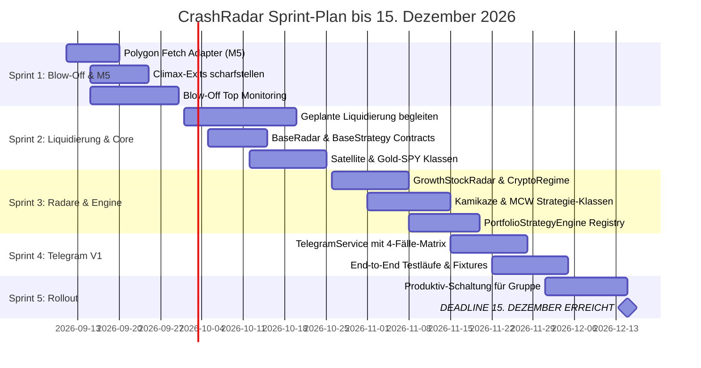

# CrashRadar: Dezember-Fokus-Roadmap (V1 MVP)
*Pragmatischer Umsetzungs- und Prioritätenplan bis zur Deadline Mitte Dezember 2026*

> 🎯 **Stichtag:** **15. Dezember 2026 (Hard Deadline)**  
> **Zweck:** Verbindlicher Fokus-Fahrplan zur Fertigstellung des Gesamtsystems. Trennt zwingende Kern-Bausteine (P0) von nachgelagerten Komfort- und Zukunftsthemen (V2).  
> **Bezug:** Ergänzt und fokussiert die übergeordneten Dokumente [`ROADMAP.md`](file:///D:/GitHub/CrashRadar/ROADMAP.md) und [`TODO.md`](file:///D:/GitHub/CrashRadar/TODO.md), ohne diese zu überschreiben.

---

## 1. Die Doppel-Mission bis Dezember 2026

Bis Mitte Dezember 2026 muss das System zwei konkrete Aufgaben verlässlich im Live-Betrieb erfüllen:

```text
┌─────────────────────────────────────────────────────────────────────────────────┐
│                      DIE CRASHRADAR DOPPEL-MISSION                              │
├────────────────────────────────────────┬────────────────────────────────────────┤
│ 1. PRIVATES PORTFOLIO-MANAGEMENT       │ 2. COMMUNITY- & GRUPPEN-STRATEGIEN     │
│    (Kamikaze Growth & Cash War Chest)  │    (Satellite, MCW & Gold-SPY)         │
├────────────────────────────────────────┼────────────────────────────────────────┤
│ • Blow-Off Top bis Ende Sep mitnehmen  │ • Einfache, klare Führung für Gruppen- │
│ • Ausstiegsalarme (Climax/EMA20)       │   mitglieder ohne Fachwissen           │
│ • Geordnete Liquidierung Mitte/Ende Okt│ • Kein manuelles Rechnen für Nutzer    │
│ • War Chest sichern (100 % Cash/T-Bills│ • Selbst-selektierende Handlungssignale│
│ • Lauerstellung für 'LASTING_HOLD'     │   (Fall A, B, C oder D)                │
│   Böden (PLTR, S, SOFI, AIRO)          │ • Schutz vor Bärenmarkt & FOMO-Tops    │
└────────────────────────────────────────┴────────────────────────────────────────┘
```

---

## 2. Die zentrale Architekturentscheidung: V1 MVP vs. V2 Zukunft

Um die Deadline im Dezember garantiert einzuhalten, wird das bisher in [`Investment-Signaldienst.md`](file:///D:/GitHub/CrashRadar/docs/architecture/signal-service/Investment-Signaldienst.md) geplante System radikal und pragmatisch zweigeteilt:

### ❌ Was wir für V1 STREICHEN (Verschoben nach 2027 / V2):
1. **Kein zweites Repository (`CrashRadar-Signals`):** Vorerst kein separater Cloudflare Worker.
2. **Keine Cloudflare D1 SQLite-Datenbank:** Kein Speichern individueller Portfolios, Budgets oder Chat-Historien.
3. **Keine interaktiven 1:1 Telegram-Dialoge:** Kein `/onboarding`, `/topup` oder State-Tracking.
4. **Keine Inline-Feedback-Buttons:** Keine `[✅ Ausgeführt]` State-Machines, die Datenbank-Synchronisation verlangen.

### ✅ Was wir in V1 BAUEN (Der Selbst-Selektierende Broadcast):
* Der bestehende `CrashRadar` Runner schickt nach dem täglichen Berechnungslauf **fertig formatierte Handlungsanweisungen** direkt in den Telegram-Kanal bzw. die Telegram-Gruppe.
* Jedes Signal bedient in **einer einzigen Nachricht** die 4 typischen Lebenslagen eines Gruppenmitglieds:

```markdown
🚨 CRASHRADAR SIGNAL: [STRATEGIE-NAME]
Asset: [TICKER] | Status: [SIGNAL_TYP]
━━━━━━━━━━━━━━━━━━━━━━━━━━━━━━━━━━━━━━━━━━━━━━━━━━

👉 WAS MUSST DU JETZT TUN?

🟢 FALL A: BEREITS INVESTIERT (Gewinne sichern / Halten)
• Handlungsanweisung: z. B. 25 % Teilgewinne mitnehmen oder Stop nachziehen.

🔴 FALL B: NOCH NICHT INVESTIERT (Füße stillhalten!)
• Handlungsanweisung: Kein Einstieg! Aktie überdehnt / Warten auf Boden.

🟡 FALL C: DU WILLST NEU ANFANGEN (DCA / Sparplan)
• Handlungsanweisung: Ab heute monatlichen Sparplan starten (Allokation X %).

🔵 FALL D: INITIALES CASH VORHANDEN (Tranchen-Einstieg)
• Handlungsanweisung: Erste Tranche (30 %) jetzt investieren, 70 % als Puffer halten.
```

---

## 3. Die 5 zwingenden Pflicht-Bausteine (P0 - Must Haves bis Dezember)

Diese 5 Komponenten müssen bis zum 15. Dezember 2026 programmiert und getestet sein:

### 1. M5-Intraday-Ingestion via Polygon (`PolygonFetchAdapter.js`)
* **Warum zwingend:** Ohne 5-Minuten-Kerzen können die parabolischen Climax-Tops (`TOP_CLIMAX_ALERT`) und Intraday-VWAP-Dumps für deine aktuellen Positionen (`NVTS`, `PLTR`, `S`, `IBRX`, `SPY`, `QQQ`) nicht sauber erkannt werden.
* **Umfang:** Minimal-Adapter für maximal 8–10 Fokus-Ticker (beschränkt auf die bestehende Tabelle `market_data_m5`).

### 2. Die autarken Stock- & Regime-Radare (`src/radars/`)
* **`GrowthStockRadar.js`:** Weinstein Stage-2 Ausbrüche, 10-Q Fundamental-Gate, Bollinger-Band-Squeeze und Climax-Top-Erkennung.
* **`CryptoRegimeRadar.js`:** BTC 21-Wochen-EMA Schalter und Halving-Zyklusuhr (> 970 Tage) zur Steuerung des Krypto-Sub-Buckets.

### 3. Die 4 Kern-Strategieklassen (`src/strategies/`)
* **`KamikazeGrowthStrategy.js` (Dein privates High-Conviction Portfolio):** 
  * **V1-Rolle:** Rein kuratierter Portfolio-Wachhund. Keine marktweite Aktiensuche in V1!
  * Überwacht deine festen Bestände (`NVTS`, `S`, `AIRO`, `IBRX`, Krypto) für das Ausstiegsfenster Mitte/Ende Oktober.
  * Integration der 3 Investment-Typen:
    * `LASTING_HOLD` (`PLTR`, `S`): Verkaufsblockade für technische Signale (stoischer Besitz).
    * `CYCLICAL` (`NVTS`): Volle Climax- und Trendbruch-Exits gegen -70 % Drawdowns.
    * `BINARY` (`IBRX`): Asymmetrische Deckelung & Vorbereitung auf Januar 2027.
* **`MuzzledCathieWoodStrategy.js` (Einfache Wachstums-Pipeline für die Gruppe):** 
  * 60 % Tech / 40 % Krypto mit monatlichem DCA und S&P 500 Mutterschiff.
  * **V1-Ideen-Pipeline (Simpel & genial):** Cathie Wood kauft $\to$ Ticker landet automatisch auf `OBSERVE` (geknebelt!).
  * Ein `BUY`-Signal geht erst in den Chat raus, wenn der Titel nachweislich Fahrt aufnimmt (Weinstein Stage-2 Ausbruch über SMA 50/200, Volumen 1,5x). Schutz vor Cathie-Klogriffen!
* **`SatelliteCoreStrategy.js` (Set-and-Forget für die Gruppe):** 
  * 80 % SPY / 15 % DFNS / 5 % BTC mit Notfall-Stecker (50 Gold / 50 Cash). Keine Einzeltitelsuche nötig.
* **`GoldSpyDcaStrategy.js` (Konservativer Vermögensaufbau für die Gruppe):** 
  * Reines SPY-DCA für vorsichtige Mitglieder mit 75 % Gold / 25 % Cash Notfall-Hedge. Keine Einzeltitelsuche nötig.
* **`SevenSlotGuruStrategy.js` (Smart-Money-Konsens für die Gruppe - P1):**
  * Gremium aus 6 Gurus: Mindestens 2 Manager halten die Aktie laut 13F-Filing $\to$ Sofort auf `OBSERVE` bzw. Kauf bei intaktem Basisschutz.

### 4. Die `PortfolioStrategyEngine.js` (Orchestrator & Runner)
* Lädt alle Strategien modular (Plugin-Muster).
* Versorgt sie mit den vorverarbeiteten Makro-Zuständen der `MacroRegimeEngine`.
* Aggregiert die täglichen Signale für den Export.

### 5. `TelegramService.js` (Broadcast mit 4-Fälle-Matrix)
* Direkte Anbindung an die Telegram Bot API via HTTPS (ohne Cloudflare Worker).
* Formatierung der Signale nach dem 4-Fälle-Schema (Bereits investiert / Noch nicht investiert / Sparplan / Cash).
* Getrennte Kanäle/Gruppen: `Makro-Wetter` (öffentlich) und `CrashRadar-Signale` (für deine Gruppe).

---

## 4. Scope-Cuts: Was bewusst nach 2027 verschoben wird (V2)

Um den Terminplan nicht zu gefährden, werden folgende komplexe Themen offiziell für 2027 geparkt:

| Thema / Baustein | Grund für die Verschiebung | V1-Ersatzlösung |
| :--- | :--- | :--- |
| **Kamikaze: Autonome Aktiensuche & Post-IPO Growth Engine (PIGE)** | Die marktweite Suche ([`Post-Ipo-Growth-Engine.md`](file:///D:/GitHub/CrashRadar/docs/architecture/strategies/Post-Ipo-Growth-Engine.md)) über tausende US-Aktien (SIC/NAICS-Filter, IPO-Altersfenster, SEC 10-Q XBRL-Parsing) und die 2. Reihe (Tier-2 Fallbacks) sind zu komplex für V1. | **Curated Watchlist Radar:** In V1 überwacht Kamikaze nur deine feste, handverlesene Watchlist (`PLTR`, `SOFI`, `S`, `NVTS`, `AIRO`, `IBRX`, Krypto). |
| **Cloudflare Worker & D1 Repo** | Zu hoher Infrastruktur- und Test-Aufwand (1:1 Dialoge, Budgets, Buttons). | Direkter Telegram-Broadcast aus CrashRadar mit 4-Fälle-Matrix. |
| **Full-DB Makro-Wirtschaftskalender** | Riesige DDL-, Parsing- & Nowcast-Pipeline. | Bestehende `Macro-Scenarios-Config.json` genügt vollauf. |
| **Einzeltitel-ML & FINRA LSTMs** | Hohes Overfitting-Risiko, unvollständige Tests. | Bewährte Heuristik (Weinstein Stage-2 + Makro-Radar). |
| **Gold-GDX Minen-Strategie** | Reines Forschungsthema. | Verbleibt als Referenz in `docs/research/`. |

---

## 5. Verbindlicher Sprint-Fahrplan (Woche für Woche bis 15. Dezember)



### Die Meilensteine im Detail:

#### Sprint 1 (11.09. – 30.09.2026): Schutz & M5-Fundament
* [ ] Implementierung [`PolygonFetchAdapter.js`](file:///D:/GitHub/CrashRadar/src/core/adapters/fetch/PolygonFetchAdapter.js) für M5-Intraday-Daten der Fokus-Werte.
* [ ] Scharfschaltung der `TOP_CLIMAX_ALERT`-Überwachung für `NVTS`, `S`, `AIRO`, `IBRX`.
* [ ] Begleitung des vermuteten Blow-Off Tops bis Ende September.

#### Sprint 2 (01.10. – 25.10.2026): Liquidierung & Strategie-Klassen (Teil 1)
* [ ] Begleitung der geplanten Portfolio-Liquidierung (Mitte/Ende Oktober).
* [ ] Definition der Interfaces `BaseStockRadar.js` und `BasePortfolioStrategy.js`.
* [ ] Implementierung der ersten zwei Strategien als autarke Klassen:
  * [`SatelliteCoreStrategy.js`](file:///D:/GitHub/CrashRadar/src/strategies/SatelliteCoreStrategy.js)
  * [`GoldSpyDcaStrategy.js`](file:///D:/GitHub/CrashRadar/src/strategies/GoldSpyDcaStrategy.js)

#### Sprint 3 (26.10. – 20.11.2026): Radare & Strategie-Klassen (Teil 2)
* [ ] Implementierung [`GrowthStockRadar.js`](file:///D:/GitHub/CrashRadar/src/radars/GrowthStockRadar.js) und [`CryptoRegimeRadar.js`](file:///D:/GitHub/CrashRadar/src/radars/CryptoRegimeRadar.js).
* [ ] Implementierung der Wachstums-Strategien:
  * [`KamikazeGrowthStrategy.js`](file:///D:/GitHub/CrashRadar/src/strategies/KamikazeGrowthStrategy.js) (inkl. `LASTING_HOLD`, `CYCLICAL`, `BINARY`).
  * [`MuzzledCathieWoodStrategy.js`](file:///D:/GitHub/CrashRadar/src/strategies/MuzzledCathieWoodStrategy.js).
* [ ] Implementierung der [`PortfolioStrategyEngine.js`](file:///D:/GitHub/CrashRadar/src/strategies/PortfolioStrategyEngine.js) als Orchestrator.

#### Sprint 4 (21.11. – 05.12.2026): Telegram V1 Broadcast & 4-Fälle-Matrix
* [ ] Implementierung [`TelegramService.js`](file:///D:/GitHub/CrashRadar/src/services/TelegramService.js) mit MarkdownV2-Unterstützung.
* [ ] Template-Engine für die 4-Fälle-Nachrichten (Fall A: Investiert, Fall B: Nicht investiert, Fall C: DCA, Fall D: Cash).
* [ ] Integration in die täglichen Runner ([`MacroScorecardRunner.js`](file:///D:/GitHub/CrashRadar/src/runners/MacroScorecardRunner.js) & `PortfolioStrategyRunner.js`).
* [ ] Vollständige TDD-Absicherung mit synthetischen Chaos-Daten.

#### Sprint 5 (06.12. – 15.12.2026): Generalprobe & Go-Live
* [ ] 7 Tage paralleler Testbetrieb in der Test-Gruppe (`TELEGRAM_ENV=test`).
* [ ] Freigabe der Gruppen-Kanäle für die Mitglieder.
* [ ] **15. Dezember 2026:** System ist vollständig einsatzbereit für den Bärenmarkt 2027.
