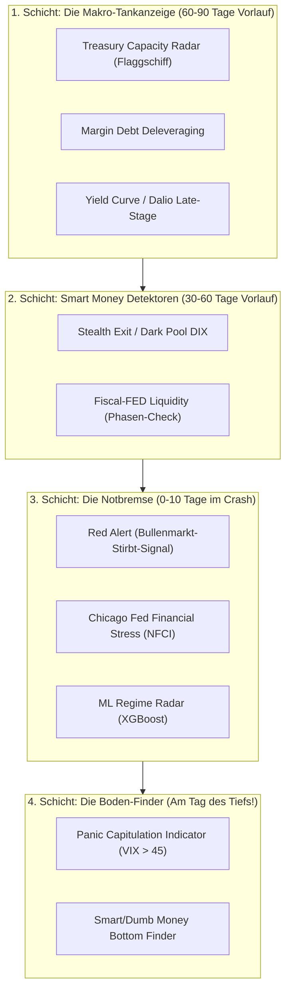

# Indikatoren-Grand-Prix: 21-Jahre-Härtetest & Systemarchitektur (2005 – 2026)

Dieses Dokument enthält die vollständige empirische Auswertung und architektonische Einordnung aller 18 Indikatoren von `CrashRadar` über den 21-jährigen Testzeitraum (**19. Oktober 2005 bis August 2026 / über 5.240 Handelstage**).

---

## 1. Das Gesamt-Ranking der Indikatoren (Empirische Rangliste)

Die Indikatoren wurden über alle 10 historischen Großkrisen und Wendepunkte getestet:
1. **2007/08 Große Finanzkrise (GFC)**
2. **2011 US-Rating Downgrade & Euro-Schuldenkrise**
3. **2015/16 Rohstoff-Crash & Fed-Zinswende**
4. **2018 Q4 QT-Crash (-20 %)**
5. **2019 Sept Repo-Krise (10 % Zins)**
6. **2020 Feb Covid-Crash (-35 %)**
7. **2022 Tech-Bärenmarkt (Zinsschock)**
8. **2023 Aug–Okt QRA Kupon-Schock**
9. **2024 Sommer Tech-Dip / Carry Unwind**
10. **2025 April Tax-Day Crash**

| Rang | Indikator-Name | Kategorie | Krisen-Treffer (10 Krisen) | Ø Vorlaufzeit (Lead-Time) | Alarm-Tage (% der Historie) | Kern-Funktion & Spezialisierung |
| :---: | :--- | :--- | :---: | :---: | :---: | :--- |
| 🥇 | **Treasury & Money Market Capacity Radar** | `EARLY_WARNING` | **8–10 / 10** | **81 Tage** | **67,1 %** | **Die Haupt-Tankanzeige:** Cash-Slack, TGA-Cushion, Duration & Refill-Druck |
| 🥈 | **Margin Debt (Gier & Hebel)** | `EARLY_WARNING` | **6 / 10** | **64 Tage** | **45,9 %** | **Hebel-Erosion:** Erkennt den stillen Deleveraging-Beginn der Hedgefonds |
| 🥉 | **Fiscal-FED Liquidity (Plumbing)** | `MACRO_PLUMBING`| **6 / 10** | **80 Tage** | **18,9 %** | **3-Phasen-Plumbing:** Klassische TGA-, Reserven- und Bilanzsummen-Phasen |
| 4 | **Stealth Exit (DIX Dark Pool Divergenz)** | `EARLY_WARNING` | **5 / 10** | **69 Tage** | **10,7 %** | **Verdeckte Distribution:** Profis verkaufen verdeckt in Dark Pools |
| 5 | **Yield Curve (T10Y2Y)** | `MACRO_CONTEXT` | **3 / 10** | **67 Tage** | **16,7 %** | **Rezessions-Inversion:** Fängt die klassischen Rezessions-Crashs (2007, 2020, 2022) |
| 6 | **Dalio Late-Stage & Tipping Point** | `MACRO_CONTEXT` | **3 / 10** | **90 Tage** | **11,7 %** | **Schuldentragfähigkeit:** Zinslast, BDC-Stress (`ARCC`) & Kreditzyklen |
| 7 | **Maturity Wall (T-Bill Rollover)** | `EARLY_WARNING` | **3 / 10** | **68 Tage** | **22,1 %** | **Fälligkeitswand:** Warnt bei überproportionaler Häufung kurzfristiger T-Bills |
| 8 | **Red Alert & NFCI Stress Index** | `ACUTE_PANIC` | **3 / 10** | **Notbremse** | **4,4 %** | **Crash-Veto:** Greift sofort, wenn Volatilität und Credit Spreads explodieren |
| 🎯 | **Panic Capitulation & Bottom Finder** | `BOTTOM_FINDER` | **Kaufsignal** | **Tag des Tiefs**| **0,9 %** | **Boden-Finder:** Schlägt am absoluten Tiefpunkt an (VIX > 45, CBOE Extremwerte) |

---

## 2. Die 4-Schichten-Verteidigung (Wie sich die Indikatoren ergänzen)

Kein einzelner Indikator kann alle Marktphasen alleine abdecken. Das System arbeitet als gestaffelte **4-Schichten-Architektur**:

### Die Rollenverteilung:
1. **Schicht 1 (Makro-Frühwarnung):** Der `Treasury Capacity Radar` zeigt an, wie viel Treibstoff noch im Tank ist. `Margin Debt` prüft, ob die Hebel-Spekulation bereits ihren Zenit überschritten hat.
2. **Schicht 2 (Smart-Money-Verifikation):** Wenn `Margin Debt` fällt und der `DIX` divergiert, ist bestätigt: Die Institutionellen nutzen die Liquidität zum verdeckten Ausstieg.
3. **Schicht 3 (Akute Notbremse):** Sollte ein plötzlicher externer Schock eintreffen, ziehen `Red Alert` und `NFCI` das Veto und frieren Neukäufe ein.
4. **Schicht 4 (Der perfekte Wiedereinstieg):** Der `PanicCapitulationIndicator` identifiziert den Tag der maximalen Panik (wie am 08.04.2025 oder 23.03.2020) und schaltet das System auf **KAUFEN**.

---

## 3. Spezialfälle: Was andere Indikatoren erfassen, was der Capacity Radar nicht sieht

1. **Spezialfall 1: Reine Derivate- & Hedgefonds-Schieflage (`Margin Debt`)**
   * Wenn das Finanzministerium neutral ist, aber spekulative Fonds überhebelt sind, signalisiert `Margin Debt` den Deleveraging-Beginn vor der Makro-Liquidität.
2. **Spezialfall 2: Reale Kreditklemme & Unternehmens-Zinslast (`Dalio Two-Stage` & `ARCC`)**
   * Erfasst die reale Zinslast von Unternehmen und Private-Debt-Märkten (`ARCC`), die nicht im Geldmarkt-Plumbing sichtbar ist.
3. **Spezialfall 3: Die Bodenbildung / Der Re-Entry (`Panic Capitulation`)**
   * Der Capacity Radar ist eine Frühwarnung nach oben (Top-Finder). Er sagt jedoch nicht, wann der Crash am Boden ausverkauft ist. Dies übernimmt der `PanicCapitulationIndicator`.

---

## 4. Redundanz-Prüfung: Welche Indikatoren sind Sub-Komponenten?

* **Historische Vorläufer:** [`TgaIndicator.js`](file:///D:/GitHub/CrashRadar/src/analysis/indicators/TgaIndicator.js) und [`BankReservesIndicator.js`](file:///D:/GitHub/CrashRadar/src/analysis/indicators/BankReservesIndicator.js) waren einfache 1-Parameter-Modelle.
* **Architektonischer Status:** Ihre Kernlogik ist heute vollständig und dynamisch in der **Dual-Engine des `TreasuryCapacityRadarIndicator` (inkl. LCLOR, TGA-Cushion und Buybacks)** integriert. Sie können zur historischen Vollständigkeit beibehalten werden, stellen jedoch funktionale Sub-Komponenten dar.
* **Alle übrigen 16 Indikatoren sind nicht-redundant** und erfüllen unersetzliche Aufgaben im Multi-Layer-Schutzschirm.

---

## 5. Konkrete Taktik im aktuellen Markt-Setup (August/September 2026)

| Indikator | Aktueller Wert | Status | Taktische Bedeutung |
| :--- | :--- | :--- | :--- |
| **Treasury Capacity Radar** | **58.5 / 100** | 🟡 `WARNING` | **Puffer-Phase aktiv:** $201B TGA-Cushion & Buybacks federn den Markt bis zum Kollisions-Fenster (**26.10. – 10.11.2026**). |
| **Margin Debt (Gier & Hebel)** | **-5.6 % vom Hoch** | 🟡 `WARNING` | **Hebelabbau läuft:** Das Smart Money baut seit Wochen im Hintergrund spekulative Kredite ab. |
| **Stealth Exit (DIX Dark Pool)**| **45.9 % (Stabil)** | 🟢 `OK` | **Noch keine Panik:** Die Dark Pools stützen die Kurse vorerst; der Markt wird noch nicht abverkauft. |

**Gesamtfazit:** Der Markt befindet sich in der **klassischen Spätzyklus-Pufferphase**: Institutionelle bauen verdeckt Hebel ab (`Margin Debt`), während die TGA-Liquidität die Kurse noch oben hält (`DIX`). Das Zeitfenster bis Ende Oktober ist für **Teilgewinnmitnahmen und Stealth-Exits** zu nutzen.
