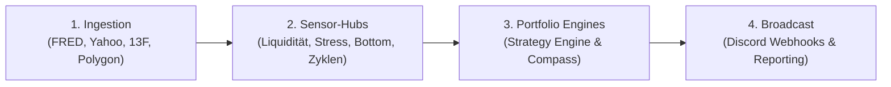

# ⚡ CrashRadar

> **Quantitatives Frühwarnsystem & Automatisierte Portfolio-Steuerung**  
> Kontinuierliche Überwachung globaler Liquidität, makroökonomischer Regime, technologischer Zyklen und deterministischer Absicherungsstrategien zur Vermeidung säkularer Drawdowns.

---

## 🏛️ System-Architektur im Überblick

CrashRadar verarbeitet Daten über eine 4-stufige, modulare Pipeline:



1. **Daten-Ingestion ([`src/core/`](file:///D:/GitHub/CrashRadar/src/core/)):** Tägliche und Intraday-Zeitreihen (US-Treasury DTS, Fed WRESBAL, Zinskurven, Spreads, SEC-13F Filings, Asset-Preise).
2. **Composite Sensor-Hubs ([`src/signals/hubs/`](file:///D:/GitHub/CrashRadar/src/signals/hubs/)):** Autarke Sensoren für Geldmarkt-Liquidität ([`LiquiditySensorHub`](file:///D:/GitHub/CrashRadar/src/signals/hubs/LiquiditySensorHub.js)), systemischen Stress ([`MacroStressSensorHub`](file:///D:/GitHub/CrashRadar/src/signals/hubs/MacroStressSensorHub.js)), Makro-Klima ([`GoldilocksSensorHub`](file:///D:/GitHub/CrashRadar/src/signals/hubs/GoldilocksSensorHub.js)) und Marktböden ([`MarketBottomSensorHub`](file:///D:/GitHub/CrashRadar/src/signals/hubs/MarketBottomSensorHub.js)).
3. **Portfolio Strategy Engine ([`src/strategies/`](file:///D:/GitHub/CrashRadar/src/strategies/)):** Modulares Plugin-System zur simultanen Auswertung von Anlagestrategien ([`SatelliteStrategy`](file:///D:/GitHub/CrashRadar/src/strategies/SatelliteStrategy.js), [`GoldSpyDcaStrategy`](file:///D:/GitHub/CrashRadar/src/strategies/GoldSpyDcaStrategy.js), [`KamikazeGrowthStrategy`](file:///D:/GitHub/CrashRadar/src/strategies/KamikazeGrowthStrategy.js), [`MuzzledCathieWoodStrategy`](file:///D:/GitHub/CrashRadar/src/strategies/MuzzledCathieWoodStrategy.js)).
4. **Broadcast & Reporting ([`src/services/`](file:///D:/GitHub/CrashRadar/src/services/)):** Serverlose Signal-Übertragung via Discord-Webhooks mit 4-Fälle-Handlungsmatrix (Investiert, Nicht investiert, Sparplan, Cash).

---

## 🚀 Quickstart & Bedienung

### 1. Installation & Umgebung
```bash
# Abhängigkeiten installieren
npm install

# Umgebungsvariablen konfigurieren
cp .env.example .env
```

### 2. Test-Suite ausführen
CrashRadar setzt auf strikte TDD-Praktiken mit deterministischem Chaos- und Resilienz-Testing:
```bash
# Alle Tests einmalig ausführen
npm test

# Test-Runner im Watch-Modus
npm run test:watch

# Test-Coverage analysieren
npm run coverage
```

### 3. Operative Runner starten
Die wichtigsten Einstiegspunkte des Systems via [`index.js`](file:///D:/GitHub/CrashRadar/index.js) oder `npm`-Skripte:

| Befehl | Runner | Beschreibung |
| :--- | :--- | :--- |
| `node index.js --signals` | [`PortfolioStrategyRunner`](file:///D:/GitHub/CrashRadar/src/runners/PortfolioStrategyRunner.js) | Führt alle registrierten Portfoliostrategien aus und generiert Handlungsanweisungen. |
| `npm run compass` | [`DailyPortfolioCompassRunner`](file:///D:/GitHub/CrashRadar/src/runners/DailyPortfolioCompassRunner.js) | Tägliche Makro- & Geldmarkt-Kompassanalyse inkl. empirischer Thesen-Prüfung. |
| `node index.js -c` | [`IndicatorAnalysisRunner`](file:///D:/GitHub/CrashRadar/src/runners/IndicatorAnalysisRunner.js) | Sequenzielle Auswertung aller Einzelindikatoren und Alert-Erzeugung. |
| `node index.js -s` | [`MacroScorecardRunner`](file:///D:/GitHub/CrashRadar/src/runners/MacroScorecardRunner.js) | DB-gestützte Auswertung des Makro-Wirtschaftskalenders und Fiskalszenarien. |
| `node index.js` | [`TimeSeriesFetchRunner`](file:///D:/GitHub/CrashRadar/src/runners/TimeSeriesFetchRunner.js) | Täglicher Ingestion-Lauf für alle konfigurierten Daten-Tasks (`daily`). |
| `node index.js -p intraday_m5` | [`TimeSeriesFetchRunner`](file:///D:/GitHub/CrashRadar/src/runners/TimeSeriesFetchRunner.js) | Gezielter Abruf von M5-Intraday-Kerzen für aktive Positionen. |

---

## 📂 Codebase-Struktur

```text
CrashRadar/
├── config/              # JSON-Konfigurationen für Indikatoren, Fetcher, Kalender und Strategien
├── data/                # Lokale Caches (data/cache/) und Archiv-Daten
├── docs/                # 📚 Vollständige Wissens- und Spezifikations-Architektur (2-Säulen-Prinzip)
│   ├── architecture/    # Technische Spezifikationen, Verträge, APIs und State Machines
│   └── research/        # Empirische 21-Jahre-Backtests, Hypothesen und Studien (ADRs)
├── research/            # Empirische Forschung, Thesen-Beweise, ADR-Invarianten & Chaos-Audits
├── simulations/         # Reproduzierbare Portfolio-Master-Engines (21-Jahre-Backtests)
├── src/
│   ├── analysis/        # Makro-Regime-Engines, Indikatoren und Labeler
│   ├── core/            # Datenbank- & Fetch-Adapter (MySQL, TiDB, FRED, Yahoo, Polygon)
│   ├── radars/          # Autarke Signal-Scanner auf Asset-Ebene (Stage-2, 13F, Krypto-Regime)
│   ├── runners/         # Operative CLI-Runner für Cronjobs und manuelle Auswertungen
│   ├── services/        # Externe Dienste (Discord-Webhooks, Notifier, ML-Inferenz)
│   ├── signals/         # Composite Sensor-Hubs, Leaf-Sensoren und Verträge
│   └── strategies/      # Modulare Portfoliostrategien & PortfolioStrategyEngine
├── tools/               # Operative Entwickler- & Wartungs-Tools
└── tests/               # Unit- und Integrationstests (Vitest) mit deterministischem Chaos
```

---

## 📚 Dokumentation & Entwicklungs-Fokus

* **Vollständige Wissens-Architektur:** Alle Spezifikationen, APIs, Datenmodelle und empirischen Beweise sind zentral in [`docs/README.md`](file:///D:/GitHub/CrashRadar/docs/README.md) strukturiert und indexiert.
* **Entwicklungsplan & Sprints:** Der verbindliche Status, offene Meilensteine und der aktuelle Sprintplan befinden sich in [`ROADMAP.md`](file:///D:/GitHub/CrashRadar/ROADMAP.md).
* **System- & Qualitätsregeln:** Entwicklungsrichtlinien, Code-Buddy-Modus und Chaos-Engineering-Standards sind in [`AGENTS.md`](file:///D:/GitHub/CrashRadar/AGENTS.md) hinterlegt.
