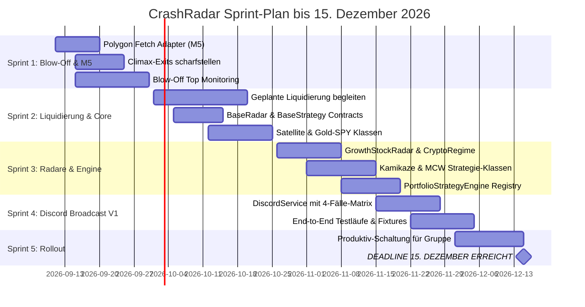

# 🧭 CrashRadar Roadmap & Operativer Sprintplan

> **Single Source of Truth:** Dieses Dokument bündelt die gesamte strategische und operative Planung von `CrashRadar`. Es vereint den unmittelbaren Umsetzungsfokus (V1 MVP bis 15. Dezember 2026) mit der mittel- und langfristigen System-Evolution (V2 ab 2027) und archiviert erreichte Meilensteine.

---

## 🎯 1. Aktueller Fokus: V1 MVP bis 15. Dezember 2026 (P0 - Hard Deadline)

*Pragmatischer Umsetzungs- und Prioritätenplan bis zum Stichtag Mitte Dezember 2026.*

### 1.1 Die Doppel-Mission bis Dezember 2026

```text
┌─────────────────────────────────────────────────────────────────────────────────┐
│                      DIE CRASHRADAR DOPPEL-MISSION                              │
├────────────────────────────────────────┬────────────────────────────────────────┤
│ 1. PRIVATES PORTFOLIO-MANAGEMENT       │ 2. COMMUNITY- & GRUPPEN-STRATEGIEN     │
│    (Kamikaze Growth & Cash War Chest)  │    (Satellite, MCW & Gold-SPY)         │
├────────────────────────────────────────┼────────────────────────────────────────┤
│ • Blow-Off Top bis Ende Sep mitnehmen  │ • Einfache, klare Führung für Gruppen- │
│ • Ausstiegsalarme (Climax/EMA20)       │   mitglieder ohne Fachwissen           │
│ • Geordnete Liquidierung Mitte/Ende Okt│ • Kein manuelles Rechnen für Nutzer    │
│ • War Chest sichern (100 % Cash/T-Bills│ • Selbst-selektierende Handlungssignale│
│ • Lauerstellung für 'LASTING_HOLD'     │   (Fall A, B, C oder D)                │
│   Böden (PLTR, S, SOFI, AIRO)          │ • Schutz vor Bärenmarkt & FOMO-Tops    │
└────────────────────────────────────────┴────────────────────────────────────────┘
```

---

### 1.2 Zentrale Architekturentscheidung & Scope-Cuts (V1 MVP vs. V2 Zukunft)

Um die Deadline im Dezember garantiert einzuhalten, wird das in [`docs/architecture/signal-service/Investment-Signaldienst.md`](file:///D:/GitHub/CrashRadar/docs/architecture/signal-service/Investment-Signaldienst.md) geplante System pragmatisch zweigeteilt:

#### Die Scope-Cuts Begründungs-Matrix:

| Thema / Baustein | Grund für die Verschiebung | V1-Ersatzlösung |
| :--- | :--- | :--- |
| **Kamikaze: Autonome Aktiensuche & Post-IPO Growth Engine (PIGE)** | Marktweite Suche ([`01-Post-Ipo-Growth-Engine.md`](file:///D:/GitHub/CrashRadar/docs/architecture/strategies/kamikaze/01-Post-Ipo-Growth-Engine.md)) über tausende US-Aktien (SIC/NAICS-Filter, IPO-Altersfenster, SEC 10-Q XBRL-Parsing) und 2. Reihe sind zu komplex für V1. | **Curated Watchlist Radar:** In V1 überwacht Kamikaze nur deine feste, handverlesene Watchlist (`PLTR`, `SOFI`, `S`, `NVTS`, `AIRO`, `IBRX`, Krypto). |
| **Cloudflare Worker & D1 Repo** | Zu hoher Infrastruktur- und Test-Aufwand (1:1 Dialoge, individuelle Budgets, Inline-Buttons). | **Direkter Discord-Webhook-Broadcast** aus CrashRadar mit 4-Fälle-Matrix. |
| **Full-DB Makro-Wirtschaftskalender Phase 2** | Nativer In-Engine Regime-Indikator & Kelly-Kopplung komplex. | **Phase 1 genügt für V1:** DB-Scorecard & `macro_calendar_events` mit `MacroScorecardRunner.js` voll funktionsfähig. |
| **Einzeltitel-ML & FINRA LSTMs** | Hohes Overfitting-Risiko, unvollständige Tests. | **Bewährte Heuristik:** Weinstein Stage-2 + Makro-SensorHubs. |
| **Gold-GDX Minen-Strategie** | Reines Forschungsthema. | Verbleibt als Referenz in [`docs/architecture/strategies/Gold-GDX.md`](file:///D:/GitHub/CrashRadar/docs/architecture/strategies/Gold-GDX.md). |

#### ✅ V1 MVP Lösung (Der Selbst-Selektierende Discord Broadcast):
* Der bestehende Runner schickt nach dem täglichen Berechnungslauf **fertig formatierte Handlungsanweisungen** via Discord-Webhooks direkt in den Kanal.
* Jedes Signal bedient in **einer einzigen Nachricht** die 4 typischen Lebenslagen eines Nutzers:
  * 🟢 **Fall A: Bereits investiert:** Gewinne sichern, Stop nachziehen oder HODL.
  * 🔴 **Fall B: Noch nicht investiert:** Füße stillhalten, kein Einstieg in überdehnte Märkte.
  * 🟡 **Fall C: Sparplan / DCA:** Stur monatliche Tranche investieren.
  * 🔵 **Fall D: Initiales Cash vorhanden:** Definierte Tranche einsetzen, Rest als War Chest halten.

---

### 1.3 Die 5 Pflicht-Bausteine bis Dezember (P0 Must Haves)

#### 1. M5-Intraday-Ingestion via Polygon ([`PolygonFetchAdapter.js`](file:///D:/GitHub/CrashRadar/src/core/adapters/fetch/PolygonFetchAdapter.js))
* **Zweck:** Ohne 5-Minuten-Kerzen können parabolische Climax-Tops (`TOP_CLIMAX_ALERT`) und Intraday-VWAP-Dumps für Kernpositionen (`NVTS`, `PLTR`, `S`, `IBRX`, `SPY`, `QQQ`) nicht sauber erkannt werden.
* **Umfang:** Minimal-Adapter für maximal 8–10 Fokus-Ticker (beschränkt auf Tabelle `market_data_m5`).

#### 2. Die autarken Stock- & Regime-Radare ([`src/radars/`](file:///D:/GitHub/CrashRadar/src/radars/))
* **Vertrag [`BaseStockRadar.js`](file:///D:/GitHub/CrashRadar/src/radars/BaseStockRadar.js):** Standard-Schnittstelle mit `initialize(config)`, `evaluateSymbol(symbol, date, marketData, contextData)`, `scanUniverse()`, liefert normiertes `RadarSignalResult`-Objekt.
* **[`GrowthStockRadar.js`](file:///D:/GitHub/CrashRadar/src/radars/GrowthStockRadar.js):** Weinstein Stage-2 Ausbrüche, SEC 10-Q Fundamental-Gate, Intraday M5 Bollinger-Band-Squeeze / VWAP und parabolische Climax-Top-Erkennung (Distanz zum $\text{EMA 20} \ge 35\text{–}45\,\%$).
* **[`CryptoRegimeRadar.js`](file:///D:/GitHub/CrashRadar/src/radars/CryptoRegimeRadar.js):** BTC 21-Wochen-EMA Schalter, Halving-Zyklusuhr (> 970 Tage) und Krypto-Equity-Ranking.
* **`Institutional13FRadar.js` (P1):** 13F-Konsens der 6 Hedgefonds-Gurus ($\ge 2$ Manager halten Aktie), Base-Schutz und SMA 200 Filter.

#### 3. Die 4 Kern-Strategieklassen ([`src/strategies/`](file:///D:/GitHub/CrashRadar/src/strategies/))
* **Vertrag [`PortfolioStrategyInterface.js`](file:///D:/GitHub/CrashRadar/src/strategies/PortfolioStrategyInterface.js):** Standardisiert `initialize(config)`, `evaluateDaily(date, marketData, macroSignalContext, radarSignals)`, `getPortfolioStatus()`, `generateOrderInstructions()`.
* **[`KamikazeGrowthStrategy.js`](file:///D:/GitHub/CrashRadar/src/strategies/KamikazeGrowthStrategy.js) (Privates High-Conviction Portfolio):**
  * V1-Rolle: Rein kuratierter Portfolio-Wachhund für feste Bestände (`NVTS`, `S`, `AIRO`, `IBRX`, Krypto).
  * Integration der 3 Investment-Typen:
    * `LASTING_HOLD` (`PLTR`, `S`): Verkaufsblockade für rein technische Signale (stoischer Langzeit-Besitz).
    * `CYCLICAL` (`NVTS`): Volle Climax- und Trendbruch-Exits gegen -70 % Drawdowns.
    * `BINARY` (`IBRX`): Asymmetrische Deckelung & Vorbereitung auf FDA-/Studienergebnisse bis Januar 2027.
  * Broker-Sync & Discretionary Override (siehe Schnittstellen-Schritt unten).
* **[`MuzzledCathieWoodStrategy.js`](file:///D:/GitHub/CrashRadar/src/strategies/MuzzledCathieWoodStrategy.js) (Wachstums-Pipeline für die Gruppe):**
  * 60 % Tech / 40 % Krypto mit monatlichem DCA und S&P 500 Mutterschiff als Park-Konto.
  * V1-Pipeline: Cathie Wood kauft $\to$ Ticker landet automatisch auf `OBSERVE` (geknebelt!).
  * `BUY`-Signal geht erst raus bei Bestätigung: Weinstein Stage-2 Ausbruch über $\text{SMA 50}$ und $\text{SMA 200}$ mit relativem Volumen $\ge 1{,}5\times$.
* **[`SatelliteStrategy.js`](file:///D:/GitHub/CrashRadar/src/strategies/SatelliteStrategy.js) (Set-and-Forget für die Gruppe - BEREITS IMPLEMENTIERT):**
  * 80 % SPY / 15 % DFNS / 5 % BTC mit Notfall-Stecker (50 % Gold / 50 % Cash) und 10-Tage Anti-Whipsaw Hysterese.
* **[`GoldSpyDcaStrategy.js`](file:///D:/GitHub/CrashRadar/src/strategies/GoldSpyDcaStrategy.js) (Konservativer Vermögensaufbau - BEREITS IMPLEMENTIERT):**
  * Reines SPY-DCA mit 75 % Gold / 25 % Cash Notfall-Hedge und Pre-Margin Cash-Lock.
* **`SevenSlotGuruStrategy.js` (Smart-Money-Konsens - P1):**
  * 7 gleichgewichtete Slots, Gremium aus 6 Gurus ($\ge 2$ Manager), 50 % Gold / 50 % Cash Notfall-Schutzschild mit Dual-Trigger (NetLiq + Spreads).

#### 4. Die [`PortfolioStrategyEngine.js`](file:///D:/GitHub/CrashRadar/src/strategies/PortfolioStrategyEngine.js) (Orchestrator & Runner - BEREITS IMPLEMENTIERT)
* Lädt alle Strategien modular über ein Plugin-Registry-Muster.
* Zero-Leakage-Garantie, historische 21,8-Jahre-Simulation und Aggregation der Tages-Allokationen für den Export.

#### 5. [`DiscordNotificationService.js`](file:///D:/GitHub/CrashRadar/src/services/DiscordNotificationService.js) / `DiscordService.js` (Broadcast mit 4-Fälle-Matrix)
* Direkte Anbindung via Discord Webhook API (HTTP POST ohne Server oder Middleware) mit Rich Embeds.
* Getrennte Kanäle: `#makro-wetter` (öffentlich) und `#crashradar-signale` (geschlossene Gruppe).
* Dynamisches Debouncing & Krisen-Aufwach-Logik (14 Tage Normalbetrieb, 1–2 Tage im Kollisionsfenster, 0 Tage / Sofort-Push bei Veto oder Flash Crash).

---

### 1.4 Verbindlicher Sprint-Fahrplan (Bis 15. Dezember 2026)



#### Operative Checkliste nach Sprints & Arbeitsschritten:

##### Sprint 1 (11.09. – 30.09.2026): Schutz & M5-Fundament
* [ ] **Polygon-Adapter:** [`PolygonFetchAdapter.js`](file:///D:/GitHub/CrashRadar/src/core/adapters/fetch/PolygonFetchAdapter.js) in [`FetchAdapterFactory.js`](file:///D:/GitHub/CrashRadar/src/core/adapters/fetch/FetchAdapterFactory.js) registrieren (Market-Status-Check `/v1/marketstatus/now`, Paginierung via `next_url`, UTC-Mapping).
* [ ] **M5-Tasks anlegen:** 10 Fokus-Tasks (`PLTR, NVTS, IBRX, IGV, CIBR, SPY, QQQ, SOUN, SOFI, S`) in [`config/Database-Fetcher-Config.json`](file:///D:/GitHub/CrashRadar/config/Database-Fetcher-Config.json) mit `"frequency": "intraday_m5"` einrichten.
* [ ] **Intraday-Workflow:** GitHub Action `intraday-m5-fetch.yml` (17:15 & 22:15 Uhr) für automatische Synchronisation anlegen.
* [ ] **Climax-Überwachung:** `TOP_CLIMAX_ALERT`-Überwachung für High-Beta-Positionen (`NVTS`, `S`, `AIRO`, `IBRX`) bei $\text{Distanz zum EMA 20} \ge 35\text{–}45\,\%$ scharfstellen.
* [ ] **Blow-Off Top:** Begleitung des vermuteten Tops bis Ende September.

##### Sprint 2 (01.10. – 25.10.2026): Liquidierung & Strategie-Klassen (Teil 1)
* [ ] **Liquidierung:** Geordnete Portfolio-Liquidierung zur Cash-Sicherung begleiten (Mitte/Ende Oktober).
* [x] **Verträge & Composite-Pattern:** [`PortfolioStrategyInterface.js`](file:///D:/GitHub/CrashRadar/src/strategies/PortfolioStrategyInterface.js) und [`SignalComponent.js`](file:///D:/GitHub/CrashRadar/src/signals/contracts/SignalComponent.js) implementiert und abgesichert.
* [x] **SatelliteStrategy:** [`SatelliteStrategy.js`](file:///D:/GitHub/CrashRadar/src/strategies/SatelliteStrategy.js) (Core-Satellite 80/15/5 inkl. 50/50 Notfall-Stecker, Krypto-Airbag & 10-Tage Anti-Whipsaw).
  > 🔍 **ZU PRÜFEN / CODE-BEFUND (Hysterese-Parameter):**  
  > Im Code ([`SatelliteStrategy.js`](file:///D:/GitHub/CrashRadar/src/strategies/SatelliteStrategy.js#L46-L48)) sind drei Hysterese-Werte hinterlegt: `minHoldingPeriodDays: 15` (15 Handelstage Mindesthaltedauer im Schutzhafen), `reTriggerCooldownDays: 20` (20 Handelstage Cooldown nach Re-Entry) und `minBtcHedgeDays: 10` (10 Tage Mindesthaltedauer für BTC-Airbag). Prüfen, ob die Bezeichnung „10-Tage Anti-Whipsaw“ im Text auf 15 Tage (Gesamt-Hedge) präzisiert werden soll.
* [x] **GoldSpyDcaStrategy:** [`GoldSpyDcaStrategy.js`](file:///D:/GitHub/CrashRadar/src/strategies/GoldSpyDcaStrategy.js) (Dynamisches DCA mit 75/25 Gold/Cash Notfall-Schirm & Pre-Margin Cash-Lock).

##### Sprint 3 (26.10. – 20.11.2026): Radare & Strategie-Klassen (Teil 2)
* [x] **PortfolioStrategyEngine:** [`PortfolioStrategyEngine.js`](file:///D:/GitHub/CrashRadar/src/strategies/PortfolioStrategyEngine.js) als Orchestrator mit modularer Plugin-Registry implementiert (vorgezogen!).
* [x] **Sensor-Hubs aufgebaut:** [`MacroStressSensorHub`](file:///D:/GitHub/CrashRadar/src/signals/hubs/MacroStressSensorHub.js), [`CryptoSensorHub`](file:///D:/GitHub/CrashRadar/src/signals/hubs/CryptoSensorHub.js), [`LiquiditySensorHub`](file:///D:/GitHub/CrashRadar/src/signals/hubs/LiquiditySensorHub.js), [`MarketBottomSensorHub`](file:///D:/GitHub/CrashRadar/src/signals/hubs/MarketBottomSensorHub.js).
* [x] **Makrowetter- & Notification-Härtung:** Bereinigung [`config/Indicator-Pipeline-Config.json`](file:///D:/GitHub/CrashRadar/config/Indicator-Pipeline-Config.json) und Stille Rückkehr im [`StrategyNotificationService.js`](file:///D:/GitHub/CrashRadar/src/services/StrategyNotificationService.js).
* [ ] **BaseStockRadar:** Einheitliche Schnittstelle in `src/radars/BaseStockRadar.js` anlegen (`initialize`, `evaluateSymbol`, `scanUniverse`, normiertes `RadarSignalResult`).
* [ ] **Stock-Radare implementieren:**
  * [`src/radars/GrowthStockRadar.js`](file:///D:/GitHub/CrashRadar/src/radars/GrowthStockRadar.js) (Weinstein Stage-2, 10-Q Fundamental-Gate, Intraday M5 Bollinger Squeeze).
  * [`src/radars/CryptoRegimeRadar.js`](file:///D:/GitHub/CrashRadar/src/radars/CryptoRegimeRadar.js) (BTC 21W-EMA Schalter, Halving-Uhr).
  * `src/radars/Institutional13FRadar.js` (13F Smart-Money-Konsens $\ge 2$ Manager).
* [ ] **Wachstums-Strategien finalisieren:**
  * [`KamikazeGrowthStrategy.js`](file:///D:/GitHub/CrashRadar/src/strategies/KamikazeGrowthStrategy.js) (Curated Watchlist, `LASTING_HOLD`, `CYCLICAL`, `BINARY`).
    > 🔍 **ZU PRÜFEN / CODE-BEFUND (Kamikaze-Status):**  
    > Die Basisklasse existiert bereits vollständig ([`src/strategies/KamikazeGrowthStrategy.js`](file:///D:/GitHub/CrashRadar/src/strategies/KamikazeGrowthStrategy.js), 167 Zeilen, Vitest grün), parst `free_usd` / `pending_orders_usd` aus dem Broker-State und trennt `LASTING_HOLD` (`PLTR`, `AIRO`) von `CYCLICAL` (`NVTS`).  
    > **Offen zur Fertigstellung:** Es fehlt im Code noch die explizite Handhabung des dritten Typs `BINARY` (`IBRX` mit asymmetrischer Deckelung bis Jan 2027) sowie die realen Broker-Adapter.
  * [`MuzzledCathieWoodStrategy.js`](file:///D:/GitHub/CrashRadar/src/strategies/MuzzledCathieWoodStrategy.js) (Cathie-Kauf $\to$ `OBSERVE`, Kauf erst bei Stage-2 Bestätigung über $\text{SMA 50/200}$ mit relativem Volumen $\ge 1{,}5\times$).
  * `SevenSlotGuruStrategy.js` (P1 - 6 Guru-Gremium mit 50/50 Notfall-Schutzschild).
* [ ] **Broker-Live-Ingestion & Discretionary Override (Kamikaze):**
  * Broker-Adapter in `src/core/adapters/broker/` (`BrokerAdapterInterface.js`, `InteractiveBrokersAdapter.js`, `MockBrokerAdapter.js`).
  * Reconciliation-Service in `src/services/BrokerReconciliationService.js` (*„Broker-Realität überschreibt Modell-Zustand“*).

##### Sprint 4 (21.11. – 05.12.2026): Discord V1 Broadcast & 4-Fälle-Matrix
* [ ] **Dynamisches Debouncing & Krisen-Aufwach-Logik:**
  * Normalzustand: 14 Tage Spam-Schutz für reguläre Warnungen in [`NotificationManager.js`](file:///D:/GitHub/CrashRadar/src/services/NotificationManager.js) und [`config/Notification-Config.json`](file:///D:/GitHub/CrashRadar/config/Notification-Config.json).
  * Spätzyklus / Kollisions-Fenster aktiv: Dynamische Verkürzung auf 1–2 Tage oder sofortige Alarmierung bei Zustands-/Statuswechsel.
  * Akute Panik / Flash Crash: 0 Tage / Sofort-Push für Re-Entry- und Exit-Signale.
* [ ] **Discord Webhook Service:** `src/services/DiscordService.js` mit Rich Embeds, Farbcodierung (Rot/Grün/Gold) und getrennten Webhooks (`#makro-wetter` öffentlich, `#crashradar-signale` intern).
  > 🔍 **ZU PRÜFEN / CODE-BEFUND (Service-Nomenklatur):**  
  > In den Dokumenten wird teils `DiscordService.js` und teils `DiscordNotificationService.js` genannt. Bei der Umsetzung festlegen, welcher Klassenname als Standard in `src/services/` gelten soll (analog zu `NtfyService.js` vs. `StrategyNotificationService.js`).
* [ ] **4-Fälle Template-Engine:** Selbst-selektierende Nachrichtenvorlage (Fall A: Investiert, Fall B: Nicht investiert, Fall C: Sparplan, Fall D: Cash).
* [ ] **Runner-Refactoring & Snapshot-Export:**
  * [`PortfolioStrategyRunner.js`](file:///D:/GitHub/CrashRadar/src/runners/PortfolioStrategyRunner.js), [`MacroScorecardRunner.js`](file:///D:/GitHub/CrashRadar/src/runners/MacroScorecardRunner.js), [`IndicatorAnalysisRunner.js`](file:///D:/GitHub/CrashRadar/src/runners/IndicatorAnalysisRunner.js) und [`StandardRunner.js`](file:///D:/GitHub/CrashRadar/src/runners/StandardRunner.js) anbinden.
  * Snapshot-Export des `daily_intelligence.json` Payloads (Makro-Regime, Veto-Status, Allokationen pro Strategie).
* [ ] **TDD Chaos-Testing:** End-to-End Testläufe mit deterministischen Fixtures und synthetischen Ausfällen.

##### Sprint 5 (06.12. – 15.12.2026): Generalprobe & Go-Live
* [ ] **Testbetrieb:** 7 Tage paralleler Probelauf im Test-Discord-Kanal (`DISCORD_ENV=test`).
* [ ] **Audit & Freigabe:** Letzter Konsistenz-Check aller Signale und Schwellenwerte.
* [ ] **15. Dezember 2026:** Produktiv-Schaltung für die Community. Das System ist scharf für den Bärenmarkt 2027.

> 🔍 **ZU PRÜFEN / CODEBASE-HYGIENE (Backup-Dateien im Quellcode-Ordner):**  
> Im Quellcode-Ordner `src/analysis/` liegt aktuell die ungetrackte Backup-Datei [`DailyPortfolioCompass.with_portfolio_backup.js`](file:///D:/GitHub/CrashRadar/src/analysis/DailyPortfolioCompass.with_portfolio_backup.js). Gemäß [`AGENTS.md`](file:///D:/GitHub/CrashRadar/AGENTS.md) (Regel 3: *Spiegel-Disziplin & Tools vs. Trash*) prüfen, ob diese nach `scratch/trash/` verschoben werden soll, um `src/` frei von manuellen Backups zu halten.

---

## 🔮 2. Mittel- und Langfristige Roadmap (V2 Zukunft ab 2027)

Nach erfolgreichem V1-Go-Live werden die strategischen Großprojekte etappenweise ausgerollt:

### 2.1 Gamma-Hedging Backtest: Spurenlesen (Stichtag: 04.01.2027)
* **Status:** Live-Aufzeichnung läuft seit 04.07.2026 via Data-Fetcher.
* **Ziel:** Nach 6 Monaten kontinuierlicher Optionsdaten-Erfassung erfolgt die erste empirische Auswertung der Gamma-Support-/Resistance-Wände.
* **Nutzen:** Erkenntnisse fließen als Volatilitätsfilter oder dynamische Put/Call-Schwellen in die Strategien ein.

### 2.2 Personalisiertes 1:1 Edge-Gateway (`CrashRadar-Signals`)
* **Architektur:** Auslagerung in Cloudflare Worker mit Cloudflare D1 SQLite.
* **Tabellen:** `user_portfolios` (inkl. `strategy_id` & `strategy_version`), `market_regime_snapshot`, `strategy_changelogs` und `signal_logs`.
* **Funktionen:** Diskrete 1:1 Nutzer-Chats, geführtes Onboarding, individuelles Budget- & Sparplan-Tracking, Ad-hoc `/topup` mit Sofort-Feedback (< 50 ms), interaktive Inline-Buttons (`[✅ Ausgeführt]` / `[⏳ Überspringen]`), 3 Beweisszenarien (Worst Case, Best Case, Neutral) und proaktiver Transparenz-Broadcast bei Strategie-Updates.

### 2.3 Post-IPO Growth Engine (PIGE) für Kamikaze
* **Spezifikation:** [`docs/architecture/strategies/kamikaze/01-Post-Ipo-Growth-Engine.md`](file:///D:/GitHub/CrashRadar/docs/architecture/strategies/kamikaze/01-Post-Ipo-Growth-Engine.md).
* **Ziel:** Ablösung der handverlesenen V1-Watchlist durch marktweites, automatisiertes US-Aktien-Screening (SIC/NAICS-Branchenfilter, IPO-Altersfenster, SEC 10-Q XBRL-Parsing).

### 2.4 Makro-Kalender Phase 2: In-Engine Regime-Indikator
* **Konzept:** [`docs/architecture/macro/Makro-Kalender-Szenarien-Konzept.md`](file:///D:/GitHub/CrashRadar/docs/architecture/macro/Makro-Kalender-Szenarien-Konzept.md).
* **Ziel:** Kapselung der Szenario-Auswertung als vollwertiger Indikator (`MacroScenarioIndicator.js`) in der `MacroEngine`. Anbindung an die Trading Engine als Fundamental-Watchdog und Fractional-Kelly-Risikobremse (`action.scaleDown`).

### 2.5 Architektur-Review: Indikatoren-Pipeline & SensorHub-Refactoring
* **Öl- & Liquiditäts-Stress:** Vormerkung zur späteren Aufnahme des [`MacroLiquiditySensorHub`](file:///D:/GitHub/CrashRadar/src/signals/hubs/MacroLiquiditySensorHub.js) (Ölpreis-Spikes $> 92\text{–}95\,\$$, Frachtdruck `IYT` vs. `CL=F`, Stagflationsrisiko aus [`Geopolitical-Oil-Liquidity-Stress-Study.md`](file:///D:/GitHub/CrashRadar/docs/research/macro-proofs/Geopolitical-Oil-Liquidity-Stress-Study.md)) in das Makrowetter.
* **MacroEngine Modernisierung:** Geplante Überarbeitung der historischen `MacroRegimeEngine` auf die moderne SensorHub-Architektur.

### 2.6 Trading & Execution Engine (Portfolio State Machine & ML)
* **Spezifikation:** [`docs/architecture/trading-engine/TradingEngine.md`](file:///D:/GitHub/CrashRadar/docs/architecture/trading-engine/TradingEngine.md).
* **Ziel:** 5-Stufen Portfolio State Machine für 50/50 Krypto- & Growth-Portfolio (`MSTR`, `NVTS`, `SOFI`, `ZETA`), Fractional-Kelly-Positionsgrößenanpassung (`action.scaleDown`), Einzeltitel-LSTMs kombiniert mit FINRA Short-Volume und 21-Jahre A/B-Backtest über 10 Großkrisen (2005–2026).

### 2.7 Generational Turnaround Framework ($L_2$-Sniper)
* **Spezifikation:** [`docs/architecture/strategies/kamikaze/02-Turnaround-Framework.md`](file:///D:/GitHub/CrashRadar/docs/architecture/strategies/kamikaze/02-Turnaround-Framework.md) und Forschungs-Hypothese [`docs/research/turnarounds/Generational-Growth-Hypothesis.md`](file:///D:/GitHub/CrashRadar/docs/research/turnarounds/Generational-Growth-Hypothesis.md).
* **Nächster Schritt:** Simulation von $L_2$-Sniper vs. Diamanten-Haltedauer in [`scratch/research/turnarounds/generational_sniper_simulation.js`](file:///D:/GitHub/CrashRadar/scratch/research/turnarounds/generational_sniper_simulation.js).

---

## 🏆 3. Erreichte Meilensteine (Done-Archiv)

### ✅ Composite Sensor-Hubs & PortfolioStrategyEngine
* **Vollständig modular:** [`PortfolioStrategyEngine.js`](file:///D:/GitHub/CrashRadar/src/strategies/PortfolioStrategyEngine.js) mit dynamischer Plugin-Registry und Zero-Leakage-Garantie implementiert.
* **Sensor-Hubs aktiv:** [`MacroStressSensorHub`](file:///D:/GitHub/CrashRadar/src/signals/hubs/MacroStressSensorHub.js), [`CryptoSensorHub`](file:///D:/GitHub/CrashRadar/src/signals/hubs/CryptoSensorHub.js), [`LiquiditySensorHub`](file:///D:/GitHub/CrashRadar/src/signals/hubs/LiquiditySensorHub.js), [`MarketBottomSensorHub`](file:///D:/GitHub/CrashRadar/src/signals/hubs/MarketBottomSensorHub.js).
* **Strategien bereit:** [`SatelliteStrategy.js`](file:///D:/GitHub/CrashRadar/src/strategies/SatelliteStrategy.js) und [`GoldSpyDcaStrategy.js`](file:///D:/GitHub/CrashRadar/src/strategies/GoldSpyDcaStrategy.js) mit 21,8-Jahre-Historienprüfung (2004–2026) und Notfall-Schutzschirm.
  > 🔍 **ZU PRÜFEN / CODE-BEFUND (Allokations-Quote Gold-SPY vs. Satellite):**  
  > Im früheren Fließtext stand pauschal „universeller 50/50 Notfall-Schutzschirm“.  
  > **Tatsächlicher Code-Stand:** [`SatelliteStrategy.js`](file:///D:/GitHub/CrashRadar/src/strategies/SatelliteStrategy.js) nutzt tatsächlich **50 % Gold / 50 % Cash**. [`GoldSpyDcaStrategy.js`](file:///D:/GitHub/CrashRadar/src/strategies/GoldSpyDcaStrategy.js#L12) und [`config/strategies/gold-spy.json`](file:///D:/GitHub/CrashRadar/config/strategies/gold-spy.json) nutzen dagegen bewusst den Sweet-Spot **75 % Gold / 25 % Cash** (`gold_focused_mode`). Prüfen, ob die Formulierung in der Roadmap harmonisiert oder so als Dual-Standard beibehalten werden soll.
* **Notification-Härtung:** Stille Rückkehr im [`StrategyNotificationService.js`](file:///D:/GitHub/CrashRadar/src/services/StrategyNotificationService.js), Entschärfung Margin-Debt und 180-Tage-Un-Inversions-Gedächtnis für Yield-Curve.

### ✅ Autarke Datenbank-Scorecard & Makro-Wirtschaftskalender
* **MySQL-Tabelle `macro_calendar_events`:** Vollständige Ablösung statischer JSONs durch relationale Kalendertabelle ([`docs/architecture/database/Macro-Calendar-Events.md`](file:///D:/GitHub/CrashRadar/docs/architecture/database/Macro-Calendar-Events.md)).
* **Termin- & Konsens-Ingestion:** FRED Release API (`/fred/release/dates`), Treasury DTS Headroom & dynamische X-Date-Projektion, ForexFactory Consensus Enrichment.
* **DB-First Services:** [`FiscalCalendarService.js`](file:///D:/GitHub/CrashRadar/src/services/FiscalCalendarService.js), [`ScenarioChecklistService.js`](file:///D:/GitHub/CrashRadar/src/services/ScenarioChecklistService.js) und [`MacroScorecardRunner.js`](file:///D:/GitHub/CrashRadar/src/runners/MacroScorecardRunner.js) mit direkter Ist-Wert-Persistenz live verifiziert.

### ✅ Multivariates Makro-ML-Regime-Modell
* **Stationarisierte XGBoost-Pipeline:** Python-Trainingspipeline mit Purged Walk-Forward CV ([`scratch/architecture/ml/train_macro_regime.py`](file:///D:/GitHub/CrashRadar/scratch/architecture/ml/train_macro_regime.py)).
* **Latenzfreie JS-Inferenz:** [`MacroMlService.js`](file:///D:/GitHub/CrashRadar/src/services/MacroMlService.js) und [`MlRegimeRadarMacroIndicator.js`](file:///D:/GitHub/CrashRadar/src/analysis/indicators/MlRegimeRadarMacroIndicator.js) in [`MacroRegimeEngine.js`](file:///D:/GitHub/CrashRadar/src/analysis/MacroRegimeEngine.js) integriert.
* **Dokumentation:** Vollständig hinterlegt in [`docs/architecture/ml/Makro-ML.md`](file:///D:/GitHub/CrashRadar/docs/architecture/ml/Makro-ML.md).

### ✅ Profiling-Infrastruktur für Daten-Fetcher
* **Filter-Flag `--profile`:** Trennung von regulären täglichen Tasks (`--profile daily`) und hochfrequenten Intraday-Tasks (`--profile intraday_m5`) in [`TimeSeriesFetcher.js`](file:///D:/GitHub/CrashRadar/src/services/TimeSeriesFetcher.js) und [`index.js`](file:///D:/GitHub/CrashRadar/index.js) vollständig implementiert und mit Unit-Tests abgesichert.
