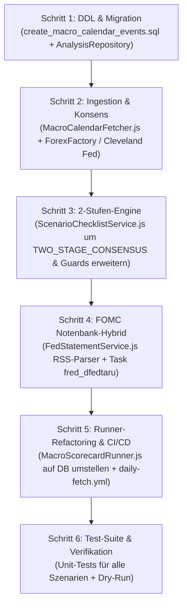

# Befund & Gap-Analyse: Überarbeitung des Szenario- & Kalender-Systems

> **Status:** Analysiert & Spezifiziert  
> **Referenz-Konzept:** [`docs/architecture/macro/Makro-Kalender-Szenarien-Konzept.md`](file:///workspaces/CrashRadar/docs/architecture/macro/Makro-Kalender-Szenarien-Konzept.md)  
> **Ziel:** Vollständiger technischer Abgleich des überarbeiteten Konzepts gegen die bestehende Codebase zur Vorbereitung der System-Umstellung von statischen JSON-Konfigurationen auf das datenbankgestützte 3-Schichten-Framework (`Option A: Full DB`).

---

## 1. Zusammenfassung des Befunds

Der Abgleich zwischen dem Zielkonzept [`docs/architecture/macro/Makro-Kalender-Szenarien-Konzept.md`](file:///workspaces/CrashRadar/docs/architecture/macro/Makro-Kalender-Szenarien-Konzept.md) und dem Ist-Zustand des Codes ([`src/services/ScenarioChecklistService.js`](file:///workspaces/CrashRadar/src/services/ScenarioChecklistService.js), [`src/runners/MacroScorecardRunner.js`](file:///workspaces/CrashRadar/src/runners/MacroScorecardRunner.js), [`src/core/repositories/AnalysisRepository.js`](file:///workspaces/CrashRadar/src/core/repositories/AnalysisRepository.js)) zeigt eine klare Trennung zwischen:
1. **Neu zu erstellenden Kern-Diensten und Datenbank-Strukturen** (Kalender-Ingestion, dynamischer Regel-Generator, Notenbank-RSS-Parser).
2. **Punktuell anzupassenden bestehenden Diensten** (Runner auf DB-Events umstellen, Rule-Engine um 2-Stufen-Modell erweitern, Repository-Erweiterungen, CI/CD-Timing).

---

## 2. Was ist NEU zu erstellen? ("Neu")

| Komponente | Dateipfad | Zweck & Spezifikation |
| :--- | :--- | :--- |
| **1. DDL & Migration** | [`src/db/migrations/create_macro_calendar_events.sql`](file:///workspaces/CrashRadar/docs/architecture/macro/Makro-Kalender-Szenarien-Konzept.md#L207-L234) | **MySQL Schema für `macro_calendar_events`:** • Spalten: `id`, `scenario_id`, `event_code`, `title`, `reporting_period`, `release_date`, `release_time`, `target_observation_date`, `metric`, `rule_json` (JSON), `pass_message`, `fail_message`, `status` (ENUM: `SCHEDULED`, `PENDING_DATA`, `PASSED`, `FAILED`, `SKIPPED`), `previous_value` (VARCHAR 64), `consensus_estimate` (VARCHAR 64), `actual_value` (VARCHAR 64), `details_json` (JSON), `evaluated_at`, `notified_at`, Timestamps. • Indizes: `idx_release_date`, `idx_scenario_status`, `idx_event_code`. |
| **2. `MacroCalendarFetcher.js`** | [`src/services/MacroCalendarFetcher.js`](file:///workspaces/CrashRadar/src/services/) | **Layer 1 (Termine & Konsens):** • *Jahres-Termine:* Ruft FRED Release Dates API (`/fred/release/dates`) für die 5 Kern-Releases ab (JOLTS: 119, NFP: 50, CPI: 10, PPI: 110, PCE: 54) und legt Termine mit Status `SCHEDULED` in DB an. • *Konsens-Ingestion:* Gecachter, resilienter Abruf des Wall-Street-Konsens von ForexFactory (`ff_calendar_thisweek.json`) & Cleveland Fed Inflation Nowcast (`parseClevelandNowcast()`), Normalisierung (`"7.33M"` $\to$ `7330`) und Update von `consensus_estimate`. |
| **3. `MacroScenarioRuleService.js`** | [`src/services/MacroScenarioRuleService.js`](file:///workspaces/CrashRadar/src/services/) | **Layer 2 (Regel-Generator & Interpretation):** • Erzeugt dynamische `rule_json`-Definitionen (z. B. 2-Stufen-Regeln mit beidseitigem Goldilocks-Korridor und `macroGuards`) für das aktive Szenario (z. B. `goldilocks_q3_2026`). • Verknüpft die Regeln persistent mit den fälligen Kalender-Events in `macro_calendar_events`. |
| **4. FOMC Phase 1 RSS Parser** | [`src/services/FedStatementService.js`](file:///workspaces/CrashRadar/src/services/) (oder Helper) | **Phase 1 Live-Zinsentscheid:** • Ruft um 20:05 MESZ (18:05 UTC) den offiziellen Fed Press RSS-Feed ab: `https://www.federalreserve.gov/feeds/press_monetary.xml`. • Regex-Klassifikation auf standardisierte Beschlussmuster (`PAUSE`, `CUT_25`, `CUT_50`, `HIKE_25`). • Zero-Hallucination-Guard: Bei Feed-Ausfall oder unklarer Formulierung stummer Verbleib auf `PENDING_DATA` (Übergang in Phase 2). |
| **5. FRED-Task `fred_dfedtaru`** | [`config/Database-Fetcher-Config.json`](file:///workspaces/CrashRadar/config/Database-Fetcher-Config.json) | **Phase 2 T+1 Verifikation:** • Task für die offizielle Federal Funds Target Range Upper Limit (`DFEDTARU`) aus dem H.15-Release zur mathematischen Absicherung am Folgetag (Donnerstag 15:30 MESZ). |
| **6. CLI-Option `--sync-macro-calendar`** | [`index.js`](file:///workspaces/CrashRadar/index.js) | CLI-Schalter, um den `MacroCalendarFetcher` manuell oder per Cron-Job auszuführen. |

---

## 3. Was muss im bestehenden Code GEÄNDERT werden? ("Anders")

### 3.1 [`src/runners/MacroScorecardRunner.js`](file:///workspaces/CrashRadar/src/runners/MacroScorecardRunner.js)
* **Status Quo:**
  * Liest Events synchron aus der statischen JSON [`config/Macro-Scenarios-Config.json`](file:///workspaces/CrashRadar/config/Macro-Scenarios-Config.json).
  * Nutzt [`config/alert_history.json`](file:///workspaces/CrashRadar/config/alert_history.json) zur Entprellung (ob ein Alert heute bereits versendet wurde).
  * Gemessene Werte werden nicht in der Datenbank gespeichert, sondern nur in Log/Alert ausgegeben.
* **Erforderliche Änderungen:**
  1. **SQL-Eventabfrage:** Liest anstehende Events (`release_date = CURRENT_DATE` und `status IN ('SCHEDULED', 'PENDING_DATA')`) direkt per SQL aus `macro_calendar_events`.
  2. **2-Phasen-Weiche für FOMC:**
     * Am Sitzungsabend (Mittwoch 20:05 MESZ): Triggert Phase 1 (Fed-Statement RSS-Parser).
     * Am Folgetag (Donnerstag 15:30 MESZ): Triggert Phase 2 (`TimeSeriesFetcher` Task `fred_dfedtaru` bzw. `fred_dff` und mathematisches Delta).
  3. **Ergebnis-Persistenz:** Nach der Auswertung werden `actual_value`, `details_json`, `status` (`PASSED`/`FAILED`), `evaluated_at` und `notified_at` direkt in der Datenbank aktualisiert (`alert_history.json` entfällt für Makro-Events).

### 3.2 [`src/services/ScenarioChecklistService.js`](file:///workspaces/CrashRadar/src/services/ScenarioChecklistService.js)
* **Status Quo:**
  * Unterstützt die Regeltypen `RANGE`, `MIN`, `MAX`, `ALLOWED_VALUES`.
  * Arbeitet auf dem statischen In-Memory-Array der MVP-Konfiguration.
* **Erforderliche Änderungen:**
  1. **Neuer Regeltyp `TWO_STAGE_CONSENSUS`:**
     * **Stufe 1 (Konsens-Check):** Toleranzkorridor gegen `consensus_estimate` prüfen:
       * *Inflation (CPI/PCE/PPI):* $\text{actual\_value} \le \text{consensus\_estimate} + 0.10\,\%$
       * *Arbeitsmarkt (NFP):* $\text{consensus\_estimate} - 15\text{k} \le \text{actual\_value} \le \text{consensus\_estimate} + 100\text{k}$
     * **Stufe 2 (Makro-Sicherheitsnetz / `macroGuards`):**
       * Iteration über ein Array von Guards (z. B. `SAHMREALTIME <= 0.50`, `PAYEMS_DIFF >= 40k`, `SPREAD_TO_METRIC` für Realzins $\text{Core CPI} \le \text{DFF} - 0.25\,\%$).
  2. **DB-Entity-Kompatibilität:**
     * Methode `_evaluateSingleEvent` so anpassen, dass sie direkt mit Datensätzen aus `macro_calendar_events` arbeitet (`rule_json` als JSON-Objekt).
  3. **Detail-Strukturierung:**
     * Erzeugung von `details_json` mit allen Einzelprüfungen zur Speicherung in MySQL.

### 3.3 [`src/core/repositories/AnalysisRepository.js`](file:///workspaces/CrashRadar/src/core/repositories/AnalysisRepository.js)
* **Status Quo:**
  * Enthält Zeitreihentabellen (`TABLES`), Symbole und FRED-Serien.
  * `PAYEMS` und `DFEDTARU` fehlen in `FRED_SERIES`.
  * Keine Methoden zur Verwaltung von Kalender-Events vorhanden.
* **Erforderliche Änderungen:**
  1. Ergänzung von `TABLES.MACRO_CALENDAR_EVENTS = 'macro_calendar_events'`.
  2. Ergänzung von `FRED_SERIES.PAYEMS = 'PAYEMS'` und `FRED_SERIES.DFEDTARU = 'DFEDTARU'`.
  3. Neue Methoden:
     * `getCalendarEventsForDate(dateStr, scenarioId)`
     * `updateCalendarEventResult(id, { actual_value, status, details_json, evaluated_at, notified_at })`
     * `upsertCalendarEvents(events)`
     * `updateConsensusEstimate(eventCode, reportingPeriod, consensus)`

### 3.4 [`.github/workflows/daily-fetch.yml`](file:///workspaces/CrashRadar/.github/workflows/daily-fetch.yml)
* **Status Quo:**
  * Intraday-Cron läuft stündlich um `:30` von 14:30 bis 20:30 UTC (`30 14,15,16,17,18,19,20 * * 1-5`).
* **Erforderliche Änderungen:**
  1. **FOMC Live-Trigger (Phase 1):** Die Zinsentscheidung fällt um 20:00 MESZ (= 18:00 UTC). Ein Lauf um 18:05 UTC stellt sicher, dass der Live-Alert unmittelbar nach Statement-Veröffentlichung um 20:05 MESZ versendet wird.
  2. **Kalender- & Konsens-Sync Step:** Einbindung des wöchentlichen/täglichen `MacroCalendarFetcher`-Laufs im nächtlichen EOD-Job (`0 1 * * 2-6`), um Konsens-Schätzungen (ForexFactory / Cleveland Fed) automatisch vorab in MySQL abzulegen.

### 3.5 [`tests/services/ScenarioChecklistService.test.js`](file:///workspaces/CrashRadar/tests/services/ScenarioChecklistService.test.js)
* **Status Quo:**
  * 17 Tests decken bestehende Typen (`RANGE`, `MIN`, `MAX`, `ALLOWED_VALUES`) sowie die MoM-/YoY-Fixes ab.
* **Erforderliche Änderungen:**
  * Zusätzliche Unit-Tests für:
    * `TWO_STAGE_CONSENSUS` mit Beat, Miss und Überhitzung ($> +100\text{k}$).
    * `macroGuards` Veto-Logik (z. B. Beat bei NFP, aber Sahm-Regel getriggert $\to$ FAIL).
    * `SPREAD_TO_METRIC` (Kerninflation vs. Leitzins).

---

## 4. Wichtige Befunde & Korrekturen aus dem Codeabgleich

1. **Korrektur im Konzept (Tabelle 4.2):**
   * Im Konzeptdokument ([`docs/architecture/macro/Makro-Kalender-Szenarien-Konzept.md`](file:///workspaces/CrashRadar/docs/architecture/macro/Makro-Kalender-Szenarien-Konzept.md#L244)) wurde für das Event `FOMC` als Task `fred_interest` angegeben.
   * *Code-Befund:* In [`config/Database-Fetcher-Config.json:570`](file:///workspaces/CrashRadar/config/Database-Fetcher-Config.json#L570) referenziert `fred_interest` die staatlichen Zinsausgaben (`A091RC1Q027SBEA`), nicht den Leitzins!
   * *Lösung:* Der bestehende Task für den Leitzins ist `fred_dff` (`DFF`). Für Phase 2 wird der neue Task `fred_dfedtaru` (`DFEDTARU`) ergänzt.
2. **Entlastung von `alert_history.json`:**
   * Die Entprellung wandert vollständig in die Datenbank (`status != 'SCHEDULED' && status != 'PENDING_DATA'` bzw. `notified_at IS NOT NULL`). Dadurch entfallen Git-Merge-Konflikte bei gleichzeitigen GitHub-Action-Läufen.
3. **Monopol des TimeSeriesFetchers gewahrt:**
   * Auch im neuen System greift der `MacroScorecardRunner` niemals direkt auf externe Zeitreihen-Endpunkte zu. Er triggert den `TimeSeriesFetcher` und liest harte Ist-Werte ausschließlich lokal aus `econ_fred`.

---

## 5. Empfohlener Umsetzungs-Fahrplan (Roadmap)

