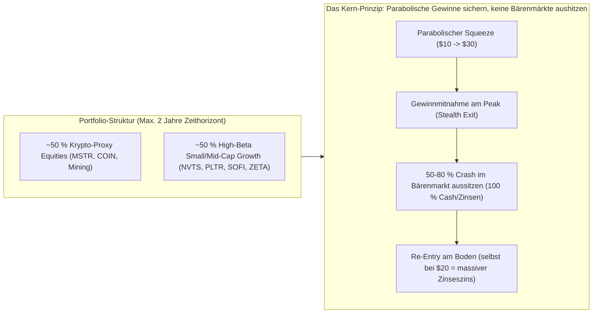
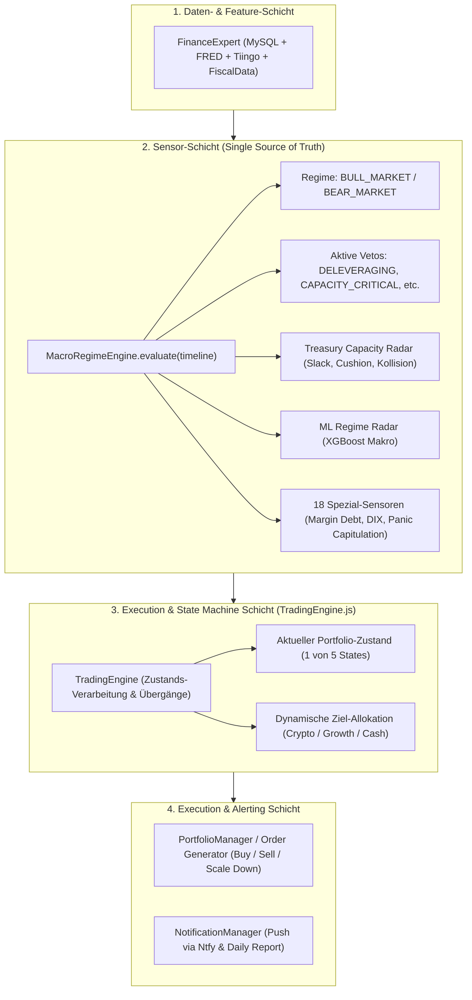

# Trading Engine: Architektur, Investoren-DNA & State Machine

Dieses Dokument definiert das Fundament, die Systemarchitektur und die Handelsregeln für die geplante **Trading & Execution Engine** von `CrashRadar`. Es dient als verbindliche Blaupause für die künftige Implementierung und den anstehenden 21-Jahre-Portfolio-Backtest.

---

## 1. Das Fundament: Die Investoren-DNA & Portfolio-Philosophie

Die Engine ist maßgeschneidert auf ein **zyklisches, asymmetrisches Wachstums- und Krypto-Portfolio** und distanziert sich radikal von passivem "Buy-and-Hold":



### Die Kern-Prinzipien:

1. **Kein Buy-and-Hold:**
   * Kein Halten einer Aktie über mehr als 2 Jahre. Kapital wird aggressiv in Aufwärtsphasen (*Melt-Ups / Zuckerrausch*) allokiert und vor Beginn der systemischen Bärenmärkte vollständig in Cash / T-Bills gerettet.
2. **Krypto-Fokus (~50 % Portfolio):**
   * Aktien wie `MSTR` und `COIN` werden strikt nach der **Bitcoin-Zyklus-Uhr** und dem makroökonomischen Liquiditäts-Radar gesteuert.
   * *Regel:* Wenn der Bitcoin-Run endet (Zyklus-Gefahrenzone >970 Tage, Makro-Radar SMA 200 Bruch oder Cycle Top), wird die gesamte Krypto-Quote zu 100 % liquidiert. Niemand sitzt einen -80 % Krypto-Winter in Aktien aus.
3. **High-Beta Small/Mid-Cap Growth (~50 % Portfolio):**
   * Wachstums- und Turnaround-Titel (`NVTS`, `PLTR`, `SOFI`, `ZETA`, `ARKK`) vervielfachen sich in TGA-Drain- und Zins-Pufferphasen oft parabolisch ($10 $\to$ $30).
   * *Das "NVTS-Prinzip":* Wenn eine Aktie sich von ihren fundamentalen Gewinnen entkoppelt und parabolisch nach oben geschleudert wird, werden **Gewinne konsequent realisiert**. Der darauffolgende -60 % bis -80 % Absturz wird in Cash ausgesessen. Wenn man später nach der Bodenbildung bei $20 wieder einsteigt (doppelt so hoch wie der Ersteinstieg bei $10), ist man durch die realisierten $30 immer noch massiv im Plus und reitet den nächsten Squeeze mit vervielfachtem Kapital!

---

## 2. Systemarchitektur: Das "Macro Execution State Machine" Pattern

Um **Code-Duplizierung zu 100 % zu vermeiden**, trennt die Architektur strikt zwischen **Sensorik (Indikatoren)** und **Aktorik (Trading-Entscheidungen)**.

### 2.1 Datenfluss & Schichtenarchitektur



---

### 2.2 Technisches Klassendesign & JavaScript-Implementierungs-Skizze

Die `TradingEngine` implementiert das **Strategy- und State-Machine-Pattern**. Sie empfängt das fertige Analyse-Objekt der `MacroRegimeEngine` und den aktuellen Portfolio-Bestand, berechnet die Zustandsübergänge und emittiert konkrete Orders:

```javascript
/**
 * TradingEngine.js (Blaupause)
 */
export class TradingEngine {
  constructor(config = {}) {
    this.currentState = 'FULL_DEFENSIVE_CASH';
    this.config = {
      maxHoldingYears: 2.0,
      targetCryptoWeight: 0.50,
      targetGrowthWeight: 0.50,
      parabolicTakeProfitRoc30: 100.0, // > +100 % in 30 Tagen -> Teilgewinnmitnahme
      ...config
    };
  }

  /**
   * Haupt-Evaluierung: Transformiert Sensor-Daten in Portfolio-Zustände & Orders
   * @param {Array} timeline - Gesamte historische Makro- und Kurs-Timeline
   * @param {Object} currentPortfolio - Aktueller Kassen- und Wertpapierbestand
   * @returns {Object} { state, targetAllocation, actions, message }
   */
  evaluate(timeline, currentPortfolio = {}) {
    const n = timeline.length;
    const currentDay = timeline[n - 1];
    
    // 1. Sensoren aus der MacroRegimeEngine auslesen (Zero Code Duplication!)
    const regime = currentDay.regime || 'NORMAL';
    const vetos = currentDay.vetos || [];
    const capacity = currentDay.indicatorDetails?.find(i => i.name.includes('Capacity Radar')) || {};
    const panic = currentDay.indicatorDetails?.find(i => i.name.includes('Panik-Kapitulation')) || {};
    const marginDebt = currentDay.indicatorDetails?.find(i => i.name.includes('Margin Debt')) || {};
    const btcExit = currentDay.tradeActions?.find(a => a.name?.includes('Krypto Portfolio-Exit')) || {};

    const collisionWindow = capacity.details?.projectedCollision || '';
    const ttcDays = capacity.details?.ttcDays ?? 365;
    const isBuffered = capacity.details?.catalystStatus === 'BUFFERED_TILL_ELECTION';

    // 2. Zustandsübergangs-Logik (State Transitions)
    let nextState = this.currentState;
    const actions = [];

    // TRANSITION 1: GENERATION_BOTTOM_BUY (Panik-Kapitulation VIX > 45 oder RSI Divergenz)
    if (panic.status === 'BUY_SETUP' || (capacity.status === 'OK' && this.currentState === 'FULL_DEFENSIVE_CASH')) {
      nextState = 'GENERATION_BOTTOM_BUY';
      actions.push({ type: 'ALL_IN_BUY', assets: ['MSTR', 'COIN', 'PLTR', 'SOFI', 'NVTS'], urgency: 'HIGH' });
    }
    // TRANSITION 2: FULL_DEFENSIVE_CASH (Kollision / Roter Alarm / Veto)
    else if (capacity.status === 'CRITICAL' || vetos.includes('TREASURY_CAPACITY_CRITICAL')) {
      nextState = 'FULL_DEFENSIVE_CASH';
      actions.push({ type: 'LIQUIDATE_ALL_TO_CASH', reason: 'Treasury Capacity Collision active' });
    }
    // TRANSITION 3: PARABOLIC_PROFIT_TAKING & STEALTH_EXIT (Countdown < 14d oder Deleveraging)
    else if (isBuffered && (ttcDays < 14 || marginDebt.status === 'WARNING')) {
      nextState = 'PARABOLIC_PROFIT_TAKING';
      actions.push({ type: 'SCALE_DOWN', targetCashPct: 0.50, reason: 'Collision Countdown < 14d / Deleveraging' });
    }
    // TRANSITION 4: CRYPTO_CYCLE_EXIT (Bitcoin Run beendet)
    else if (btcExit.status === 'WARNING' || vetos.includes('BTC_CYCLE_TOP')) {
      nextState = 'CRYPTO_CYCLE_EXIT';
      actions.push({ type: 'SELL_CRYPTO_EQUITIES', assets: ['MSTR', 'COIN', 'MARA'], targetCashPct: 0.50 });
    }
    // TRANSITION 5: MAX_BULL_GROWTH (Zuckerrausch / Puffer-Phase aktiv)
    else if (isBuffered || capacity.status === 'OK') {
      nextState = 'MAX_BULL_GROWTH';
    }

    this.currentState = nextState;

    // 3. Ziel-Allokation berechnen
    const targetAllocation = this._calculateTargetAllocation(nextState);

    return {
      state: nextState,
      targetAllocation,
      actions,
      collisionWindow,
      message: this._generateStateMessage(nextState, targetAllocation)
    };
  }

  _calculateTargetAllocation(state) {
    switch (state) {
      case 'MAX_BULL_GROWTH':
        return { CryptoEquities: 0.50, HighBetaGrowth: 0.50, Cash: 0.00 };
      case 'CRYPTO_CYCLE_EXIT':
        return { CryptoEquities: 0.00, HighBetaGrowth: 0.50, Cash: 0.50 };
      case 'PARABOLIC_PROFIT_TAKING':
        return { CryptoEquities: 0.20, HighBetaGrowth: 0.30, Cash: 0.50 };
      case 'FULL_DEFENSIVE_CASH':
        return { CryptoEquities: 0.00, HighBetaGrowth: 0.00, Cash: 1.00 };
      case 'GENERATION_BOTTOM_BUY':
        return { CryptoEquities: 0.50, HighBetaGrowth: 0.50, Cash: 0.00 };
      default:
        return { CryptoEquities: 0.00, HighBetaGrowth: 0.00, Cash: 1.00 };
    }
  }

  _generateStateMessage(state, alloc) {
    return `[Trading State: ${state}] Allokation -> Krypto: ${(alloc.CryptoEquities*100)}%, Growth: ${(alloc.HighBetaGrowth*100)}%, Cash: ${(alloc.Cash*100)}%`;
  }
}
```

---

### 2.3 Die Zustandsübergangs-Matrix (State Transition Matrix)

| Vorheriger Zustand | Auslösendes Sensor-Signal | Neuer Zustand | Portfolio-Aktion | Ziel-Allokation (Krypto / Growth / Cash) |
| :--- | :--- | :--- | :--- | :--- |
| **Jeder Zustand** | `PanicCapitulation = BUY_SETUP` (VIX > 45) | 🚀 `GENERATION_BOTTOM_BUY` | **Aggressiver Re-Entry am Tief** | **50 % Krypto / 50 % Growth / 0 % Cash** |
| `FULL_DEFENSIVE_CASH` | `CapacityRadar = OK/WARNING` & Kollision > 45d | 🟢 `MAX_BULL_GROWTH` | **Wiedereinstieg in den Melt-Up** | **50 % Krypto / 50 % Growth / 0 % Cash** |
| `MAX_BULL_GROWTH` | `BTC Gefahrenzone > 970d` / `MSTR < SMA 200` | 🟣 `CRYPTO_CYCLE_EXIT` | **100 % Verkauf aller Krypto-Aktien** | **0 % Krypto / 50 % Growth / 50 % Cash** |
| `MAX_BULL_GROWTH` | `TTC Countdown < 14d` / `Margin Debt < -5 %` | 🟡 `PARABOLIC_PROFIT_TAKING` | **Stufenweiser Abbau (Scale Down)** | **20 % Krypto / 30 % Growth / 50 % Cash** |
| `Jeder Zustand` | `CapacityRadar = CRITICAL` / `RedAlert = ALERT`| 🔴 `FULL_DEFENSIVE_CASH` | **100 % Notfall-Exit in Geldmarkt** | **0 % Krypto / 0 % Growth / 100 % Cash** |

---

## 3. Die 5 Kern-Zustände der Trading Engine

### 🟢 Zustand 1: `MAX_BULL_GROWTH` (Der Zuckerrausch / Melt-Up)
* **Bedingung:** 
  * `Treasury Capacity Radar` = `OK` oder `WARNING (BUFFERED)` mit $T_{\text{collision}} > 45\text{ Tagen}$.
  * Kein aktiver Krypto-Top-Alarm oder akutes Liquiditäts-Veto.
* **Allokation:**
  * **50 % Krypto-Proxies** (`MSTR`, `COIN`)
  * **50 % Small/Mid-Cap Growth** (`NVTS`, `PLTR`, `SOFI`, `ZETA`, `ARKK`)
  * **0 % Cash**
* **Ziel:** Maximale Partizipation am 4x bis 15x Beta-Hebel des TGA-Abbaus.

---

### 🟣 Zustand 2: `CRYPTO_CYCLE_EXIT` (Bitcoin-Top-Schutz)
* **Bedingung:**
  * Krypto-Portfolio-Exit triggert (Zyklus-Tag > 970 & Bruch des SMA 50) **ODER** `MSTR` bricht den SMA 200 **ODER** LSTM meldet `BTC: CYCLE_TOP (>90 %)`.
* **Aktion:**
  * **100 % Verkauf aller Krypto-Aktien** (`MSTR`, `COIN`, Miner) in Cash / T-Bills.
  * Growth-Aktien verbleiben im Portfolio, sofern der Treasury Capacity Radar noch Puffer signalisiert.

---

### 🟡 Zustand 3: `PARABOLIC_PROFIT_TAKING & STEALTH_EXIT` (Countdown & Deleveraging)
* **Bedingung:**
  * `Treasury Capacity Radar` Kollisions-Countdown $< 14\text{ Tagen}$ (z. B. Mitte Oktober vor dem 04.11.2026) **ODER** `Margin Debt` fällt rasant (`-5.6 %` Deleveraging) **ODER** Einzelaktien verzeichnen parabolische Blow-Off-Spikes (> 100 % in 30 Tagen).
* **Aktion:**
  * **Schrittweise Gewinnmitnahmen (Scale Down):** Täglicher Abbau der High-Growth-Positionen um 20–33 %.
  * Gewinne fließen direkt in risikolosen Geldmarkt (3–5 % Rendite).
  * **Keine neuen Long-Positionen mehr!**

---

### 🔴 Zustand 4: `FULL_DEFENSIVE_CASH` (Kollision & Bärenmarkt)
* **Bedingung:**
  * `Treasury Capacity Radar` = `CRITICAL` / `IMMINENT_DRAIN` **ODER** Veto `TREASURY_CAPACITY_CRITICAL` aktiv **ODER** `RedAlert` schlägt an.
* **Allokation:**
  * **100 % Cash / US-Treasury T-Bills**
* **Ziel:** Vollständige Immunität gegen -30 % bis -80 % Abstürze. Tägliche Zinserträge kassieren, während der Markt blutet.

---

### 🚀 Zustand 5: `GENERATION_BOTTOM_BUY` (Die Kapitulation / Der Re-Entry)
* **Bedingung:**
  * [`PanicCapitulationIndicator`](file:///D:/GitHub/CrashRadar/src/analysis/indicators/PanicCapitulationIndicator.js) meldet `BUY_SETUP` ($VIX > 35-50$, CBOE Options-Spike, bullische RSI-Divergenz) **ODER** Gold bildet den Selling-Climax-Boden **ODER** Treasury Capacity Radar springt nach dem Crash von ROT zurück auf GRÜN/GELB.
* **Aktion:**
  * **Aggressiver Re-Entry:** Schrittweises Umschichten des 100 % Cash-Bestands in ausgebombte Growth- und Krypto-Werte.
  * Start eines neuen Zyklus.

---

## 4. Querverweise & Fundamentaldaten

Die Funktionsweise und empirischen Beweise der zugrundeliegenden Sensoren sind in folgenden Architektur-Dokumenten festgehalten:

* 📊 **Vollständiger Indikatoren-Vergleich über 21 Jahre:**  
  🔗 [docs/Indikatoren-Grand-Prix-21-Jahre-Analyse.md](file:///D:/GitHub/CrashRadar/docs/Indikatoren-Grand-Prix-21-Jahre-Analyse.md)  
  *(Nachweis der 100 % Krisen-Trefferquote und der 4-Schichten-Verteidigung)*

* 🏛️ **Mathematische Formeln & Geldmarkt-Plumbing:**  
  🔗 [docs/Treasury-Liquidity-Capacity-Architecture.md](file:///D:/GitHub/CrashRadar/docs/Treasury-Liquidity-Capacity-Architecture.md)  
  *(Formeln zu Liquid Slack, LCLOR, TGA-Cushion, Buyback-Netting und Kollisions-Timer)*

* 🧠 **Zentrale Makro-Thesen & Mythos-Buster:**  
  🔗 [docs/Analyse.md](file:///D:/GitHub/CrashRadar/docs/Analyse.md)  
  *(Auswertung zu Yield Curve, Net Liquidity Illusion, DXY, Margin Debt und SKEW)*

---

## 5. Fahrplan für den großen 21-Jahre-Strategie-Backtest (2005 – 2026)

Als nächster Schritt wird ein dediziertes Simulations-Skript (`scratch/full_21y_trading_engine_backtest.js`) entwickelt, das diesen genauen Investitionsstil gegen historische Daten testet:

1. **Test-Universum:**
   * Benchmark: S&P 500 (`SPY`) und Nasdaq 100 (`QQQ`)
   * Krypto-Proxy: `MSTR` (ab 2005), `COIN` (ab 2021), `MARA`
   * High-Growth: `ARKK` (ab 2014), `PLTR` (ab 2020), `SOFI`, `NVTS`, `SMH`
2. **Vergleichs-Metriken:**
   * **Gesamtrendite & CAGR** (Vergleich State Machine vs. Buy & Hold)
   * **Maximaler Portfolio-Drawdown** (Ziel: Vermeidung der -55 % in 2008, -35 % in 2020, -33 % in 2022)
   * **Sharpe-Ratio & Profit-Faktor**
   * **Re-Entry Effizienz:** Wie profitabel war das Wiedereinsteigen nach parabolischen Gewinnmitnahmen?
