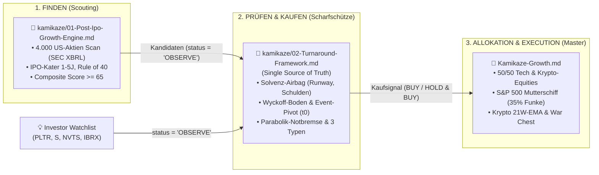

```mermaid
flowchart TD
    Index["📚 CrashRadar Docs"]
    
    Index --> Arch["📐 1. ARCHITECTURE (Das 'WIE')"]
    Index --> Res["🔬 2. RESEARCH (Das 'WARUM')"]
    
    Arch --> A1["🎯 single-asset-radar/<br>(M5 Ingestion & Radar-Master)"]
    Arch --> A2["🏛️ macro/<br>(Treasury Capacity & Kalender)"]
    Arch --> A3["⚙️ trading-engine/<br>(Portfolio State Machine)"]
    Arch --> A4["🧠 ml/<br>(Strategy Pipeline Blueprint)"]
    Arch --> A5["♟️ strategies/<br>(Portfoliostrategien & Allokation)"]
    Arch --> A6["🌐 api/ & data/<br>(Provider-Schnittstellen)"]
    Arch --> A7["📱 signal-service/<br>(Discord, WhatsApp & Broadcasts)"]
    
    Res --> R1["📊 macro-proofs/<br>(21-Jahre-Test & Korrelationen)"]
    Res --> R2["📜 dalio-cycles/<br>(Schuldenkrisen & 3-von-4-Regel)"]
    Res --> R3["🧪 ml-lab/<br>(Trainings-Logs & Fat Tails)"]
    Res --> R4["🔬 methodology-audits/<br>(Noise-Tests & Slippage)"]
    Res --> R5["🧭 DailyPortfolioCompass/<br>(ADR-Thesen & Backtests)"]
```

# CrashRadar Dokumentations-Index & Wissens-Architektur

Willkommen im Dokumentations-Verzeichnis von **`CrashRadar`**.  
Die Dokumentation ist strikt nach **Separation of Concerns** in zwei Hauptbereiche unterteilt:
1. **`architecture/` (System Architecture & Specifications):** Technische Bauanleitungen, Datenpipelines, Schemas, State Machines und Trading-Regeln (Das technische **WIE**).
2. **`research/` (Empirical Research & Proofs):** Wissenschaftliche Auswertungen, historische 21-Jahre-Krisentests, Backtests und Labor-Tagebücher (Der empirische **BEWEIS**).

---

---

## 📐 1. System Architecture & Specifications (`docs/architecture/`)

Hier finden Entwickler und System-Architekten alle operativen Spezifikationen, Endpunkte, Datenbank-Strukturen und Regelwerke:

### A. 🎯 Single-Asset Radar (`docs/architecture/single-asset-radar/`)
* 📄 **[`Single-Asset-Radar-Architecture.md`](file:///D:/GitHub/CrashRadar/docs/architecture/single-asset-radar/Single-Asset-Radar-Architecture.md):**  
  *Master-Architektur des Single-Asset Radars, 3-Schichten-Modell (Ingestion, Analytics, Delivery), 17:15 & 22:15 Uhr Workflows und Ntfy-Smartphone-Alerting.*
* 📄 **[`M5Candels.md`](file:///D:/GitHub/CrashRadar/docs/architecture/single-asset-radar/M5Candels.md):**  
  *Spezifikation der Polygon.io REST-API, 50.000 Kerzen Paginierung, Pacing, Rate-Limit Schutz und MySQL-Schema `market_data_m5`.*
* 📄 **[`SingleAssetTrading.md`](file:///D:/GitHub/CrashRadar/docs/architecture/single-asset-radar/SingleAssetTrading.md):**  
  *Quantitatives Regelwerk: 4-Phasen-Katapult-Engine für Growth-Aktien (NVTS, PLTR, IBRX) und duales MACD-Regime für Sektor-ETFs (IGV, CIBR).*

### B. 🏛️ Makro-Systeme & Liquidität (`docs/architecture/macro/`)
* 📄 **[`Treasury-Liquidity-Capacity-Architecture.md`](file:///D:/GitHub/CrashRadar/docs/architecture/macro/Treasury-Liquidity-Capacity-Architecture.md):**  
  *Architektur zur vorausschauenden Erfassung von Liquiditäts- und Absorptionsengpässen (Liquid Slack, LCLOR, TGA-Cushion, Kollisions-Timer).*
* 📄 **[`Fiscal-FED-Indicator.md`](file:///D:/GitHub/CrashRadar/docs/architecture/macro/Fiscal-FED-Indicator.md):**  
  *Fiskaldominanz vs. Fed-Bilanz, WRESBAL-Schwellenwerte und K-Faktor-Logik.*
* 📄 **[`Makro-Kalender-Szenarien-Konzept.md`](file:///D:/GitHub/CrashRadar/docs/architecture/macro/Makro-Kalender-Szenarien-Konzept.md):**  
  *Vollständige DB-gestützte Architektur für Termine, Konsens-Schätzungen und 2-Stufen-Regeln (`Option A: Full DB`).*
* 📄 **[`ScenarioChecklistService-Gap-Analyse.md`](file:///D:/GitHub/CrashRadar/docs/architecture/macro/ScenarioChecklistService-Gap-Analyse.md):**  
  *Technischer Code-Abgleich und Gap-Analyse zur Migration von statischen JSON-Konfigurationen auf das datenbankgestützte 3-Schichten-Framework.*
* 📄 **[`Macro-Calendar-Events.md`](file:///D:/GitHub/CrashRadar/docs/architecture/database/Macro-Calendar-Events.md):**  
  *Zentrale, kontinuierliche Kalendertabelle `macro_calendar_events`: Automatischer Abgleich von Fiskalfristen, Continuing Resolutions (CR EXTENDED/CONFIRMED), deterministischer QRA-Zyklus und dynamische X-Date-Projektion via US Treasury DTS Table IIIC.*
* 📄 **[`Checkliste-Goldilocks-Szenarios.md`](file:///D:/GitHub/CrashRadar/docs/architecture/macro/Checkliste-Goldilocks-Szenarios.md):**  
  *Monatliche Event-Checkliste für anstehende Makro-Veröffentlichungen mit tagesaktueller Live-Status-Erfassung.*
* 📄 **[`Derivate-OpEx-Kalender-Konzept.md`](file:///D:/GitHub/CrashRadar/docs/architecture/macro/Derivate-OpEx-Kalender-Konzept.md):**  
  *Deterministische Erfassung von monatlichem OpEx, Quadruple Witching (Hexensabbat), VIX-Settlement und 5-Phasen-Derivate-State-Machine für vorausschauende Markt-Entlastung.*

### C. ⚙️ Trading & Execution Engine (`docs/architecture/trading-engine/`)
* 📄 **[`TradingEngine.md`](file:///D:/GitHub/CrashRadar/docs/architecture/trading-engine/TradingEngine.md):**  
  *Die 5 Portfolio-Zustände (State Machine), 50/50 Krypto- & Growth-Philosophie, Fractional-Kelly-Sizing und Re-Entry-System.*

### D. 🧠 Machine Learning Pipelines (`docs/architecture/ml/`)
* 📄 **[`ML_ARCHITECTURE.md`](file:///D:/GitHub/CrashRadar/docs/architecture/ml/ML_ARCHITECTURE.md):**  
  *Strategy-Pattern Pipeline Blueprint (`src/ml/`), dynamic FeatureBuilder und universelles TensorFlow-Training.*
* 📄 **[`Makro-ML.md`](file:///D:/GitHub/CrashRadar/docs/architecture/ml/Makro-ML.md):**  
  *Technisches Konzept für das multivariate Makro-ML-Regime-Modell (XGBoost, Purged Walk-Forward CV & JS-Inferenz).*

### E. 📡 Signal- & SensorHub-Architektur (`docs/architecture/signals/`)
* 📄 **[`Composite-SensorHub-Architektur.md`](file:///D:/GitHub/CrashRadar/docs/architecture/signals/Composite-SensorHub-Architektur.md):**  
  *Composite-Pattern für die SignalEngine: Trennung von atomaren Messfühlern (`MstrLeadSensor`, `BtcTrendSensor`, `DarkPoolSensor`, `VixShockSensor`, `SpyTrendSensor`, `CreditStressSensor`) und aggregierenden Sensor-Hubs (`CryptoSensorHub`, `MacroStressSensorHub`, `LiquiditySensorHub`, `MarketBottomSensorHub`) mit rein deskriptiven Markt-Regimes ohne Strategie-Bevormundung.*
* 📄 **[`LiquiditySensorHub.md`](file:///D:/GitHub/CrashRadar/docs/architecture/signals/LiquiditySensorHub.md):**  
  *Spezifikation der 4-Regime-Geldmarkt-Architektur (`EXPANSION`, `BUFFERED_CUSHION`, `DRAIN_WARNING`, `CRITICAL_DRAIN`), Time-to-Collision (TTC), atomarer Leaf-Sensor `LiquidityCollisionSensor` und empirische Detektion der toxischen 93%-Crash-Falle (`dualMacroStress >= 55 && VIX > 25`).*
* 📄 **[`DailyPortfolioCompass.md`](file:///D:/GitHub/CrashRadar/docs/architecture/signals/DailyPortfolioCompass.md):**  
  *Taktischer Portfolio- & Timing-Lotse: Synthese aus Geldmarkt-, Derivate- und Goldilocks-Hubs mit Trading212-Depotverknüpfung (`TEILGEWINNE PRÜFEN`, `FÜSSE STILLHALTEN`, `NOT-EXIT / ABSICHERN`), Erkennung von Verfallswochen-Ausschütteln vor Hexensabbat (`SHAKEOUT`) und Ntfy-Push-Alarmierung (`NTFY_PORTFOLIO_COMPASS_TOPIC`).*
* 📄 **[`Makrowetter-Audit-und-Refactoring.md`](file:///D:/GitHub/CrashRadar/docs/architecture/signals/Makrowetter-Audit-und-Refactoring.md):**  
  *Code-Audit & Bereinigung des Makrowetter-Berichts: Stilllegung veralteter Monolithen (`SmartDumbMoneyBottom`), Entschärfung von Margin-Debt Fehleskalationen (-5% Warning / -10% Critical), 180-Tage Un-Inversions-Gedächtnis für die Renditekurve und Einhängen der Katastrophen-Matrix in die Pipeline.*

### F. ♟️ Portfoliostrategien & Allokations-Regeln (`docs/architecture/strategies/`)

* 📄 **[`7-Slot-Guru-Konsens-System.md`](file:///D:/GitHub/CrashRadar/docs/architecture/strategies/7-Slot-Guru-Konsens-System.md):**  
  *Masterplan Version 3.1.0 (Dual-Engine Governance & KI-Infrastruktur): Arbeitsteilung zwischen Tech-Momentum-Scouts (Altimeter, Coatue, Tiger Global als Alpha-Motor) und Makro-Risiko-Wächtern (Duquesne, PointState, Appaloosa als Governance & Veto-Gatekeeper). Thematische Öffnung auf Tech & KI-Infrastruktur/Power (Einzug von GE Vernova GEV in Slot 7, UBER im Watch-Pool Rang 1), doppelt gesichertes Rebalancing (Verdrängung bei Wächter-Trimmen UND SMA-50-Knick oder SMA-200-Überdehnung > 30 % mit +24,5 % Alpha-Beweis), dauerhafter Halbleiter-Deckel auf max. 2 Slots (TSM, NVDA; LRCX auf Deck mit Skip-Rule), Unterbelegungs-Doktrin ($100\% / N$ bei weniger als 7 Titeln am Boden, QQQ-Fallback bei $N=0$), Geopolitische Whitelist (China VIE-Ausschluss), Vetoed-No-Rebuy am Marktboden (+33,05 %P Alpha), automatisches 13F-Signature Nachfolge-Tracking sowie **Roadmap V3.2: Forschungs-Hypothese zur Drosselung überdehnter Spätzyklus-Positionen und Vorziehen frischer Watch-Pool-Kandidaten (UBER)**.*  
  * 🗄️ **[`guru-archive/7-Slot-Guru-Konsens-System-v2.1-Archive.md`](file:///D:/GitHub/CrashRadar/docs/architecture/strategies/guru-archive/7-Slot-Guru-Konsens-System-v2.1-Archive.md):** *Historisches Archiv der Vorgänger-Version 2.1 (archiviert am 14.09.2026).*
* 📄 **[`Gold-GDX.md`](file:///D:/GitHub/CrashRadar/docs/architecture/strategies/Gold-GDX.md):**  
  *Quantitative Tranchen-Exit- und Regime-Strategie für Gold & GDX (Selling Climax, Divergenzen, ROC-Erschöpfung und Catastrophe Stop).*
* 📄 **[`Gold-SPY.md`](file:///D:/GitHub/CrashRadar/docs/architecture/strategies/Gold-SPY.md):**  
  *Quantitative Trend-Schild & Gold-Hedge-Strategie (Version 2.2) für dynamisches DCA im S&P 500: Reines DCA im Normalbetrieb, 3-Säulen-Katastrophen-Matrix als Makro-Türsteher gegen Fehlausstiege (SPY < SMA 200 & DD >= 8 % gekoppelt an Kreditstress, VIX-Panik, Deleveraging oder QT) und 75 % Gold / 25 % Cash Sweet Spot mit antizyklischem VIX-Panik-Boden-Sniper inkl. 21,8-Jahre-Historien-Beweis (2004–2026: 381.741 € / +674 % Rendite / nur 23 Ausstiege in 21,8 Jahren / Max Drawdown -28,61 %) in [`test_katastrophen_matrix.js`](file:///D:/GitHub/CrashRadar/scratch/architecture/strategies/test_katastrophen_matrix.js).*
* 📄 **[`Muzzled-Cathie-Wood.md`](file:///D:/GitHub/CrashRadar/docs/architecture/strategies/Muzzled-Cathie-Wood.md):**  
  *Master V3 des Cathie-Wood-Radars: 60/40 Strategische Allokation (60 % Tech / 40 % Krypto), 3-Säulen-ARK-Ingestion (Watchlist `OBSERVE` $\rightarrow$ `BUY` erst nach Chart-Validierung), organischer Tech Sub-Bucket ohne Slot-Limit mit S&P 500 Mutterschiff, autonom gesteuerter Krypto Sub-Bucket (`BTC`, `COIN`, `HOOD`) via 21-Wochen-EMA mit 40/30/30-Pyramide & internem Leihgabe-Verrechnungskonto (`kryptoClaimUSD`), Sektor-Relativität (SMH/IGV), Flag-System (`HOLD & BUY` Verkaufsblockade vs. `HOLD & OBSERVE`) mit 3-Stufen-Abbau (1/3 bei Growth-Knick, 1/3 bei SMA 200, 100 % bei Folge-Knick), konträres Dip-Buying, 100 % Notfall-Evakuierung in 50 % Gold / 50 % Cash mit Dual-Re-Entry-Sniper (+1.286,33 % Nettorendite / 304.991,89 €) inkl. PoC in [`MuzzledCathieWoodSimulation.js`](file:///D:/GitHub/CrashRadar/scratch/architecture/strategies/MuzzledCathieWoodSimulation.js).*
* 📄 **[`Kamikaze-Growth.md`](file:///D:/GitHub/CrashRadar/docs/architecture/strategies/Kamikaze-Growth.md):**  
  *Master-Strategie für das private High-Conviction Realdepot (~94.000 $ Basis): 50/50 Tech- & Krypto-Equity-Allokation mit S&P 500 Mutterschiff, 35 % Zündfunken-Allokation, Krypto-21W-EMA Regime, 100 % Notfall-Evakuierung (50 Gold / 50 Cash), Broker-Realität ('Broker ist Gesetz') sowie Zwei-Phasen-Restrukturierungsmodell (Oktober-Liquidierung & War Chest).*
  * 📁 **Modulare Kamikaze-Architektur ([`docs/architecture/strategies/kamikaze/`](file:///D:/GitHub/CrashRadar/docs/architecture/strategies/kamikaze/)):**
    * 📄 **[`Kamikaze-Master-Drehbuch.md`](file:///D:/GitHub/CrashRadar/docs/architecture/strategies/kamikaze/Kamikaze-Master-Drehbuch.md):** *Das lückenlose, empirisch bewiesene Master-Drehbuch & Protokoll (Single Source of Truth) aus Spürhund für Wall-Street-Irrsinn (Selling Climax, Trockenvolumen, Akkumulation), 3 Asset-Klassen (LASTING_HOLD, CYCLICAL, BINARY), 50/50-Allokation und Panik-Kriegskasse.*
    * 🗄️ **[`kamikaze-archive/`](file:///D:/GitHub/CrashRadar/docs/architecture/strategies/kamikaze-archive/):** *Historisches Archiv der Vorgänger-Entwürfe (01-PIGE, 02-Turnaround, 03-Interface, v1.1 Master).*
* 📄 **[`Satelite.md`](file:///D:/GitHub/CrashRadar/docs/architecture/strategies/Satelite.md):**  
  *Geopolitisch gehärtetes Core-Satellite-Depot: 80 % SPY (S&P 500 Mutterschiff), 15 % DFNS (VanEck Defense UCITS ETF) und 5 % BTC (Bitcoin). Im Normalbetrieb gilt kompromissloses HODL (keine unterjährigen Verkäufe). Rebalancing erfolgt ausschließlich über den universellen Notfall-Stecker (100 % Notfall-Evakuierung in 50 % Gold / 50 % Cash bei NetLiq < -5 % & Credit Spreads > 4 % sowie Rebalancing-Reset bei Re-Entry am Marktboden) (+83,40 % Rendite / +12,68 %-Pkt. Alpha vs. SPY) inkl. PoC in [`SatelliteCoreSimulation.js`](file:///D:/GitHub/CrashRadar/scratch/architecture/strategies/SatelliteCoreSimulation.js).*

### G. 🌐 Externe Schnittstellen & Daten (`docs/architecture/api/` & `docs/architecture/data/`)
* 📄 **[`FRED-Api.md`](file:///D:/GitHub/CrashRadar/docs/architecture/api/Stlouisfed.md)** | **[`Fiscaldata.md`](file:///D:/GitHub/CrashRadar/docs/architecture/api/Fiscaldata.md)** | **[`Tiingo.md`](file:///D:/GitHub/CrashRadar/docs/architecture/api/Tiingo.md)** | **[`Binance.md`](file:///D:/GitHub/CrashRadar/docs/architecture/api/Binance.md)** | **[`Yahoo-Finance.md`](file:///D:/GitHub/CrashRadar/docs/architecture/api/Yahoo-Finance.md)**
* 📄 **[`DataStructure.md`](file:///D:/GitHub/CrashRadar/docs/architecture/data/DataStructure.md)**
* 📄 **[`System-Overlap-Datacenter-CrashRadar.md`](file:///D:/GitHub/CrashRadar/docs/architecture/data/System-Overlap-Datacenter-CrashRadar.md):**  
  *Systemabgrenzung & funktionale Überlappungs-Analyse zwischen CrashRadar und dem Schwesterprojekt `datacenter` (FinanceOS): 17-Controller-Matrix, Datenbank-Divergenz (MySQL vs. Supabase), Autarkie-Doktrin für V1 (Zero-Dependency) und V2-Rollenverteilung (News-Sentinel & Data Warehouse).*

### H. 📱 Signal- & Benachrichtigungsdienst (`docs/architecture/signal-service/`)
* 📄 **[`Investment-Signaldienst.md`](file:///D:/GitHub/CrashRadar/docs/architecture/signal-service/Investment-Signaldienst.md):**  
  *Serverlose 0,00-€-End-to-End-Architektur: 2-Ebenen-Signal-Hierarchie mit Trennung von zustandslosen Stock- & Asset-Radaren (`src/radars/`) und Portfolio-Kapitalmanagement (`src/strategies/`), CrashRadar Intelligence Engine (Pre-Computation Push via `PortfolioStrategyEngine` Plugin-Registry, Standard-Makrosignale als Service, autonomes Bucket- & Order-Management, Kamikaze Live-Broker Sync mit Discretionary Override) sowie moderne Chat- und Broadcast-Kanäle (Discord-Webhooks, 4-Fälle-Matrix, Rich Embeds).*
* 📄 **[`Trading212-Portfolio-Broadcast.md`](file:///D:/GitHub/CrashRadar/docs/architecture/signal-service/Trading212-Portfolio-Broadcast.md):**  
  *Vollautomatisierter, datenbankfreier Read-Only Broadcast des realen Broker-Depots via Trading 212 API: Zero Absolute Leakage (ausschließlich relative Allokation in % und Gesamtrenditen), 2 Modi (`weekly` Freitags nach Börsenschluss inkl. ASCII-Balken vs. `trades` 3x täglich stumm mit Ausführungs-Alerts), automatische Delta-Erkennung (Käufe, Verkäufe, Aufstockungen, Order-Buch), Normalisierung von Legacy-SPAC-Tickern und Auslieferung an Ntfy-Topic `JahnsPortfolio-baLvp3m0KdnYQdAC`.*
* 📁 **Kanal-Blueprints & Referenzen (`docs/architecture/signal-service/channels/`):**
  * 📑 **[`Discord-Bot-Chat-Benachrichtigung.pdf`](file:///D:/GitHub/CrashRadar/docs/architecture/signal-service/channels/Discord-Bot-Chat-Benachrichtigung.pdf):** *Konzept-Blueprint für serverlosen Discord-Broadcast via Webhooks (Phase 1: Rich Embeds, Rollen-Mentions `@Subscriber`) und interaktive Bot-Phase (Phase 2).*
  * 📑 **[`Whtsapp-Bot-Chat-Benachrichtigung.pdf`](file:///D:/GitHub/CrashRadar/docs/architecture/signal-service/channels/Whtsapp-Bot-Chat-Benachrichtigung.pdf):** *Master-Blueprint für bidirektionale Gitter-WhatsApp-Bridge (`whatsapp-web.js` + Gitter REST/Stream API) zur Gruppen-Interaktion.*

---

## 🔬 2. Empirical Research & Proofs (`docs/research/`)

Hier liegen alle empirischen Auswertungen, historischen Krisen-Härtetests und mathematischen Beweise:

### A. 📊 Makro-Forschung & Krisen-Validierung (`docs/research/macro-proofs/`)
* 📄 **[`Analyse.md`](file:///D:/GitHub/CrashRadar/docs/research/macro-proofs/Analyse.md):**  
  *Zentrale statistische Analyse: Net Liquidity Illusion, Yield Curve Steepening Trap, DXY Schwerkraft, 20 %-Margin-Call-Schwelle bei Gold & Volume Climax sowie CBOE/VIX/RSI Bottom-Finding.*
* 📄 **[`Geopolitical-Oil-Liquidity-Stress-Study.md`](file:///D:/GitHub/CrashRadar/docs/research/macro-proofs/Geopolitical-Oil-Liquidity-Stress-Study.md):**  
  *Empirischer 21-Episoden-Stresstest (2004–2026): Zusammenspiel von geopolitischem Öl-Schock (CL=F > 92 $), Transport-Margen (IYT), Yen-Carry-Trade (US-Japan 10Y Spread), China FX und US-Fiskal-Schutzschild (Continuing Resolution bis 18.12.) via Master-Composite `MacroLiquiditySensorHub`.*
* 📄 **[`Indikatoren-Grand-Prix-21-Jahre-Analyse.md`](file:///D:/GitHub/CrashRadar/docs/research/macro-proofs/Indikatoren-Grand-Prix-21-Jahre-Analyse.md):**  
  *21-Jahre-Härtetest aller 18 Makro-Sensoren über 10 historische Großkrisen (2005–2026).*
* 📄 **[`Crash-Arbeitsmarkt-Analyse.md`](file:///D:/GitHub/CrashRadar/docs/research/macro-proofs/Crash-Arbeitsmarkt-Analyse.md):**  
  *Empirischer Beweis der Arbeitsmarkt-Divergenzen (Household vs. Payrolls) und Sahm-Regel Vorlauf.*
* 📄 **[`MCW-Hybrid-Macro-Guard-Proof.md`](file:///D:/GitHub/CrashRadar/docs/research/macro-proofs/MCW-Hybrid-Macro-Guard-Proof.md):**  
  *Empirischer Matrix-Test auf Muzzled Cathie Wood: Warum FiscalFed Emergency Borrowing als Exit scheitert (-72.721 €), während der Panic-Capitulation-Sniper als Re-Entry-Beschleuniger auf +1.286,33 % (304.991,89 €) boostet.*
* 📄 **[`MCW-Historical-Backtest-2015-2026.md`](file:///D:/GitHub/CrashRadar/docs/research/macro-proofs/MCW-Historical-Backtest-2015-2026.md):**  
  *Historischer 11,5-Jahre-Härtetest (2015–2026) aus 50 SEC-EDGAR-Filings: Rekonstruktion aller ARK-Bestände seit Fondsgründung, OBSERVE-Filterung, SEC-XBRL-Parser-Upgrade (3-Monats-Isolation) und 'Kein Kauf ohne Fundamentaldaten'-Gate (+5.698,28 % / 1.797.466,07 € vs. ARKK +373,68 % und QQQ +660,31 %).*
* 📄 **[`MSTR-Krypto-Taktgeber-Analyse.md`](file:///D:/GitHub/CrashRadar/docs/research/macro-proofs/MSTR-Krypto-Taktgeber-Analyse.md):**  
  *Empirischer Beweis für MicroStrategy (MSTR) als Krypto-Taktgeber: Warum MSTR SMA-200 mit +150,3 % Rendite und nur 9 Umschichtungen in 5 Jahren (+130,2 %P Alpha vs. BTC Buy & Hold) der optimale Taktgeber für stressfreies Krypto-Timing ist.*
* 📄 **[`Derivate-OpEx-Bull-Trap-Analyse-21-Jahre.md`](file:///D:/GitHub/CrashRadar/docs/research/macro-proofs/Derivate-OpEx-Bull-Trap-Analyse-21-Jahre.md):**  
  *22-Jahre-Härtetest (2004–2026 / 271 Events) über OpEx- & Hexensabbat-Zyklen: Wann war der Rebound eine tödliche Bull Trap (6,6 % Gesamtrisiko, 4,4 % beim Hexensabbat) und wie filtern SMA 200 (> 95,5 % Verlässlichkeit im Bullenmarkt) und das VIX-Regime fatale Crash-Fallen zuverlässig heraus.*

### B. 📜 Ray Dalio Schuldenkrisen-Zyklen (`docs/research/dalio-cycles/`)
* 📄 **[`These.md`](file:///D:/GitHub/CrashRadar/docs/research/dalio-cycles/These.md)** | **[`Daten_zur_These.md`](file:///D:/GitHub/CrashRadar/docs/research/dalio-cycles/Daten_zur_These.md)**
* 📄 **[`Backtest_3_von_4_Regel.md`](file:///D:/GitHub/CrashRadar/docs/research/dalio-cycles/Backtest_3_von_4_Regel.md)** | **[`Empirische_Auswertung_Dalio_These.md`](file:///D:/GitHub/CrashRadar/docs/research/dalio-cycles/Empirische_Auswertung_Dalio_These.md)**

### C. 🧪 ML-Labor & Feature-Forschung (`docs/research/ml-lab/`)
* 📄 **[`ML_EVALUATIONS.md`](file:///D:/GitHub/CrashRadar/docs/research/ml-lab/ML_EVALUATIONS.md):**  
  *Labor-Tagebuch: Trainingsläufe, BTC V2 Dow-Theorie, PLTR-Divergenzen und FINRA Short-Volume Bärenmarkt-Beweise.*
* 📄 **[`ML_FEATURE_RESEARCH.md`](file:///D:/GitHub/CrashRadar/docs/research/ml-lab/ML_FEATURE_RESEARCH.md):**  
  *Theoretische Forschung zu Fat Tails, Robust Scaling vs. Z-Score Verzerrung und Schwerkraft-Ankern (SMA200).*

### D. 🔬 Validierungs-Methodik & Audits (`docs/research/methodology-audits/`)
* 📄 **[`Noise-Test-IndicatorEngine.md`](file:///D:/GitHub/CrashRadar/docs/research/methodology-audits/Noise-Test-IndicatorEngine.md):**  
  *Monte-Carlo White-Noise Test zur mathematischen Verifikation der Überanpassungs-Freiheit (Anti-Overfitting).*
* 📄 **[`Signal-vs-Execution-Hypothese.md`](file:///D:/GitHub/CrashRadar/docs/research/methodology-audits/Signal-vs-Execution-Hypothese.md):**  
  *Fraktales Trading: Empirischer Beweis zur Vermeidung von Slippage durch Trennung von Tages-Signal und Intraday-Ausführung.*
* 📄 **[`Architecture-Audit.md`](file:///D:/GitHub/CrashRadar/docs/research/methodology-audits/Architecture-Audit.md):**  
  *Code-vs-Theorie Audit Report.*

### E. 🚀 High-Beta Growth & Turnaround Forschung (`docs/research/turnarounds/`)
* 📄 **[`Turnaround-Research-Proof.md`](file:///D:/GitHub/CrashRadar/docs/research/turnarounds/Turnaround-Research-Proof.md):**  
  *Empirischer Forschungsbericht: Härtetest des High-Beta Growth Lebenszyklus-Radars über 10 Jahre (2016–2026) an 8 Wachstumsaktien (PLTR, NVTS, IBRX, HIMS, APP, S, SOFI, NET). Mathematischer Beweis durch Institutional Event-Pivot (+130 % Einkaufsvorteil bei PLTR), stoischen Major Higher-Low Trailing Stop (+492,3 % / 709 Tage Haltedauer in PLTR Welle 2), Parabolik-Notbremse (+248,6 % Exit bei NVTS vor dem Absturz) sowie 60-Trade Multi-Ticker Härtetest (V1 vs. V2 Livermore-Pyramidisierung mit +112 % Mehrertrag und Profit Factor 6,54).*
* 📄 **[`Parabolic-Volume-Analysis.md`](file:///D:/GitHub/CrashRadar/docs/research/turnarounds/Parabolic-Volume-Analysis.md):**  
  *Detaillierte M5-Volumen- & Korrektur-Analyse über 5 Wachstumsaktien (PLTR, NVTS, IBRX, SOFI, S): Empirische Zerlegung der 1,5h Eröffnungs- und Schlussfenster, Gegenüberstellung gesunder Dips (Volumen-Dry-Up < 0,85x + positives Schlussfenster-Delta > +10 %) vs. institutioneller Dumps (> 1,35x Volumen + negatives Schlussfenster-Delta < -25 %).*
* 📄 **[`Multi-Timeframe-Pyramide-Analysis.md`](file:///D:/GitHub/CrashRadar/docs/research/turnarounds/Multi-Timeframe-Pyramide-Analysis.md):**  
  *Konzept und Härtetest der 5-Ebenen-Multi-Timeframe-Pyramide (M5 Session-Fenster -> D1 -> 3D-Rolling -> W1 -> M1) sowie **Event-verankerter Timeframes ($t_0$-Anchored Rolling 3D, 5D, 21D)**: Beseitigung der Kalender-Willkür (Wyckoff-Zyklen ab Ausbruch) und empirischer Nachweis des 2,0 bis 3,5 Tage Zeitvorsprungs der rollierenden 3-Tage-Swing-Ebene gegenüber dem klassischen Freitags-Wochenschluss.*
* 📄 **[`Generational-Growth-Hypothesis.md`](file:///D:/GitHub/CrashRadar/docs/research/turnarounds/Generational-Growth-Hypothesis.md):**  
  *Strategische Forschungs-Hypothese: Auflösung des „Pseudo-Trading“-Dilemmas im Spätzyklus. Klare 2-Phasen-Architektur zur Trennung des Geburtshelfers (Turnaround-Radar als L2-Boden-Sniper zur Vermeidung der 2-3-jährigen Post-IPO Kater-Falle) vom unerschütterlichen Lebenszeit-Besitz fundamentaler Monopol-Diamanten (PLTR, SentinelOne S) ohne verfrühte Climax-Ausstiege.*
* 📄 **[`Macro-Shakeout-Elasticity-Study.md`](file:///D:/GitHub/CrashRadar/docs/research/turnarounds/Macro-Shakeout-Elasticity-Study.md):**  
  *Empirischer Forschungsbericht: Ganzheitliche Synthese aus Makro-Liquiditäts-Plumbing (TGA, RRP, Bankreserven vs. 8%-BIP-Notbremse), Terminmarkt-Hedging (PCR 1,44, SKEW 147, DIX 48,9 %) und 26-jähriger VIX-Drawdown-Regression (34 Zyklen 2000–2026). Mathematischer Nachweis des -21,5 % Wyckoff-Springs für High-Beta Wachstumsaktien, Ableitung cent-genauer Stop-Fishing Limit-Orders (NVTS 9,91 $, S 18,80 $, PGY 19,80 $) gekoppelt an die geschlossene Depot-Doktrin („Euro zu pumpen ist verboten“) sowie historische Makro-Parallelen zu Zinsen & Ölpreis (Herbst 2023) und Midterm-Wahlzyklen.*
* 📄 **[`Hardware-Cycle-Canary-Study.md`](file:///D:/GitHub/CrashRadar/docs/research/turnarounds/Hardware-Cycle-Canary-Study.md):**  
  *Empirische Zyklen-Studie (2000–2026): Analyse der Lead-Times zwischen Halbleiter-Peaks (NVDA, Cisco 2000), Bilanz-Frühwarnindikatoren (Inventar-Explosion & Days Sales of Inventory DSI > 115 Tage), Bruttomargen-Zenit (Gross Margin Ceiling) und Hyperscaler-CapEx. Beweis des 2- bis 4-Quartale-Lags von CapEx-Kürzungen hinter Kurs-Tops, Status-Quo-Diagnose für September 2026 (NVIDIA DSI bei 118 Tagen, Inventar +438 %) sowie systemische Kettenreaktion des 28,7%-Hardware-Komplexes im SPY (Bärenmarkt-Kaskade -20 % bis -27,5 %).*
* 📄 **[`SoFi-Turnaround-Cockpit.md`](file:///D:/GitHub/CrashRadar/docs/research/turnarounds/SoFi-Turnaround-Cockpit.md):**  
  *Empirischer Forschungsbericht & KPI-Cockpit (2024–2026): 4-Säulen-Überwachungssystem zur Unterscheidung zwischen reinem Bank-Rebound (taktischer Swing-Trade, Exit $ 18–$ 20) und nachhaltigem FinTech-Compounder (`LASTING_HOLD`, Kursziel $ 35–$ 50+). Analyse der Galileo-Churn-Talsohle (135 Mio. Accounts, +2 Mio. QoQ Rebound), Loan Platform Business (29 % des Volumens kapitalleichte Gebühren) und Kreditresilienz (Net Charge-Offs auf 3,7 % gefallen).*
* 📄 **[`Disruptive-Candidates-Bullshit-Test.md`](file:///D:/GitHub/CrashRadar/docs/research/turnarounds/Disruptive-Candidates-Bullshit-Test.md):**  
  *Empirischer Härtetest & SEC-XBRL-Audit für 6 disruptive Technologiewerte (SYM, TEM, PATH, CRSP, RXRX, INFQ): Burggraben-Prüfung, SOFI-Moment (GAAP-Profitabilität bei SYM & PATH vs. Cash-Burn bei RXRX & INFQ), Wall-Street-Katalysatoren, cent-genaue Schnäppchenpreise, Zyklus-Beweis der Anti-KI-Kopplung sowie Validierung des 2029/30-Zeithorizonts für Quantentechnologie (INFQ).*

### F. ♟️ Portfoliostrategien & Engine-Stresstests (`docs/research/strategies/`)
* 📄 **[`Dual-Engine-Guru-Governance-Studie.md`](file:///D:/GitHub/CrashRadar/docs/research/strategies/Dual-Engine-Guru-Governance-Studie.md):**  
  *Konzeptstudie & 10,5-Jahre-Krisen-Härtetest (2016–2026): Differenzierung zwischen Tech-Momentum-Scouts (Altimeter, Coatue, Tiger Global) und Makro-Risiko-Wächtern (Duquesne, PointState, Appaloosa). Empirischer Beweis über 252 Quartals-Filings im lokalen Cache: Bärenmarkt-Kollaps der Scouts (-82 % Tiger Global vs. nur -26,7 % Druckenmiller), Druckenmillers 6- bis 8-Quartale-Ausstiegs-Vorlauf bei NVIDIA (Bodenkauf Q4-2022, Totalausstieg Q3-2024 vs. Scouts-Allzeithoch 2026), unbestechliche Frühwarn-Puts (Schreiber 4,52 Mrd. $ SPY-Put vor 2022 & 601 Mio. $ SMH-Put 2026) sowie 4-Säulen-Governance (Konviktions-Schwelle >= 1,0 %, Einzelaktien-Put-Veto, Sektor-Cap max 28,6 % und Makro-Exodus-Schutz). Skripte gespiegelt in [`study_historical_dual_engine_10y.js`](file:///D:/GitHub/CrashRadar/scratch/research/strategies/study_historical_dual_engine_10y.js), [`simulate_conviction_filters.js`](file:///D:/GitHub/CrashRadar/scratch/research/strategies/simulate_conviction_filters.js), [`compare_old_vs_new_10y_performance.js`](file:///D:/GitHub/CrashRadar/scratch/research/strategies/compare_old_vs_new_10y_performance.js), [`simulate_vetoed_no_rebuy.js`](file:///D:/GitHub/CrashRadar/scratch/research/strategies/simulate_vetoed_no_rebuy.js) und [`simulate_guardian_confirmed_rotations.js`](file:///D:/GitHub/CrashRadar/scratch/research/strategies/simulate_guardian_confirmed_rotations.js).*
* 📄 **[`Guru-12M-Portfolio-Evolution.md`](file:///D:/GitHub/CrashRadar/docs/research/strategies/Guru-12M-Portfolio-Evolution.md):**  
  *Empirische 12-Monats-Evolution der Guru-Konsens-Portfolios (Q3/2025 – Q2/2026): Analyse von 2.342 realen SEC Form 13F-Positionen der 6 Stamm-Manager (Druckenmiller, Laffont, Coleman, Tepper, Gerstner, Schreiber) über 4 Quartale. Chronologie aller Konsens-Titel mit >= 2 Haltern, Transaktions-Historie (Zukäufe/Verkäufe), Derivate-Spiegel (Milliarden-Puts von PointState auf SPY & SMH, Apple-Put von Tepper, gehebelte Call-Wetten von Druckenmiller) und thematische Rotation (Hardware/Halbleiter & Power/Kernkraft vs. Totalausstieg aus China-Aktien und SaaS-Trimming). Skript gespiegelt in [`analyze_12m_guru_evolution.js`](file:///D:/GitHub/CrashRadar/scratch/research/strategies/analyze_12m_guru_evolution.js).*
* 📄 **[`Corona2020DrawdownRootCauseAnalysis.md`](file:///D:/GitHub/CrashRadar/docs/research/strategies/Corona2020DrawdownRootCauseAnalysis.md):**  
  *🎯 **Wiedereinstiegspunkt für die nächste Session:** Empirische Root-Cause-Analyse der Drawdown-Anomalie (-40,67 % im Corona-Crash 2020). Detaillierter Tagesdaten-Beweis: Warum der Ausstieg am 27.02. (-12 % DD) strukturell korrekt war, aber der Re-Entry am 06.03.2020 nach nur 8 Tagen via `PanicCapitulationIndicator` viel zu früh erfolgte und das Depot voll in den nachfolgenden -25 %-Absturz riss. Inklusive 4-Punkte-Fahrplan zur Drawdown-Reduktion auf unter -20 %.*
* 📄 **[`GoldSpyDailyStressTest.md`](file:///D:/GitHub/CrashRadar/docs/research/strategies/GoldSpyDailyStressTest.md):**  
  *Empirischer 21,8-Jahre Daily-Stresstest der CrashRadar SignalEngine (2004–2026, 7.760 Handelstage): Lückenloser Tages-Härtetest der echten Engine-Klassen (`PortfolioStrategyEngine` & `GoldSpyDcaStrategy`) mit 10.000 € Start + 150 €/Monat Sparplan. Beweis des Zinseszins-Schutzes (+41.425,84 € Mehrertrag / +85,59 % Alpha vs. stures SPY DCA) durch Notfall-Evakuierung in Gold/Cash (nur 19 Manöver in 21,8 Jahren, +72 % Alpha in 2008 Lehman, +11,5 % Alpha im Bärenmarkt 2022 und Dämpfung des Max Drawdown von -47,90 % auf -40,67 %) inkl. Skript in [`GoldSpyDailyStressTest.js`](file:///D:/GitHub/CrashRadar/scratch/research/strategies/GoldSpyDailyStressTest.js).*

### G. 🧭 DailyPortfolioCompass Research & ADR-Thesen (`docs/research/DailyPortfolioCompass/`)
* 📄 **[`README.md`](file:///D:/GitHub/CrashRadar/docs/research/DailyPortfolioCompass/README.md):**  
  *Übersicht und Master-Index aller ADRs (Analysis & Research Decision Records) für den DailyPortfolioCompass.*
* 📄 **[`ADR-001-Geldmarkt-Airbag-These.md`](file:///D:/GitHub/CrashRadar/docs/research/DailyPortfolioCompass/ADR-001-Geldmarkt-Airbag-These.md):**  
  *ADR-001: Geldmarkt-Airbag-These (VIX-Panik vs. Echter Liquiditäts-Crash): Empirisch verifizierter Härtetest (2020–2026, 478 Paniktage, 44 Episoden). Beweis, dass VIX-Peaks bei intakter Liquidität (`OK`) zu 100 % vor einem säkularen Crash (> -15 % Drawdown: exakt 0,0 % Quote) schützen und Dip-Buying begünstigen, während Fehlschläge 2022 den Goldilocks-Sensor als unverzichtbaren Zinswächter beweisen.*
* 📄 **[`ADR-002-Stagflations-Deckel-These.md`](file:///D:/GitHub/CrashRadar/docs/research/DailyPortfolioCompass/ADR-002-Stagflations-Deckel-These.md):**  
  *ADR-002: Stagflations-Deckel-These (Warum Allzeithoch-Ausbrüche scheitern): Empirisch verifizierter Härtetest (2020–2026, 1.130 Allzeithoch-Tage). Beweis, dass Stagflations- & Realzinsdruck Fehlausbrüche von 36,9 % auf fast 60 % verdoppelt und das diskrete Regime `STAGFLATION_PRESSURE` (Öl > $95 & Realzins > 2,4 %) als chirurgischer Not-Deckel an Hochpunkten fungiert.*
* 📄 **[`ADR-003-Squeeze-Coil-Katapult-These.md`](file:///D:/GitHub/CrashRadar/docs/research/DailyPortfolioCompass/ADR-003-Squeeze-Coil-Katapult-These.md):**  
  *ADR-003: Squeeze-Coil-Katapult-These (Derivate-Kontra-Rebound vor OpEx): Empirischer Härtetest (2020–2026, 81 OpEx-Events). Falsifikation des naiven Squeeze-Kaufs (nur 50,0 % Win-Rate, -0,39 % D+20 vs. 76,6 % Win-Rate bei normalem OpEx) und unbestechlicher mathematischer Beweis der `SHAKEOUT`-Stillhalte-Doktrin („Füße stillhalten vor Verfallstag, kein Dip-Buying in fallende Kurse“).*
* 📄 **[`ADR-004-Dual-Gatekeeper-These.md`](file:///D:/GitHub/CrashRadar/docs/research/DailyPortfolioCompass/ADR-004-Dual-Gatekeeper-These.md):**  
  *ADR-004: Dual-Gatekeeper-These (Geldmarkt-Airbag + Goldilocks-Veto): Empirischer Härtetest (2020–2026, 478 Paniktage, 44 Episoden). Mathematischer Beweis der 2-Säulen-Konfluenz: Vollständige Beseitigung aller 4 Fehlschläge aus dem Zinsbärenmarkt 2022 (0,0 % Fehlschlag-Quote), Steigerung der 60-Tage-Win-Rate auf bis zu 97,6 % (+8,86 % Alpha) und Etablierung des Goldilocks-Vetos gegen Multiple-Compression-Fallen.*
* 📄 **[`ADR-005-Post-OpEx-Relief-These.md`](file:///D:/GitHub/CrashRadar/docs/research/DailyPortfolioCompass/ADR-005-Post-OpEx-Relief-These.md):**  
  *ADR-005: Post-OpEx-Relief-These (Bestätigtes Entlastungs-Katapult nach Verfall): Empirischer Härtetest (2020–2026, 81 OpEx-Events). Falsifikation der naiven Post-OpEx Erholungs-These: Auch nach Verfallstagen verharrt die Win-Rate bei nur 45,5–47,6 % (0 von 10 Bull Traps gelöst), womit extremes Pre-OpEx Shorting als echtes institutionelles Verkaufssignal und persistentes 5-Tage-Kaufverbot (Post-OpEx-Schonfrist) bewiesen ist.*
* 📄 **[`ADR-006-Oel-Zins-Zangen-These.md`](file:///D:/GitHub/CrashRadar/docs/research/DailyPortfolioCompass/ADR-006-Oel-Zins-Zangen-These.md):**  
  *ADR-006: Öl-Zins-Zangen-These (Angebots-Spike vs. Reale Bewertungs-Kompression): Empirischer Härtetest (2020–2026, 469 Hoch-Öl-Tage, 19 Episoden). Mathematischer Beweis der Realzins-Kopplung: Hohes Öl ist nur bei Realzinsen > 2,20 % schädlich (Zähe Stagnation am Allzeithoch mit nur 40,7 % Win-Rate), fungiert jedoch nach vorangegangenen Marktkorrekturen als makroökonomischer Kapitulations-Climax (100,0 % 60-Tage-Win-Rate mit +9,72 % Alpha).*
* 📄 **[`ADR-007-Fiskal-Schutzschild-These.md`](file:///D:/GitHub/CrashRadar/docs/research/DailyPortfolioCompass/ADR-007-Fiskal-Schutzschild-These.md):**  
  *ADR-007: Fiskal-Schutzschild-These (Vorwahl-Kompensation vs. Post-Election-Vakuum): Empirischer 22-Jahre-Härtetest (2004–2026 über 11 US-Wahlzyklen). Mathematischer Beweis, dass ein aktives fiskalisches Schutzschild (TGA >= $750 Mrd., T-Bills >= 55 %, Buybacks) vor Midterm-Crashes schützt (Drawdown <= -1,7 % im Vorfeld), bei geleertem RRP-Puffer (< $50 Mrd., aktuell $5,3 Mrd.) jedoch wie im Dezember 2018 ein brutales Post-Election-Vakuum (-12,5 % bis -15 % Korrektur) entfesselt.*
* 📄 **[`ADR-008-LCLOR-Bankreserven-These.md`](file:///D:/GitHub/CrashRadar/docs/research/DailyPortfolioCompass/ADR-008-LCLOR-Bankreserven-These.md):**  
  *ADR-008: LCLOR-Bankreserven-These (Notenbank-Liquiditäts-Kipppunkt bei entleertem RRP-Puffer): Empirisch verifizierter Härtetest (2009–2026, 6.470 Handelstage, 4 Episoden). Mathematischer Beweis des Plumbing-Paradoxons: 2,83x erhöhtes System-Schock-Risiko (55,5 % vs. 19,6 % in Regime 1, p < 0,0001), 100 % Trefferquote historischer Krisen (Repo 2019, SVB 2023, Status Quo 2026) und Beweis der Notenbank-Interventions-Kopplung (79 % Notfallkredit-Quote).*
* 📄 **[`ADR-009-Bull-Steepener-Falle-These.md`](file:///D:/GitHub/CrashRadar/docs/research/DailyPortfolioCompass/ADR-009-Bull-Steepener-Falle-These.md):**  
   *ADR-009: Bull-Steepener-Falle-These (Zinskurven-Entinversion 10Y-2Y vs. Rezessions-Lag): Empirisch verifizierter 27-Jahre-Härtetest (1999–2026, 9.789 Handelstage). Mathematischer Beweis der zweistufigen Zinsdynamik: Zu 100 % Bestätigung der vorübergehenden Erleichterungs-Rallye (+10,28 % Run-Up, Peak nach Ø 130 Handelstagen / 6 Monaten) gefolgt von einem schweren zyklischen Bärenmarkt-Drawdown (Ø -16,70 % Max DD, Tiefststand nach Ø 235 Handelstagen / 11 Monaten). Legitimierung des 180-Tage-Warnfensters im YieldCurveIndicator.*
* 📄 **[`ADR-010-Credit-Spread-Divergenz-These.md`](file:///D:/GitHub/CrashRadar/docs/research/DailyPortfolioCompass/ADR-010-Credit-Spread-Divergenz-These.md):**  
  *ADR-010: Credit-Spread-Divergenz-These (High-Yield HYG vs. SPY-Allzeithoch): Empirisch falsifizierter Härtetest (2007–2026, 7.101 Handelstage, 18 Episoden). Mathematische Entlarvung des Duration-Trugschlusses: Nur 16,3 % Korrektur-Quote (Risk Ratio 0,90x vs. Normalzustand), Verpassen der echten Tops 2018/2022 und Beweis, dass ETF-Kursschwächen bei HYG zinsinduziert (Duration) und kein valider Indikator für Bonitätskrisen sind.*
* 📄 **[`ADR-011-Dual-Gatekeeper-Reentry-These.md`](file:///D:/GitHub/CrashRadar/docs/research/DailyPortfolioCompass/ADR-011-Dual-Gatekeeper-Reentry-These.md):**  
  *ADR-011: Dual-Gatekeeper-Reentry-These (Systematischer Wiedereinstieg nach Liquiditäts-Crashes): Empirisch falsifizierter Härtetest (2004–2026, 7.992 Handelstage). Beweis der Rebound-Lag-Kosten: Zwar verbesserte der Gatekeeper das Corona-Manöver 2020 (+13,95 % vs. +1,59 % Alpha), kostete das Gesamtportfolio über 21,8 Jahre jedoch -331.960 € an Zinseszins-Wachstum (578.734 € vs. 910.695 € Baseline), weshalb permanente Trend-Gatekeeper beim Re-Entry verworfen werden.*
* 📄 **[`ADR-012-Selling-Climax-Volumen-These.md`](file:///D:/GitHub/CrashRadar/docs/research/DailyPortfolioCompass/ADR-012-Selling-Climax-Volumen-These.md):**  
  *ADR-012: Selling-Climax-Volumen-These (Empirischer Test von Volumen-Spikes am S&P 500 / SPY als Re-Entry-Katalysator): Empirisch falsifizierter Härtetest (2004–2026, 7.992 Handelstage). Mathematische Widerlegung naiver Volumen-Multiplikatoren (>= 2,0x): 20-Tage-Erholungsrendite negativ (-0,09 %), Asymmetrie ungünstig (0,90:1) und gravierendes Baseline-Lag-Paradoxon (Boden 2020 bei nur 1,70x wegen explodiertem SMA-50; GFC-Boden 2009 bei 0,97x). Beweis, dass Volumen primär Liquidationsdruck spiegelt und isoliert kein autonomes Kaufsignal darstellt.*

