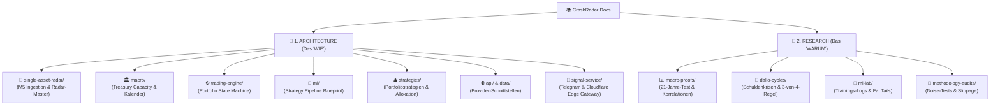
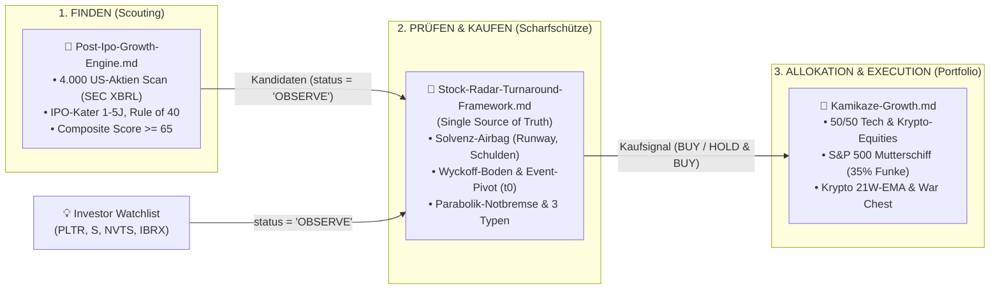

# CrashRadar Dokumentations-Index & Wissens-Architektur

Willkommen im Dokumentations-Verzeichnis von **`CrashRadar`**.  
Die Dokumentation ist strikt nach **Separation of Concerns** in zwei Hauptbereiche unterteilt:
1. **`architecture/` (System Architecture & Specifications):** Technische Bauanleitungen, Datenpipelines, Schemas, State Machines und Trading-Regeln (Das technische **WIE**).
2. **`research/` (Empirical Research & Proofs):** Wissenschaftliche Auswertungen, historische 21-Jahre-Krisentests, Backtests und Labor-Tagebücher (Der empirische **BEWEIS**).

---

---

## 📐 1. System Architecture & Specifications (`docs/architecture/`)

Hier finden Entwickler und System-Architekten alle operativen Spezifikationen, Endpunkte, Datenbank-Strukturen und Regelwerke:

### A. 🎯 Single-Asset Radar (`docs/architecture/single-asset-radar/`)
* 📄 **[`Single-Asset-Radar-Architecture.md`](file:///D:/GitHub/CrashRadar/docs/architecture/single-asset-radar/Single-Asset-Radar-Architecture.md):**  
  *Master-Architektur des Single-Asset Radars, 3-Schichten-Modell (Ingestion, Analytics, Delivery), 17:15 & 22:15 Uhr Workflows und Ntfy-Smartphone-Alerting.*
* 📄 **[`M5Candels.md`](file:///D:/GitHub/CrashRadar/docs/architecture/single-asset-radar/M5Candels.md):**  
  *Spezifikation der Polygon.io REST-API, 50.000 Kerzen Paginierung, Pacing, Rate-Limit Schutz und MySQL-Schema `market_data_m5`.*
* 📄 **[`SingleAssetTrading.md`](file:///D:/GitHub/CrashRadar/docs/architecture/single-asset-radar/SingleAssetTrading.md):**  
  *Quantitatives Regelwerk: 4-Phasen-Katapult-Engine für Growth-Aktien (NVTS, PLTR, IBRX) und duales MACD-Regime für Sektor-ETFs (IGV, CIBR).*

### B. 🏛️ Makro-Systeme & Liquidität (`docs/architecture/macro/`)
* 📄 **[`Treasury-Liquidity-Capacity-Architecture.md`](file:///D:/GitHub/CrashRadar/docs/architecture/macro/Treasury-Liquidity-Capacity-Architecture.md):**  
  *Architektur zur vorausschauenden Erfassung von Liquiditäts- und Absorptionsengpässen (Liquid Slack, LCLOR, TGA-Cushion, Kollisions-Timer).*
* 📄 **[`Fiscal-FED-Indicator.md`](file:///D:/GitHub/CrashRadar/docs/architecture/macro/Fiscal-FED-Indicator.md):**  
  *Fiskaldominanz vs. Fed-Bilanz, WRESBAL-Schwellenwerte und K-Faktor-Logik.*
* 📄 **[`Makro-Kalender-Szenarien-Konzept.md`](file:///D:/GitHub/CrashRadar/docs/architecture/macro/Makro-Kalender-Szenarien-Konzept.md):**  
  *Vollständige DB-gestützte Architektur für Termine, Konsens-Schätzungen und 2-Stufen-Regeln (`Option A: Full DB`).*
* 📄 **[`Checkliste-Goldilocks-Szenarios.md`](file:///D:/GitHub/CrashRadar/docs/architecture/macro/Checkliste-Goldilocks-Szenarios.md):**  
  *Monatliche Event-Checkliste für anstehende Makro-Veröffentlichungen.*

### C. ⚙️ Trading & Execution Engine (`docs/architecture/trading-engine/`)
* 📄 **[`TradingEngine.md`](file:///D:/GitHub/CrashRadar/docs/architecture/trading-engine/TradingEngine.md):**  
  *Die 5 Portfolio-Zustände (State Machine), 50/50 Krypto- & Growth-Philosophie, Fractional-Kelly-Sizing und Re-Entry-System.*

### D. 🧠 Machine Learning Pipelines (`docs/architecture/ml/`)
* 📄 **[`ML_ARCHITECTURE.md`](file:///D:/GitHub/CrashRadar/docs/architecture/ml/ML_ARCHITECTURE.md):**  
  *Strategy-Pattern Pipeline Blueprint (`src/ml/`), dynamic FeatureBuilder und universelles TensorFlow-Training.*
* 📄 **[`Makro-ML.md`](file:///D:/GitHub/CrashRadar/docs/architecture/ml/Makro-ML.md):**  
  *Technisches Konzept für das multivariate Makro-ML-Regime-Modell (XGBoost, Purged Walk-Forward CV & JS-Inferenz).*

### E. ♟️ Portfoliostrategien & Allokations-Regeln (`docs/architecture/strategies/`)

* 📄 **[`7-Slot-Guru-Konsens-System.md`](file:///D:/GitHub/CrashRadar/docs/architecture/strategies/7-Slot-Guru-Konsens-System.md):**  
  *Masterplan Version 2.0: 6er-Guru-Gremium (13F-Konsens >= 2 Halter), Einstiegs-Ampelsystem, 7 Slots Tech-Fokus und universeller 100 % Schutzschild (50 % Gold / 50 % Cash) mit Dual-Trigger & Bottom-Finder Re-Entry via Druckenmiller Net Fed Liquidity & Credit-Spread-Filter (inkl. PoC-Simulation in [`SevenSlotGuruSimulation.js`](file:///D:/GitHub/CrashRadar/scratch/architecture/strategies/SevenSlotGuruSimulation.js)).*
* 📄 **[`Gold-GDX.md`](file:///D:/GitHub/CrashRadar/docs/architecture/strategies/Gold-GDX.md):**  
  *Quantitative Tranchen-Exit- und Regime-Strategie für Gold & GDX (Selling Climax, Divergenzen, ROC-Erschöpfung und Catastrophe Stop).*
* 📄 **[`Gold-SPY.md`](file:///D:/GitHub/CrashRadar/docs/architecture/strategies/Gold-SPY.md):**  
  *Quantitative Trend-Schild & Gold-Hedge-Strategie (Version 2.2) für dynamisches DCA im S&P 500: Reines DCA im Normalbetrieb, 3-Säulen-Katastrophen-Matrix als Makro-Türsteher gegen Fehlausstiege (SPY < SMA 200 & DD >= 8 % gekoppelt an Kreditstress, VIX-Panik, Deleveraging oder QT) und 75 % Gold / 25 % Cash Sweet Spot mit antizyklischem VIX-Panik-Boden-Sniper inkl. 21,8-Jahre-Historien-Beweis (2004–2026: 381.741 € / +674 % Rendite / nur 23 Ausstiege in 21,8 Jahren / Max Drawdown -28,61 %) in [`test_katastrophen_matrix.js`](file:///D:/GitHub/CrashRadar/scratch/architecture/strategies/test_katastrophen_matrix.js).*
* 📄 **[`Muzzled-Cathie-Wood.md`](file:///D:/GitHub/CrashRadar/docs/architecture/strategies/Muzzled-Cathie-Wood.md):**  
  *Master V3 des Cathie-Wood-Radars: 60/40 Strategische Allokation (60 % Tech / 40 % Krypto), 3-Säulen-ARK-Ingestion (Watchlist `OBSERVE` $\rightarrow$ `BUY` erst nach Chart-Validierung), organischer Tech Sub-Bucket ohne Slot-Limit mit S&P 500 Mutterschiff, autonom gesteuerter Krypto Sub-Bucket (`BTC`, `COIN`, `HOOD`) via 21-Wochen-EMA mit 40/30/30-Pyramide & internem Leihgabe-Verrechnungskonto (`kryptoClaimUSD`), Sektor-Relativität (SMH/IGV), Flag-System (`HOLD & BUY` Verkaufsblockade vs. `HOLD & OBSERVE`) mit 3-Stufen-Abbau (1/3 bei Growth-Knick, 1/3 bei SMA 200, 100 % bei Folge-Knick), konträres Dip-Buying, 100 % Notfall-Evakuierung in 50 % Gold / 50 % Cash mit Dual-Re-Entry-Sniper (+1.286,33 % Nettorendite / 304.991,89 €) inkl. PoC in [`MuzzledCathieWoodSimulation.js`](file:///D:/GitHub/CrashRadar/scratch/architecture/strategies/MuzzledCathieWoodSimulation.js).*
* 📄 **[`Kamikaze-Growth.md`](file:///D:/GitHub/CrashRadar/docs/architecture/strategies/Kamikaze-Growth.md):**  
  *Pipeline-Stufe 3 (Portfolio-Allokation & Execution): 50/50 High-Conviction Realdepot-Pool (~94.000 $ Basis) mit S&P 500 Mutterschiff, 35 % Zündfunken-Allokation, Krypto-21W-EMA Master-Regime, 100 % Notfall-Evakuierung (50 Gold / 50 Cash), Broker-Realität ('Broker ist Gesetz') sowie Zwei-Phasen-Restrukturierungsmodell (Oktober-Liquidierung & War Chest).*
* 📄 **[`Kamikaze-Stock-Radar.md`](file:///D:/GitHub/CrashRadar/docs/architecture/strategies/Kamikaze-Stock-Radar.md):**  
  *Operative Watchlist- & Radar-Spezifikation für das Kamikaze-Depot: User-kuratierte Master-Watchlist (`OBSERVE` Pflicht, Tier-1/Tier-2 & Krypto-Silo) und Schnittstelle von `GrowthStockRadar.js` zur Single Source of Truth (`Stock-Radar-Turnaround-Framework.md`).*
* 📄 **[`Stock-Radar-Turnaround-Framework.md`](file:///D:/GitHub/CrashRadar/docs/architecture/strategies/Stock-Radar-Turnaround-Framework.md):**  
  *Pipeline-Stufe 2 (Single Source of Truth für Einzeltitel-Bewertung & Timing): Vollständiger Lebenszyklus für abgestrafte Qualitäts-Wachstumswerte (Small/Mid-Caps wie IBRX, NVTS, S, SOFI, PLTR) und Big Tech (META, NFLX) – vom fundamentalen Solvenz-Airbag (Net Cash Runway, Deleveraging, Peer-Discount, Verwässerungs-Matrix) über Wyckoff-Boden ($L_1 \to L_2$) und Event-Pivot ($t_0$) bis zur Parabolik-Notbremse und den 3 Investment-Typen (`LASTING_HOLD`, `CYCLICAL`, `BINARY`).*
* 📄 **[`Post-Ipo-Growth-Engine.md`](file:///D:/GitHub/CrashRadar/docs/architecture/strategies/Post-Ipo-Growth-Engine.md):**  
  *Pipeline-Stufe 1 (Scouting & Markt-Screening - V2): Automatisierte Screening-Pipeline für qualitative Wachstums- und Turnaround-Aktien im Reife- und Kater-Zeitfenster von 1 bis 5 Jahren nach Börsengang (SIC/NAICS-Filter, De-SPAC Super 8-K Klausel, SEC EDGAR Facts API, Runway-Formel, Rule of 40, Verwässerungs-Matrix und 2027-Skalierungsmodell für 300 Ticker im Freetier).*
* 📄 **[`Satelite.md`](file:///D:/GitHub/CrashRadar/docs/architecture/strategies/Satelite.md):**  
  *Geopolitisch gehärtetes Core-Satellite-Depot: 80 % SPY (S&P 500 Mutterschiff), 15 % DFNS (VanEck Defense UCITS ETF) und 5 % BTC (Bitcoin). Im Normalbetrieb gilt kompromissloses HODL (keine unterjährigen Verkäufe). Rebalancing erfolgt ausschließlich über den universellen Notfall-Stecker (100 % Notfall-Evakuierung in 50 % Gold / 50 % Cash bei NetLiq < -5 % & Credit Spreads > 4 % sowie Rebalancing-Reset bei Re-Entry am Marktboden) (+83,40 % Rendite / +12,68 %-Pkt. Alpha vs. SPY) inkl. PoC in [`SatelliteCoreSimulation.js`](file:///D:/GitHub/CrashRadar/scratch/architecture/strategies/SatelliteCoreSimulation.js).*

### F. 🌐 Externe Schnittstellen & Daten (`docs/architecture/api/` & `docs/architecture/data/`)
* 📄 **[`FRED-Api.md`](file:///D:/GitHub/CrashRadar/docs/architecture/api/Stlouisfed.md)** | **[`Fiscaldata.md`](file:///D:/GitHub/CrashRadar/docs/architecture/api/Fiscaldata.md)** | **[`Tiingo.md`](file:///D:/GitHub/CrashRadar/docs/architecture/api/Tiingo.md)** | **[`Binance.md`](file:///D:/GitHub/CrashRadar/docs/architecture/api/Binance.md)** | **[`Yahoo-Finance.md`](file:///D:/GitHub/CrashRadar/docs/architecture/api/Yahoo-Finance.md)**
* 📄 **[`DataStructure.md`](file:///D:/GitHub/CrashRadar/docs/architecture/data/DataStructure.md)**

### G. 📱 Signal- & Benachrichtigungsdienst (`docs/architecture/signal-service/`)
* 📄 **[`Investment-Signaldienst.md`](file:///D:/GitHub/CrashRadar/docs/architecture/signal-service/Investment-Signaldienst.md):**  
  *Serverlose 0,00-€-End-to-End-Architektur: 2-Ebenen-Signal-Hierarchie mit Trennung von zustandslosen Stock- & Asset-Radaren (`src/radars/`) und Portfolio-Kapitalmanagement (`src/strategies/`), CrashRadar Intelligence Engine (Pre-Computation Push via `PortfolioStrategyEngine` Plugin-Registry, Standard-Makrosignale als Service, autonomes Bucket- & Order-Management, Kamikaze Live-Broker Sync mit Discretionary Override) und Cloudflare Edge + D1 Gateway (1:1 Telegram Private Chats, dynamisches Onboarding, 3 kuratierte Beweis-Szenarien, Execution Feedback Loop und Roadmap für die evolutorische Entwicklung).*

---

## 🔬 2. Empirical Research & Proofs (`docs/research/`)

Hier liegen alle empirischen Auswertungen, historischen Krisen-Härtetests und mathematischen Beweise:

### A. 📊 Makro-Forschung & Krisen-Validierung (`docs/research/macro-proofs/`)
* 📄 **[`Analyse.md`](file:///D:/GitHub/CrashRadar/docs/research/macro-proofs/Analyse.md):**  
  *Zentrale statistische Analyse: Net Liquidity Illusion, Yield Curve Steepening Trap, DXY Schwerkraft und CBOE/VIX/RSI Bottom-Finding.*
* 📄 **[`Indikatoren-Grand-Prix-21-Jahre-Analyse.md`](file:///D:/GitHub/CrashRadar/docs/research/macro-proofs/Indikatoren-Grand-Prix-21-Jahre-Analyse.md):**  
  *21-Jahre-Härtetest aller 18 Makro-Sensoren über 10 historische Großkrisen (2005–2026).*
* 📄 **[`Crash-Arbeitsmarkt-Analyse.md`](file:///D:/GitHub/CrashRadar/docs/research/macro-proofs/Crash-Arbeitsmarkt-Analyse.md):**  
  *Empirischer Beweis der Arbeitsmarkt-Divergenzen (Household vs. Payrolls) und Sahm-Regel Vorlauf.*
* 📄 **[`MCW-Hybrid-Macro-Guard-Proof.md`](file:///D:/GitHub/CrashRadar/docs/research/macro-proofs/MCW-Hybrid-Macro-Guard-Proof.md):**  
  *Empirischer Matrix-Test auf Muzzled Cathie Wood: Warum FiscalFed Emergency Borrowing als Exit scheitert (-72.721 €), während der Panic-Capitulation-Sniper als Re-Entry-Beschleuniger auf +1.286,33 % (304.991,89 €) boostet.*
* 📄 **[`MCW-Historical-Backtest-2015-2026.md`](file:///D:/GitHub/CrashRadar/docs/research/macro-proofs/MCW-Historical-Backtest-2015-2026.md):**  
  *Historischer 11,5-Jahre-Härtetest (2015–2026) aus 50 SEC-EDGAR-Filings: Rekonstruktion aller ARK-Bestände seit Fondsgründung, OBSERVE-Filterung, SEC-XBRL-Parser-Upgrade (3-Monats-Isolation) und 'Kein Kauf ohne Fundamentaldaten'-Gate (+5.698,28 % / 1.797.466,07 € vs. ARKK +373,68 % und QQQ +660,31 %).*

### B. 📜 Ray Dalio Schuldenkrisen-Zyklen (`docs/research/dalio-cycles/`)
* 📄 **[`These.md`](file:///D:/GitHub/CrashRadar/docs/research/dalio-cycles/These.md)** | **[`Daten_zur_These.md`](file:///D:/GitHub/CrashRadar/docs/research/dalio-cycles/Daten_zur_These.md)**
* 📄 **[`Backtest_3_von_4_Regel.md`](file:///D:/GitHub/CrashRadar/docs/research/dalio-cycles/Backtest_3_von_4_Regel.md)** | **[`Empirische_Auswertung_Dalio_These.md`](file:///D:/GitHub/CrashRadar/docs/research/dalio-cycles/Empirische_Auswertung_Dalio_These.md)**

### C. 🧪 ML-Labor & Feature-Forschung (`docs/research/ml-lab/`)
* 📄 **[`ML_EVALUATIONS.md`](file:///D:/GitHub/CrashRadar/docs/research/ml-lab/ML_EVALUATIONS.md):**  
  *Labor-Tagebuch: Trainingsläufe, BTC V2 Dow-Theorie, PLTR-Divergenzen und FINRA Short-Volume Bärenmarkt-Beweise.*
* 📄 **[`ML_FEATURE_RESEARCH.md`](file:///D:/GitHub/CrashRadar/docs/research/ml-lab/ML_FEATURE_RESEARCH.md):**  
  *Theoretische Forschung zu Fat Tails, Robust Scaling vs. Z-Score Verzerrung und Schwerkraft-Ankern (SMA200).*

### D. 🔬 Validierungs-Methodik & Audits (`docs/research/methodology-audits/`)
* 📄 **[`Noise-Test-IndicatorEngine.md`](file:///D:/GitHub/CrashRadar/docs/research/methodology-audits/Noise-Test-IndicatorEngine.md):**  
  *Monte-Carlo White-Noise Test zur mathematischen Verifikation der Überanpassungs-Freiheit (Anti-Overfitting).*
* 📄 **[`Signal-vs-Execution-Hypothese.md`](file:///D:/GitHub/CrashRadar/docs/research/methodology-audits/Signal-vs-Execution-Hypothese.md):**  
  *Fraktales Trading: Empirischer Beweis zur Vermeidung von Slippage durch Trennung von Tages-Signal und Intraday-Ausführung.*
* 📄 **[`Architecture-Audit.md`](file:///D:/GitHub/CrashRadar/docs/research/methodology-audits/Architecture-Audit.md):**  
  *Code-vs-Theorie Audit Report.*

### E. 🚀 High-Beta Growth & Turnaround Forschung (`docs/research/turnarounds/`)
* 📄 **[`Turnaround-Research-Proof.md`](file:///D:/GitHub/CrashRadar/docs/research/turnarounds/Turnaround-Research-Proof.md):**  
  *Empirischer Forschungsbericht: Härtetest des High-Beta Growth Lebenszyklus-Radars und des Parabolischen Trendlinien-Fächers über 10 Jahre (2016–2026) an 8 Wachstumsaktien (PLTR, NVTS, IBRX, HIMS, APP, S, SOFI, NET). Mathematischer Beweis zur Beseitigung der „Zu-Spät-Rein- und Zu-Früh-Raus“-Problematik durch den Institutional Event-Pivot (+130 % Einkaufsvorteil am Beispiel PLTR) und den stoischen Major Higher-Low Trailing Stop (+492,3 % / 709 Tage Haltedauer in PLTR Welle 2) gekoppelt an die kompromisslose Parabolik-Notbremse vor dem Peak-Kollaps (+248,6 % Exit bei NVTS vor dem Absturz).*
* 📄 **[`Parabolic-Volume-Analysis.md`](file:///D:/GitHub/CrashRadar/docs/research/turnarounds/Parabolic-Volume-Analysis.md):**  
  *Detaillierte M5-Volumen- & Korrektur-Analyse über 5 Wachstumsaktien (PLTR, NVTS, IBRX, SOFI, S): Empirische Zerlegung der 1,5h Eröffnungs- und Schlussfenster, Gegenüberstellung gesunder Dips (Volumen-Dry-Up < 0,85x + positives Schlussfenster-Delta > +10 %) vs. institutioneller Dumps (> 1,35x Volumen + negatives Schlussfenster-Delta < -25 %).*
* 📄 **[`Multi-Timeframe-Pyramide-Analysis.md`](file:///D:/GitHub/CrashRadar/docs/research/turnarounds/Multi-Timeframe-Pyramide-Analysis.md):**  
  *Konzept und Härtetest der 5-Ebenen-Multi-Timeframe-Pyramide (M5 Session-Fenster -> D1 -> 3D-Rolling -> W1 -> M1) sowie **Event-verankerter Timeframes ($t_0$-Anchored Rolling 3D, 5D, 21D)**: Beseitigung der Kalender-Willkür (Wyckoff-Zyklen ab Ausbruch) und empirischer Nachweis des 2,0 bis 3,5 Tage Zeitvorsprungs der rollierenden 3-Tage-Swing-Ebene gegenüber dem klassischen Freitags-Wochenschluss.*
* 📄 **[`Generational-Growth-Hypothesis.md`](file:///D:/GitHub/CrashRadar/docs/research/turnarounds/Generational-Growth-Hypothesis.md):**  
  *Strategische Forschungs-Hypothese: Auflösung des „Pseudo-Trading“-Dilemmas im Spätzyklus. Klare 2-Phasen-Architektur zur Trennung des Geburtshelfers (Turnaround-Radar als L2-Boden-Sniper zur Vermeidung der 2-3-jährigen Post-IPO Kater-Falle) vom unerschütterlichen Lebenszeit-Besitz fundamentaler Monopol-Diamanten (PLTR, SentinelOne S) ohne verfrühte Climax-Ausstiege.*

