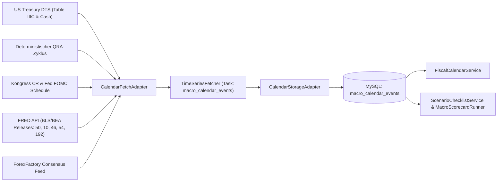

# Makro-Kalender & Fiskal-Events (`macro_calendar_events`)

Die Tabelle `macro_calendar_events` bildet das zentrale, automatisierte Fundament für alle zeitkritischen Meilensteine und Ereignisse im CrashRadar-System. Sie speichert Fiskalfristen, Notenbanktermine (FOMC), Treasury Refunding Announcements (QRA) und dynamische Schuldenobergrenzen-Projektionen (X-Date) kontinuierlich und historisch nachvollziehbar.

---

## 1. Tabellen-Schema (DDL)

```sql
CREATE TABLE IF NOT EXISTS `macro_calendar_events` (
  `id` VARCHAR(64) NOT NULL,
  `category` VARCHAR(32) NOT NULL,                     -- 'FISCAL', 'CENTRAL_BANK', 'MACRO_RELEASE', 'OPEX', 'GEOPOLITICAL'
  `subcategory` VARCHAR(32) NOT NULL,                  -- 'QRA', 'SHUTDOWN', 'DEBT_CEILING', 'FOMC', 'INFLATION', 'LABOR', 'PRODUCER_PRICES'
  `title` VARCHAR(128) NOT NULL,
  `event_date` DATE NOT NULL,
  `event_time` VARCHAR(32) DEFAULT NULL,
  `status` ENUM('SCHEDULED', 'CONFIRMED', 'ESTIMATED', 'COMPLETED', 'EXTENDED', 'PENDING_DATA', 'PASSED', 'FAILED') NOT NULL DEFAULT 'SCHEDULED',
  `criticality` ENUM('LOW', 'MEDIUM', 'HIGH', 'CRITICAL') NOT NULL DEFAULT 'MEDIUM',
  `metadata_json` JSON DEFAULT NULL,
  `actual_value` VARCHAR(64) DEFAULT NULL,
  `details_json` JSON DEFAULT NULL,
  `source` VARCHAR(64) NOT NULL,
  `created_at` DATETIME NOT NULL DEFAULT CURRENT_TIMESTAMP,
  `updated_at` DATETIME NOT NULL DEFAULT CURRENT_TIMESTAMP ON UPDATE CURRENT_TIMESTAMP,
  PRIMARY KEY (`id`),
  KEY `idx_event_date` (`event_date`),
  KEY `idx_category_status` (`category`, `status`),
  KEY `idx_subcategory` (`subcategory`)
) ENGINE=InnoDB DEFAULT CHARSET=utf8mb4 COLLATE=utf8mb4_unicode_ci;
```

---

## 2. Architektur & Pipeline-Integration

Der Kalender läuft vollautomatisch über das standardmäßige Fetcher- und Storage-Framework von CrashRadar:



1. **Task-ID:** `macro_calendar_events` in [`config/Database-Fetcher-Config.json`](file:///D:/GitHub/CrashRadar/config/Database-Fetcher-Config.json).
2. **Fetch-Adapter:** [`CalendarFetchAdapter.js`](file:///D:/GitHub/CrashRadar/src/core/adapters/fetch/CalendarFetchAdapter.js) in `src/core/adapters/fetch/`:
   * **Fiskal & Schuldenobergrenze:** US Treasury DTS Table IIIC & Operating Cash Balance (Headroom, dynamisches X-Date).
   * **QRA-Zyklus:** Deterministischer Rhythmus (1. Mittwoch im Feb/Mai/Aug/Nov).
   * **Kongress-Fristen & FOMC:** Statutory Deadline (30.09. `EXTENDED`), Continuing Resolution (18.12. `CONFIRMED`), Zinsentscheide.
   * **FRED Release Dates API:** Offizielle Veröffentlichungstermine für Nonfarm Payrolls (`50`), Core CPI (`10`), PPI (`46`), Core PCE (`54`) und JOLTS (`192`).
   * **Konsens-Enrichment:** Resilienter Abruf des Wall-Street-Konsens (`forecast`, `previous`) von ForexFactory.
3. **Storage-Adapter:** [`CalendarStorageAdapter.js`](file:///D:/GitHub/CrashRadar/src/core/adapters/storage/CalendarStorageAdapter.js) in `src/core/adapters/storage/` (Upsert unter Erhalt bestehender `actual_value` und `status` Werte).
4. **Service-Abruf:**
   * [`FiscalCalendarService.js`](file:///D:/GitHub/CrashRadar/src/services/FiscalCalendarService.js): Liest fiskalische Meilensteine und Shutdown-Fristen.
   * [`ScenarioChecklistService.js`](file:///D:/GitHub/CrashRadar/src/services/ScenarioChecklistService.js): Baut monatliche Goldilocks-Scorecards autark aus `macro_calendar_events` auf.
   * [`MacroScorecardRunner.js`](file:///D:/GitHub/CrashRadar/src/runners/MacroScorecardRunner.js): Wertet Events aus und schreibt `status` (`PASSED`/`FAILED`), `actual_value` und `details_json` direkt in die Datenbank.

---

## 3. Handhabung von Fristverlängerungen (`EXTENDED`)

Um die historische Genauigkeit und Revisionssicherheit zu gewährleisten, werden Fristen bei einer Continuing Resolution (CR) nicht destruktiv überschrieben, sondern als Ereigniskette abgebildet:

* **Gesetzliche Frist (Historie):**
  * `id`: `statutory_deadline_fy2027`
  * `event_date`: `2026-09-30`
  * `status`: `EXTENDED`
  * `metadata_json`: `{"statutoryDeadline": "2026-09-30", "extendedTo": "2026-12-18", "resolution": "Continuing Appropriations Act, 2027"}`
* **Aktive Verlängerung (Wirksam):**
  * `id`: `cr_deadline_fy2027`
  * `event_date`: `2026-12-18`
  * `status`: `CONFIRMED`
  * `criticality`: `CRITICAL`
  * `metadata_json`: `{"statutoryDeadline": "2026-09-30", "effectiveDeadline": "2026-12-18", "preElectionShieldActive": true}`

---

## 4. Berechnungslogik für das dynamische X-Date

Aus dem tagesaktuellen Treasury-Datensatz Table IIIC werden:
1. `Statutory Debt Limit` ($41,104 Billionen)
2. `Total Debt Subject to Limit` ($40,048 Billionen)
3. `Available Headroom` ($1,056 Billionen)
4. `TGA Cash Balance` ($843,7 Mrd.)

extrahiert. Das System ermittelt die verbleibenden Tage bis zur harten Kollision dynamisch über:
$$\text{Days Remaining} = \frac{\text{Headroom} + \text{TGA Cash}}{\text{Daily Burn Rate}}$$
und schreibt den Meilenstein `debt_ceiling_x_date_projection` mit `status = 'ESTIMATED'` rollierend in die Datenbank.
