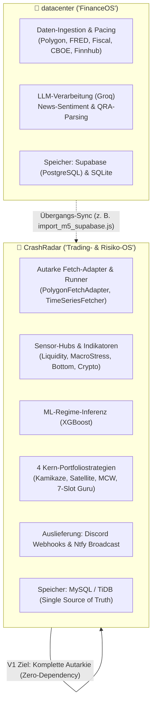

# Systemabgrenzung & Überlappungs-Analyse: CrashRadar vs. Datacenter (FinanceOS)

> **Architektur-Spezifikation:** Dieses Dokument definiert die Systemgrenzen, Datenströme, funktionale Redundanzen und die Autarkie-Strategie zwischen dem Schwesterprojekt **`datacenter`** (`D:\GitHub\datacenter`) und **`CrashRadar`** (`D:\GitHub\CrashRadar`).

---

## 1. Executive Summary & System-Profile

Beide Projekte greifen auf ähnliche finanz- und makroökonomische Datenquellen zu, verfolgen jedoch grundlegend unterschiedliche architektonische Aufgaben und Schichten im Gesamtsystem:

* **`datacenter` (`D:\GitHub\datacenter`):**  
  Konzipiert als modularer Daten-Hub („FinanceOS“). Kernaufgabe ist das Einholen, Pacing (Rate-Limit-Schutz) und persistente Speichern von Rohdaten in einer **Supabase/Postgres-Cloud-Datenbank** sowie lokale SQLite-Pufferung und KI-gestützte Textfilterung (Groq LLM).
* **`CrashRadar` (`D:\GitHub\CrashRadar`):**  
  Konzipiert als autonomes **quantitatives Risiko- und Portfoliosteuerungssystem**. Es enthält die gesamte Trading-Intelligenz (Sensor-Hubs, Regime-Erkennung, ML-Modelle, 21-Jahre Backtests, Portfolio-Allokationsmodelle und Discord-Broadcasts) mit eigener performanter relationaler Datenbank (**MySQL / TiDB**).

---

## 2. Technologie- & Speicher-Gegenüberstellung

| Kriterium | `datacenter` (`D:\GitHub\datacenter`) | `CrashRadar` (`D:\GitHub\CrashRadar`) | Divergenz / Bewertung |
| :--- | :--- | :--- | :--- |
| **Primärdatenbank** | Supabase (PostgreSQL Cloud) + SQLite | MySQL / TiDB (Relational, TimeSeries-optimiert) | **Divergent:** CrashRadar benötigt kein Supabase; Speicherung erfolgt in `market_data_daily`, `market_data_m5` und `macro_calendar_events`. |
| **Primärrolle** | Datensammler & Pacing-Schicht | Analyse-, Signal- und Ausführungsmotor | **Komplementär:** CrashRadar baut logisch auf den Daten auf, die datacenter sammelt. |
| **Trading-Logik** | Keine Trading-Strategien (nur Scanner) | 4 Portfoliostrategien + PortfolioStrategyEngine | **Exklusiv in CrashRadar:** Kamikaze, Satellite, Gold-SPY, Cathie Wood, 7-Slot Guru. |
| **Alerting** | Telegram / Basis-Alerts | Discord Webhooks (4-Fälle-Matrix) + Ntfy Push | **Getrennt:** CrashRadar nutzt kanalspezifische Rich Embeds. |
| **KI / ML** | Groq LLM API (Text-/News-Parsing) | XGBoost Makro-Regime (JS-Inferenz) | **Unterschiedlich:** datacenter nutzt LLMs für Text; CrashRadar nutzt Tabular-ML für Marktregimes. |

---

## 3. Detaillierter Controller-für-Controller Abgleich

`datacenter` kapselt seine Datenbeschaffung in **17 Controllern** (`D:\GitHub\datacenter\src\controllers\`). Die folgende Matrix zeigt den Überlappungsgrad und das jeweilige Pendant in `CrashRadar`:

| # | Controller in `datacenter` | Datenquelle | Pendant / Status in `CrashRadar` | Überlappungs-Grad | Handlungs-Empfehlung für CrashRadar |
| :-: | :--- | :--- | :--- | :---: | :--- |
| 1 | **`M5Controller.js`** | Polygon.io (5m OHLCV) | [`PolygonFetchAdapter.js`](file:///D:/GitHub/CrashRadar/src/core/adapters/fetch/PolygonFetchAdapter.js) / [`M5Candels.md`](file:///D:/GitHub/CrashRadar/docs/architecture/single-asset-radar/M5Candels.md) | **100 % Überlapp** | `PolygonFetchAdapter.js` in CrashRadar fertigstellen; Supabase-Brücke (`import_m5_supabase.js`) stilllegen. |
| 2 | **`FredController.js`** | FRED (St. Louis Fed) | [`config/Database-Fetcher-Config.json`](file:///D:/GitHub/CrashRadar/config/Database-Fetcher-Config.json) (`TimeSeriesFetcher.js`) | **100 % Überlapp** | Bereits voll redundant in CrashRadar integriert (läuft direkt in MySQL `market_data_daily`). |
| 3 | **`FiscalController.js`** | US Treasury (Fiscal Data) | [`CalendarFetchAdapter.js`](file:///D:/GitHub/CrashRadar/src/core/adapters/fetch/CalendarFetchAdapter.js) & [`FiscalCalendarService.js`](file:///D:/GitHub/CrashRadar/src/services/FiscalCalendarService.js) | **100 % Überlapp** | Bereits voll redundant in CrashRadar integriert (TGA, Debt, DTS Table IIIC). |
| 4 | **`QRAController.js`** | US Treasury QRA Announcements | [`macro_calendar_events`](file:///D:/GitHub/CrashRadar/docs/architecture/database/Macro-Calendar-Events.md) & [`FiscalCalendarService.js`](file:///D:/GitHub/CrashRadar/src/services/FiscalCalendarService.js) | **100 % Überlapp** | In CrashRadar datenbankgestützt via relationaler Kalendertabelle gelöst. |
| 5 | **`CboeController.js`** | CBOE (Put/Call Ratios, VIX) | [`CboeFetchAdapter.js`](file:///D:/GitHub/CrashRadar/src/core/adapters/fetch/CboeFetchAdapter.js) | **100 % Überlapp** | Bereits autark als FetchAdapter in CrashRadar vorhanden. |
| 6 | **`FinraController.js`** | FINRA (Margin Debt, Short Vol) | [`FinraFetchAdapter.js`](file:///D:/GitHub/CrashRadar/src/core/adapters/fetch/FinraFetchAdapter.js) | **100 % Überlapp** | Bereits autark als FetchAdapter in CrashRadar vorhanden. |
| 7 | **`SecController.js`** | SEC EDGAR (Form 13F Filings) | [`SecEdgar13FFetchAdapter.js`](file:///D:/GitHub/CrashRadar/src/core/adapters/fetch/SecEdgar13FFetchAdapter.js) | **100 % Überlapp** | In CrashRadar tiefergehend verarbeitet (7-Slot Guru Konsens V3.1). |
| 8 | **`OptionsController.js`** | Optionsdaten & Gamma-Wände | [`Derivate-OpEx-Kalender-Konzept.md`](file:///D:/GitHub/CrashRadar/docs/architecture/macro/Derivate-OpEx-Kalender-Konzept.md) | **Funktional identisch** | Gamma-Datenaufzeichnung für V2-Backtest läuft bereits in CrashRadar. |
| 9 | **`LaborMarketController.js`** | BLS / FRED (Arbeitsmarkt) | [`Crash-Arbeitsmarkt-Analyse.md`](file:///D:/GitHub/CrashRadar/docs/research/macro-proofs/Crash-Arbeitsmarkt-Analyse.md) / FRED | **Funktional identisch** | Über CrashRadars FRED-Pipeline abgedeckt (Household vs. Payrolls). |
| 10 | **`ClimaxController.js`** | Selling Climax Scorer | [`GrowthStockRadar.js`](file:///D:/GitHub/CrashRadar/src/radars/GrowthStockRadar.js) (`TOP_CLIMAX_ALERT`) | **Teil-Überlapp** | CrashRadar nutzt fortgeschrittenere Logik (EMA20-Distanz 35–45 % + M5-Volumen). |
| 11 | **`DailyController.js`** | Yahoo / Tiingo (D1 Candles) | [`TimeSeriesFetcher.js`](file:///D:/GitHub/CrashRadar/src/services/TimeSeriesFetcher.js) / Tiingo / Yahoo | **100 % Überlapp** | Täglicher D1-Sync läuft autark in CrashRadar. |
| 12 | **`EventsController.js`** | Wirtschaftsdaten-Termine | [`ScenarioChecklistService.js`](file:///D:/GitHub/CrashRadar/src/services/ScenarioChecklistService.js) / ForexFactory | **100 % Überlapp** | Läuft voll integriert über MySQL-Tabelle `macro_calendar_events`. |
| 13 | **`GlobalMacroController.js`** | Makro-Zustände | [`MacroRegimeEngine.js`](file:///D:/GitHub/CrashRadar/src/analysis/MacroRegimeEngine.js) & Sensor-Hubs | **Evolutionärer Überlapp** | CrashRadar hat die Monolithen durch Composite Sensor-Hubs ersetzt. |
| 14 | **`RegulationController.js`** | Schuldenobergrenze / Fristen | `FiscalCalendarService.js` / X-Date | **100 % Überlapp** | Dynamische DTS IIIC Headroom-Berechnung läuft in CrashRadar. |
| 15 | **`SectorRotationController.js`** | Sektor-Relative Stärke | [`SingleAssetTrading.md`](file:///D:/GitHub/CrashRadar/docs/architecture/single-asset-radar/SingleAssetTrading.md) / Muzzled Cathie | **Konzeptioneller Überlapp** | In CrashRadar über Weinstein Stage-2 und relative Stärke gelöst. |
| 16 | **`SentimentNewsController.js`** | Finnhub News & Groq LLM | *In CrashRadar V1 nicht aktiv* | **Exklusiv in datacenter** | Bleibt vorerst in `datacenter`; optionaler Zulieferer für CrashRadar V2. |
| 17 | **`ArchiveController.js`** | CSV-Archivierung historischer Daten | `data/archive/` (CBOE, FINRA CSVs) | **Funktional identisch** | Beide Repos pflegen lokale Snapshot-Archive. |

---

## 4. Die Autarkie-Doktrin für CrashRadar V1 (Deadline: 15. Dezember 2026)

Aufgrund der harten Deadline für den V1-MVP gilt für CrashRadar die **Autarkie-Doktrin**:

> **Architektur-Vorgabe:** CrashRadar darf im Produktivbetrieb zu keinem Zeitpunkt von der lokalen Verfügbarkeit oder Ausführung von `datacenter` abhängig sein. Alle für die tägliche Entscheidungsfindung nötigen Daten (M5, D1, Makro, CBOE, FINRA, Kalender) müssen direkt über CrashRadars eigene Runner und Fetch-Adapter in die MySQL-/TiDB-Instanz fließen.

### Bereits vollzogene Schritte:
1. **Makro- und Marktdaten:** Vollständig auf [`TimeSeriesFetcher.js`](file:///D:/GitHub/CrashRadar/src/services/TimeSeriesFetcher.js) und [`FetchAdapterFactory.js`](file:///D:/GitHub/CrashRadar/src/core/adapters/fetch/FetchAdapterFactory.js) umgestellt.
2. **Kalender & Fiskaldaten:** Tabelle `macro_calendar_events` ersetzt jegliche externe JSON-Zulieferung.

### Letzter offener Schritt zur vollständigen Entkopplung:
* **Sprint 1 Task:** [`PolygonFetchAdapter.js`](file:///D:/GitHub/CrashRadar/src/core/adapters/fetch/PolygonFetchAdapter.js) in CrashRadar registrieren und direkt mit `market_data_m5` verdrahten. Sobald dieser läuft, wird das temporäre Brücken-Skript [`tools/import_m5_supabase.js`](file:///D:/GitHub/CrashRadar/tools/import_m5_supabase.js) entfernt.

---

## 5. Rollenverteilung in V2 (Zukunft ab 2027)

Für die langfristige Weiterentwicklung (V2) kann `datacenter` eine spezialisierte Rolle als vorgelagerter Service einnehmen:

1. **AI-gestützter News-Sentinel:**  
   `datacenter` führt die `SentimentNewsController.js`-Pipeline mit Groq-LLM weiter und liefert aggregierte Ticker-Sentiments per API oder Webhook an CrashRadar.
2. **Data Lake & Historical Warehouse:**  
   `datacenter` kann als massives Rohdaten-Archiv auf Supabase dienen, während CrashRadar als schlanker, operativer Realtime-Execution-Knoten agiert.
