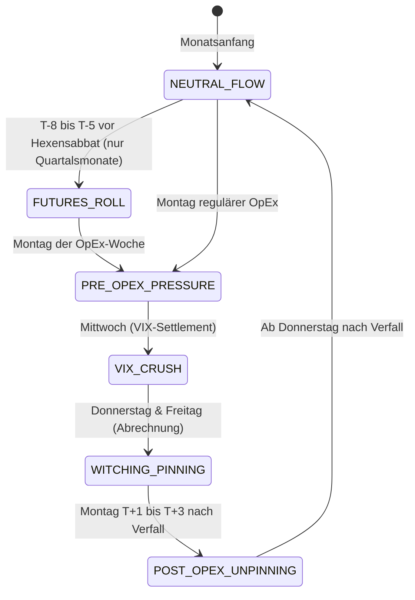

# Derivate- & OpEx-Kalender-Konzept (Forward-Projektionen & Zyklen-Mechanik)

Dieses Dokument definiert die technische Architektur und das Regelwerk für die deterministische Erfassung und Vorhersage von **Derivate-Verfallstagen, Hexensabbat-Zyklen (Quadruple Witching), VIX-Settlement und Futures-Rolls** im CrashRadar-System.

---

## 1. Das Problem: Fundamentale Täuschung durch Derivate-Mechanik

Über 80 % des täglichen Handelsvolumens an den US-Märkten wird durch Derivate, Hedging-Strategien von Market Makern (Delta- und Gamma-Hedging), Options-Volumen und algorithmische Basis-Trades bestimmt. 
* Wenn Aktien zu Beginn einer Verfallswoche ohne fundamentale News abrupt abverkauft werden, interpretieren Privatanleger dies fälschlicherweise als Beginn eines echten Crashs.
* In der Realität handelt es sich meist um **künstliche markttechnische Verwerfungen**: Market Maker, die durch Put-Überhänge in eine **Short-Gamma-Position** gedrückt wurden, sind gezwungen, bei fallenden Kursen zusätzliche Aktien leerzuverkaufen, um ihr Buch delta-neutral zu halten.
* Sobald die Optionen verfallen oder abgerechnet sind, entfällt diese Zwangsliquidität schlagartig. Der Markt vollzieht eine scharfe Erleichterungsrallye (**Post-OpEx Unpinning**).

---

## 2. Die drei deterministischen Zyklen

Alle relevanten Derivate-Termine an den US-Börsen (CBOE, CME, ICE) sind rein kalendarisch und damit zu **100 % mathematisch im Voraus berechenbar**:

### A. Der monatliche OpEx (Monthly Options Expiration)
* **Termin:** Jeder **3. Freitag eines Monats**. Fällt dieser auf einen Börsenfeiertag, gilt der vorherige Donnerstag.
* **Umfang:** Monatliche Aktien-Optionen (Single Stock Options) und Index-Optionen (SPX, NDX, RUT).
* **Effekt:** Erhöhte Pinning-Tendenzen in Richtung des sogenannten *Max Pain*-Strikes (dem Kursniveau, an dem die meisten Optionen wertlos verfallen).

### B. Der große Hexensabbat (Triple / Quadruple Witching)
* **Termin:** Jeder **3. Freitag im März, Juni, September und Dezember** (Quartalsabschluss-Monate).
* **Umfang:** Zeitgleicher Verfall von:
  1. Aktienindex-Futures (z. B. CME E-mini S&P 500 `ES`, Nasdaq `NQ`)
  2. Aktienindex-Optionen (z. B. SPX-Optionen)
  3. Einzelaktien-Optionen (Single Stock Options, z. B. S, NVTS, PGY, AMD)
  4. Einzeltitel-Futures (Single Stock Futures)
* **Effekt:** Höchste Volumina des gesamten Quartals. Extremes Stop-Fishing in den Tagen Mo–Mi vor dem Verfall; Befreiungs-Rallye oder Richtungsentscheidung ab dem darauffolgenden Montag.

### C. VIX-Settlement (Der Volatilitäts-Kollaps)
* **Termin:** Immer am **Mittwoch vor dem 3. Freitag des Monats** (exakt 30 Tage vor dem Verfall der SPX-Optionen des Folgemonats).
* **Effekt:** Vor dem VIX-Verfall sichern sich Institute panisch mit VIX-Calls ab (hoher SKEW, hohe PCR). Sobald die Abrechnung am Mittwochmorgen erfolgt, bricht die implizite Volatilität zusammen (**Volatility Crush**). Da fallende Volatilität das Value-at-Risk (VaR) von Fonds senkt, führt dies zu mechanischen Aktienkäufen.

### D. Futures-Roll-Woche
* **Termin:** Die **Woche vor dem Quadruple Witching** (konkret ab dem zweiten Donnerstag des Verfallsmonats).
* **Effekt:** Umschichtung riesiger Kontraktvolumina vom auslaufenden Kontrakt in den nächsten Front-Monat. Künstliche Spreizung und temporäre Illiquidität an den Kassenmärkten.

---

## 3. Die 5 Phasen der Derivate-State-Machine

Das CrashRadar unterteilt jeden Handelsmonat bezüglich der Derivate-Dynamik in 5 deterministische Phasen:



| Phase | Zeitfenster | Marktverhalten & Dealer-Dynamik | Emotionale Leitplanke für den Investor |
| :--- | :--- | :--- | :--- |
| `NEUTRAL_FLOW` | Tag 1 bis ca. Tag 8 des Monats | Markt folgt Makro- und Fundamentaltrends. | Normale Trendbeobachtung. |
| `FUTURES_ROLL` | 2. Woche der Quartalsmonate | Erhöhte Kurssprünge durch Kontraktwechsel (z. B. U26 $\rightarrow$ Z26). | Keine Trendbrüche überinterpretieren. |
| `PRE_OPEX_PRESSURE` | Mo–Mi der Verfallswoche | Dealer im Short-Gamma. Stop-Fishing unter markanten Tiefs. | **Keine Panikverkäufe!** Tiefs sind ideale Shakeout-Zonen. |
| `VIX_CRUSH` | Mittwoch der Verfallswoche | Abrechnung der VIX-Futures/Optionen. Implizite Volatilität sackt ab. | Wendepunkt-Potenzial für Rebounds. |
| `WITCHING_PINNING` | Do–Fr der Verfallswoche | Kurse werden zu den Max-Pain-Strikes gravitativ hingezogen. | Keine Ausbrüche vor Freitagabend jagen. |
| `POST_OPEX_UNPINNING` | Mo–Mi der Folgewoche | Gamma-Klammer gelöst. Aufgestauter Trend bricht sich Bahn. | Startschuss für Erleichterungsrallye. |

---

## 4. Mathematische Berechnungs-Regeln

```javascript
// 1. Dritter Freitag des Monats
function getThirdFriday(year, monthIndex) {
  let date = new Date(Date.UTC(year, monthIndex, 1));
  let fridays = 0;
  while (fridays < 3) {
    if (date.getUTCDay() === 5) fridays++;
    if (fridays < 3) date.setUTCDate(date.getUTCDate() + 1);
  }
  return date;
}

// 2. VIX-Settlement (Mittwoch vor dem 3. Freitag)
function getVixSettlementDate(thirdFriday) {
  const vixDate = new Date(thirdFriday);
  vixDate.setUTCDate(thirdFriday.getUTCDate() - 2); // Mittwoch vor Freitag
  return vixDate;
}

// 3. Hexensabbat-Prüfung
function isQuadrupleWitching(monthIndex) {
  return [2, 5, 8, 11].includes(monthIndex); // März (2), Juni (5), Sept (8), Dez (11)
}
```

---

## 5. Integration im CrashRadar

1. **Service:** [`src/services/DerivativesCycleService.js`](file:///D:/GitHub/CrashRadar/src/services/DerivativesCycleService.js) berechnet tagesaktuell Status, Resttage und Phase.
2. **Projektor:** [`tools/macro_shakeout_projector.js`](file:///D:/GitHub/CrashRadar/tools/macro_shakeout_projector.js) gibt den aktuellen Derivate-Statusblock im Terminal aus.
3. **Stresstest:** [`research/macro-proofs/test_derivatives_cycle_stress.js`](file:///D:/GitHub/CrashRadar/research/macro-proofs/test_derivatives_cycle_stress.js) validiert historisch die Rebound- und Volatilitätsraten vor und nach dem Verfall.
