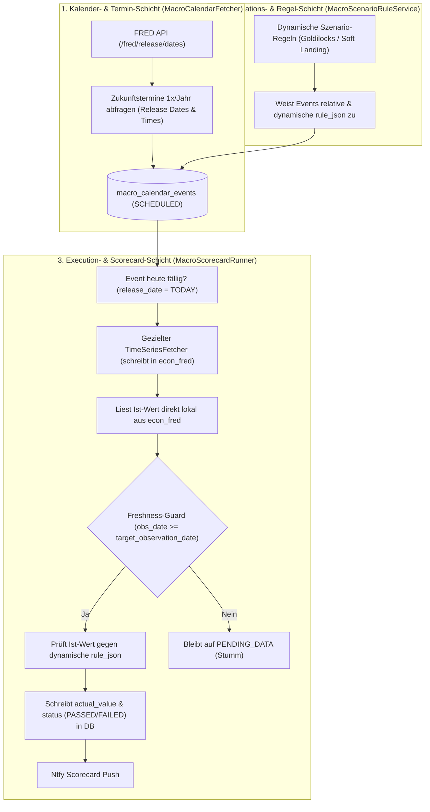
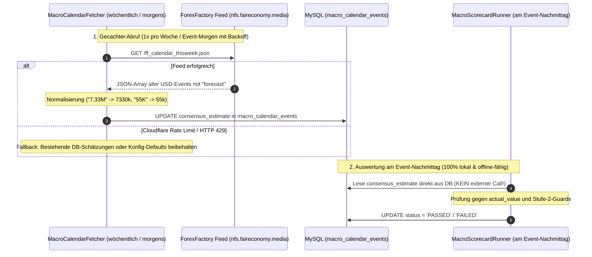
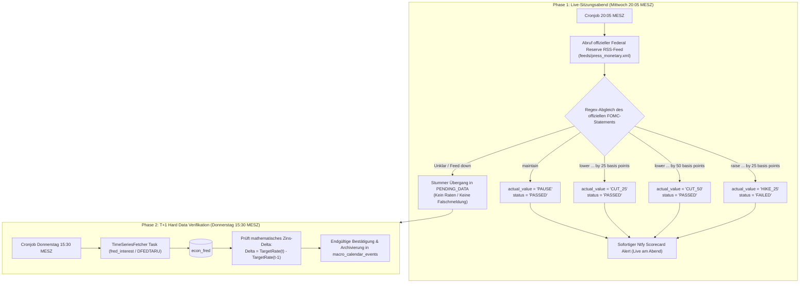
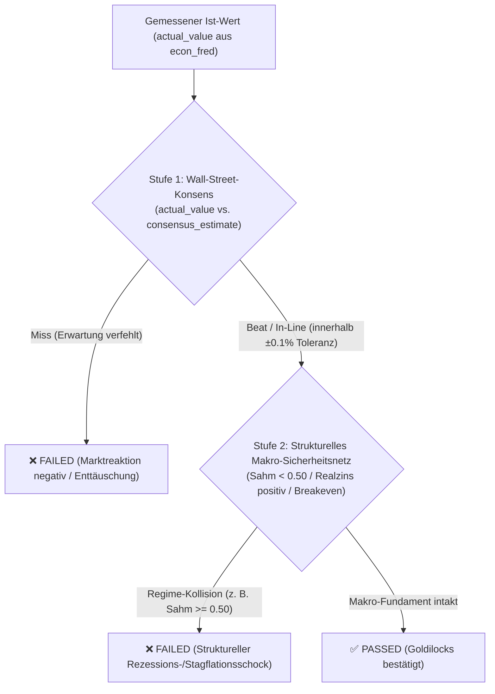
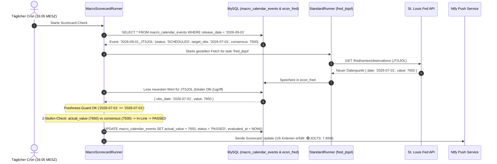
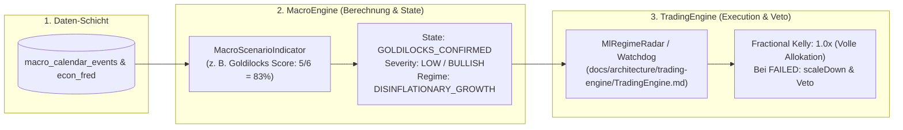

# Konzept: Dynamischer Makro-Wirtschaftskalender & Szenario-Framework

> **Status:** Verbindliche Architektur & Konzept-Spezifikation (`Option A: Full DB`)  
> **Ziel:** Vollständige Ablösung der statischen `Macro-Scenarios-Config.json` durch eine automatisierte, datenbankgestützte Event-, Kalender- und Scorecard-Engine.

---

## 1. Ausgangslage & Problemstellung

Für den September 2026 wurde mit der [`config/Macro-Scenarios-Config.json`](file:///D:/GitHub/CrashRadar/config/Macro-Scenarios-Config.json) ein statisches *Minimum Viable Product (MVP)* geschaffen. 

### Warum die MVP-Konstruktion skaliert werden muss:
1. **Monatsgekoppelte IDs:** IDs wie `jolts_july` oder `nfp_august` sind starr. Für Folgequartale müssten fortlaufend neue JSON-Einträge manuell angelegt werden.
2. **Ablaufdatum des Szenarios:** Nach dem 30.09.2026 ist das System "blind", da kein automatischer Übergang in neue Quartale (z. B. Q4 2026, Q1 2027) existiert.
3. **Keine Persistenz der Ist-Ergebnisse:** Gemessene Werte (`actual_value`) und der finale Status (`PASSED`/`FAILED`) existieren nur flüchtig zur Laufzeit im Speicher und in der Ntfy-Benachrichtigung, anstatt in der DB historisiert zu werden.
4. **Statische Schwellenwerte altern (Das Dynamik- & Realzins-Problem):**
   * Feste Zahlenwerte wie $100\text{k}$ NFP oder $3.4\,\%$ CPI sind Momentaufnahmen:
     * *Arbeitsmarkt:* 2022 waren $12\text{M}$ offene Stellen normal, 2026 sind es $7.5\text{M}$. Bei demografischem Wandel reichen in Zukunft vielleicht $+60\text{k}$ Payrolls für Vollbeschäftigung.
     * *Realzins-Kopplung:* Bei $5.25\,\%$ Leitzins ist eine Kerninflation von $3.2\,\%$ unkritisch (positiver Realzins $+2.05\,\%$, Fed hat Spielraum). Bei einem Leitzins von $3.00\,\%$ wäre dieselbe Inflation von $3.2\,\%$ ein negativer Realzins-Schock!

---

## 2. Das 3-Schichten-Zielbild (Separation of Concerns)

Um Termine (Fakten), Marktregeln (Interpretation) und Ausführung (Execution) strikt zu trennen, wird das System in drei Schichten strukturiert:



### Die Zuständigkeiten im Detail:

1. **`MacroCalendarFetcher.js` (Fakten, Termine & Konsens):**
   * Fragt die offiziellen Veröffentlichungstermine für das Kalenderjahr von der FRED-API ab (`release_date`, `release_time`, `target_observation_date`, `event_code`).
   * Bezieht den offiziellen Wall-Street-Konsens (`consensus_estimate`) resilient von Cleveland Fed Nowcast und per gecachtem Abruf von ForexFactory.
   * Schreibt diese Termine mit Status `SCHEDULED` in die Tabelle `macro_calendar_events`.
   * **Wichtig:** Kennt *keine* Trading- oder Goldilocks-Regeln.

2. **`MacroScenarioRuleService.js` (Markt-Regeln & Interpretation):**
   * Definiert, was die Wall Street in einem bestimmten Regime (z. B. "Goldilocks", "Stagflation-Watch", "Zinswende-Tracker") sehen will.
   * Generiert relative, trend- und zinsabhängige Schwellenwerte (`rule_json`) mit beidseitigen Korridoren und ordnet sie den Events zu.

3. **`MacroScorecardRunner.js` (Live-Execution & Werte-Übertrag):**
   * Prüft täglich, ob ein Event ansteht (`release_date = CURRENT_DATE`).
   * Führt den gezielten `TimeSeriesFetcher`-Task aus (Daten fließen in `econ_fred`).
   * **Lokale Synchronisation:** Liest den neuen Ist-Wert direkt lokal aus `econ_fred` (keine redundanten externen API-Calls) bzw. nutzt am FOMC-Abend den offiziellen Notenbank-Hybrid.
   * Validiert den Freshness-Guard, bewertet die Regel, aktualisiert `actual_value`, `details_json` + `status` (`PASSED`/`FAILED`) und feuert die Ntfy-Scorecard.

### 2.1 Das Monopol des TimeSeriesFetchers (Separation of Concerns)

Ein zentraler Architektur-Grundsatz von CrashRadar ist das **Monopol des TimeSeriesFetchers** auf externe Zeitreihenbeschaffung. Dieses Monopol wird wie folgt gewahrt und sauber abgegrenzt:

1. **Harte Wirtschafts- und Marktdaten (`econ_fred`):**
   * Das Monopol des `TimeSeriesFetcher` (`StandardRunner` / [`config/Database-Fetcher-Config.json`](file:///D:/GitHub/CrashRadar/config/Database-Fetcher-Config.json)) bleibt zu **100 % unangetastet**.
   * Der `MacroScorecardRunner` greift niemals selbst auf externe Daten-Endpunkte von FRED zu, sondern delegiert die Datenbeschaffung an den regulären `TimeSeriesFetcher`-Task (`fred_jtsjol`, `fred_payems`, etc.) und liest das Ergebnis erst nach dem Speichern lokal aus MySQL.
2. **Event- und Kalender-Metadaten (`macro_calendar_events`):**
   * Release-Termine (`/fred/release/dates`) und Konsens-Schätzungen (ForexFactory, Cleveland Fed Nowcast) sind **keine relationalen Markt-Zeitreihen**, sondern **Szenario-Metadaten**.
   * Sie werden getrennt über den `MacroCalendarFetcher` eingepflegt (vergleichbar mit Stammdaten-Seedern), wodurch die Kern-Zeitreihentabellen von CrashRadar schlank und unberührt bleiben.

---

## 3. Datenquellen & Offizielle Release-IDs

Die US-Behörden und die Federal Reserve veröffentlichen ihren Jahresplan weit im Voraus. Die Termine werden über die offizielle FRED-Release-API synchronisiert:

| Event | Herausgeber | Offizielle Quelle | FRED Release-ID / Feed | Standard-Uhrzeit |
| :--- | :--- | :--- | :--- | :--- |
| **JOLTS** (Offene Stellen) | **BLS** (Bureau of Labor Statistics) | [BLS Schedule](https://www.bls.gov/schedule/news_release/) | `release_id=119` | 16:00 MESZ (10:00 ET) |
| **NFP** (Employment Situation / Payrolls) | **BLS** | [BLS Schedule](https://www.bls.gov/news.release/empsit.toc.htm) | `release_id=50` | 14:30 MESZ (08:30 ET) |
| **CPI Core** (Verbraucherpreise) | **BLS** | [BLS Schedule](https://www.bls.gov/cpi/) | `release_id=10` | 14:30 MESZ (08:30 ET) |
| **PPI** (Erzeugerpreise) | **BLS** | [BLS Schedule](https://www.bls.gov/ppi/) | `release_id=110` | 14:30 MESZ (08:30 ET) |
| **FOMC** (Fed Zinsentscheid) | **Federal Reserve** | [FOMC Calendar](https://www.federalreserve.gov/monetarypolicy/fomccalendars.htm) & [FRB Monetary Feed](https://www.federalreserve.gov/feeds/press_monetary.xml) | 8 Termine / Jahr (H.15 `release_id=115`) | 20:00 MESZ (Live-Statement) / T+1 15:30 MESZ (FRED) |
| **Core PCE** (Fed-Preismaß) | **BEA** (Bureau of Economic Analysis) | [BEA Schedule](https://www.bea.gov/news/schedule) | `release_id=54` | 14:30 MESZ (08:30 ET) |

### 3.2 Live-Evaluierung & Marktübersicht aller Datenquellen

Im Rahmen der Konzeption wurden alle relevanten Marktdaten-Provider auf ihre Eignung und Datenverfügbarkeit im Free-Tier untersucht und live getestet (Skripte: [`scratch/trash/test_sources.js`](file:///D:/GitHub/CrashRadar/scratch/trash/test_sources.js), [`scratch/trash/test_modern_fmp.js`](file:///D:/GitHub/CrashRadar/scratch/trash/test_modern_fmp.js), [`scratch/architecture/macro/test_forexfactory.js`](file:///D:/GitHub/CrashRadar/scratch/architecture/macro/test_forexfactory.js) und [`scratch/architecture/macro/parse_cleveland.js`](file:///D:/GitHub/CrashRadar/scratch/architecture/macro/parse_cleveland.js)):

| Provider | Makro-Wirtschaftskalender | Konsens-Schätzungen (Macro) | Free-Tier Eignung & Testergebnis |
| :--- | :--- | :--- | :--- |
| **Tiingo** | ❌ Nein | ❌ Nein | Spezialisiert auf Aktien, Krypto, Forex & SEC-Fundamentaldaten. Kein Makro-Kalender. |
| **Alpaca** | ❌ Nein | ❌ Nein | "Calendar API" liefert nur Börsen-Handelszeiten (Market Open/Close/Holidays). |
| **AlphaVantage** | ❌ Nein | ❌ Nein | Funktion `ECONOMIC_CALENDAR` existiert nicht. Reine historische Zeitreihen. |
| **FMP (FinancialModelingPrep)** | ⚠️ Nur Paid | ⚠️ Nur Paid | ❌ **Blockiert:** Seit Aug 2025 hinter Paywall (`HTTP 402 Restricted Endpoint`). |
| **Finnhub** | ⚠️ Nur Schedule | ⚠️ Nur Earnings | Im Free-Tier auf Schedule und Unternehmensgewinne (EPS) beschränkt; keine verlässlichen Makro-Prints. |
| **👑 Cleveland Fed Nowcasting** | ✅ Ja (Inflation) | ✅ Ja (Live Nowcast) | 🟢 **Hervorragend (Gold-Standard):** Tägliche Schätzungen für Core CPI (`2.38 %`) und Core PCE (`3.40 %`). Stabil und verlässlich. |
| **👑 ForexFactory JSON Feed** | ✅ Ja (Alle Events) | ✅ Ja (Offizieller Konsens) | 🟢 **Hervorragend:** Öffentlicher JSON-Feed (`nfs.faireconomy.media`) liefert punktgenauen Wall-Street-Konsens (z. B. JOLTS: `7.33M`, NFP: `55k`, Unemployment: `4.1%`). *Wichtig: Caching erforderlich wegen Cloudflare Rate Limits.* |

### 3.3 Beschlossene Quellen-Strategie & 3-Stufen-Resilienz

| Metrik-Gruppe | Primäre Datenquelle für `consensus_estimate` | Status & Resilienz-Strategie |
| :--- | :--- | :--- |
| **Inflation** (`CPI_CORE`, `PCE_CORE`) | **Cleveland Fed Inflation Nowcast** | ✅ **Beschlossen:** Tägliches Nowcast-Scraping / API-Parsing (`parseClevelandNowcast()`). Höchste Genauigkeit. |
| **Zinsen** (`FOMC`) | **Federal Reserve Notenbank-Hybrid** | ✅ **Beschlossen:** Phase 1 (20:05 MESZ) offizieller Fed-Statement RSS-Feed; Phase 2 (T+1) FRED-Validierung (`DFEDTARU`). |
| **Arbeitsmarkt** (`PAYEMS` / NFP, `JTSJOL`) | **ForexFactory Feed (gecached) + Demografie- & Sahm-Guard** | ✅ **Beschlossen:** Gecachter Abruf des Wall-Street-Konsens (`forecast`) aus ForexFactory. Fallback auf konfigurierte Breakeven-Schwellen bei Verbindungsproblemen. |

#### 3.3.1 ForexFactory Ingestion & Cloudflare-Resilienz (3-Stufen-Architektur)



1. **Kein Live-Abruf im Alert-Fenster:** Um Cloudflare-Blockaden (`<title>Rate Limited</title>`) zuverlässig auszuschließen, greift der `MacroScorecardRunner` am Nachmittag niemals live auf ForexFactory zu. Sämtliche Konsens-Schätzungen werden vorab in `macro_calendar_events.consensus_estimate` persistiert.
2. **Graceful Fallback:** Sollte der Feed während des Seedings temporär nicht erreichbar sein, greift das System automatisch auf das in [`config/Macro-Scenarios-Config.json`](file:///D:/GitHub/CrashRadar/config/Macro-Scenarios-Config.json) hinterlegte Default-Niveau bzw. das 3M-Trend-Modell zurück. Der Runner stürzt niemals ab.

#### 3.3.2 Die 2-Phasen FOMC-Zinsentscheid-Strategie (Automatisierter Notenbank-Hybrid)

Das FOMC-Meeting stellt eine fundamentale methodische Besonderheit dar:
* **Das Problem:** Der Zinsentscheid wird am Mittwoch um 14:00 ET (20:00 MESZ) verkündet. Der effektive Leitzins (`DFF`) wird von der Federal Reserve Bank of New York jedoch erst am **darauffolgenden Geschäftstag (Donnerstag ca. 15:00 MESZ)** volumengewichtet aus den tatsächlichen Übernacht-Interbankenkrediten berechnet. Wer am Mittwochabend um 20:05 MESZ FRED abfragt, findet ausnahmslos den alten Zinssatz vor.
* **Die Gefahr unstrukturierten News-Scrapings:** Finanzportale und Nachrichtenticker sind werbeüberladen, ändern regelmäßig ihr DOM-Layout und neigen zu Halluzinationen oder Fehlinterpretationen.
* **Die Lösung: Der 2-Phasen-Notenbank-Hybrid:**



1. **Phase 1 (Mittwochabend 20:05 MESZ – Offizielle Primärquelle der Notenbank):**
   * Statt unzuverlässiger Nachrichtenseiten liest der Runner direkt den offiziellen RSS-Feed des Federal Reserve Board:
     `https://www.federalreserve.gov/feeds/press_monetary.xml`
   * Der Committee-Beschluss folgt seit Jahrzehnten exakt standardisierten Satzmustern:
     * `"decided to maintain the target range"` $\to$ `'PAUSE'`
     * `"decided to lower the target range ... by 25 basis points"` $\to$ `'CUT_25'`
     * `"decided to lower the target range ... by 50 basis points"` $\to$ `'CUT_50'`
     * `"decided to raise the target range ... by 25 basis points"` $\to$ `'HIKE_25'`
   * Liefert das Statement ein eindeutiges Signal, feuert die Scorecard noch am selben Abend als **Live-Alert**.
2. **Sicherheitsnetz (Zero-Hallucination-Guard):**
   * Ist der Fed-Feed nicht erreichbar oder matcht kein Pattern (z. B. bei unvorhersehbaren Formulierungsänderungen), wird **niemals geraten**.
   * Das Event verharrt geräuschlos auf `status = 'PENDING_DATA'`.
3. **Phase 2 (Donnerstag 15:30 MESZ – T+1 Verifikation aus FRED):**
   * Sobald die St. Louis Fed das H.15-Release (`DFEDTARU` / Federal Funds Target Range - Upper Limit bzw. `DFF`) eingepflegt hat, gleicht der `TimeSeriesFetcher` die harte Zahl mathematisch ab und verifiziert das Ergebnis endgültig in der Datenbank.

### 3.4 Der FRED API Endpunkt für Kalenderdaten
```http
GET https://api.stlouisfed.org/fred/release/dates?release_id={RELEASE_ID}&api_key={KEY}&include_release_dates_with_no_data=true&file_type=json
```

---

## 4. Datenbank-Design: `macro_calendar_events`

### 4.1 DDL Schema (MySQL)

```sql
CREATE TABLE IF NOT EXISTS `macro_calendar_events` (
  `id` VARCHAR(64) NOT NULL,                           -- z. B. '2026-09-01_JTSJOL' oder UUID
  `scenario_id` VARCHAR(64) NOT NULL,                  -- z. B. 'goldilocks_q3_2026', 'goldilocks_q4_2026'
  `event_code` VARCHAR(32) NOT NULL,                   -- Standardisiert: 'JTSJOL', 'PAYEMS', 'CPI_CORE', 'PPI', 'FOMC', 'PCE_CORE'
  `title` VARCHAR(128) NOT NULL,                       -- z. B. 'US JOLTS Report'
  `reporting_period` VARCHAR(16) NOT NULL,             -- z. B. '2026-07' (Juli), '2026-08' (August), '2026-Q3'
  `release_date` DATE NOT NULL,                        -- Veröffentlichungstag, z. B. '2026-09-01'
  `release_time` VARCHAR(32) NOT NULL,                 -- Uhrzeit, z. B. '16:00 MESZ'
  `target_observation_date` DATE NOT NULL,             -- Exakter FRED-Stichtag, z. B. '2026-07-01'
  `metric` VARCHAR(32) NOT NULL,                       -- Primäre Metrik in econ_fred, z. B. 'JTSJOL'
  `rule_json` JSON NOT NULL,                           -- Dynamische Auswertungsregel
  `pass_message` VARCHAR(255) DEFAULT NULL,            -- Erklärung bei Erfolg
  `fail_message` VARCHAR(255) DEFAULT NULL,            -- Erklärung bei Nichterfüllung
  `status` ENUM('SCHEDULED', 'PENDING_DATA', 'PASSED', 'FAILED', 'SKIPPED') NOT NULL DEFAULT 'SCHEDULED',
  `previous_value` VARCHAR(64) DEFAULT NULL,           -- Wert des vorangegangenen Berichtsmonats (Zahl z. B. '158800' oder Text)
  `consensus_estimate` VARCHAR(64) DEFAULT NULL,       -- Offizieller Wall-Street-Konsens vor Veröffentlichung (z. B. '55k', '2.38%')
  `actual_value` VARCHAR(64) DEFAULT NULL,             -- Gemessener Ist-Wert (Zahl z. B. '142', '2.65' oder String 'CUT_25')
  `details_json` JSON DEFAULT NULL,                    -- Strukturierte Auswertungs-Details aller Sub-Regeln & Guards
  `evaluated_at` DATETIME DEFAULT NULL,                -- Timestamp der erfolgreichen Auswertung
  `notified_at` DATETIME DEFAULT NULL,                 -- Timestamp des Ntfy-Versands
  `created_at` DATETIME NOT NULL DEFAULT CURRENT_TIMESTAMP,
  `updated_at` DATETIME NOT NULL DEFAULT CURRENT_TIMESTAMP ON UPDATE CURRENT_TIMESTAMP,
  PRIMARY KEY (`id`),
  KEY `idx_release_date` (`release_date`),
  KEY `idx_scenario_status` (`scenario_id`, `status`),
  KEY `idx_event_code` (`event_code`)
) ENGINE=InnoDB DEFAULT CHARSET=utf8mb4 COLLATE=utf8mb4_unicode_ci;
```

### 4.2 Standardisierte Event-Codes & Mapping

| `event_code` | Beschreibung | Zugehörige Fetcher-Tasks | Primäre Metrik in `econ_fred` |
| :--- | :--- | :--- | :--- |
| `JTSJOL` | US JOLTS Offene Stellen | `fred_jtsjol` | `JTSJOL` |
| `PAYEMS` | NFP Arbeitsmarkt & Payrolls | `fred_payems`, `fred_sahmrealtime` | `PAYEMS_DIFF`, `SAHMREALTIME` |
| `PPI` | Erzeugerpreisindex | `fred_ppiaco` | `PPIACO_YOY` |
| `CPI_CORE` | Kerninflation | `fred_cpilfesl` | `CPILFESL_YOY` |
| `FOMC` | Fed Zinsentscheid | `fred_interest` | `DFF_ACTION` / `DFEDTARU` |
| `PCE_CORE` | Core PCE Preisindex | `fred_pcepilfe` | `PCEPILFE_YOY` |

### 4.3 Automatische Metrik-Transformationen (Rohdaten -> Ist-Wert)

In `econ_fred` liegen rohe Zeitreihen vor. Der `MacroScorecardRunner` bzw. `ScenarioChecklistService` führt vor dem Regelabgleich standardisierte Transformationen durch:

1. **Preisindizes (`CPI_CORE`, `PCE_CORE`, `PPI`):**
   * *Rohdaten:* Indexstände (z. B. `CPILFESL = 325.4`).
   * *Berechnung:* $\text{YoY} = \frac{\text{Index}(\text{Stichtag } M) - \text{Index}(\text{Stichtag } M-12)}{\text{Index}(\text{Stichtag } M-12)} \times 100$
   * *Ergebnis:* Prozentuale Inflationsrate (z. B. `2.65 %`), die direkt gegen den Konsens (`consensus_estimate`) abgeglichen wird.
   * *Wichtig bei täglichem Forward-Fill:* Als Basiswert $M-12$ dient der historische Indexstand auf oder vor dem 12-Monats-Stichtag (`target_observation_date - 1 Jahr`), nicht ein Kalendertag des Vorjahres ohne Marktnotierung.

2. **Arbeitsmarkt-Zuwachs (`PAYEMS`):**
   * *Rohdaten:* Gesamtbeschäftigte in Tausend (z. B. `PAYEMS = 158942`).
   * *Berechnung:* $\Delta \text{PAYEMS} = \text{PAYEMS}(\text{Stichtag } M) - \text{PAYEMS}(\text{Stichtag } M-1)$
   * *Ergebnis:* Monatlicher Stellenzuwachs in Tausend (z. B. `158942 - 158800 = +142k`), der gegen den Konsens (`consensus_estimate`) abgeglichen wird.
   * *Kritischer Architektur-Hinweis für tägliche Zeitreihen:* Bei täglicher Datenhaltung mit Forward-Fill darf $M-1$ **keinesfalls der gestrige Handelstag ($t-1$)** sein! Da monatliche FRED-Daten über den gesamten Monat auf jeden Handelstag fortgeschrieben werden, wäre die Differenz zum Vortag immer $0$. Die Differenzbildung muss zwingend den Datenstand unmittelbar vor dem neuen Monats-Stichtag (`date < target_observation_date`) als Vormonat heranziehen.

3. **Zinsentscheid (`FOMC`):**
   * *Phase 1 (Live-Abend, 20:05 MESZ):* Textmuster-Extraktion aus dem offiziellen Fed-Statement (`'PAUSE'`, `'CUT_25'`, `'CUT_50'`, `'HIKE_25'`).
   * *Phase 2 (T+1 Verifikation, 15:30 MESZ):* Mathematisches Zins-Delta auf Basis der Target Range (`DFEDTARU`):
     $$\Delta \text{Rate} = \text{DFEDTARU}(t) - \text{DFEDTARU}(t-1)$$
   * *Ergebnis:* Bestätigung der diskreten Klassifikation (`'PAUSE'` bei $\Delta = 0$, `'CUT_25'` bei $\Delta \approx -0.25\,\%$, `'CUT_50'` bei $\Delta \approx -0.50\,\%$, `'HIKE_25'` bei $\Delta > 0$).

---

## 5. Empirische Simulation & Grenzen reiner Trend-Modelle

Zur Validierung der Dynamisierung wurde ein Simulations-Skript ([`scratch/architecture/macro/simulate_dynamic_rules.js`](file:///D:/GitHub/CrashRadar/scratch/architecture/macro/simulate_dynamic_rules.js)) entwickelt, das die realen historischen FRED-Zeitreihen aus `econ_fred` lädt, die gleitenden 3-Monats-Durchschnitte (3M MA) berechnet und den statischen JSON-Werten gegenüberstellt:

### 5.1 Simulations-Ergebnisse (Datenbasis: Sommer 2026)

| Event / Metrik | Datenbasis in `econ_fred` | Statischer Wert ([`Macro-Scenarios-Config.json`](file:///D:/GitHub/CrashRadar/config/Macro-Scenarios-Config.json)) | Dynamisch berechnete Rule | Erkenntnis aus der Simulation |
| :--- | :--- | :--- | :--- | :--- |
| **JOLTS** (`JTSJOL`) | 3M-Schnitt: **7.49M** | `RANGE: [7.00M - 8.20M]` | **`RANGE: [6.99M - 7.99M]`** | Die statische Obergrenze ($8.2\text{M}$) war veraltet. Der dynamische Korridor ($3\text{M} \pm 500\text{k}$) passt sich exakt dem 2026er Niveau an. |
| **NFP / Sahm** | Sahm: `-0.03`, Payrolls: `-23k` | `PAYEMS >= 100k` & `SAHM < 0.50` | **`MIN: 100k` & `MAX: 0.50`** | $100\text{k}$ bildet den demografischen US-Breakeven, $0.50$ die mathematische Rezessionsgrenze. |
| **Core CPI** (`CPILFESL`) | 3M-Trend: `2.82% -> 2.57% -> 2.47%`<br>3M-Schnitt: **2.62%**<br>Leitzins (`DFF`): **3.63%** | `MAX: 3.4%` | **`TREND_DELTA: Max 2.72%`**<br>**`REAL_RATE: Max 3.38%`** | 🔥 **Frühwarnung:** Wenn die Inflation auf $2.47\%$ gefallen ist, wäre ein Anstieg auf $3.3\%$ ein Schock. Die statische JSON ($3.4\%$) wäre blind geblieben, die dynamische Regel schlägt sofort Alarm! |
| **Core PCE** (`PCEPILFE`) | 3M-Schnitt: **3.38%** (stabil) | `MAX: 3.3%` | **`TREND_DELTA: Max 3.48%`** | Die statische Grenze ($3.3\%$) hätte einen **Fehlalarm** ausgelöst. Die dynamische Regel erkennt den stabilen Seitwärtstrend ($3.34\%$). |

### 5.2 Grenzen rein mathematischer Trend-Regeln (Warum 3M MA allein nicht reicht)
* **Das Problem:** Ein gleitender 3-Monats-Durchschnitt ist **rückwärtsgerichtet (lagging)**.
* **Wie die Wall Street wirklich agiert:** Große Marktteilnehmer (Hedgefonds & Investmentbanken) handeln nicht nach Vergangenheitsdurchschnitten, sondern nach **Forward-Looking Consensus Estimates** (offizielle Konsens-Schätzungen von Bloomberg, FactSet, Reuters oder Nowcasting-Modellen).
* **Fazit:** Ein reines Trend-Modell schützt vor strukturellem Veralten, kennt aber nicht die punktgenaue Erwartungshaltung des Marktes am Veröffentlichungstag.

---

## 6. Die Architektur-Entscheidung: Das 2-Stufen-Bewertungsmodell

Um die Vorzüge von echten Wall-Street-Erwartungen mit mathematischer Krisensicherheit zu vereinen, implementiert das System ein **2-Stufen-Bewertungsmodell**:



### Stufe 1: Der Wall-Street-Konsens-Check (`consensus_estimate`)
* Prüft, ob der gemeldete Wert im Erwartungskorridor der Wall Street liegt:
  * **Inflation (CPI/PCE/PPI):** $\text{actual\_value} \le \text{consensus\_estimate} + 0.10\,\%$ (Disinflationspfad intakt; Werte über Konsens schüren Zinsängste).
  * **Arbeitsmarkt (NFP – Beidseitiger Goldilocks-Korridor):**
    $$\text{consensus\_estimate} - 15\text{k} \le \text{actual\_value} \le \text{consensus\_estimate} + 100\text{k}$$
    * *Untergrenze:* Schützt vor Rezessionspanik (kein abrupter Stellenabbau).
    * *Obergrenze:* Schützt vor Überhitzung (ein überhitzter Arbeitsmarkt wie $+350\text{k}$ würde neue Zinserhöhungsängste entfachen und ist kein Goldilocks-Melt-Up!).
* Ein Erreichen oder Schlagen des Konsenses innerhalb des Korridors signalisiert grünes Licht für eine Erleichterungsrallye.

### Stufe 2: Das strukturelle Makro-Sicherheitsnetz (Sanity Guards)
* Verhindert Fehlinterpretationen bei "faulen Beats" (wenn der Konsens bereits ein Krisenniveau widerspiegelt):
  * *Beispiel:* Die Wall Street erwartet im Abschwung nur noch $+10\text{k}$ Payrolls. Die gemeldeten $+20\text{k}$ "schlagen" zwar den Konsens, liegen aber unter dem US-Mindestbedarf für Vollbeschäftigung!
  * **Die Guards greifen ein:** Trotz Konsens-Beat wirft Stufe 2 ein Veto über unabhängige Sanity-Checks:
    1. **Sahm-Rezessions-Guard:** Die Arbeitslosenquote darf die Sahm-Regel nicht triggern (`SAHMREALTIME < 0.50`).
    2. **Demografischer Breakeven-Guard:** Der absolute Stellenaufbau muss den demografischen Mindestbedarf decken (`PAYEMS_DIFF >= 40k`).
    3. **Realzins-Guard bei Inflation:** Die Kerninflation darf den Leitzins nicht invertieren ($\text{Core CPI} \le \text{DFF} - 0.25\,\%$ im restriktiven Regime).

---

## 7. Dynamische & Relative Rule-Engine (`rule_json`)

Die Konfiguration in `macro_calendar_events.rule_json` bildet dieses 2-Stufen-Modell flexibel ab:

### 1. 2-Stufen-Regel für Inflation (Konsens + Realzins-Schutz)
```json
{
  "type": "TWO_STAGE_CONSENSUS",
  "consensusMetric": "consensus_estimate",
  "maxTolerance": 0.10,
  "macroGuards": [
    {
      "type": "SPREAD_TO_METRIC",
      "compareMetric": "DFF",
      "operator": "LESS_THAN_OR_EQUAL",
      "offset": -0.25,
      "failMsg": "Kerninflation über Leitzins / Realzins-Inversion"
    }
  ],
  "passMsg": "Inflation im Rahmen der Erwartungen & Realzins restriktiv",
  "failMsg": "Inflation über Konsens oder Realzins-Inversion"
}
```

### 2. 2-Stufen-Regel für Arbeitsmarkt (Beidseitiger Konsens + Multi-Guard)
```json
{
  "type": "TWO_STAGE_CONSENSUS",
  "consensusMetric": "consensus_estimate",
  "minTolerance": -15,
  "maxTolerance": 100,
  "macroGuards": [
    {
      "metric": "SAHMREALTIME",
      "type": "MAX",
      "max": 0.50,
      "failMsg": "Sahm-Rezessionsalarm getriggert (>0.50)"
    },
    {
      "metric": "PAYEMS_DIFF",
      "type": "MIN",
      "min": 40,
      "failMsg": "Stellenaufbau unter demografischem Breakeven (<40k)"
    }
  ],
  "passMsg": "Arbeitsmarkt stabil im neutralen Goldilocks-Korridor (keine Rezession & keine Überhitzung)",
  "failMsg": "Arbeitsmarkt außerhalb des Korridors oder Makro-Guard verletzt"
}
```

### 3. Diskrete Notenbank-Entscheidung (FOMC Notenbank-Hybrid)
```json
{
  "type": "ALLOWED_VALUES",
  "allowed": ["PAUSE", "CUT_25", "CUT_50"],
  "phase1Feed": "https://www.federalreserve.gov/feeds/press_monetary.xml",
  "phase2Metric": "DFEDTARU",
  "passMsg": "Geldpolitische Lockerung / Zinspause bestätigt",
  "failMsg": "Unerwarteter Zinsschritt / Restriktion (HIKE)"
}
```

---

## 8. End-to-End Workflow & Durchstich-Beispiel

### Beispiel: Veröffentlichungstag 01.09.2026 (JOLTS Juli)



---

## 9. Migrations- & Einführungsfahrplan (Step-by-Step)

1. **Schritt 1: DDL & Migration (`macro_calendar_events`)**
   * Erstellen des Migrationsskripts in `src/db/migrations/create_macro_calendar_events.sql` inklusive der Spalten `consensus_estimate` (`VARCHAR(64)`), `actual_value` (`VARCHAR(64)`) und `details_json` (`JSON`).
   * Ausführen der Tabellenerstellung in MySQL.

2. **Schritt 2: `MacroCalendarFetcher.js` (Termin- & Konsens-Ingestion)**
   * Implementierung des Fetchers, der für das Kalenderjahr 2026 die Termine der 5 Kern-Release-IDs abfragt und mit `status = 'SCHEDULED'` in `macro_calendar_events` einträgt.
   * Gecachte und rate-limit-geschützte Konsens-Ingestion von Cleveland Fed Nowcast und ForexFactory in `macro_calendar_events.consensus_estimate` (wöchentlich / morgens).

3. **Schritt 3: `MacroScenarioRuleService.js` (2-Stufen-Regel-Engine & Notenbank-Hybrid)**
   * Implementierung der erweiterten 2-Stufen-Regel-Auswertung (`TWO_STAGE_CONSENSUS` mit beidseitigem Korridor und `macroGuards`-Array, `RANGE`, `SPREAD_TO_METRIC`).
   * Einbindung des FOMC-Notenbank-Hybrids (Phase 1: Fed-Statement RSS am Sitzungsabend; Phase 2: T+1 FRED-Hard-Data-Verifikation).
   * Zuweisung des aktiven Szenarios (z. B. `goldilocks_q3_2026`) auf die entsprechenden Quartals-Events.

4. **Schritt 4: Refactoring [`ScenarioChecklistService.js`](file:///D:/GitHub/CrashRadar/src/services/ScenarioChecklistService.js) & [`MacroScorecardRunner.js`](file:///D:/GitHub/CrashRadar/src/runners/MacroScorecardRunner.js)**
   * Umstellung von der statischen JSON-Datei auf die Datenbank-Tabelle `macro_calendar_events`.
   * Lokaler Werte-Abgleich aus `econ_fred` mit strikter MoM-Stichtags- und YoY-Transformation sowie persistenter Speicherung in `actual_value`, `details_json` und `status`.

5. **Schritt 5: Test-Suite & Verifikation**
   * Unit-Tests mit Mocks für alle Regeltypen, Multi-Guards, Stichtags-Forward-Fills und Live-Dry-Run via CLI.

---

## 10. Zukunftsausblick: Integration in MacroEngine & TradingEngine

Ursprünglich als reines Reporting- und Monitoring-Tool gestartet, besitzt das dynamische Szenario-Framework alle mathematischen und strukturellen Eigenschaften eines vollwertigen **Makro-Regime-Indikators**.



### 10.1 Rolle in der MacroEngine (`MacroScenarioIndicator.js`)
* **Verantwortung:** Aggregation der `macro_calendar_events` zu einem normierten Makro-Score (`0.0 - 1.0`).
* **Output-Schema:**
  ```json
  {
    "indicator": "MacroScenarioIndicator",
    "scenarioId": "goldilocks_q3_2026",
    "score": 0.83,
    "passedCount": 5,
    "totalCount": 6,
    "state": "CONFIRMED",
    "regime": "DISINFLATIONARY_GROWTH"
  }
  ```

### 10.2 Rolle in der TradingEngine ([`docs/architecture/trading-engine/TradingEngine.md`](file:///D:/GitHub/CrashRadar/docs/architecture/trading-engine/TradingEngine.md))
* **Verantwortung:** Fundamental-Veto und dynamische Risikoskalierung (Kelly Multiplikator).
* **Handlungslogik:**
  * **Score $\ge 80\,\%$ (`CONFIRMED`):** Grünes Licht für Trendfolge- und Momentum-Strategien. Maximales Risiko-Budget.
  * **Szenario `FAILED` (z. B. Inflations-Schock oder Sahm-Rezessions-Trigger):** Die TradingEngine zieht automatisch den **Fundamental-Watchdog** (`action.scaleDown`), friert neue Long-Käufe ein und zieht Trailing-Stops enger.

> **Roadmap-Einordnung:** In Phase 1 wird das System als autarker Runner & Benachrichtigungsdienst betrieben. In Phase 2 erfolgt die direkte Anbindung des Indikators an die Pipeline der TradingEngine.
