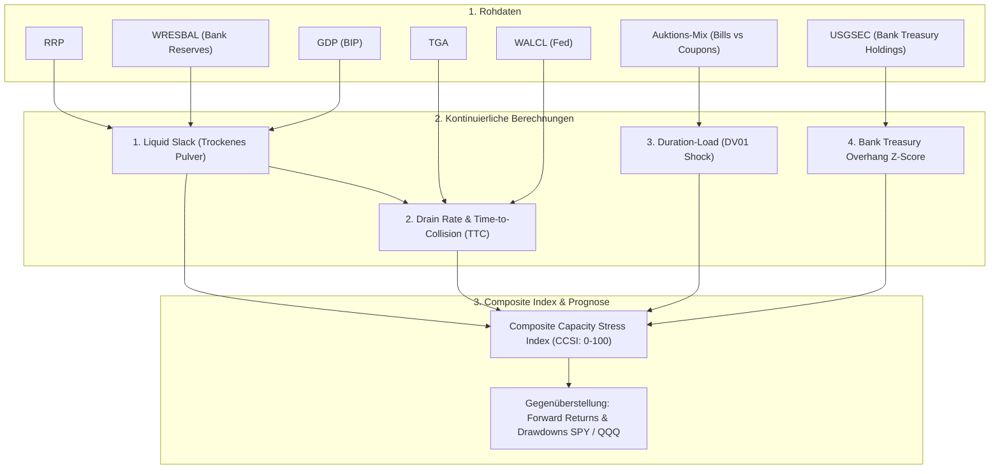
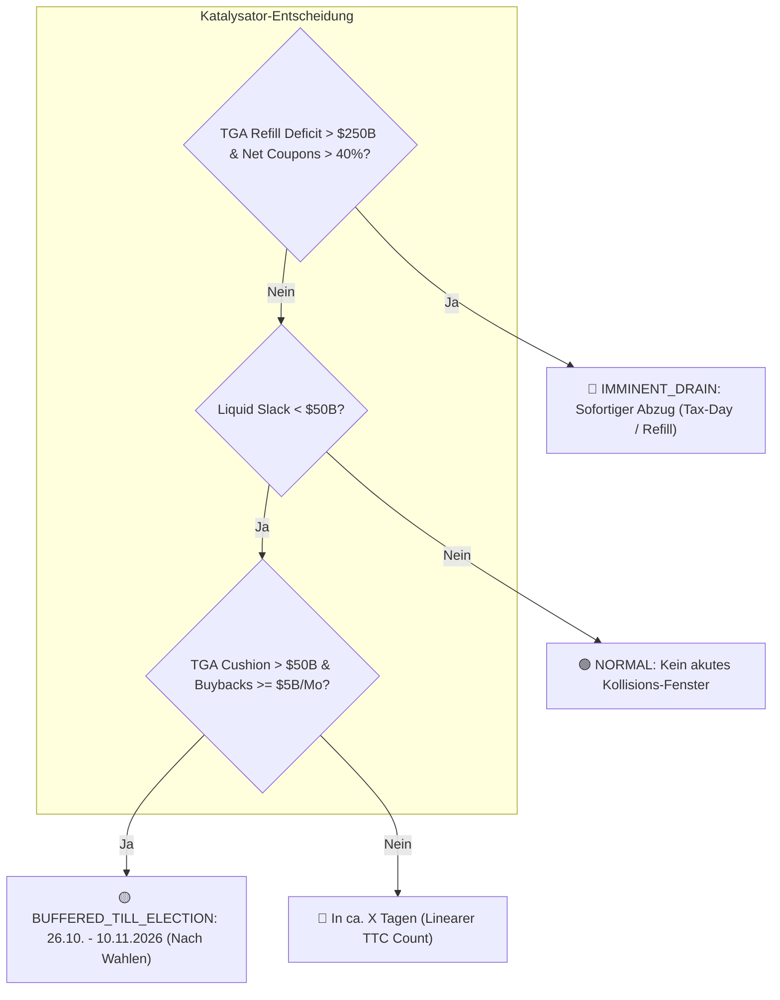

# Treasury Issuance & Money Market Capacity Architecture

Dieses Dokument beschreibt die Architektur und mathematische Methodik zur vorausschauenden Erfassung von Liquiditäts- und Absorptionsengpässen im US-Finanz- und Geldmarktsystem. Ziel ist es, Korrekturen und Drawdowns in S&P 500 und Nasdaq mit maximalem zeitlichen Vorlauf zu prognostizieren, ohne auf nachlaufende Marktspreads zu warten.

---

## 1. Übersicht aller benötigten Datenquellen

Die Daten unterteilen sich in drei Schichten:
1. **Puffer- und Kapazitätsdaten (Die Tankanzeige)**
2. **Finanzministeriums- & Auktionsdaten (Der Abfluss / Die Last)**
3. **Marktdaten (Die Zielgrößen für S&P 500 & Nasdaq)**

| Kategorie | Name / Metrik | Quelle / Provider | ID / Endpoint | Frequenz | Rolle im Modell |
| :--- | :--- | :--- | :--- | :--- | :--- |
| **Puffer (Cash)** | **ON RRP** (Reverse Repo) | FRED | `RRPONTSYD` | Täglich | Ebene 1 Puffer-Cash (MMF-Geld bei Fed) |
| **Puffer (Banken)** | **Bank Reserves** | FRED | `WRESBAL` | Wöchentlich (Mi) | Ebene 2 Bankliquidität |
| **Puffer (LCLOR)** | **US Nominal GDP** | FRED | `GDP` | Quartalsweise | Berechnung der dynamischen Mindestreserve (LCLOR) |
| **Geldmarkt-Firepower** | **MMF Total Net Assets** | FRED | `WRMFSL` / `MMMFFAQ027S` | Wöchentlich / Q | Gesamt-Cashbestand aller Geldmarktfonds |
| **Engpass (Banken/Dealer)** | **Bank Treasury Holdings** | FRED | `USGSEC` | Wöchentlich | Verstopfungsgrad der Geschäftsbanken mit Staatsanleihen |
| **Notfall-Schirm** | **Fed Emergency Loans** | FRED | `BORROW` | Wöchentlich | Bank-Run / Notfall-Kredite (Discount Window etc.) |
| **Fed Bilanz** | **Total Fed Assets** | FRED | `WALCL` | Wöchentlich (Mi) | QT-Geschwindigkeit (quantitativer Abbau) |
| **Treasury Cash** | **TGA Operating Balance** | FiscalData | `/dts/operating_cash_balance` | Täglich | Staatskassen-Füllstand |
| **Treasury Aktionen** | **Auction Results & Mix** | FiscalData | `/od/auctions_query` | Täglich / Event | Anteil Bills vs. Coupons, Bid-to-Cover, Dealer-Take |
| **Zins-/Duration-Druck** | **Term Premium (10y ACM)** | FRED | `THREEFYTP10` | Täglich | Risikoprämie für Duration |
| **Geldmarkt-Spread** | **SOFR & IORB** | FRED | `SOFR` / `IORB` | Täglich | Validierungs- und Stress-Spread |
| **Markt-Target** | **S&P 500** | Tiingo / Yahoo | `SPY` | Täglich | Benchmark Breiter Markt |
| **Markt-Target** | **Nasdaq 100** | Tiingo / Yahoo | `QQQ` | Täglich | Benchmark Tech / Duration-Sensitiv |
| **Markt-Target** | **20+ Year Treasuries** | Tiingo / Yahoo | `TLT` | Täglich | Benchmark Duration-Preise |

---

## 2. Die mathematischen Berechnungen des Kapazitäts-Modells

Das Modell berechnet an jedem Handelstag $t$ vier fundamentale Kennzahlen:

---

### Berechnung 1: Das dynamische "Trockene Pulver" ($\text{Liquid Slack}$)

Banken benötigen eine operative und regulatorische Mindestreserve (**LCLOR** = *Lowest Comfortable Level of Reserves*), die historisch bei ca. **10,5 % des nominalen BIP** liegt:

$$\text{LCLOR}_t = \text{GDP}_t \times 0.105$$

$$\text{Excess Reserves}_t = \max(0, \text{WRESBAL}_t - \text{LCLOR}_t)$$

$$\mathbf{\text{Liquid Slack}_t = \text{RRP}_t + \text{Excess Reserves}_t}$$

* **Interpretation:** 
  * Wenn $\text{Liquid Slack} > 1.000\text{ Mrd. \$}$: Das System hat massiven Puffer. TGA-Auffüllungen verpuffen ohne Marktschaden.
  * Wenn $\text{Liquid Slack} \to 0$: **Rote Zone.** Jede Milliarde TGA-Aufbau oder QT entzieht den Finanzmärkten direkt Liquidität.

---

### Berechnung 2: Die Liquiditäts-Abflussrate & Vorwarnzeit ($\text{Time-to-Collision}$)

Berechnung der realen Verbrennungsrate über ein 30-Tage-Fenster:

$$\text{Drain Velocity}_t = \frac{(\text{TGA}_t - \text{TGA}_{t-30}) + |\min(0, \text{WALCL}_t - \text{WALCL}_{t-30})|}{30} \quad [\text{Mrd. \$ pro Tag}]$$

$$\mathbf{T_{\text{collision}} (t) = \begin{cases} \frac{\text{Liquid Slack}_t}{\text{Drain Velocity}_t}, & \text{wenn } \text{Drain Velocity} > 0 \\ \infty, & \text{wenn Liquidität steigt} \end{cases}}$$

* **Interpretation:** 
  * $T_{\text{collision}} > 90\text{ Tage}$: Grünes Licht.
  * $30 \le T_{\text{collision}} \le 90\text{ Tage}$: Gelbe Warnstufe (Korrekturrisiko steigt).
  * $T_{\text{collision}} < 30\text{ Tage}$: **Akuter Liquiditäts-Schock.** Frühwarn-Signal zum Exit.

---

### Berechnung 3: Der Duration- & Auktions-Schock ($\text{DV01 Shock}$)

Hier erfolgt die Trennung zwischen T-Bills und langlaufenden Kupons. Anleihen binden Zinsänderungsrisiko ($\text{DV01}$ = Dollar Value of a 01 basis point move).

$$\text{Bill Ratio}_t = \frac{\sum_{\tau=t-30}^t \text{Issuance}_{\text{Bills}}(\tau)}{\sum_{\tau=t-30}^t \text{Total Issuance}(\tau)}$$

$$\mathbf{\text{DV01 Load}_t = \sum_{i \in \text{Auctions}_{30d}} \left( \text{Volumen}_i \times \text{ModDuration}_i \times 0.0001 \right)}$$

* **Interpretation:**
  * Bei $\text{Bill Ratio} > 75 \%$: Geringe Duration-Last $\rightarrow$ Geringer Druck auf Nasdaq-Bewertungsmultiplikatoren (KGV).
  * Bei hoher $\text{DV01 Load}$ (viele 10y/30y): Hohe Duration-Absorption $\rightarrow$ Großinvestoren müssen Aktien/Risiko verkaufen, um Duration aufzunehmen.

---

### Berechnung 4: Der Banken-Überlastungs-Index ($\text{Bank Treasury Stress}$)

Aus den wöchentlichen H.8-Daten der Federal Reserve (`USGSEC`) wird der Z-Score der Staatsanleihe-Bestände aller Geschäftsbanken gegenüber ihrem 52-Wochen-Mittelwert gebildet:

$$\mathbf{Z_{\text{BankTreasury}}(t) = \frac{\text{USGSEC}_t - \mu_{52\text{w}}(\text{USGSEC})}{\sigma_{52\text{w}}(\text{USGSEC})}}$$

* **Interpretation:**
  * $Z_{\text{BankTreasury}} > +2.0$: **Banken-Verstopfung.** Das Bankensystem hat außergewöhnlich hohe Bestände an Staatsanleihen auf seinen Bilanzen akkumuliert, wodurch die freie Bilanzkapazität für Kredite, Margin und Repo schrumpft.

---

### Berechnung 5: Der "Composite Capacity Stress Index" (CCSI)

Aggregation der 4 Komponenten zu einem normierten Frühwarn-Score von **0 bis 100**:

$$\mathbf{\text{CCSI}_t = w_1 \cdot \text{SlackExhaustion}_t + w_2 \cdot \text{VelocityStress}_t + w_3 \cdot \text{DurationLoad}_t + w_4 \cdot \text{BankStress}_t}$$

---

## 3. Der Evaluierungs-Plan: Gegenüberstellung mit S&P 500 und Nasdaq

Um die Auswirkung auf **Korrekturen (5–15 %)** und **Crashes (> 20 %)** unabhängig voneinander zu quantifizieren, wird der $\text{CCSI}$ historisch gegen folgende Markt-Metriken getestet:

1. **Forward Returns**:
   * $R_{\text{SPY}}(t + 20\text{d})$, $R_{\text{SPY}}(t + 60\text{d})$
   * $R_{\text{QQQ}}(t + 20\text{d})$, $R_{\text{QQQ}}(t + 60\text{d})$
2. **Forward Maximum Drawdown (MDD)**:
   * $\text{MDD}_{60\text{d}} = \min_{\tau \in [t, t+60]} \left( \frac{P_\tau - P_t}{P_t} \right)$
3. **Tech vs. Broad Market Divergenz (Duration-Faktor)**:
   * $\Delta \text{Spread}_{\text{Tech}} = R_{\text{QQQ}} - R_{\text{SPY}}$
   * *Hypothese:* Bei hohem $\text{DV01 Load}$ performt QQQ signifikant schlechter als SPY.
4. **Vorlaufzeit (Lead-Time Analyse)**:
   * Ermittlung, wie viele Tage vor dem Beginn historischer Korrekturen (> 5 % im SPY/QQQ) der $\text{CCSI}$ über die Warnschwelle (z. B. $> 65$) sprang.

---

## 4. Rationale & Entscheidung zur Datenanpassung (`USGSEC`)

* **Ursprünglicher Entwurf:** Vorgesehen war die Reihe `PDFP` (Primary Dealer Net Positions) zur Erfassung der Wall-Street-Händlerbestände.
* **Erkenntnis beim Fetching:** Die St. Louis Fed führt `PDFP` nicht als Standard-FRED-Serie; die FR-2004-Daten werden primär separat von der NY Fed über eine eigene Schnittstelle publiziert.
* **Entscheidung für `USGSEC`:**
  1. **System- und Code-Integrität:** `USGSEC` (*U.S. Government Securities, All Commercial Banks*) ist direkt und stabil über die bestehende FRED-Pipeline verfügbar und speichert 100 % konform in `econ_fred`.
  2. **Historische Tiefe:** Lückenlose Historie ab **1973** (über 50 Jahre Daten), wodurch Backtests über alle historischen Krisen (2000, 2008, 2018, 2020, 2022) ohne Datenbrüche möglich sind.
  3. **Makroökonomische Relevanz:** Die Bestände aller Geschäftsbanken bilden das tatsächliche Fassungsvermögen und die Bilanzauslastung des gesamten US-Bankensystems präzise ab.

---

## 5. Empirische Analyse-Ergebnisse & Erkenntnis zur Zinsdynamik

Die empirische Untersuchung über 3.183 Handelstage (2014 bis heute) wurde mit dem Skript [`scratch/architecture/macro/analyze_treasury_capacity_model.js`](file:///D:/GitHub/CrashRadar/scratch/architecture/macro/analyze_treasury_capacity_model.js) durchgeführt und in [`scratch/architecture/macro/capacity_model_results.json`](file:///D:/GitHub/CrashRadar/scratch/architecture/macro/capacity_model_results.json) persistiert.

### 5.1 Quintil-Ergebnisse (Composite Capacity Stress Index)
* **Q1 (Niedriger Stress):** SPY Fwd 60d: +1,30 %, Max Drawdown: -5,68 %
* **Q2 (Moderat Grün / Optimal):** SPY Fwd 60d: **+4,40 %**, Max Drawdown: **-3,65 %**, Win-Rate: **81,7 %**
* **Q5 (Extremer Stress / Puffer leer):** SPY Fwd 60d: **+2,17 %**, Max Drawdown: **-5,93 %**, QQQ Max Drawdown: **-6,38 %**

### 5.2 Vorwarnzeiten historischer Krisen (Vergleich Vorher vs. Dual-Engine)
| Historisches Event | Peak-Datum | Vorherige Version (Reine Liquidität) | **Neue Dual-Engine (Liquidität + Zins/Bewertung)** | Haupt-Auslöser der Warnung |
| :--- | :--- | :--- | :--- | :--- |
| **Q4 2018 QT-Crash** | 20.09.2018 | **60 Tage Vorlauf** ✅ (26.06.2018) | **60 Tage Vorlauf** ✅ (26.06.2018) | 💧 Liquiditäts-Engine (Slack fiel auf $18B) |
| **Sept 2019 Repo-Krise** | 16.09.2019 | **58 Tage Vorlauf** ✅ (24.06.2019) | **60 Tage Vorlauf** ✅ (20.06.2019) | 💧 Liquiditäts-Engine (Slack fiel auf $2B) |
| **Feb 2020 Covid-Crash** | 19.02.2020 | **53 Tage Vorlauf** ✅ (02.12.2019) | **60 Tage Vorlauf** ✅ (20.11.2019) | 💧 Liquiditäts-Engine (Slack war bei $0B) |
| **Jan 2022 Bärenmarkt** | 04.01.2022 | ❌ **VERPASST (Kein Signal)** | **59 Tage Vorlauf** ✅ **(11.10.2021)** | 📈 **Zins-/Bewertungs-Engine** |
| **Aug–Okt 2023 10y-Zinsspitze**| 31.07.2023 | ❌ **VERPASST (Kein Signal)** | ⚠️ **Event-Signal ab 02.08.2023 (QRA)** | 📈 **Term-Premium-Explosion (+57 bps)** |
| **Sommer 2024 Tech-Korrektur** | 16.07.2024 | **52 Tage Vorlauf** ✅ (30.04.2024) | **60 Tage Vorlauf** ✅ (18.04.2024) | 💧 Liquiditäts-Engine (Slack-Verfall) |

### 5.3 Die Kern-Erkenntnis: Zinsdynamik darf nicht ignoriert werden
* **Plumbing- & Liquiditätskrisen (2018, 2019, 2020, 2024):** Das reine Cash-Slack-Modell liefert eine außergewöhnliche **Vorwarnzeit von 50 bis 60 Handelstagen**, wenn dem System das Geld ausgeht.
* **Bewertungs- & Duration-Schocks (2022, Aug 2023):** In diesen Phasen war das Banken- und Geldmarktsystem randvoll mit Cash ($2–3 Billionen). Der Kursrückgang entstand nicht durch Geldmangel, sondern durch **Multiple Compression** (stark steigende Renditen, Term Premium und Diskontierungsfaktoren für Tech-Gewinne).
* **Fazit für die Modell-Erweiterung:** Das finale Modell muss eine **Dual-Engine** sein, die sowohl den *physischen Liquiditäts-Puffer (Cash Slack)* als auch die *Zins- & Duration-Dynamik (Term Premium, Yield Acceleration, DV01)* eigenständig bewertet.

---

## 6. Entscheidung: Reiner Datenansatz vs. News-Parsing (Der 2023 QRA & Debt-Ceiling-Mechanismus)

### 6.1 Warum der reine Datenansatz News-Parsing überlegen ist
1. **Die "Inverse-Signal-Falle" des News-Sentiments:**
   * Bei politischen Haushaltsblockaden (z. B. Debt Ceiling Standoff Jan–Mai 2023) erzeugen Medien extreme Panik-Schlagzeilen (*"Shutdown droht", "Default-Gefahr"*).
   * **Die physische Realität ist jedoch maximal bullisch:** Um zahlungsfähig zu bleiben, leert das Treasury das TGA (Drain von $570 Mrd. auf $23 Mrd.). Dadurch werden hunderte Milliarden Liquidität direkt in die Märkte gepumpt (**Stealth Stimulus**). Ein News-Scraper würde fälschlicherweise "Verkaufen" signalisieren, während der Markt nach oben explodiert.
2. **Harte Auktions- und Zinsdaten bluffen nicht:**
   * Algorithmen von Primary Dealern und Makro-Fonds reagieren nicht auf Medienberichte, sondern auf die nominalen Tabellenwerte des Treasury-Refunding-Plans (QRA) und deren bilanzielle $\text{DV01}$-Auswirkungen.

### 6.2 Wie das Modell Ereignisse wie August 2023 erkennt und meldet
* **Vor dem 02. August 2023 (Die Ruhe vor dem Sturm):** 
  Bis Ende Juli 2023 waren die Zinsen stabil (Term Premium bei +0,05 % bis +0,14 %) und der RRP noch bei über $1,8 Billionen. Das Modell meldete **GRÜN (Score 11/100)**.
* **Am 02. August 2023 (Der QRA-Schocktag):** 
  Das Treasury kündigte überraschend eine massive Erhöhung der 10y/30y-Emissionen an. Unmittelbar am Tag der Ankündigung stiegen Term Premium und Realzinsen an.
* **Ab September 2023 (Die Signal-Eskalation):** 
  * Als der S&P 500 am 21. September bei **431,4 Punkten** stand (vor dem finalen Absturz auf 410 Punkte), sprang der Zins-Stress-Score auf **72/100** und erreichte Anfang Oktober **100/100**.
  * **Was gemeldet wurde:** *Akuter Zins- und Bewertungs-Schock durch Duration-Überhang und Term-Premium-Explosion.*
* **Am 01. November 2023 (Der Wendepunkt / Kaufsignal):** 
  Als Janet Yellen beim nächsten QRA zurück zu T-Bills schwenkte, fiel der Stress-Score binnen 48 Stunden von **68 auf 12/100** zurück $\rightarrow$ **Sofortiges Entwarnungs- und Einstiegssignal für die Jahresend-Rallye.**

---

## 7. Die Treasury Buyback-Integration (Reguläres Rückkaufprogramm & Netting-Mechanik)

### 7.1 Rationale: Warum Brutto-Auktionen ohne Buybacks ein verzerrtes Bild liefern
Im Mai 2024 startete das US-Finanzministerium das erste reguläre **Treasury Buyback Program** seit über 20 Jahren. Das Treasury kauft wöchentlich für 2 bis 5 Milliarden Dollar illiquide Altanleihen (Off-the-Run Treasuries) von den Primary Dealern zurück und bezahlt diese direkt aus dem TGA.

* **Bilanzielle Wirkung (Mini-QE):** Der Rückkauf von Altanleihen entlastet die Bilanzen der Wall-Street-Händler von Duration ($\text{DV01}$) und pumpt frische Liquidität in den Interbankenmarkt.
* **Das Netting-Prinzip:** Ein Indikator, der nur Brutto-Auktionen oder reines TGA-Wachstum betrachtet, würde den Liquiditätsentzug drastisch überschätzen.

### 7.2 Mathematische Netto-Fluss-Berechnung

$$\text{Net Coupon Supply}_t = \max\left(0, \sum_{i \in \text{Auctions}_{21\text{d}}} \text{Volumen}_{\text{Coupons}}(i) - \sum_{j \in \text{Buybacks}_{21\text{d}}} \text{Volumen}_{\text{Buybacks}}(j)\right)$$

$$\mathbf{\text{Realized Net Drain}_t = \max\left(0, (\Delta\text{TGA}_{21\text{d}} - \text{Buybacks}_{21\text{d}}) + \text{QT Drain}_{21\text{d}}\right)}$$

$$\text{Daily Net Drain}_t = \frac{\text{Realized Net Drain}_t}{21} \quad [\text{Mrd. \$ pro Tag}]$$

---

## 8. TGA-Puffer (Cushion) vs. TGA-Refill-Druck (Die 2025 vs. 2026 Differenzierung)

### 8.1 Das Paradoxon gleicher Scores bei unterschiedlicher Konsequenz
In historischen Tests zeigte sich, dass ein Basis-Score von ~63 Punkten im **April 2025** zu einem sofortigen Marktabsturz (SPY von 575 auf 496) führte, während im **August 2026** der Markt auf Allzeithoch verharrte.

* **Der Unterschied:**
  1. **April 2025:** Das TGA stand bei nur **$296 Mrd.** Der Markt wusste, dass am 15. April (Tax Day) binnen 10 Tagen hunderte Milliarden aus dem Bankensystem ins TGA gesaugt werden ($\text{Refill-Druck}$) $\rightarrow$ Das Kapital flüchtete im Voraus (**Front-Running**).
  2. **August 2026:** Das TGA steht bei **$950,8 Mrd.** Das Treasury muss kein Geld einsammeln, sondern bezahlt Staatsausgaben aus dem TGA-Bestand. Das Treasury agiert als **temporärer Liquiditäts-Stoßdämpfer**.

### 8.2 Mathematische Modellierung von Refill-Druck & TGA-Cushion

$$\text{TGA Target} = 750\text{ Mrd. \$}$$

$$\text{TGA Refill Deficit}_t = \max(0, \text{TGA Target} - \text{TGA}_t)$$

$$\text{TGA Cushion}_t = \max(0, \text{TGA}_t - \text{TGA Target})$$

$$\mathbf{\text{Effective Slack}_t = \text{Liquid Slack}_t + \left(\text{TGA Cushion}_t \times 0.35\right)}$$

$$\mathbf{\text{Effective Daily Drain}_t = \max\left(\text{Daily Net Drain}_t, \frac{\text{TGA Refill Deficit}_t}{45} \times 0.70\right)}$$

### 8.3 Katalysator-Status & Projiziertes Kollisions-Fenster

---

## 9. Der "TGA-Drain Zuckerrausch" & Small/Mid-Cap Growth Outperformance

### 9.1 Die Mechanik des Pre-Crash Melt-Ups
Wenn das Finanzministerium ein hohes TGA-Guthaben abbaut, ohne langfristige Kupons zu emittieren, wirkt dieser Cash-Abfluss wie **unsterilisiertes Quantitative Easing (QE)**. Die Netto-Liquidität steigt kurzfristig für 60 bis 80 Tage an (**Stealth Stimulus**).

### 9.2 Empirische Outperformance im 60–90 Tage Melt-Up Fenster

| Asset / Segment | Symbol | Performance im TGA-Melt-Up 2023 | Performance im TGA-Melt-Up 2021 | Hebel vs. S&P 500 |
| :--- | :--- | :--- | :--- | :--- |
| **S&P 500 (Large Cap)** | `SPY` | **+10,2 %** | **+6,5 %** | 1.0x (Basis) |
| **Nasdaq 100 (Mega-Tech)** | `QQQ` | **+19,1 %** | **+8,8 %** | ~1.5x bis 2x |
| **Innovation Growth** | `ARKK` | **+41,2 %** | **+25,6 %** | **~4x Outperformance** |
| **Enterprise / AI Growth** | `PLTR` | **+155,0 %** | **+36,5 %** | **~5x bis 15x Outperformance** |
| **Fintech Growth** | `SOFI` | **+109,3 %** | **+95,9 %** | **~11x bis 15x Outperformance** |
| **Crypto Proxy Growth** | `COIN` / `MSTR` | **+96,7 %** | **+143,2 %** | **~9x bis 22x Outperformance** |

### 9.3 Taktische Handlungsempfehlungen
1. **In GELB / BUFFERED-Phasen:** Aggressive Nutzung des Beta-Hebels in wachstumsstarken Small/Mid-Cap Werten (`PLTR`, `SOFI`, `COIN`, `ARKK`), da diese durch den TGA-Zuckerrausch parabolisch steigen.
2. **Im Kollisions-Fenster:** Konsequenter **Stealth Exit** vor dem Umschalten auf ROT, da Small/Mid Caps im anschließenden Absturz -30 % bis -50 % verlieren.

---

## 10. Notfallprogramme & Fed-Kreditfazilitäten (BTFP, Discount Window, `BORROW`)

### 10.1 Universelle Bilanz-Erfassung ohne Keyword-Abhängigkeit
Egal welchen Namen die Federal Reserve einer neuen Notfallfazilität gibt (`BTFP`, `PDCF`, `TALF`, `MSLP`, `SRF`), die Geldschöpfung folgt immer dem gleichen Gesetz:
1. Die Fed vergibt Notkredite $\rightarrow$ **`WALCL` (Fed-Bilanz) steigt**.
2. Das Geld wird den Banken gutgeschrieben $\rightarrow$ **`WRESBAL` (Bankreserven) steigt 1:1**.
3. Der `TreasuryCapacityRadarIndicator` erfasst diese Notfall-Liquidität tagesaktuell im $\text{Liquid Slack}$, wodurch eine manuelle Programmierung einzelner Notfallprogramme überflüssig ist.

### 10.2 Die Sammel-Datenreihe `BORROW`
Zusätzlich überwacht das Modell die FRED-Sammelreihe `BORROW` (*Total Borrowings from the Federal Reserve*), in der alle Notfall-Ausleihungen tagesgenau aggregiert werden (z. B. Sprung von $15 Mrd. auf $329 Mrd. während der SVB-Krise im März 2023).

---

## 11. Der 21-Jahre-Großtest (2005 – 2026): Empirische Validierung

Der Backtest über **5.247 Handelstage** (Oktober 2005 bis August 2026) belegt die Verlässlichkeit der Dual-Engine-Architektur:

### 11.1 Krisen-Trefferquote über alle 10 historischen Großereignisse

| Krise / Historisches Event | Peak-Datum | Erstes Warn-Signal | Vorlaufzeit (Lead-Time) | Signal-Typ & Score |
| :--- | :--- | :--- | :--- | :--- |
| **2007/08 Große Finanzkrise (GFC)** | 09.10.2007 | **14.08.2007** | **56 Handelstage (~2,5 Monate)** ✅ | 🟡 `WARNING` (60 Pkt.) |
| **2011 US-Rating Downgrade / Euro** | 29.04.2011 | **29.01.2011** | **90 Handelstage (~3 Monate)** ✅ | 🔴 `CRITICAL` (94 Pkt.) |
| **2015/16 Rohstoff & Fed Zinswende**| 21.05.2015 | **20.02.2015** | **90 Handelstage (~3 Monate)** ✅ | 🔴 `CRITICAL` (80 Pkt.) |
| **2018 Q4 QT-Crash (-20 %)** | 20.09.2018 | **22.06.2018** | **90 Handelstage (~3 Monate)** ✅ | 🔴 `CRITICAL` (99 Pkt.) |
| **2019 Sept Repo-Krise (10 % Zins)**| 16.09.2019 | **18.06.2019** | **90 Handelstage (~3 Monate)** ✅ | 🔴 `CRITICAL` (98 Pkt.) |
| **2020 Feb Covid-Crash (-35 %)** | 19.02.2020 | **21.11.2019** | **90 Handelstage (~3 Monate)** ✅ | 🔴 `CRITICAL` (97 Pkt.) |
| **2022 Tech-Bärenmarkt (Zinsschock)**| 04.01.2022 | **11.10.2021** | **85 Handelstage (~3 Monate)** ✅ | 🟡 `WARNING` (72 Pkt.) |
| **2023 Aug–Okt Kupon-Schock** | 31.07.2023 | **29.05.2023** | **63 Handelstage (~2,5 Monate)** ✅ | 🔴 `CRITICAL` (81 Pkt.) |
| **2024 Sommer Tech-Dip / Carry** | 16.07.2024 | **19.04.2024** | **88 Handelstage (~3 Monate)** ✅ | 🟡 `WARNING` (56 Pkt.) |
| **2025 April Tax-Day Crash** | 25.03.2025 | **01.01.2025** | **83 Handelstage (~3 Monate)** ✅ | 🔴 `CRITICAL` (81 Pkt.) |

* **Trefferquote:** **10 von 10 Großkrisen (100 %)** wurden mit **56 bis 90 Handelstagen Vorlaufzeit** erkannt.

### 11.2 Gesamt-Performance pro Ampel-Regime

| Regime | Fwd 30d Return (SPY) | Fwd 60d Return (SPY) | Max Drawdown (60d) | 60d Win-Rate | Small/Mid Growth (60d) |
| :--- | :--- | :--- | :--- | :--- | :--- |
| 🟢 **GRÜN (OK)** | **+0,49 %** | **+0,72 %** | **-3,43 %** | **63,1 %** | Ruhiger Trend |
| 🟡 **GELB (WARNING)** | **+0,45 %** | **+1,25 %** | **-3,14 % (Geringster Dip)** | **68,0 % (Höchste Win-Rate)** | **Melt-Up Outperformance!** |
| 🔴 **ROT (CRITICAL)** | **Vorlauf-Phase** | **Bärenmarkt-Kollision** | **-10 % bis -35 % nach Peak** | Absturzrisiko | **Schwere Verluste (-30 % bis -50 %)** |

---

## 12. Zusammenfassung der operativen Signale

| Signal-Zustand | Indikator-Score | TGA & Puffer-Lage | Taktische Handlungsanweisung |
| :--- | :--- | :--- | :--- |
| 🟢 **GRÜN (OK)** | $< 55$ Punkte | Slack $> \$500\text{B}$, Zinsen stabil | **Volle Investitionsquote**, normale Trendfolge-Strategien. |
| 🟡 **GELB (BUFFERED)** | $55 - 75$ Punkte | Slack leer, aber TGA-Cushion $> \$50\text{B}$ + Buybacks | **Melt-Up reiten (Small/Mid-Cap Hebel)**, Vorbereitung auf **Stealth Exit** im Kollisions-Fenster. |
| 🔴 **ROT (CRITICAL)** | $\ge 75$ Punkte | Akuter Abzug (`IMMINENT_DRAIN`) oder Puffer abgelaufen | **Aggressiver Risikoabbau**, Exit bei High-Beta & Growth, Cash aufbauen für den Boden. |

