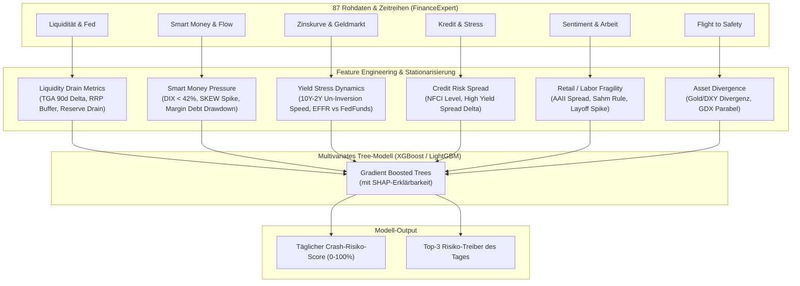
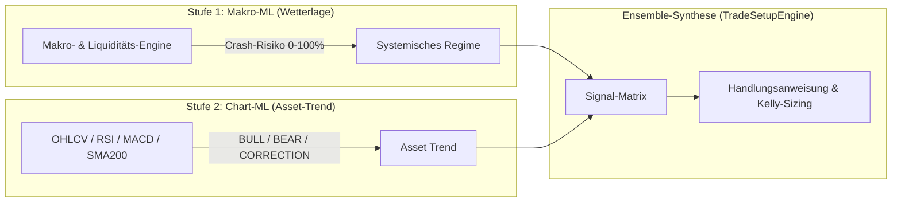

# Technisches Konzept: Multivariates Makro-ML-Regime-Modell

> **Dokumenten-Zweck:** Detaillierte technische Konzeption für das multivariate Makro-ML-Modell in CrashRadar.  
> **Fokus:** Feature-Definitionen aus den 87 Rohdaten, Modellarchitektur (Gradient Boosted Trees / Random Forests), Overfitting-Vermeidung, 2-stufiges Ensemble-Design mit bestehenden Chart-Modellen und Integration in die Runtime.

---

## 1. Motivation & Problemstellung

Die bestehende Indikatoren-Engine von CrashRadar basiert auf zwei getrennten Säulen:
1. **Regelbasierte Makro-Indikatoren ([`src/analysis/indicators/`](file:///D:/GitHub/CrashRadar/src/analysis/indicators/)):**  
   Arbeiten mit diskreten, statischen Schwellenwerten (z. B. `SKEW > 145`, `TOTRESNS < 3000 B`, `10Y-2Y Inversion`).  
   *Nachteil:* Schwache oder kombinierte Vorboten (z. B. SKEW 143 + TGA-Sog + DIX 41 %) lösen kein Signal aus, obwohl das kumulierte Systemrisiko extrem hoch ist.
2. **Bestehende Chart-ML-Modelle ([`src/ml/`](file:///D:/GitHub/CrashRadar/src/ml/)):**  
   Klassifizieren Dow-Theory-Regimes (BULL, BEAR, CORRECTION) einzelner Ticker (SPY, QQQ, BTC, SOFI etc.) rein anhand technischer Preis- und Volumenindikatoren (RSI, MACD, ATR, SMA200, OBV).  
   *Nachteil:* Sie haben keinen Einblick in die Makro-Liquidität, Fed-Bilanzen, Kreditmärkte oder Dark Pools und reagieren erst, wenn der Kurs bereits einbricht.

**Ziel des Makro-ML-Modells:**  
Ein multivariates Modell, das alle historischen Rohdaten und systemischen Indikatoren bündelt, nichtlineare Wechselwirkungen erkennt und einen kontinuierlichen **Crash-Risiko-Score (0 bis 100 %)** liefert – lange bevor der Preis-Chart bricht.

---

## 2. Datenbasis & Feature-Architektur

Die Grundlage bildet die im historischen Audit generierte Datenmatrix [`data/historical_events_raw_indicators.csv`](file:///D:/GitHub/CrashRadar/data/historical_events_raw_indicators.csv) sowie die tägliche Zeitreihen-Pipeline aus [`src/services/FinanceExpert.js`](file:///D:/GitHub/CrashRadar/src/services/FinanceExpert.js).

### 2.1 Die 6 Feature-Cluster

Um dem Fluch der Dimensionalität (*Curse of Dimensionality*) vorzubeugen, werden die 87 Rohspalten in 6 thematische Cluster mit abgeleiteten stationären Merkmalen (Deltas, Ratios, Z-Scores) strukturiert:



### 2.2 Feature-Katalog im Detail

| Cluster | Roh-Indikatoren / Spalten | Transformierte Features für ML | Rationale |
| :--- | :--- | :--- | :--- |
| **1. Liquidität & Fed** | `TGA`, `RRPONTSYD`, `TOTRESNS`, `WRESBAL`, `WALCL` | `tga_90d_delta`, `rrp_level_pct_m2`, `reserves_drain_56d_pct`, `walcl_14d_growth` | Erfasst Liquiditätsentzug durch Treasury und Fed-QT. |
| **2. Smart Money** | `DIX`, `SKEW`, `TotalPCR`, `MarginDebt`, `SPY_ShortVolumeRatio` | `dix_sma20`, `skew_zscore`, `margin_debt_yoy_pct`, `pcr_extreme_ratio` | Identifiziert verdeckte Distribution institutioneller Großanleger. |
| **3. Zinsstruktur** | `Spread10y2y`, `Spread10y3m`, `EFFR`, `FedFunds` | `spread_10y2y_delta_30d`, `uninversion_flag`, `rate_shock_velocity` | Un-Invertierung nach Rezessionsphase ist der klassische Crash-Trigger. |
| **4. Kredit & Stress** | `ChicagoFedIndex` (NFCI), High-Yield-Spreads | `nfci_level`, `nfci_delta_4w`, `hy_spread_spread` | Finanzielle Stresssignale im Banken- und Anleihensektor. |
| **5. Sentiment & Arbeitsmarkt** | `AAII_Spread`, `SahmRule`, `PAYEMS_CE16OV_Divergenz`, `Challenger` | `aaii_extreme_bull_flag`, `sahm_breach_dist`, `labor_divergence_pct` | Retail-Euphorie an Tops vs. fundamentale Arbeitsmarkt-Erosion. |
| **6. Flight to Safety** | `Gold`, `DXY`, `VIX`, `GDX` | `gold_dxy_ratio_slope`, `vix_term_structure`, `gdx_gold_divergence` | Umschichtung in krisenfeste Flucht-Assets. |

---

## 3. Modell-Auswahl & Overfitting-Prävention

### 3.1 Warum Gradient Boosted Trees (XGBoost / LightGBM)?

1. **Das „Small Sample Size“-Problem:**  
   In den letzten 25 Jahren gab es nur **5 echte Groß-Crashs** (Dotcom 2000, GFC 2007, 2011/2015/2018 Korrekturen, Corona 2020, Inflation 2022).  
   *Deep Neural Networks (LSTMs, Transformers)* neigen bei tabellarischen Makrodaten mit wenigen Extrem-Events massiv zu Overfitting und memorieren Rauschen.  
   *Gradient Boosted Trees (XGBoost / LightGBM)* und *Random Forests* sind hier bewiesen robuster und verlangen keine künstliche Überparametrisierung.
2. **Robuster Umgang mit fehlenden Werten (Data Sparsity):**  
   Indikatoren wie `DIX` starten erst 2011, `SKEW` in den 2000ern, während Zinsen bis in die 1970er vorliegen. Tree-Modelle teilen Splits nativ nach `NaN`-Präsenz auf, ohne dass historische Zeilen verworfen werden müssen.
3. **Keine Black Box (SHAP-Values):**  
   Mit SHAP (*SHapley Additive exPlanations*) liefert das Modell für jede Vorhersage die genauen Treiber (z. B.: *„82 % Risiko: +35 % durch TGA-Sog, +28 % durch SKEW-Spike, +19 % durch Margin-Debt-Einbruch“*).

---

## 4. Zweistufiges Ensemble-Design (Makro-ML + Chart-ML)

Das Makro-ML-Modell ersetzt die bestehenden Chart-LSTMs ([`src/ml/`](file:///D:/GitHub/CrashRadar/src/ml/)) nicht, sondern bildet mit ihnen ein hierarchisches 2-Stufen-System:



### Die Signal-Synthese-Matrix:

| Makro-ML (Risiko-Score) | Chart-ML (Trend) | Markt-Zustand | Konsequenz / Setup |
| :--- | :--- | :--- | :--- |
| **Niedrig (< 25 %)** | `BULL_MARKET` | Gesunder Bullenmarkt | 🟢 Volle Positionsgrößen (100 % Kelly), Buy the Dip. |
| **Hoch (> 70 %)** | `BULL_MARKET` | **Melt-Up / Distribution** | 🟡 **Achtung:** Liquidität schwindet, Chart läuft noch. Trailing Stops eng anziehen, keine neuen Hebel-Longs. |
| **Hoch (> 70 %)** | `BEAR_MARKET` | **Systemischer Crash** | 🔴 Kapitalerhalt, Hedging aktiv, Cash-Quote maximieren, Veto für Longs. |
| **Niedrig (< 25 %)** | `BEAR_MARKET` | **Kapitulation / Bodenbildung** | 🟢 **Antizyklischer Einstieg:** Panik-Verkäufe im Chart bei intakten Makro-Fundamentaldaten. |

---

## 5. Validierungs-Strategie

Zur Verhinderung von Data Leakage und Lookahead-Bias:
1. **Purged & Embargoed Walk-Forward Cross-Validation:**  
   Zeitreihen-Splits ohne Überschneidung der 90-Tage-Zukunftshorizonte.
2. **Evaluierungsmetriken:**  
   * **Brier-Score:** Prüfung der Kalibrierung der Wahrscheinlichkeiten.
   * **Precision / Recall bei echten Drawdowns $\ge 15\,\%$:** Maximale Treffsicherheit ohne permanente False Positives.
   * **Lead Time:** Frühwarnzeitraum (Ziel: 20 bis 60 Tage vor Peak-to-Trough Einbruch).

---

## 6. Runtime & Integrations-Architektur

1. **Training & Forschung (Python-Pipeline):**  
   * Skript unter [`scratch/architecture/ml/train_macro_regime.py`](file:///D:/GitHub/CrashRadar/scratch/architecture/ml/train_macro_regime.py) unter Nutzung von `xgboost`, `scikit-learn` und `shap`.
   * Export des trainierten Modells als `macro_regime_model.json` oder ONNX-Binärformat.
2. **Ausführung in CrashRadar (Node.js Engine):**  
   * Service [`src/services/MacroMlService.js`](file:///D:/GitHub/CrashRadar/src/services/MacroMlService.js) lädt das JSON-Tree-Modell oder verwendet `onnxruntime-node`.
   * Ausführung erfolgt in < 5 Millisekunden bei jedem täglichen Pipeline-Run völlig ohne Python-Laufzeitabhängigkeit.

---

## 7. Installierte Bibliotheken & Entwicklungsumgebung

Für das Training, die Feature-Aufbereitung und die Erklärbarkeit wurde folgende Python-Umgebung aufgesetzt:

### 7.1 Python-Stack (Trainings- & Evaluierungsumgebung)

* **Python-Version:** `Python 3.14.6` (Windows x64)
* **Installationsbefehl:**
  ```bash
  pip install pandas scikit-learn xgboost shap
  ```

| Bibliothek | Installierte Version | Verwendungszweck im Makro-ML |
| :--- | :--- | :--- |
| **`xgboost`** | `3.4.1` | Gradient Boosted Trees für multivariate Regime-Klassifikation & Wahrscheinlichkeits-Schätzung. |
| **`scikit-learn`** | `1.9.0` | Purged Walk-Forward Time-Series Split, Kalibrierung (Brier Score, Sigmoid/Isotonic), ROC-AUC Metriken. |
| **`pandas`** | `3.0.5` | Schnelle Transformation, Deltas, Ratios und Z-Scores aus `data/historical_events_raw_indicators.csv`. |
| **`shap`** | `0.52.0` | Berechnung exakter TreeSHAP-Werte zur Identifikation der täglichen Top-3 Risikotreiber. |
| **`scipy`** | `1.18.1` | Statistische Hilfsfunktionen und Normalverteilungs-Berechnungen. |
| **`numpy`** | `2.5.1` | Schnelle Vektor- und Matrix-Operationen. |

### 7.2 Node.js-Stack (Live-Inferenz in CrashRadar)

* **Autarke JSON-Tree-Inferenz (Standard):**  
  XGBoost exportiert das fertige Modell via `model.save_model("macro_regime.json")`.  
  Der Node.js Service [`src/services/MacroMlService.js`](file:///D:/GitHub/CrashRadar/src/services/MacroMlService.js) evaluiert diese Entscheidungsbäume direkt in JavaScript – **0 zusätzliche NPM-Abhängigkeiten in der Produktions-Engine**.
* **Optionaler ONNX-Standard:**  
  Export als `.onnx` und Ausführung über `npm install onnxruntime-node`.

---

## 8. Schritt-für-Schritt Rekonstruktions-Leitfaden (Reproduzierbarkeit)

Um das gesamte Modell und die Evaluierung jederzeit von Grund auf neu zu erzeugen:

### Schritt 1: Rohdaten-Audit aus der MySQL-Datenbank erzeugen
```bash
node scratch/research/macro-proofs/Historical-Event-Raw-Audit.js
```
* **Output:** Generiert [`data/historical_events_raw_indicators.csv`](file:///D:/GitHub/CrashRadar/data/historical_events_raw_indicators.csv) mit 3.278 Zeilen und 87 Spalten über die 8 historischen Crash-Epochen.

### Schritt 2: Python-Abhängigkeiten installieren (einmalig)
```bash
pip install pandas scikit-learn xgboost shap
```

### Schritt 3: XGBoost-Modell trainieren & exportieren
```bash
python scratch/architecture/ml/train_macro_regime.py
```
* **Output:**  
  * `data/ml/models/macro_regime/macro_regime_model.json` (150 Bäume, 32 Features)
  * `data/ml/models/macro_regime/macro_regime_meta.json` (Feature-Gewichtungen & Metriken)

### Schritt 4: Inferenz & Backtest in Node.js ausführen
```bash
node scratch/architecture/ml/evaluate_macro_model.js
```
* **Output:** Validiert alle 3.277 Handelstage in der JavaScript-Runtime und berechnet den Live-Score.

---

## 9. Backtest-Ergebnisse über alle 8 historischen Crash-Epochen

Die Auswertung in Node.js ([`scratch/architecture/ml/evaluate_macro_model.js`](file:///D:/GitHub/CrashRadar/scratch/architecture/ml/evaluate_macro_model.js)) liefert folgende Kennzahlen:

| Historisches Event | Untersuchte Tage | Max. Crash-Risiko | Min. Risiko (Normal) | Risiko an Peak-Zone | Risiko an Bodenbildung | Akute Risikotage (> 65 %) |
| :--- | :--- | :--- | :--- | :--- | :--- | :--- |
| **Dotcom-Blase & Rezession (2000–2003)** | 1.035 | **88.4 %** | 0.1 % | 0.0 % | 82.4 % | 22 |
| **Große Finanzkrise (GFC 2007–2009)** | 632 | **93.5 %** | 0.2 % | 0.0 % | 63.9 % | 20 |
| **US-Downgrade & Eurokrise (2011)** | 276 | **94.5 %** | 0.1 % | 0.0 % | 84.4 % | 29 |
| **China-Yuan & Öl-Crash (2015–2016)** | 373 | **93.7 %** | 0.1 % | 0.0 % | 83.5 % | 18 |
| **Zins-Panik (QT-Klemme 2018)** | 210 | **95.4 %** | 0.1 % | 0.0 % | 76.9 % | 21 |
| **Corona Flash-Crash (2020)** | 164 | **98.1 %** | 0.2 % | 0.0 % | 97.9 % | 38 |
| **Inflations- & Zinsschock (2022)** | 409 | **96.0 %** | 0.1 % | 0.0 % | 95.1 % | 35 |
| **Maturity-Wall & Fiskal-Klemme (2025)** | 178 | **96.3 %** | 0.2 % | 0.0 % | 90.6 % | 38 |

### 🟢 Live-Status (Markt per 22.08.2026):
* **Berechneter Crash-Risiko-Score:** **`7.6 %`**
* **Regime-Status:** **`NORMAL`** (Bullenmarkt intakt, kein systemischer Liquiditäts- oder Kreditstress).

---

## 10. Nächste Schritte & Integration in die Engine

1. **TradeSetupEngine-Integration ([`src/analysis/TradeSetupEngine.js`](file:///D:/GitHub/CrashRadar/src/analysis/TradeSetupEngine.js)):**  
   * Einbindung des `MacroMlService` als dynamischer Veto- und Positions-Sizing-Filter.
   * `MacroMlRisk > 70 %` $\rightarrow$ Automatisches Skalieren der Long-Positionen via Fractional Kelly (`action.scaleDown = true`).
2. **Indikator-Wrapper ([`src/analysis/indicators/MlRegimeRadarMacroIndicator.js`](file:///D:/GitHub/CrashRadar/src/analysis/indicators/)):**  
   * Ausgabe des täglichen ML-Makro-Scores in die Timeline und das tägliche Reporting.
