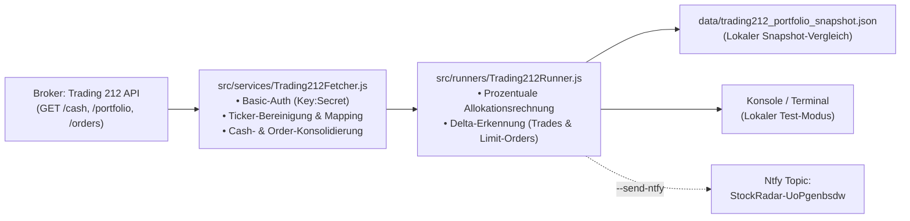

# Trading 212 Portfolio-Broadcast (Read-Only & Prozentual)

## 1. Architektur & Zielsetzung

Dieses Modul stellt die vollautomatisierte, datenbankfreie Überwachung und prozentuale Veröffentlichung des realen **Trading 212** Broker-Portfolios bereit:

* 🎯 **Zweck:** Bereitstellung eines tagesaktuellen Portfolio-Updates nach US-Börsenschluss für interessierte Beobachter.
* 🛡️ **Privatsphären-Garantie (Zero Absolute Leakage):**  
  Es werden **niemals** absolute Euro- oder Dollarbeträge, Gesamtkontowerte oder nominale Gewinne übertragen oder im Broadcast-Report angezeigt. Sämtliche Angaben erfolgen ausschließlich als **relative Allokation in %** und **prozentualer Buchgewinn/Verlust (PnL %)**.
* 📡 **Lieferkanal:** Read-Only Ntfy-Topic `StockRadar-UoPgenbsdw`.
* 💾 **Speicher-Architektur:** Rein lokaler JSON-Storage unter [`data/trading212_portfolio_snapshot.json`](file:///D:/GitHub/CrashRadar/data/trading212_portfolio_snapshot.json) – kein SQL- oder Fetcher-Overhead.

---

## 2. Komponenten-Übersicht



1. **[`Trading212Fetcher.js`](file:///D:/GitHub/CrashRadar/src/services/Trading212Fetcher.js):**
   * Kommuniziert direkt mit `https://live.trading212.com/api/v0`.
   * **Authentifizierung:** Unterstützt API-Key sowie Basic-Auth (`Basic Base64(Key:Secret)`), wenn `TRADING212_API_SECRET` in der `.env` hinterlegt ist.
   * **Ganzheitliche Cash-Konsolidierung (`CASH`):**
     Trading 212 führt das Gesamtkonto in der Basiswährung (`EUR`). Alle Formen liquider Mittel werden unter **`CASH`** subsumiert:
     1. `free`: Freies, ungebundenes Bar-Geld (EUR + USD zum EZB-Livekurs).
     2. `blocked`: Durch offene Limit-Kaufaufträge reserviertes Bar-Kapital.
     3. **Geldmarktfonds-Äquivalente (`IB01`, `XEON`, `ERND`):**  
        Wird der iShares $ Treasury Bond 0-1yr ETF (`IB01` / `IB01l_EQ`) zum zinsbringenden Parken von USD gehalten, wird er **nicht** als Risiko-Aktie in der Allokation gelistet, sondern zu 100 % dem **`CASH`** zugerechnet.
     * `totalCash` = `free + blocked + IB01`.
   * **Offene Limit-Orders ([`GET /equity/orders`](file:///D:/GitHub/CrashRadar/src/services/Trading212Fetcher.js)):** Holt alle aktiven Limit- und Stop-Aufträge ab, normalisiert die Ticker und berechnet die relative Ziel-Allokation (`targetWeightPct`) im Verhältnis zum Depotwert.
   * **Ticker-Normalisierung:** Bereinigt Suffixe (`_US_EQ`, `_EQ`, `l_EQ`) und übersetzt Trading-212-spezifische Legacy-/SPAC-Kürzel automatisch:
     * `CTL` $\rightarrow$ `LUMN` (Lumen Technologies)
     * `LOKB` $\rightarrow$ `NVTS` (Navitas Semiconductor)
     * `EJFA` $\rightarrow$ `PGY` (Pagaya Technologies)
     * `NK` $\rightarrow$ `IBRX` (ImmunityBio)
     * `CNDX` $\rightarrow$ `CDNX` (Nasdaq 100 ETF)
     * `SEMI` $\rightarrow$ `SEMI` (VanEck Semiconductor ETF)
     * `IB01l` $\rightarrow$ `IB01` (iShares $ Treasury Bond 0-1yr UCITS ETF)
2. **[`Trading212Runner.js`](file:///D:/GitHub/CrashRadar/src/runners/Trading212Runner.js):**
   * Lädt den vorherigen Stand aus `data/trading212_portfolio_snapshot.json`.
   * **Delta-Detektor:** Erkennt automatisch:
     * 🟢 **Neukauf:** Neuer Ticker im Depot (+X % Allokation).
     * 🔴 **Verkauf:** Ticker nicht mehr im Depot (vollständig liquidiert).
     * 🔼 **Aufstockung / 🔽 Teilverkauf:** Stückzahl geändert (von X % auf Y %).
     * 📝 **Limit-Order erstellt:** Neue Limit-Order platziert.
     * 🎯 **Order ausgeführt:** Limit-Order wurde im Markt gematcht (Position ist gestiegen).
     * ❌ **Order gelöscht:** Limit-Order wurde ohne Ausführung storniert.
     * ℹ️ **HODL-Status:** Keine Transaktionen seit dem letzten Lauf.
   * **Dry-Run-Sicherheit:** Sendet standardmäßig **nicht** an Ntfy, sondern gibt den formatierten Bericht lokal im Terminal aus.
3. **CLI-Schnittstelle ([`index.js`](file:///D:/GitHub/CrashRadar/index.js)):**
   * `--t212-sync`: Führt den Abgleich und Snapshot-Vergleich aus.
   * `--send-ntfy`: Schaltet den Ntfy-Versand scharf.

---

## 3. Konfiguration (`.env`)

```bash
# Trading 212 Portfolio API
TRADING212_API_KEY=dein_api_key
TRADING212_API_SECRET=dein_api_secret
TRADING212_API_URL=https://live.trading212.com/api/v0
NTFY_PORTFOLIO_TOPIC=StockRadar-UoPgenbsdw
```

---

## 4. Ausführung & Beispiele

### A. Lokaler Testlauf (Terminal-Ausgabe, Ntfy bleibt stumm)
```bash
node index.js --t212-sync
```

### B. Wöchentlicher Report (Freitags nach Börsenschluss)
```bash
node index.js --t212-sync --mode weekly --send-ntfy
```

### C. Trades & Ausführungs-Monitor (3x täglich Mo–Fr)
```bash
# Bleibt komplett stumm, falls keine Trades/Orders stattfanden; sendet Alert bei Änderungen
node index.js --t212-sync --mode trades --send-ntfy
```

### D. Beispiel-Ausgabe 1: Wöchentlicher Portfolio-Report (`mode: weekly`)
```text
📊 **Kamikaze Portfolio Update** (13.09.2026)
----------------------------------------
💵 **Cash-Quote:** 10.9 % (Bar: 5.4 %, In Limit-Orders: 5.5 %)
📈 **Investiert:** 89.1 % (8 Positionen)
🚀 **Gesamtrendite:** +185.6 % (Offen: +5.8 %)

⏳ **Offene Limit-Orders (3):**
• **NVTS:** 100 Stk. @ 9.91 USD (~0.9 % Ziel-Allokation)
• **PGY:** 50 Stk. @ 19.80 USD (~0.9 % Ziel-Allokation)
• **S:** 200 Stk. @ 18.80 USD (~3.6 % Ziel-Allokation)

📊 **Allokation & Performance:**
```
AIRO   17.9 % [██████████░]  +12.0%
LUMN   16.8 % [█████████░░]  +13.7%
IBRX   14.3 % [████████░░░]   +8.3%
SEMI   12.7 % [███████░░░░]   +4.6%
CDNX   12.2 % [███████░░░░]   +2.4%
CASH   10.9 % [██████░░░░░]      --
PGY     8.4 % [█████░░░░░░]   -6.4%
S       3.6 % [██░░░░░░░░░]   +0.7%
NVTS    3.4 % [██░░░░░░░░░]  +17.5%
```
```

### E. Beispiel-Ausgabe 2: Kumulierter Transaktions-Alert (`mode: trades`)
```text
🔔 **Kamikaze Transaktions-Alert** (13.09.2026, 11:58)
----------------------------------------
🎯 **ORDER AUSGEFÜHRT:** S (200 Stk. @ 18.80 USD)
🟢 **NEUKAUF:** PLTR (+4.5 % Allokation, 50 Stk.)
🔽 **TEILVERKAUF:** AIRO (17.9 % ➔ 13.8 %, -600 Stk.)
🔼 **AUFSTOCKUNG:** S (3.6 % ➔ 7.2 %, +200 Stk.)
📝 **LIMIT-ORDER ERSTELLT:** NVTS (150 Stk. @ 10.50 USD)
❌ **ORDER GELÖSCHT:** PGY (50 Stk. @ 19.80 USD)

💵 **Aktuelle Cash-Quote:** 9.2 % (-1.7 %)
```

---

## 5. GitHub Actions Automatisierung

Die Datei [`.github/workflows/trading212-portfolio.yml`](file:///.github/workflows/trading212-portfolio.yml) steuert die zeitgesteuerte Ausführung auf GitHub:
* **Trades-Monitor:** Läuft Mo–Fr um 12:00, 18:00 und 22:00 Uhr MEZ (`mode: trades`). Bleibt stumm, wenn keine Transaktionen vorliegen.
* **Wöchentlicher Report:** Läuft jeden Freitag um 22:15 Uhr MEZ (`mode: weekly`) nach US-Börsenschluss.
* **Snapshot Persistenz:** Speichert und committet `data/trading212_portfolio_snapshot.json` automatisch zurück ins Repository.

