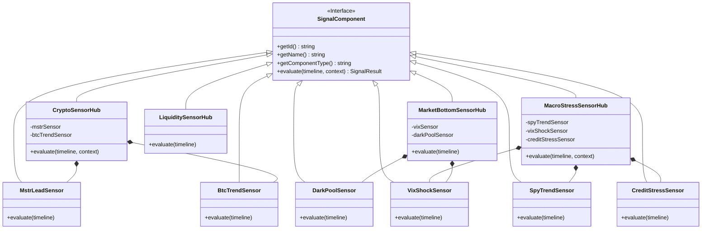

# Architektur: Composite-SensorHub & SignalEngine (V2.3)

> 🏛️ **Architektur-Grundsatz:**  
> *"Der Hub beschreibt das Wetter – die Strategie entscheidet, welche Jacke sie anzieht!"*

Dieses Dokument spezifiziert das **Composite-Pattern** für die SignalEngine in CrashRadar. Es löst das historische Problem monolithischer, bevormundender Indikatoren ab und trennt strikt zwischen:
1. **Atomaren Messfühlern (Leafs / Sensoren):** Messen genau eine physikalische Marktrelation.
2. **Aggregierenden Sensor-Hubs (Composites):** Betreiben Sensor-Fusion und emittieren rein deskriptive Markt-Regimes.
3. **Portfoliostrategien (Clients / Konsumenten):** Treffen Allokations-Entscheidungen autonom auf Basis der gemeldeten Marktphasen.

---

## 1. Das Composite-Muster im Detail



---

## 2. Standardisiertes Signal-Schema

Jeder Sensor und Sensor-Hub liefert das standardisierte `SignalResult`:

```typescript
interface SignalResult {
  status: 'OK' | 'WARNING' | 'CRITICAL' | 'UNKNOWN'; // Universelle technische Ampel
  regime: string;                                    // Domänenspezifisches Zustands-Enum
  message: string;                                   // Klartext-Begründung
  diagnostics?: Record<string, any>;                 // Rohwerte für Logs/D1 (Strategien greifen NICHT darauf zu)
}
```

---

## 3. Die 4 Sensor-Hubs & ihre deskriptiven Regimes

### A. Krypto-Hub (`CryptoSensorHub`)
* **Aufgabe:** Sensor-Fusion aus MicroStrategy-Liquiditätsvorlauf (`MstrLeadSensor`) und Bitcoin 21W-EMA Trend (`BtcTrendSensor`).
* **Deskriptive Regimes:**
  * `BULL_EXPANSION`: MSTR und BTC beide stabil über ihren Trendlinien.
  * `BULL_WARNING`: Erste Divergenz / MSTR unter SMA-200.
  * `BULL_CRITICAL`: Akuter Top-Alarm! MSTR verliert heute die 200-Tage-Linie.
  * `BEAR_REGIME`: Krypto-Winter (MSTR und BTC beide unter Trendlinie).
  * `CYCLE_BOTTOM_CLOSE`: Panik-Kapitulation / Generations-Boden erkannt.

### B. Makro-Stress & Crash-Hub (`MacroStressSensorHub`)
* **Aufgabe:** Aggregiert Trendbruch (SPY vs. SMA-200 & DD >= 8%) mit den 3 Makro-Säulen (VIX, Credit Spread, Net Liquidity) und überwacht die Margin-Call-Zone.
* **Deskriptive Regimes (Keine Trade-Befehle!):**
  * `NORMAL_EXPANSION`: Makro-Klima und Aktienmarkt-Trend intakt.
  * `SYSTEMIC_STRESS`: Katastrophen-Matrix schlägt an (Trendbruch + Makro-Pfeiler ROT).
  * `LIQUIDATION_CASCADE`: SPY Drawdown erreicht -18% bis -20% (akute Zwangsliquidierungen rollen).
  * `PANIC_CAPITULATION`: Panik-Boden erreicht, Verkäufer-Erschöpfung.

### C. Geldmarkt- & Liquiditäts-Hub (`LiquiditySensorHub`)
* **Aufgabe:** Überwachung von Bank-Reserven (WRESBAL), Reverse Repo (RRP), TGA-Konto und Netto-Auktionen.
* **Ergebnis & Zeitprognose:**
  * `EXPANSION`: Puffer ausreichend, Slack gesund.
  * `DRAIN_WARNING`: TGA-Refill-Defizit oder schrumpfende Puffer.
  * `CRITICAL_DRAIN`: Akute Liquiditätsverknappung droht den Markt abzuwürgen.
  * **Erhalt der Zeitprognose:** Behält `ttcDays` (Time-to-Collision) und `projectedCollision` (z. B. *"In ca. X Tagen"*) vollständig bei!

### D. Markt-Boden & Kapitulations-Hub (`MarketBottomSensorHub`)
* **Aufgabe:** Robuste Erkennung von Crash-Tiefpunkten anhand von Options-Panik (`VixShockSensor`) und Wal-Akkumulation (`DarkPoolSensor`).
* **Härtung gegen falsche RSI-Böden:** Verlässt sich nicht auf instabile RSI-Divergenzen in Wasserfall-Crashs.
* **Deskriptive Regimes:**
  * `NONE`: Normaler Markt.
  * `BOTTOM_FORMING`: VIX >= 35 oder Dark Pool DIX >= 45%.
  * `CAPITULATION_CONFIRMED`: Panik-Climax trifft auf aggressive Wal-Akkumulation (DIX >= 48%).

---

## 4. Wie Strategien die Signale konsumieren

Strategien kennen weder MSTR-Preise noch VIX-Schwellen. Sie fragen ausschließlich:

```javascript
const { macroStressHub, cryptoHub } = context.macroSignalContext;

// 1. Notfall-Schutzhafen (z. B. SatelliteStrategy oder GoldSpy)
if (macroStressHub.regime === 'SYSTEMIC_STRESS') {
  // Strategie evakuiert in Schutzhafen (z. B. 50/50 oder 75/25 Gold/Cash)
} else if (macroStressHub.regime === 'LIQUIDATION_CASCADE') {
  // Gold-SPY sichert Goldgewinne vor Margin-Calls (100% Cash)
}

// 2. Krypto-Satellite (5% BTC Slot)
if (cryptoHub.regime === 'BULL_CRITICAL') {
  // Krypto-Alarm: Stop-Loss eng nachziehen oder Gewinne sichern
} else if (cryptoHub.regime === 'BULL_EXPANSION') {
  // Normaler HODL-Betrieb
}
```

---

## 5. Zero-Leakage Garantie & Striktes State-Tracking

1. **Keine Indikator-Leaks (`Zero Leaking Rule`):**  
   Im `macroSignalContext` werden keinerlei rohe Indikatoren (`katastrophenMatrix`, `mstrRadar`, `goldSniper`, `treasuryCapacity`), keine Einzel-Indikator-Preise oder Zwischenwerte an die Strategien weitergereicht.
2. **Eigenverantwortliche State Machines:**  
   Jede Strategie (`SatelliteStrategy`, `GoldSpyDcaStrategy`, etc.) führt ihren eigenen internen Zustand (`NORMAL_HODL`, `EMERGENCY_SHIELD`, `RE_ENTRY_RESET`, `trancheLevel`) und reagiert rein auf die deskriptiven Regimes der 4 Hubs.
3. **100% Empirische Äquivalenz:**  
   Im historischen 21,8-Jahre-Stresstest über 7.992 Handelstage (2004–2026) erzeugt das `MacroStressSensorHub` exakt dieselben 2.061 Katastrophen-Alarmtage wie die Vorgänger-Logik (100,00 % Signaldeckung, 0 Mismatches).

