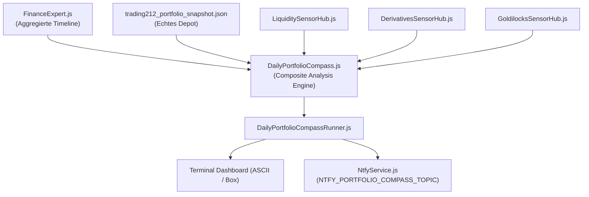

# DailyPortfolioCompass: Taktischer Portfolio- & Timing-Lotse

## 1. Überblick & System-Rolle

Der [`DailyPortfolioCompass`](file:///D:/GitHub/CrashRadar/src/analysis/DailyPortfolioCompass.js) dient als **täglicher kognitiver Lotse und Entscheidungs-Support** für den Investor.

Seine Aufgabe ist **ausdrücklich nicht**, als unfehlbare Kristallkugel Marktböden oder Wendepunkte vorherzusagen, sondern das tägliche Handeln an den realen Makro- und Derivate-Kräften auszurichten:
1. **Soll ich Gewinne mitnehmen?**  
   Prüft laufende Buchgewinne (z. B. AIRO, LUMN, NVTS $> 12\%$) auf Gelegenheiten zur Gewinnsicherung in den USD-Treasury-Cash-Puffer (`IB01`), bevor das Kollisionsfenster zuschlägt.
2. **Soll ich mit Nachkäufen noch 2–4 Tage warten, weil noch geschüttelt wird?**  
   Erkennt systematische Stop-Fishing- und Gamma-Pinning-Phasen vor Monats-OpEx und dem großen Hexensabbat (Quadruple Witching).
3. **Hard Exit Deadline beachten:**  
   Erinnert permanent an die äußere Haltemarke für risikobehaftete Positionen (**26. Oktober 2026**) vor dem Post-Election QRA/TGA-Liquiditätsentzug.

---

## 2. Die 3-stufige Synthese-Matrix

Der Kompass aggregiert die drei spezialisierten Sensor-Hubs ([`LiquiditySensorHub`](file:///D:/GitHub/CrashRadar/src/signals/hubs/LiquiditySensorHub.js), [`DerivativesSensorHub`](file:///D:/GitHub/CrashRadar/src/signals/hubs/DerivativesSensorHub.js), [`GoldilocksSensorHub`](file:///D:/GitHub/CrashRadar/src/signals/hubs/GoldilocksSensorHub.js)) in ein priorisiertes 3-Stufen-Entscheidungsmodell:

| Stufe | Kompass-Zustand | Kriterium | Signal | Taktische Leitlinie |
| :--- | :--- | :--- | :--- | :--- |
| **1. Not-Alarm** | **`HALT_STOPP`** | Toxische Falle (`DualStress >= 55 && VIX > 25`) ODER `TTC < 30d` Geldmarkt-Kollision | `CRITICAL` 🔴 | **„Don't do it! Hände weg!“** Zwangsausverkäufe rollen. Absolutes Kaufverbot für fallende Kurse. Buchgewinne sichern oder Not-Exit in `IB01`. |
| **2A. Zyklus-Druck** | **`SHAKEOUT`** | $\le 5$ Tage bis OpEx / Hexensabbat mit erhöhtem VIX, Gamma-Pinning oder Short-Squeeze-Spannung | `WARNING` 🟡 | **„Ausschütteln läuft – Füße stillhalten!“** Market Maker drücken Kurse an Max-Pain-Strikes. Nicht voreilig verbilligen; in 2–4 Tagen gibt es günstigere Kurse. |
| **2B. Wachsamkeit** | **`CAUTION_DRIFT`** | SPY unter SMA 200, Stagflationsdruck oder Puffer-Phase mit Zinsanstieg | `WARNING` 🟡 | **„Wachsame Gelassenheit“** Kein Systemcrash, aber Rebounds nur mit halber Positionsgröße und striktem Trailing-Stop traden. |
| **3. Rückenwind** | **`SUNSHINE`** | Liquidität stabil/gepuffert, keine Verfallswochen-Kompression, Trend intakt | `OK` 🟢 | **„Sonnenschein (Buy the Dip)“** Rücksetzer sind normale Konsolidierungen. Gezieltes Dip-Buying mit Einstiegs-Sniper statistisch begünstigt. |

---

## 3. Direkte Depot-Verknüpfung (Trading212)

Der Kompass liest automatisch das aktuelle Portfolio (`data/trading212_portfolio_snapshot.json`) ein und weist jeder Position eine situative Handlungsanweisung zu:

| Action-Label | Bedingung | Taktische Begründung |
| :--- | :--- | :--- |
| 🟠 **`TEILGEWINNE PRÜFEN`** | $\text{PnL} \ge +12.0\%$ | Hoher aufgelaufener Buchgewinn; vor dem Kollisionsfenster Teilverkäufe in `IB01` erwägen. |
| 🟡 **`FÜSSE STILLHALTEN`** | Kompass im `SHAKEOUT` & $\text{PnL} < 0\%$ | Verfallswochen-Ausschütteln läuft; nicht ins fallende Messer verbilligen. |
| 🔴 **`NOT-EXIT / ABSICHERN`** | Kompass im `HALT_STOPP` | Akuter Makro-Crash droht; Position rigoros absichern oder liquidieren. |
| 🟢 **`DIP-BUYING ERLAUBT`** | Kompass im `SUNSHINE`, Depot-Gewicht $< 5\%$ | Solide Position mit Raum zur Aufstockung bei bestätigtem Einstiegs-Signal. |
| 🟢 **`HALTEN & TRAILEN`** | Alle übrigen Fälle | Position befindet sich im gesunden Trend und wird eng abgesichert gehalten. |

---

## 4. Architektur & Datenfluss



* **Core Domain:** [`src/analysis/DailyPortfolioCompass.js`](file:///D:/GitHub/CrashRadar/src/analysis/DailyPortfolioCompass.js) (implementiert `SignalComponent`).
* **Executable Runner:** [`src/runners/DailyPortfolioCompassRunner.js`](file:///D:/GitHub/CrashRadar/src/runners/DailyPortfolioCompassRunner.js).
* **Ntfy-Push-Kanal:** Konfiguriert über `NTFY_PORTFOLIO_COMPASS_TOPIC` in `.env`.

---

## 5. Bedienung & CLI-Nutzung

Der Kompass kann jederzeit über NPM oder Node aufgerufen werden:

```bash
# Standard-Ausführung mit neuester verknüpfter Historie und aktuellem Depot
npm run compass

# Gezielte historische Analyse eines bestimmten Datums (z. B. Vor-Hexensabbat)
node src/runners/DailyPortfolioCompassRunner.js --date=2026-09-14

# Mit scharfem Push-Alert auf das Smartphone via Ntfy
node src/runners/DailyPortfolioCompassRunner.js --notify
```

---

## 6. Verifikation & Tests

* Unit-Tests der Kompass-Logik: [`tests/signals/DailyPortfolioCompass.test.js`](file:///D:/GitHub/CrashRadar/tests/signals/DailyPortfolioCompass.test.js) (4 Tests, 100% grün).
* Unit-Tests des Runners & Ntfy: [`tests/runners/DailyPortfolioCompassRunner.test.js`](file:///D:/GitHub/CrashRadar/tests/runners/DailyPortfolioCompassRunner.test.js) (3 Tests, 100% grün).
