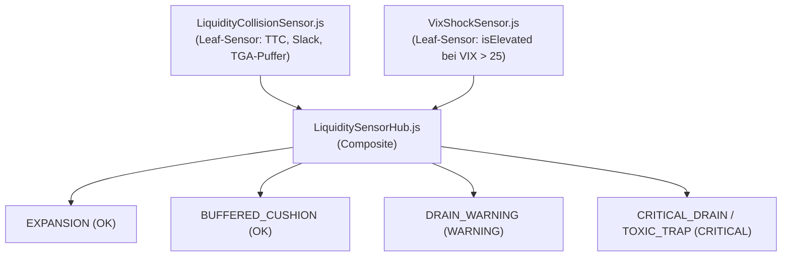

# LiquiditySensorHub: Spezifikation der 4-Regime-Geldmarkt-Architektur

## 1. Überblick & System-Rolle

Der [`LiquiditySensorHub`](file:///D:/GitHub/CrashRadar/src/signals/hubs/LiquiditySensorHub.js) überwacht die Liquiditäts- und Refinanzierungsmechanik des US-Geldmarkts und des Finanzministeriums (Treasury Slack & Capacity).

Er dient als **makroökonomischer Kompass & Risikomodulator** für kurzfristige Derivate- und Rebound-Zyklen ([`DerivativesSensorHub`](file:///D:/GitHub/CrashRadar/src/signals/hubs/DerivativesSensorHub.js)). Seine Aufgabe ist es **nicht**, als blinder Ein/Aus-Schalter Trades zu vernichten, sondern zwischen harmlosen, kaufbaren Dips und echten, illiquiden Absturzfallen zu unterscheiden.

---

## 2. Die 4 Liquiditäts-Regimes

Der Hub klassifiziert den Geldmarkt in vier präzise definierte Zustände:

| Regime | Technische Bedingung | Status | Bedeutung & Handlungsempfehlung |
| :--- | :--- | :--- | :--- |
| **`EXPANSION`** | Slack $> \$500\text{B}$, TTC $> 180\text{d}$, Zinsstress niedrig | `OK` 🟢 | **Volles grünes Licht:** Geldmarkt im Überschuss. Dips vor Verfallstagen bieten maximale Rebound-Chancen. |
| **`BUFFERED_CUSHION`** | Slack $< \$50\text{B}$, aber TGA-Cushion $> \$50\text{B}$ aktiv, Buybacks $\ge \$5\text{B}$ & TTC $\ge 90\text{d}$ | `OK` 🟢 | **Puffer-Phase (Entwarnung):** RRP ist zwar leer, aber Finanzministerium puffert Auktionen ab. **Kein Sofort-Crash! Dips kaufbar.** |
| **`DRAIN_WARNING`** | Dualer Stress $\ge 55$ oder TTC $30\text{–}90\text{d}$ | `WARNING` 🟡 | **Erhöhte Wachsamkeit:** Schleichender Netto-Abzug (QT / Refill). Dips nur mit halber Positionsgröße und Trailing-Stop traden. |
| **`CRITICAL_DRAIN`** | TTC $< 30\text{d}$ ODER ungedeckter Sofort-Drain ODER Toxische Falle (`DualStress >= 55 && VIX > 25`) | `CRITICAL` 🔴 | **„Halt Stopp! Don't do it!“** Hohe Wahrscheinlichkeit einer Absturzfalle ($75\%\text{ bis }93\%$). Hände weg vom fallenden Messer! |

---

## 3. Die beiden empirisch bewiesenen Gefahren-Muster

In der 8-Jahres-Analyse (2018–2026, 422 Korrekturtage) kristallisierten sich zwei spezifische Warnmuster heraus:

### A. Die Toxische Liquiditäts-Falle (Crash-Präzision: 93.1 %)
* **Formel:** `dualMacroStress >= 55 && VIX > 25`
* **Mechanismus:** Wenn der Zins- und Geldmarkt-Stress erhöht ist **und gleichzeitig** die implizite Volatilität im Derivatemarkt über 25 ausbricht, kippt der Markt in eine Zwangsausverkaufs-Kaskade. 
* **Ergebnis:** In **93.1 %** der historischen Fälle fiel der Markt innerhalb von 20 Tagen um weitere $> 6\%$ bis $33\%$. Ein Einstieg an solchen Tagen ist toxisch.

### B. Die Geldmarkt-Kollision (Crash-Präzision: 75.3 %)
* **Formel:** `ttcDays < 30 || (catalystStatus === 'IMMINENT_DRAIN' && effectiveSlackB < 300)`
* **Mechanismus:** Die Geldmarkt-Slack-Puffer (RRP + Überschussreserven) sind in unter 30 Tagen erschöpft, während eine Welle an Staatsanleihen-Emissionen (Coupons) auf den Markt trifft (wie im Februar 2020 vor dem Corona-Crash).

---

## 4. Beteiligte Komponenten

* [`src/signals/contracts/SignalTypes.js`](file:///D:/GitHub/CrashRadar/src/signals/contracts/SignalTypes.js): `LiquidityRegime.BUFFERED_CUSHION`.
* [`src/signals/sensors/LiquidityCollisionSensor.js`](file:///D:/GitHub/CrashRadar/src/signals/sensors/LiquidityCollisionSensor.js): Berechnet atomar TTC, Puffer und Katalysatoren.
* [`src/signals/sensors/VixShockSensor.js`](file:///D:/GitHub/CrashRadar/src/signals/sensors/VixShockSensor.js): Prüft `isElevated` ($VIX \ge 25.0$).
* [`src/signals/hubs/LiquiditySensorHub.js`](file:///D:/GitHub/CrashRadar/src/signals/hubs/LiquiditySensorHub.js): Führt Geldmarkt-, Zins- und Volatilitätsmetriken zusammen.

---

## 5. Testabdeckung & Verifikation

* Leaf-Sensor-Tests: [`tests/signals/sensors/LiquidityCollisionSensor.test.js`](file:///D:/GitHub/CrashRadar/tests/signals/sensors/LiquidityCollisionSensor.test.js) (4 Tests passing).
* Hub-Tests: [`tests/signals/hubs/LiquiditySensorHub.test.js`](file:///D:/GitHub/CrashRadar/tests/signals/hubs/LiquiditySensorHub.test.js) (5 Tests passing).
* Gesamt-Stresstest über 79 OpEx-Zyklen: [`scratch/research/macro-proofs/test_derivatives_liquidity_gatekeeper.js`](file:///D:/GitHub/CrashRadar/scratch/research/macro-proofs/test_derivatives_liquidity_gatekeeper.js).
