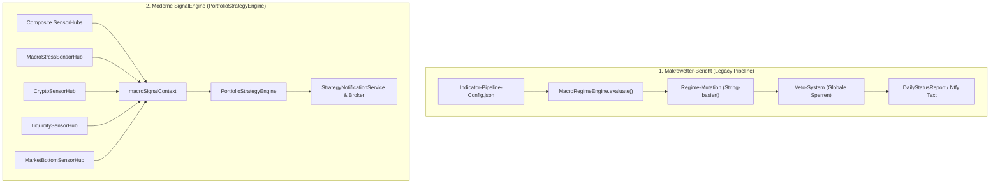

# Makrowetter-Bericht: Code-Audit & Refactoring-Fahrplan

**Status:** Umgesetzt & Verifiziert  
**Datum:** September 2026  
**Ziel:** Beseitigung monolithischer Altlasten, Eliminierung von Fehlalarmen und Angleichung an die moderne CrashRadar SignalEngine.

---

## 1. Executive Summary: Der Architektur-Split

Im Projekt CrashRadar existierten historisch zwei parallele Welten:

1. **Die moderne SignalEngine ([`src/strategies/PortfolioStrategyEngine.js`](file:///D:/GitHub/CrashRadar/src/strategies/PortfolioStrategyEngine.js)):**  
   Arbeitet mit sauberen, atomaren Sensoren und Composite Sensor-Hubs ([`MacroStressSensorHub`](file:///D:/GitHub/CrashRadar/src/signals/hubs/MacroStressSensorHub.js), [`CryptoSensorHub`](file:///D:/GitHub/CrashRadar/src/signals/hubs/CryptoSensorHub.js), [`LiquiditySensorHub`](file:///D:/GitHub/CrashRadar/src/signals/hubs/LiquiditySensorHub.js), [`MarketBottomSensorHub`](file:///D:/GitHub/CrashRadar/src/signals/hubs/MarketBottomSensorHub.js)), 15-tägiger Notfall-Hysterese und typisierten Booleans im `macroSignalContext`.
2. **Der Makrowetter-Bericht ([`src/analysis/IndicatorEngine.js`](file:///D:/GitHub/CrashRadar/src/analysis/IndicatorEngine.js), [`src/services/NotificationManager.js`](file:///D:/GitHub/CrashRadar/src/services/NotificationManager.js)):**  
   Nutzt die Pipeline-Logik aus [`config/Indicator-Pipeline-Config.json`](file:///D:/GitHub/CrashRadar/config/Indicator-Pipeline-Config.json). Hier mutierten alte, teilweise fehlerhafte Indikatoren unkoordiniert einen globalen Regime-String (`state.regime = 'BEAR_MARKET'`).

---

## 2. Identifizierte Schwachstellen & Umgesetzte Bereinigung

### 1. `MarginDebtIndicator.js` + Pipeline (Entschärft)
* **Dateien:** [`src/analysis/indicators/MarginDebtIndicator.js`](file:///D:/GitHub/CrashRadar/src/analysis/indicators/MarginDebtIndicator.js) & [`config/Indicator-Pipeline-Config.json`](file:///D:/GitHub/CrashRadar/config/Indicator-Pipeline-Config.json)
* **Problem:** Triggerte bereits bei `-2,0%` Monats-Drawdown den Status `WARNING` und schaltete sofort das Gesamtsystem auf `BEAR_MARKET` mit Veto `DELEVERAGING_ONGOING`. Harmloses statistisches Monatsrauschen stürzte das Makrowetter in Panik.
* **Lösung:** 
  * `-2%` bis `-4.9%`: Normales statistisches Monatsrauschen $\rightarrow$ `OK`.
  * Ab `-5.0%`: `WARNING` $\rightarrow$ Setzt Veto `DELEVERAGING_ONGOING`, kippt aber nicht das globale Regime.
  * Ab `-10.0%`: `CRITICAL` (Echte Liquidierungswelle) $\rightarrow$ `BEAR_MARKET`.

### 2. `SmartDumbMoneyBottomIndicator.js` (Stillgelegt)
* **Dateien:** [`src/analysis/indicators/SmartDumbMoneyBottomIndicator.js`](file:///D:/GitHub/CrashRadar/src/analysis/indicators/SmartDumbMoneyBottomIndicator.js) & [`config/Indicator-Pipeline-Config.json`](file:///D:/GitHub/CrashRadar/config/Indicator-Pipeline-Config.json)
* **Problem:** Monolithische Kopplung von wöchentlichen AAII-Lag-Umfragen mit starrem VIX > 40. Bereits im Header als `@deprecated` markiert, war aber in der Pipeline-Config noch aktiv.
* **Lösung:** In `config/Indicator-Pipeline-Config.json` auf `"enabled": false` gesetzt. Atomare Nachfolger (`DarkPoolSensor`, `VixShockSensor`) übernehmen die Erkennung.

### 3. `YieldCurveIndicator.js` (180-Tage Rezessions-Gefahrenzone)
* **Datei:** [`src/analysis/indicators/YieldCurveIndicator.js`](file:///D:/GitHub/CrashRadar/src/analysis/indicators/YieldCurveIndicator.js)
* **Problem:** Prüfte starr `past30 < 0 && current >= 0`. An Tag 31 nach der Un-Inversion sprang der Status naiv zurück auf `OK: Normale Kurve`, obwohl Rezessionen typischerweise erst 6–18 Monate *nach* der Un-Inversion ausbrechen.
* **Lösung:** 180-Tage-Gedächtnis integriert: War die Zinskurve in den letzten 180 Handelstagen invertiert und ist jetzt positiv, verbleibt sie in `WARNING: UN-INVERTING DANGER ZONE`.

### 4. `KatastrophenMatrixIndicator` in Makrowetter-Pipeline integriert
* **Datei:** [`config/Indicator-Pipeline-Config.json`](file:///D:/GitHub/CrashRadar/config/Indicator-Pipeline-Config.json)
* **Problem:** Die bewährte 3-Säulen-Katastrophen-Matrix lief in der SignalEngine, fehlte aber völlig im Makrowetter.
* **Lösung:** Als oberster Indikator (`reportOrder: 0`) in Stage `ACUTE_PANIC` eingehängt. Bei `CRITICAL` schaltet auch das Makrowetter verbindlich auf `FLASH_CRASH` mit Veto `SYSTEMIC_COLLAPSE_RISK`.

---

## 3. Zugehörige Quellcode-Receipts

* **Pipeline-Definition:** [`config/Indicator-Pipeline-Config.json`](file:///D:/GitHub/CrashRadar/config/Indicator-Pipeline-Config.json)
* **Indikatoren:**
  * [`src/analysis/indicators/MarginDebtIndicator.js`](file:///D:/GitHub/CrashRadar/src/analysis/indicators/MarginDebtIndicator.js)
  * [`src/analysis/indicators/YieldCurveIndicator.js`](file:///D:/GitHub/CrashRadar/src/analysis/indicators/YieldCurveIndicator.js)
  * [`src/analysis/indicators/KatastrophenMatrixIndicator.js`](file:///D:/GitHub/CrashRadar/src/analysis/indicators/KatastrophenMatrixIndicator.js)
  * [`src/analysis/indicators/SmartDumbMoneyBottomIndicator.js`](file:///D:/GitHub/CrashRadar/src/analysis/indicators/SmartDumbMoneyBottomIndicator.js)
* **Engines:**
  * [`src/analysis/IndicatorEngine.js`](file:///D:/GitHub/CrashRadar/src/analysis/IndicatorEngine.js)
  * [`src/analysis/MacroRegimeEngine.js`](file:///D:/GitHub/CrashRadar/src/analysis/MacroRegimeEngine.js)
  * [`src/strategies/PortfolioStrategyEngine.js`](file:///D:/GitHub/CrashRadar/src/strategies/PortfolioStrategyEngine.js)

---

## 4. Ausblick & Mittelfristige System-Evolution

1. **Integration der Öl- & Liquiditäts-Analyse (Geopolitical Oil Stress):**
   * Es besteht die konkrete Überlegung, die Erkenntnisse der empirischen Studie ([`Geopolitical-Oil-Liquidity-Stress-Study.md`](file:///D:/GitHub/CrashRadar/docs/research/macro-proofs/Geopolitical-Oil-Liquidity-Stress-Study.md)) und des [`MacroLiquiditySensorHub.js`](file:///D:/GitHub/CrashRadar/src/signals/hubs/MacroLiquiditySensorHub.js) (WTI-Spikes > 92–95 $, Stagflations-Ratio Kupfer/Öl, Frachtkosten-Margendruck `IYT` vs. `CL=F`) in die Makrowetter-Pipeline aufzunehmen.

2. **Überarbeitung der MacroRegimeEngine auf SensorHub-Basis:**
   * Langfristig wird die historische `MacroRegimeEngine` überarbeitet, um direkt auf der modernen Composite-Architektur der zustandslosen `SensorHubs` aufzusetzen und die parallelen Pipeline-Welten vollständig zu harmonisieren.
   * **Prioritäts-Klassifikation:** Dies ist architektonisch vorgemerkt, besitzt jedoch aktuell **nicht die oberste Priorität** (der operative P0-Fokus liegt verbindlich auf der Finalisierung der Portfoliostrategien und des Signal-Broadcastings).
