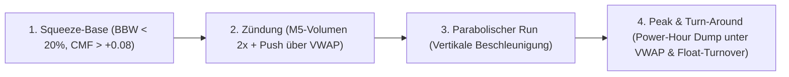
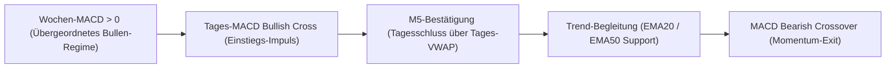

# Single-Asset Trading Framework (Regelwerk & Heuristik)

> **Master-Architektur:** Dieses Dokument ist die quantitative Regelwerk-Spezifikation innerhalb des übergeordneten Frameworks [`Single-Asset-Radar-Architecture.md`](file:///D:/GitHub/CrashRadar/docs/architecture/single-asset-radar/Single-Asset-Radar-Architecture.md). Für den technischen Datenbezug der Kerzen siehe [`M5Candels.md`](file:///D:/GitHub/CrashRadar/docs/architecture/single-asset-radar/M5Candels.md).

Dieses Dokument definiert die quantitativen Handelsregeln, Filter, Indikator-Schwellenwerte und Exit-Bedingungen für liquide Einzelwerte und ETFs. Das Framework unterscheidet strikt zwischen **explosiven Einzelaktien (Katapult-Titeln)** und **breiten Sektor-ETFs**.

---

## 1. Explosive Growth & Katapult-Aktien (Fokus: NVTS, IBRX & PLTR)

> **Empirische Basis:**  
> Dieses Modell basiert auf der Analyse von über 250.000 5-Minuten-Kerzen (M5) und mehrjährigen Tageszeitreihen (2024 bis 2026) für die drei Pilot-Titel **NVTS (Navitas Semiconductor)**, **IBRX (ImmunityBio)** und **PLTR (Palantir Technologies)**.

### A. Markt-Charakteristik & Liquiditäts-Hebel
High-Beta Growth-Aktien und institutionelle Momentum-Leader verhalten sich im Spätzyklus wie asymmetrische Katapulte:
1. **In Akkumulations- & Pufferphasen:** Die Aktie zieht sich über Wochen in einer engen Handelsspanne zusammen (*Bollinger Band Squeeze* $< 20\%$) und saugt verdeckt Liquidität auf (*CMF* $> +0,08$, steigendes *OBV*).
2. **Im Parabolischen Run:** Sobald der Ausbruch zündet, explodiert der Kurs binnen weniger Handelstage vertikal um **+30 % bis +350 %**.
3. **Am Gipfel (Peak):** Nach einem gigantischen Float-Turnover kippt das Orderbuch in der US-Power-Hour unter den Tages-VWAP und bildet ein volatiles **Blow-Off Top**, gefolgt von einem scharfen Kursrücksetzer.



---

### B. Die 4 Phasen der Katapult-Engine im Detail

| Phase | Auslösende Kriterien / Metriken | Taktische Aktion |
| :--- | :--- | :--- |
| **1. Base-Building (`BASE_BUILDING` / `READY_TO_FIRE`)** | • Bollinger Band Width (BBW) $\le 20\% - 26\%$<br>• Chaikin Money Flow (CMF) $\ge +0,08$<br>• Distanz zum 20er EMA $\le 15\%$ (Nicht überdehnt) | • Lauerstellung / Watchlist-Alarm<br>• Trigger auf das 10-Tage-Hoch setzen |
| **2. Zündung (`BREAKOUT_ACTIVE`)** | • Kurs bricht über das 10-Tage-Hoch<br>• Tagesvolumen $\ge 1,8\times$ 20d-Schnitt (oder $> 15\text{ Mio.}$)<br>• M5-Tagesschluss stabil **über** dem Tages-VWAP | • **KAUF / Trade-Einstieg**<br>• Initialer Stop-Loss bei -8 % |
| **3. Entspanntes Halten (`RIDE_TREND`)** | • Kurs notiert über dem 20er / 50er EMA<br>• M5-Tages-VWAP wird an Konsolidierungstagen gehalten<br>• Kleine Intraday-Rücksetzer („Luft holen“) werden ignoriert | • Position voll investiert halten<br>• Kein vorzeitiges Herausschütteln |
| **4. Peak & Turn-Around (`TOP_CLIMAX_ALERT`)** | • **Parabolische Hysterie:** Distanz zu 20 EMA $\ge +45\%$, Distanz zu 50 EMA $\ge +90\%$, RSI $\ge 85$<br>• **M5 Power-Hour Dump:** Kurs bricht in der letzten 1,5h unter den Tages-VWAP (Close vs VWAP $\le -3\%$ bis $-10\%$, Upper Wick $\ge 45\%$) | • **SOFORTIGER 100 % VERKAUF**<br>• Gewinne sichern vor dem Absturz |
| **5. Schutzfilter (`EXTENDED_NO_CHASE`)** | • Kurs ist bereits $> +25\%$ über dem 20er EMA | • **Kauf-Verbot!** Verhindert toxische FOMO-Käufe am Allzeithoch |

---

### C. M5-Sessions-Mikrostruktur (Opening Bell vs. Power Hour)

Die Engine zerlegt den Handelstag in spezifische Zeitfenster (Regular Trading Hours):
* **Eröffnungsphase (erste 1,5h / 15:30 – 17:00 MESZ):**  
  * *Echter Ausbruch:* Hohes Volumen (30–45 %), Kurs fängt Verkaufsdruck stabil auf.  
  * *Top-Tag (Blow-Off):* Retail-Kaufrausch treibt den Kurs morgens auf ein neues Hoch.
* **Power Hour (letzte 1,5h / 20:30 – 22:00 MESZ):**  
  * *Echter Ausbruch:* Smart Money kauft weiter zu $\rightarrow$ **🟢 Power-Hour Push**, Schlusskurs direkt am Tageshoch.  
  * *Top-Tag (Blow-Off):* Smart Money lädt massiv ab $\rightarrow$ **🔴 Power-Hour Dump**, Kurs stürzt $-5 \%$ bis $-12\%$ unter den Tages-VWAP ins Tagestief.

---

### D. Historische Performance (NVTS, IBRX & PLTR)

| Titel | Sektor / Asset-Klasse | Zeitraum | Gesamtrendite | Endkapital (Start $10k) | Win-Rate | Bedeutendste Trades |
| :--- | :--- | :---: | :---: | :---: | :---: | :--- |
| **NVTS** | Semiconductors (Mid-Cap) | 2024 – 2026 | **+136,8 %** | **$23.681** | 44 % | • Mai 2026: **+77,9 %** (Ausstieg bei $32,23 vor Crash auf $9,43)<br>• Sept/Okt 2025: **+34,0 %** & **+13,6 %** am ATH<br>• April 2026: **+38,3 %** & **+30,7 %** |
| **PLTR** | Enterprise AI (Large-Cap) | 2024 – 2026<br>*(2024 voll)* | **+106,5 %**<br>*(+82,5 %)* | **$20.649**<br>*($18.247)* | **50 % - 63 %** | • Jan/Feb 2025: **+43,7 %** ($76,85 $\to$ $110,45)<br>• April/Mai 2025: **+43,2 %** ($80,16 $\to$ $114,77)<br>• Nov/Dez 2024: **+38,6 %** (Ausstieg am $80-Top) |
| **IBRX** | Biotech / Immuno (Small-Cap)| 2024 – 2026 | **+40,4 %** | **$14.042** | 44 % | • Jan 2026: **+131,4 %** (von $2,61 auf $6,04 in 5 Tagen)<br>• Feb 2026: **+62,4 %** (Ausstieg bei $9,78 vor dem $12,43-Top)<br>• Okt 2024: **+23,7 %** |

---

### E. Zugehöriges Growth-Werkzeug

* 📡 **Growth Stock Engine:** [`scratch/tools/GrowthStockTradingEngine.js`](file:///D:/GitHub/CrashRadar/scratch/tools/GrowthStockTradingEngine.js)  
  *Berechnet die Trade-Historie und das tagesaktuelle Dashboard für alle Wachstumsaktien.*
  ```bash
  node scratch/tools/GrowthStockTradingEngine.js
  ```

---

## 2. Sektor- & Themen-ETFs (Fokus: IGV & CIBR)

> **Empirische Basis:**  
> Analyse von über 110.000 5-Minuten-Kerzen (M5) und mehrjährigen Tages- und Wochen-Zeitreihen für **IGV (iShares Expanded Tech-Software Sector ETF)** und **CIBR (First Trust NASDAQ Cybersecurity ETF)**.

### A. Markt-Charakteristik von Sektor-ETFs
1. **Trendstabilität statt Hysterie:** ETFs bündeln 30–60 Unternehmen. Es gibt keine Short Squeezes von +100 % in 5 Tagen, sondern gleichmäßige, monatelange Makro-Trends (Haltedauer 20 bis 60 Tage).
2. **Schmale Bandbreite (BBW $\le 12\%$):** Durch die Glättung der Einzelaktien liegt die Volatilität deutlich niedriger als bei High-Beta Einzeltiteln.
3. **Zweistufiges MACD-Regime:** Der **Wochen-MACD (12,26,9)** filtert das übergeordnete Makro-Umfeld, während der **Tages-MACD** den präzisen Schwung-Einstieg und Momentum-Ausstieg taktet.



---

### B. Das ETF-Regelwerk im Detail

| Phase / Signal | Kriterien & Indikatoren | Taktische Aktion |
| :--- | :--- | :--- |
| **1. Regime- & Outperformance-Filter** | • Wochen-MACD Histogramm $> 0$ (Übergeordneter Bullenmarkt)<br>• Kurs $\ge$ 50er EMA & EMA20 ansteigend (`ema20 >= ema20[t-3]`)<br>• **Relative Stärke vs. SPY:** Sektor outperformt Markt ($\text{RS} \ge \text{SMA}_{20}(\text{RS})$) | • ETF ist im Freigabe-Modus für Long-Trades |
| **2. Trend-Einstieg (`BULLISH_TREND_RIDE`)** | • Tages-MACD Bullish Crossover (`macdHist > 0`) oder 10d-Hoch-Ausbruch<br>• BBW $\le 15\%$ (Squeeze) oder CMF $\ge +0,05$<br>• M5-Tagesschluss über dem Tages-VWAP | • **KAUF / ETF-Einstieg**<br>• Initialer Stop-Loss bei moderaten -5,5 % |
| **3. Trend-Runner Exit (Gewinne laufen lassen)** | • Bei Gewinnen $> +10\%$: Kein vorzeitiger Ausstieg bei kleinen MACD-Schwankungen! Position läuft, solange Kurs über 20 EMA bleibt oder MACD stark einbricht ($< -0,50$).<br>• Bei kleineren Trades: Standard MACD-Exit ($< -0,20$). | • **MAXIMALES TREND-POTENZIAL ABSCHÖPFEN** |
| **4. Trend-Schutz** | • Tagesschlusskurs fällt unter den 20er / 50er EMA | • **Ausstieg / Risiko-Reduktion** |

---

### C. Historische Performance (IGV & CIBR 2024–2026)

| ETF | Sektor | Zeitraum | Gesamtrendite | Endkapital (Start $10k) | Win-Rate | Bedeutendste Trend-Trades |
| :--- | :--- | :---: | :---: | :---: | :---: | :--- |
| **IGV** | Software Sector | 2024 – 2026 | 🟢 **+32,4 %** | **$13.239** | 50 % | • Juli–Aug 2026: **+17,0 %** (Offener Run von $94,25 auf $110,30)<br>• April–Juli 2025: **+12,0 %** ($95,99 $\to$ $107,54 in 73 Tagen)<br>• April–Juni 2026: **+9,6 %** ($86,59 $\to$ $94,91) |
| **CIBR** | Cybersecurity | 2024 – 2026 | 🟢 **+32,7 %** | **$13.270** | 46 % | • April–Juni 2026: **+20,2 %** (von $69,91 auf $84,00 in 48 Tagen)<br>• April–Juli 2025: **+13,4 %** ($65,41 $\to$ $74,17 in 76 Tagen)<br>• Jan–Feb 2025: **+4,5 %** ($65,10 $\to$ $68,05) |

---

### D. Zugehöriges ETF-Werkzeug

* 📡 **Blue-Chip & ETF Trader:** [`scratch/tools/BlueChipAndEtfTrader.js`](file:///D:/GitHub/CrashRadar/scratch/tools/BlueChipAndEtfTrader.js)  
  *Führt den Backtest und das Live-Dashboard für alle Sektor-ETFs aus.*
  ```bash
  node scratch/tools/BlueChipAndEtfTrader.js
  ```
