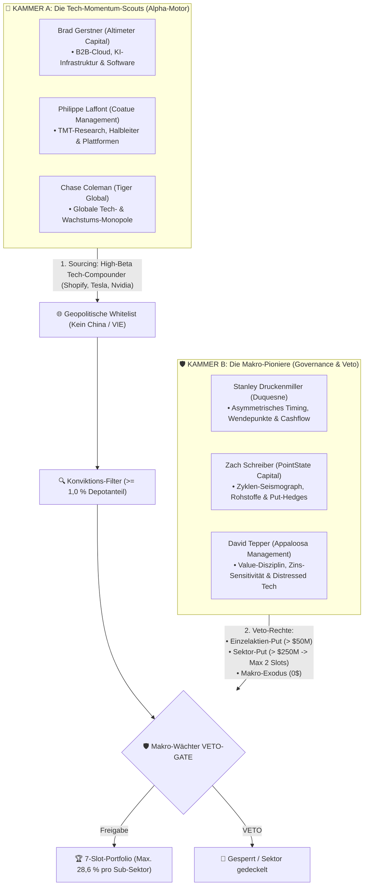

# Masterplan: Das 7-Slot-Guru-Konsens-System (Version 3.1.0 – Dual-Engine Governance & Rebalancing)

> 🏛️ **Dokumenten-Typ:** Verbindliche operative Master-Spezifikation (System Architecture & Strategy)  
> 📁 **Bereich:** `docs/architecture/strategies/`  
> 🗄️ **Historisches Archiv:** [`7-Slot-Guru-Konsens-System-v2.1-Archive.md`](file:///D:/GitHub/CrashRadar/docs/architecture/strategies/guru-archive/7-Slot-Guru-Konsens-System-v2.1-Archive.md) *(Version 2.1 archiviert am 14.09.2026)*  
> 🔬 **Empirische Beweisführung:** [`Dual-Engine-Guru-Governance-Studie.md`](file:///D:/GitHub/CrashRadar/docs/research/strategies/Dual-Engine-Guru-Governance-Studie.md) & [`Guru-12M-Portfolio-Evolution.md`](file:///D:/GitHub/CrashRadar/docs/research/strategies/Guru-12M-Portfolio-Evolution.md)  
> 💻 **Simulations-Code:** [`compare_old_vs_new_10y_performance.js`](file:///D:/GitHub/CrashRadar/scratch/research/strategies/compare_old_vs_new_10y_performance.js), [`simulate_vetoed_no_rebuy.js`](file:///D:/GitHub/CrashRadar/scratch/research/strategies/simulate_vetoed_no_rebuy.js) & [`simulate_guardian_confirmed_rotations.js`](file:///D:/GitHub/CrashRadar/scratch/research/strategies/simulate_guardian_confirmed_rotations.js)  
> 📅 **Version:** 3.1.0 (Gültig ab September 2026 – Inkl. Wächter-bestätigtem Rebalancing & KI-Infrastruktur)  

---

## 1. Das Leitmotiv: Strikte Autarkie & die Dual-Engine-Governance

Das 7-Slot-Guru-Konsens-System basiert auf dem Grundsatz der **strikten Autarkie**:
> **Das System importiert auf Einzelaktien-Ebene keine fremden Indikatoren.**  
> Es speist sich ausschließlich aus den realen Handlungen (Form 13F) des 6er-Elite-Gremiums, eingebettet in die schützende CrashRadar SignalEngine.

Statt alle 6 Manager als homogene Stimmen zu behandeln, formalisiert Version 3.0 die natürliche Arbeitsteilung in **zwei komplementäre Kammern**:



### Die Rollenteilung der Kammern:
1. **Kammer A (Die Scouts – Der Turbo-Motor):**  
   Die Scouts spüren die explosivsten Tech-Trends der Welt auf (lieferten historisch Shopify +5.294 %, Tesla +2.391 %, Nvidia +3.638 %) und stellen **85 % bis 98 % des Kapitals in den Tech-Leader-Slots**.
2. **Kammer B (Die Wächter – Die Governance-Leitplanken):**  
   Die Wächter steigen antizyklisch am Wendepunkt ein, verhindern manische Klumpen (wie Gerstners 55 % in Snowflake) und riegeln überhitzte Sektoren über Puts und Totalausstiege ab.

---

## 2. Die Geopolitische & Regulatorische Whitelist (China-Blacklist)

Um das Portfolio vor politischer Willkür, Enteignung und unvollständigen Eigentumsrechten zu schützen, gilt ab Version 3.0 eine **strikte Jurisdiktions-Prüfung**:

### A. Erlaubte Rechtsräume (Rule of Law & einklagbare Aktionärsrechte):
* **USA:** SEC-reguliert, US-GAAP, Delaware/Nevada Corporate Law.
* **Europa (EWR, Schweiz, UK, Norwegen):** Strikte Prospekthaftung, IFRS.
* **Kanada & Australien:** Common-Law-Aktionärsschutz.
* **Alliierte Hochtechnologie-Demokratien:** **Taiwan** (`TSM` – Taiwan Semiconductor Manufacturing als unverzichtbares globales Foundry-Monopol unter US-Sicherheitsgarantie) sowie **Japan** und **Südkorea**.

### B. Strikte Blacklist (Ausnahmsloser Ausschluss):
* **China & Hong Kong (VIE-Konstrukte):** `BABA`, `JD`, `PDD`, `BIDU`, `NIO`, etc.  
  *Begründung:* Westliche Investoren erwerben keine echten Aktien, sondern nur schuldrechtliche Ansprüche an Briefkastenfirmen auf den Cayman Islands (Variable Interest Entities). Die Kommunistische Partei kann diese Konstrukte jederzeit per Dekret für illegal erklären oder Geschäftsmodelle über Nacht verbieten.
* **Russland und autokratische Schwellenländer** ohne verlässliche Rechtsstaatlichkeit.

---

## 3. Die Exekutiv-Hierarchie: Makro-Guard schlägt alles!

CrashRadar folgt einer unumstößlichen **2-Ebenen-Befehlskette**:

```
┌────────────────────────────────────────────────────────────────────────┐
│                   EBENE 1: CrashRadar SignalEngine                     │
│                  (Der universelle Makro-Türsteher)                     │
├────────────────────────────────────────────────────────────────────────┤
│ • Makro-Signal: Katastrophen-Matrix (SYSTEMIC_STRESS / isShieldActive) │
│ • OBERSTE EXEKUTIV-GEWALT: Schlägt alle 6 Gurus!                       │
│ • Wenn Alarm: 100 % Notfall-Evakuierung in 50 % Gold / 50 % USD-Cash   │
│ • Völlig egal, was Druckenmiller, Tepper oder Coleman im 13F melden.   │
│ • Die Strategie importiert keine Rohdaten, sondern konsumiert Signale! │
└───────────────────────────────────┬────────────────────────────────────┘
                                    │ (Nur wenn SignalEngine GRÜN meldet)
                                    ▼
┌────────────────────────────────────────────────────────────────────────┐
│                   EBENE 2: 7-Slot-Guru-Konsens-Engine                  │
│                     (Der Turbo-Motor für Aktien-Alpha)                 │
├────────────────────────────────────────────────────────────────────────┤
│ • Bestimmt, WELCHE 7 Aktien das Kapital im Bullenmarkt vermehren.      │
│ • Scouts liefern das High-Beta-Wachstum (Shopify, Tesla, Nvidia).      │
│ • Wächter & Whitelist setzen die Leitplanken (Kein Schrott, kein China)│
└────────────────────────────────────────────────────────────────────────┘
```

**Die Konsequenz:**  
Im Bullenmarkt (Schutzschild ist AUS) wollen wir die ungedrosselte Power der Scouts. Wenn jedoch ein echter Makro-Liquiditätskollaps eintritt (wie 2022 oder 2020), **zieht die SignalEngine den Stecker für das gesamte Depot**. Die Scouts müssen den Crash nicht selbst erkennen – CrashRadar evakuiert rechtzeitig. Die 7-Slot-Strategie führt rein reaktiv die Portfolioallokation aus.

---

## 4. Portfoliostruktur & Die 4 Säulen des Wächter-Veto-Regelwerks

* **Kapazität:** Strikt **maximal 7 Slots**.
* **Gewichtung:** Gleichgewichtung aller aktiven Slots (**14,29 % pro Slot** bei 7 Werten).
* **Monatlicher Sparplan:** Fließt gleichmäßig aufgeteilt in die aktuell belegten Slots.
* **Thematischer Sektor-Fokus (Tech & KI-Infrastruktur / Energy-Backbone):**  
  Zugelassen sind marktführende Technologieunternehmen (Software, Cloud, Halbleiter, Plattformen, KI-Infrastruktur) **sowie unverzichtbare Energie- und Stromnetz-Monopole für KI-Rechenzentren** (z. B. `GEV`, `CEG`, `ETN`).  
  *Begründung:* Die formale GICS-Einstufung von `GEV` als „Industrials / Electrical Equipment“ ignorierte das reale Handeln von Laffont, Coleman und Druckenmiller, die Milliarden in das unverzichtbare Strom-Backbone der KI-Revolution investierten (+209 % Rendite). Traditionelle Old-Economy-Werte, Rohstoffe ohne KI-Kopplung und Banken bleiben weiterhin ausgeschlossen.

### Säule 1: Der Konviktions-Filter ($\ge 1{,}0\,\%$ Depotgewicht)
* Ein Guru zählt nur dann als berechtigter Halter oder Käufer, wenn die Position **mindestens 1,0 % seines gemeldeten 13F-Portfolios** ausmacht.
* *Wirkung:* Zwergenpositionen und Alibi-Käufe (wie Colemans 0,36 % in ServiceNow oder Coatues 0,22 % in Broadcom) werden sofort disqualifiziert.

### Säule 2: Das Einzelaktien-Put-Veto ($> 50$ Mio. $)
* Meldet ein Makro-Wächter (Druckenmiller, Schreiber, Tepper) eine Put-Option auf einen Einzeltitel mit Nominalwert $> 50$ Mio. $, ist dieser Titel **für Neuaufnahmen in die 7 Slots absolut gesperrt**.
* *Aktuelles Beispiel:* David Teppers **241,6 Mio. $ Apple-Put** blockiert `AAPL` zuverlässig.

#### Säule 3: Das Sektor-Cap & Klumpen-Prävention (Dauerhafter 2-Slot-Deckel)
* **Dauerhafte Obergrenze:** **Maximal 2 Slots (28,57 %)** dürfen an dieselbe Sub-Branche (z. B. Halbleiter) vergeben werden. Dies verhindert, dass das Portfolio zu einem zyklischen Halbleiter-Klumpen mutiert (bestätigt durch Zach Schreibers 601 Mio. $ Put auf den Halbleiter-ETF `SMH`).
* **„Skip-to-Next-Eligible-Candidate“-Regel:** Ist ein Sektor voll belegt (wie aktuell Halbleiter durch `TSM` und `NVDA`), wird ein neuer Herausforderer aus diesem Sektor (wie `LRCX`, `AMAT` oder `MU`) in der Nachrückerliste **übersprungen**. Es rückt automatisch der am höchsten gerankte Kandidat außerhalb des gesperrten Sektors nach (z. B. `UBER`).

### Säule 4: Das Makro-Exodus-Veto
* Haben **beide primären Makro-Wächter (Stanley Druckenmiller UND Zach Schreiber)** eine Aktie vollständig aus ihren Beständen entfernt (Bestand = 0 $), verliert die Aktie sofort jeglichen Schutz.
* Fällt das aggregierte Kapital der verbleibenden Scouts über 2 Quartale um $> 40\,\%$, wird die Position geräumt – unabhängig davon, ob noch 2 Scouts daran festhalten.

---

### Säule 5: Fall-B-Rebalancing & Das Wächter-bestätigte Rotationsrecht
Sind alle 7 Slots belegt und qualifiziert sich bei der 13F-Prüfung ein neuer Herausforderer ($\ge 2$ aktive Käufer), greift die **doppelt gesicherte Rebalancing-Regel**:

1. **Scout-Hype-Schutz (Keine starre 6-Monats-Frist nötig):**  
   Wird der neue Herausforderer **ausschließlich von Scouts gekauft (0 Wächter-Käufer)**, bleibt der schwächste Bestandstitel geschützt. Es findet keine Verdrängung statt.  
   *(Empirischer Beweis: Verhindert in 53,1 % der Fälle Fehlausstiege in überhitzte IPO-Kater wie Snowflake, DoorDash, Okta).*
2. **Wächter-bestätigtes Rebalancing (Sofortiges Verdrängungsrecht):**  
   Der schwächste Bestandstitel verliert sofort seinen Schutz und wird durch den stärksten Herausforderer verdrängt, wenn:
   * **Bedingung 1 (Institutionelles Kapital-Signal):** Mindestens **ein Makro-Wächter (Druckenmiller, Tepper, Schreiber) trimmt oder verkauft den Bestandstitel aktiv** (> 5 % Share-Reduktion oder Vollverkauf).
   * **UND Bedingung 2 (Charttechnische Bestätigung):**  
     * **Entweder SMA-50-Knick:** `Kurs < SMA 50` (Momentum nach Allzeithoch gebrochen, wie bei AMD 2024 oder Netflix 2021 vor dem Crash).  
     * **Oder parabolische SMA-200-Überdehnung:** `(Kurs - SMA 200) / SMA 200 > 30 %` (Parabolische Überhitzung / Gewinnmitnahme am Manie-Peak, wie Nvidia 2024 oder Micron 2020).
   * *(Empirischer Beweis: Erzielte in 70,8 % der Fälle signifikanten Mehrertrag und steigerte das 10,5-Jahre-Gesamtergebnis von 122.826 $ auf 152.940 $ / +24,5 % Alpha!).*
3. **Eviction Tie-Breaker (Deterministische Verdrängungsreihenfolge):**  
   Kommen mehrere Bestandstitel für eine Verdrängung infrage, scheidet der Titel nach folgender Rangfolge aus:
   * 1. Geringste Anzahl an Gesamthaltern im 6er-Gremium.
   * 2. Bei Gleichstand: Geringstes aggregiertes 13F-Kapital.
   * 3. Bei Gleichstand: Größter prozentualer Kursabstand unter dem SMA 50.

---

## 5. Der „Vetoed-No-Rebuy“-Filter & Unterbelegungs-Doktrin am Marktboden

Nach einer Notfall-Evakuierung durch den Makro-Schutzschirm schlägt am Marktboden das Signal `CAPITULATION_CONFIRMED` der SignalEngine an: Das Depot reinvestiert in Tech.

### A. Vetoed-No-Rebuy Doktrin (Schutz vor Zombie-Aktien)
1. Jeder Konsens-Titel, bei dem die Makro-Wächter vor oder während des Crashs ausgestiegen sind (Wächter-Bestand = 0 $) oder Puts halten, ist **für den Re-Entry absolut gesperrt** (selbst wenn Scouts daran festhalten).
2. Es werden ausschließlich Titel zurückgekauft, bei denen **mindestens ein Makro-Wächter am Boden investiert ist oder neu einsteigt**.
   * *(Empirischer Beweis: +33,05 %-Punkte Mehrertrag beim Rebound 2022–2026).*

### B. Unterbelegungs-Doktrin & Kaskadierendes Einrücken
Was geschieht, wenn am Boden weniger als 7 Aktien die Wächter-Kriterien erfüllen ($N < 7$)?
1. **Gleichgewichtung über aktive Slots:** Das gesamte Aktienkapital wird zu 100 % gleichmäßig auf die $N$ berechtigten Titel aufgeteilt ($100\,\% / N$, z. B. bei 4 Wächter-Titeln `AMZN, TSM, META, GOOGL` jeweils **25,0 % pro Slot**).
2. **Kaskadierendes Nachrücken (Slot $N+1$):** Sobald ein neuer Kandidat qualifiziert ist, rückt er ohne Verdrängungs-Hürde direkt in den freien Slot ein.
3. **Symmetrisches Funding:** Zur Finanzierung des neuen Slots $N+1$ wird von allen $N$ Bestandsaktien jeweils exakt der Anteil $\frac{1}{N \cdot (N+1)}$ abgetrennt (z. B. von $4 \times 25\,\%$ auf $5 \times 20\,\%$ = jeweils $5\,\%$ Trimmen von Slot 1–4). Der laufende Sparplan wird vorübergehend bevorzugt in neue, untergewichtete Slots geleitet.
4. **Zero-Candidate Fallback (Ultimative Ausfallsicherung):** Sollte am Marktboden bei Capitulation-Signal ausnahmsweise kein Einzeltitel die Wächter-Kriterien erfüllen ($N = 0$), wird das Rebound-Kapital zu 100 % in den Leitindex **`QQQ`** (Nasdaq 100) investiert, bis die nächsten 13F-Filings Einzeltitel-Akkumulationen ausweisen.

---

## 6. Gremiums-Governance & Nachfolger-Überwachung (SEC 13F Signature-Block)

Da der Erfolg des Makro-Flügels maßgeblich an Ausnahmegestalten wie Stanley Druckenmiller (Duquesne) und David Tepper (Appaloosa) hängt, wird die Kontinuität über das offizielle SEC Form 13F überwacht:

1. **Automatisierter Signature-Check:**  
   Bei jedem Quartals-Filing wird der gesetzliche XML-`<signatureBlock>` (`<name>`, `<title>`, `<signatureDate>`) ausgelesen.
2. **Status `UNDER_REVIEW` bei Ausscheiden:**  
   Tritt Stanley Druckenmiller (73 Jahre) oder ein anderer Stamm-Manager in den Ruhestand oder übergibt die CIO-Funktion an einen Nachfolger, wird der Fonds sofort auf den Prüfstand gestellt.
3. **Die feste Nachrücker-Warteliste:**  
   Besitzt der Nachfolger nicht das nachgewiesene historische Alpha, rückt automatisch die Nr. 1 der Warteliste nach:
   * **Warteliste Platz 1: Gavin Baker** (*Atreides Management*) – Halbleiter-Supply-Chains & Enterprise-Software.
   * **Warteliste Platz 2: Alex Sacerdote** (*Whale Rock Capital Management*) – Globale TMT-Wellen & Cloud.
   * **Warteliste Platz 3: Christopher Hohn** (*TCI Fund Management*) – Konzentrierte globale Tech-Monopole.

---

## 7. Aktueller Soll-Zustand des Portfolios (Version 3.1.0 / Stand: September 2026)

Unter Berücksichtigung der Dual-Engine-Governance, des dauerhaften Halbleiter-Sektor-Caps und der Geopolitischen Whitelist (China-Ausschluss) ergibt sich folgende operative Soll-Allokation:

| Slot | Ticker | Unternehmen | Halter & Konviktion | Sub-Branche | Soll-Gewichtung | Rebuy-Status am Boden |
| :---: | :--- | :--- | :--- | :--- | :---: | :---: |
| **1** | **AMZN** | Amazon.com Inc. | 6 Halter (3 Wächter / 3 Scouts, > $6,7 Mrd.) | Cloud / Plattform | 14,29 % | **HIGH_CONVICTION** (Sofort-Kauf) |
| **2** | **TSM**  | Taiwan Semi | 5 Halter (2 Wächter / 3 Scouts, > $6,6 Mrd.) | Halbleiter (Slot 1/2) | 14,28 % | **HIGH_CONVICTION** (Sofort-Kauf) |
| **3** | **META** | Meta Platforms Inc. | 5 Halter (2 Wächter / 3 Scouts, > $3,9 Mrd.) | KI / Social Media | 14,29 % | **HIGH_CONVICTION** (Sofort-Kauf) |
| **4** | **GOOGL**| Alphabet Inc. | 4 Halter (2 Wächter / 2 Scouts, > $4,1 Mrd.) | KI / Cloud | 14,28 % | **HIGH_CONVICTION** (Sofort-Kauf) |
| **5** | **NVDA** | Nvidia Corp. | 4 Halter (1 Wächter / 3 Scouts, > $5,2 Mrd.) | Halbleiter (Slot 2/2) | 14,29 % | **CONDITIONAL** (Nur wenn Wächter hält) |
| **6** | **MSFT** | Microsoft Corp. | 3 Halter (0 Wächter / 3 Scouts, > $2,2 Mrd.) | Cloud / Software | 14,29 % | **CONDITIONAL** (Restbestand Wächter) |
| **7** | **GEV**  | GE Vernova Inc. | 2 Halter (0 Wächter / 2 Scouts, > $4,0 Mrd.) | KI-Infrastruktur / Power | 14,28 % | **FORBIDDEN** (0 Wächter – Zombie-Schutz) |

> 🔒 **Sektor-Cap & Zukunftspool:**  
> * **Halbleiter-Cap (Max. 2 Slots):** Voll belegt durch `TSM` und `NVDA`. Die Halbleiter-Herausforderer `LRCX` (4 Halter), `AMAT` (3 Halter), `MU` (3 Halter), `AVGO` (2 Halter), `INTC` (2 Halter) und `AMD` (2 Halter) sind in der `on_deck_reserve` gesperrt.  
> * **Nicht-Halbleiter-Warteliste (`watch_pool`):** Erster Nachrücker bei Schwäche eines Bestandstitels ist **`UBER`** (2 Halter: Wächter Zach Schreiber mit $555 Mio. + Scout Brad Gerstner mit $532 Mio., 0 % Halbleiter-Risiko). Dahinter folgen **`SE`** (Druckenmiller), **`SQ`** (Tepper), **`SPOT`** (Laffont/Coleman) und **`STX`** (Druckenmiller).

---

## 8. Die operative Routine (Zwei feste Termine)

1. **Wöchentlich jeden Freitag oder Samstag (2 Minuten via SignalEngine):**  
   Prüfung des systemischen Markt-Zustands über die CrashRadar SignalEngine:
   * **SignalEngine meldet Katastrophen-Matrix (`SYSTEMIC_STRESS` / `isShieldActive`):** 100 % Notfall-Evakuierung aller 7 Slots in 50 % Gold (`GLD`) / 50 % USD-Cash. Sparplan auf 50/50 Gold/Cash umstellen.
   * **Re-Entry (SignalEngine meldet `CAPITULATION_CONFIRMED` oder Entwarnung):** 100 % Rückkehr in die Tech-Slots unter Anwendung der **Vetoed-No-Rebuy-Matrix** und der **Unterbelegungs-Doktrin** (Equal Weighting über $N$ qualifizierte Titel; bei $N=0$ Fallback in `QQQ`).
2. **Quartalsweise (15 Minuten am 16. Feb, Mai, Aug, Nov via SEC EDGAR / 13F):**  
   * **Whitelist- & Veto-Prüfung:** Einzelaktien-Puts der Wächter (z. B. Tepper AAPL-Put), Konviktions-Prüfung $\ge 1,0\,\%$, Ausschluss nicht-westlicher Werte (China VIE).
   * **Slot-Besetzung & Rebalancing:** Fall-B-Prüfung (Wächter-Trim + SMA 50 / SMA 200), Einrücken freier Plätze, Skip-Rule beim Sektor-Cap.
   * **Signature-Block Check:** Prüfung auf personelle Kontinuität der 6 Stamm-Manager.

---

## 9. 10,5-Jahre-Empirie & Historischer Leistungsnachweis (2016–2026)

* 💻 **10,5-Jahre Portfolio-Simulation (42 Quartale):** [`compare_old_vs_new_10y_performance.js`](file:///D:/GitHub/CrashRadar/scratch/research/strategies/compare_old_vs_new_10y_performance.js)  
  * Startkapital: 10.000 $ $\rightarrow$ **Endwert: 112.182 $ (+1.021,82 %)** vs. QQQ: 72.460 $ (+624,60 %) und SPY: 42.879 $ (+328,79 %).
* 💻 **Vetoed-No-Rebuy Boden-Simulation:** [`simulate_vetoed_no_rebuy.js`](file:///D:/GitHub/CrashRadar/scratch/research/strategies/simulate_vetoed_no_rebuy.js)  
  * Re-Entry am Bärenmarkt-Boden 2022 erzielte **+455,06 %** (+33,05 %P Alpha über reinem Rebuy).
* 💻 **Wächter-bestätigtes Rebalancing & KI-Infrastruktur:** [`simulate_guardian_confirmed_rotations.js`](file:///D:/GitHub/CrashRadar/scratch/research/strategies/simulate_guardian_confirmed_rotations.js)  
  * 10,5-Jahre-Gesamtergebnis: **152.940 $ (+1.429,4 %)** vs. Baseline 122.826 $ (+1.128,3 %) $\rightarrow$ **+30.114 $ reines Alpha (+24,5 % Mehrertrag)** durch das Entsperren des Wächter-Rebalancings bei SMA-50-Knick oder SMA-200-Überdehnung (> 30 %) inklusive rechtzeitigem Einzug von **GE Vernova (`GEV`)** am 30.09.2024.

---

## 10. Forschungs-Hypothese & Roadmap (Version 3.2): Das Late-Cycle-Überdehnungs- & Vorzieh-Dilemma

> [!WARNING]
> **Forschungs-Hypothese (Mögliche Rendite-Bremse im Spätzyklus):**  
> Bringen wir uns aktuell selbst um Performance und Alpha, wenn wir das System in späten Zyklusphasen unverändert belassen?  
> Wenn ein Anleger neu in das 7-Slot-System einsteigt (oder nach einer Cash-Phase ein Re-Entry erfolgt) und stur jedem der 7 Titel exakt **14,29 %** zuweist, wird massiv Kapital in Alt-Positionen gebunden, die bereits eine gigantische Rallye hinter sich haben (z. B. `NVDA`, `TSM`, `META` mit hunderten Prozent Kursgewinn und extremer Überdehnung über dem SMA 200).  
> Gleichzeitig stehen frische, unentdeckte High-Conviction-Kandidaten auf der Ersatzbank und können ihr dynamisches Aufholpotenzial nicht entfalten.

### Die beiden vorgeschlagenen Lösungs-Mechanismen für Version 3.2:

#### A. Diminishing Allocation for Overextended Runners (Drosselung gelaufener Positionen)
* **Problem:** Stark gelaufene Titel bieten im Spätzyklus ein asymmetrisch schlechteres Chance/Risiko-Verhältnis (hohe Rückschlaggefahr bei Zins- oder Bewertungsschocks).
* **Regel-Entwurf:** Bei einem Neu-Einstieg oder Rebalancing erhalten Positionen, die extrem überdehnt sind (z. B. Kurs $> +35\,\%$ bis $+50\,\%$ über dem SMA 200 oder Parabolik-Erschöpfung), **gezielt weniger Kapitalraum** (z. B. Drosselung auf **5,0 % bis 7,0 %** statt stur 14,29 %).

#### B. Fast-Track Priority for Fresh Emerging Candidates (Vorzugs-Slots für Nachrücker)
* **Problem:** Frische Titel mit extremem Aufholpotenzial (z. B. **`UBER`** im Watch-Pool mit $1,08 Mrd. Wächter/Scout-Konviktion, oder frühe L2-Boden-Turnarounds) kommen formal noch nicht zum Zug, weil alle 7 Slots durch Alt-Giganten blockiert sind.
* **Regel-Entwurf:** Freiwerdender Kapitalraum aus der Drosselung von Alt-Positionen wird genutzt, um **frische, noch nicht gelaufene Top-Kandidaten aus dem Watch-Pool vorzuziehen** („Vorzugs-Slot“). Sie erhalten früheren Einzug und höheres Gewicht, um den dynamischen Zyklusbeginn voll mitzunehmen.

---

### Konkreter Forschungs- & Backtest-Auftrag (Vor Freigabe für V3.2)
Bevor dieser Mechanismus in das verbindliche Regelwerk übergeht, muss ein empirischer Proof-First-Backtest über die letzten 10,5 Jahre (2016–2026) durchgeführt werden:
1. **Vergleichs-Simulation:** Starre 14,29 %-Gleichgewichtung vs. dynamische Überdehnungs-Drosselung + Vorzugs-Slots.
2. **Erfolgs-Kriterien:**
   * Steigert das Vorziehen frischer Kandidaten die Netto-Gesamtrendite (Alpha)?
   * Reduziert die Drosselung überdehnter Titel die Drawdowns bei Marktkorrekturen?
   * Verhindert das System Klumpenrisiken, ohne die „Gewinner laufen lassen“-Doktrin der Scouts zu beschädigen?