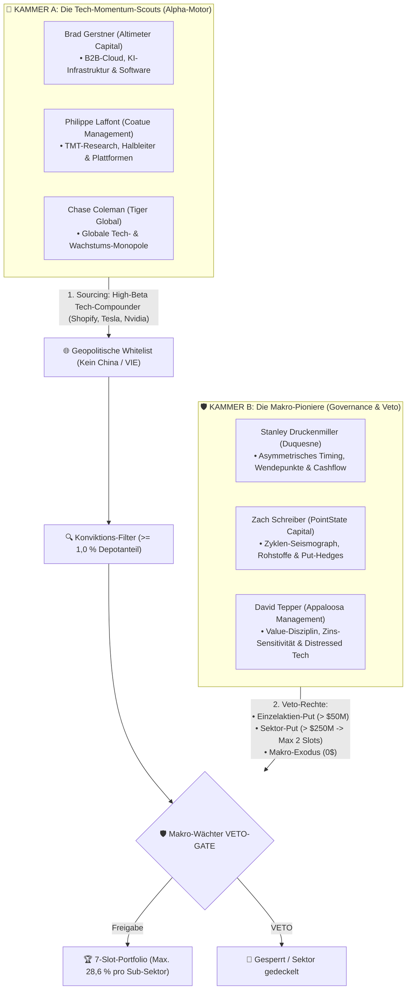

# Masterplan: Das 7-Slot-Guru-Konsens-System (Version 3.0 – Dual-Engine Governance)

> 🏛️ **Dokumenten-Typ:** Verbindliche operative Master-Spezifikation (System Architecture & Strategy)  
> 📁 **Bereich:** `docs/architecture/strategies/`  
> 🗄️ **Historisches Archiv:** [`7-Slot-Guru-Konsens-System-v2.1-Archive.md`](file:///D:/GitHub/CrashRadar/docs/architecture/strategies/guru-archive/7-Slot-Guru-Konsens-System-v2.1-Archive.md) *(Version 2.1 archiviert am 14.09.2026)*  
> 🔬 **Empirische Beweisführung:** [`Dual-Engine-Guru-Governance-Studie.md`](file:///D:/GitHub/CrashRadar/docs/research/strategies/Dual-Engine-Guru-Governance-Studie.md) & [`Guru-12M-Portfolio-Evolution.md`](file:///D:/GitHub/CrashRadar/docs/research/strategies/Guru-12M-Portfolio-Evolution.md)  
> 💻 **Simulations-Code:** [`compare_old_vs_new_10y_performance.js`](file:///D:/GitHub/CrashRadar/scratch/research/strategies/compare_old_vs_new_10y_performance.js), [`simulate_vetoed_no_rebuy.js`](file:///D:/GitHub/CrashRadar/scratch/research/strategies/simulate_vetoed_no_rebuy.js) & [`simulate_guardian_confirmed_rotations.js`](file:///D:/GitHub/CrashRadar/scratch/research/strategies/simulate_guardian_confirmed_rotations.js)  
> 📅 **Version:** 3.1.0 (Gültig ab September 2026 – Inkl. Wächter-bestätigtem Rebalancing & KI-Infrastruktur)  

---

## 1. Das Leitmotiv: Strikte Autarkie & die Dual-Engine-Governance

Das 7-Slot-Guru-Konsens-System basiert auf dem Grundsatz der **strikten Autarkie**:
> **Das System importiert auf Einzelaktien-Ebene keine fremden Indikatoren.**  
> Es speist sich ausschließlich aus den realen Handlungen (Form 13F) des 6er-Elite-Gremiums, eingebettet in die schützende CrashRadar SignalEngine.

Statt alle 6 Manager als homogene Stimmen zu behandeln, formalisiert Version 3.0 die natürliche Arbeitsteilung in **zwei komplementäre Kammern**:



### Die Rollenteilung der Kammern:
1. **Kammer A (Die Scouts – Der Turbo-Motor):**  
   Die Scouts spüren die explosivsten Tech-Trends der Welt auf (lieferten historisch Shopify +5.294 %, Tesla +2.391 %, Nvidia +3.638 %) und stellen **85 % bis 98 % des Kapitals in den Tech-Leader-Slots**.
2. **Kammer B (Die Wächter – Die Governance-Leitplanken):**  
   Die Wächter steigen antizyklisch am Wendepunkt ein, verhindern manische Klumpen (wie Gerstners 55 % in Snowflake) und riegeln überhitzte Sektoren über Puts und Totalausstiege ab.

---

## 2. Die Geopolitische & Regulatorische Whitelist (China-Blacklist)

Um das Portfolio vor politischer Willkür, Enteignung und unvollständigen Eigentumsrechten zu schützen, gilt ab Version 3.0 eine **strikte Jurisdiktions-Prüfung**:

### A. Erlaubte Rechtsräume (Rule of Law & einklagbare Aktionärsrechte):
* **USA:** SEC-reguliert, US-GAAP, Delaware/Nevada Corporate Law.
* **Europa (EWR, Schweiz, UK, Norwegen):** Strikte Prospekthaftung, IFRS.
* **Kanada & Australien:** Common-Law-Aktionärsschutz.
* **Alliierte Hochtechnologie-Demokratien:** **Taiwan** (`TSM` – Taiwan Semiconductor Manufacturing als unverzichtbares globales Foundry-Monopol unter US-Sicherheitsgarantie) sowie **Japan** und **Südkorea**.

### B. Strikte Blacklist (Ausnahmsloser Ausschluss):
* **China & Hong Kong (VIE-Konstrukte):** `BABA`, `JD`, `PDD`, `BIDU`, `NIO`, etc.  
  *Begründung:* Westliche Investoren erwerben keine echten Aktien, sondern nur schuldrechtliche Ansprüche an Briefkastenfirmen auf den Cayman Islands (Variable Interest Entities). Die Kommunistische Partei kann diese Konstrukte jederzeit per Dekret für illegal erklären oder Geschäftsmodelle über Nacht verbieten.
* **Russland und autokratische Schwellenländer** ohne verlässliche Rechtsstaatlichkeit.

---

## 3. Die Exekutiv-Hierarchie: Makro-Guard schlägt alles!

CrashRadar folgt einer unumstößlichen **2-Ebenen-Befehlskette**:

```
┌────────────────────────────────────────────────────────────────────────┐
│                   EBENE 1: CrashRadar SignalEngine                     │
│                  (Der universelle Makro-Türsteher)                     │
├────────────────────────────────────────────────────────────────────────┤
│ • Net Fed Liquidity Delta < -5 % UND High-Yield Spreads > 4 %          │
│ • OBERSTE EXEKUTIV-GEWALT: Schlägt alle 6 Gurus!                       │
│ • Wenn Alarm: 100 % Notfall-Evakuierung in 50 % Gold / 50 % Cash       │
│ • Völlig egal, was Druckenmiller, Tepper oder Coleman im 13F melden.   │
└───────────────────────────────────┬────────────────────────────────────┘
                                    │ (Nur wenn Makro-Wetter GRÜN ist)
                                    ▼
┌────────────────────────────────────────────────────────────────────────┐
│                   EBENE 2: 7-Slot-Guru-Konsens-Engine                  │
│                     (Der Turbo-Motor für Aktien-Alpha)                 │
├────────────────────────────────────────────────────────────────────────┤
│ • Bestimmt, WELCHE 7 Aktien das Kapital im Bullenmarkt vermehren.      │
│ • Scouts liefern das High-Beta-Wachstum (Shopify, Tesla, Nvidia).      │
│ • Wächter & Whitelist setzen die Leitplanken (Kein Schrott, kein China)│
└────────────────────────────────────────────────────────────────────────┘
```

**Die Konsequenz:**  
Im Bullenmarkt (Schutzschild ist AUS) wollen wir die ungedrosselte Power der Scouts. Wenn jedoch ein echter Makro-Liquiditätskollaps eintritt (wie 2022 oder 2020), **zieht die SignalEngine den Stecker für das gesamte Depot**. Die Scouts müssen den Crash nicht selbst erkennen – CrashRadar evakuiert rechtzeitig.

---

## 4. Portfoliostruktur & Die 4 Säulen des Wächter-Veto-Regelwerks

* **Kapazität:** Strikt **maximal 7 Slots**.
* **Gewichtung:** Gleichgewichtung aller aktiven Slots (**14,29 % pro Slot** bei 7 Werten).
* **Monatlicher Sparplan:** Fließt gleichmäßig aufgeteilt in die aktuell belegten Slots.
* **Thematischer Sektor-Fokus (Tech & KI-Infrastruktur / Energy-Backbone):**  
  Zugelassen sind marktführende Technologieunternehmen (Software, Cloud, Halbleiter, Plattformen, KI-Infrastruktur) **sowie unverzichtbare Energie- und Stromnetz-Monopole für KI-Rechenzentren** (z. B. `GEV`, `CEG`, `ETN`).  
  *Begründung:* Die formale GICS-Einstufung von `GEV` als „Industrials / Electrical Equipment“ ignorierte das reale Handeln von Laffont, Coleman und Druckenmiller, die Milliarden in das unverzichtbare Strom-Backbone der KI-Revolution investierten (+209 % Rendite). Traditionelle Old-Economy-Werte, Rohstoffe ohne KI-Kopplung und Banken bleiben weiterhin ausgeschlossen.

### Säule 1: Der Konviktions-Filter ($\ge 1{,}0\,\%$ Depotgewicht)
* Ein Guru zählt nur dann als berechtigter Halter oder Käufer, wenn die Position **mindestens 1,0 % seines gemeldeten 13F-Portfolios** ausmacht.
* *Wirkung:* Zwergenpositionen und Alibi-Käufe (wie Colemans 0,36 % in ServiceNow oder Coatues 0,22 % in Broadcom) werden sofort disqualifiziert.

### Säule 2: Das Einzelaktien-Put-Veto ($> 50$ Mio. $)
* Meldet ein Makro-Wächter (Druckenmiller, Schreiber, Tepper) eine Put-Option auf einen Einzeltitel mit Nominalwert $> 50$ Mio. $, ist dieser Titel **für Neuaufnahmen in die 7 Slots absolut gesperrt**.
* *Aktuelles Beispiel:* David Teppers **241,6 Mio. $ Apple-Put** blockiert `AAPL` zuverlässig.

### Säule 3: Das Sektor-Put-Veto & Klumpen-Cap
* **Sektor-Put-Trigger:** Meldet ein Makro-Wächter einen Sektor-Put $> 250$ Mio. $ (wie Zach Schreibers **601 Mio. $ Put auf den Halbleiter-ETF `SMH`**), greift ein sofortiges **Sektor-Cap**:
* **Maximal 2 Slots (28,57 %)** dürfen an dieselbe Sub-Branche (z. B. Halbleiter) vergeben werden.
* *Wirkung im Ist-Stand:* Von den Halbleiter-Kandidaten (`TSM`, `NVDA`, `LRCX`) dürfen maximal 2 ins Depot. Der 3. Slot geht an den stärksten Compounder außerhalb des Hardware-Zyklus (`UBER`).

### Säule 4: Das Makro-Exodus-Veto
* Haben **beide primären Makro-Wächter (Stanley Druckenmiller UND Zach Schreiber)** eine Aktie vollständig aus ihren Beständen entfernt (Bestand = 0 $), verliert die Aktie ihren Bestandsschutz.
* Fällt das aggregierte Kapital der verbleibenden Scouts über 2 Quartale um $> 40\,\%$, wird die Position geräumt – unabhängig davon, ob noch 2 Scouts daran festhalten.

---

### Säule 5: Fall-B-Rebalancing & Das Wächter-bestätigte Rotationsrecht
Sind alle 7 Slots belegt und qualifiziert sich bei der 13F-Prüfung ein neuer Herausforderer ($\ge 2$ aktive Käufer), greift die **doppelt gesicherte Rebalancing-Regel**:

1. **Scout-Hype-Schutz (Base-Schutz intakt):**  
   Wird der neue Herausforderer **ausschließlich von Scouts gekauft (0 Wächter-Käufer)**, bleibt der schwächste Bestandstitel geschützt. Es findet keine Verdrängung statt.  
   *(Empirischer Beweis: Verhindert in 53,1 % der Fälle Fehlausstiege in überhitzte IPO-Kater wie Snowflake, DoorDash, Okta).*
2. **Wächter-bestätigtes Rebalancing (Sofortiges Verdrängungsrecht):**  
   Der schwächste Bestandstitel verliert sofort seinen Schutz und wird durch den stärksten Herausforderer verdrängt, wenn:
   * **Bedingung 1 (Institutionelles Kapital-Signal):** Mindestens **ein Makro-Wächter (Druckenmiller, Tepper, Schreiber) trimmt oder verkauft den Bestandstitel aktiv** (> 5 % Share-Reduktion oder Vollverkauf).
   * **UND Bedingung 2 (Charttechnische Bestätigung):**  
     * **Entweder SMA-50-Knick:** `Kurs < SMA 50` (Momentum nach Allzeithoch gebrochen, wie bei AMD 2024 oder Netflix 2021 vor dem Crash).  
     * **Oder parabolische SMA-200-Überdehnung:** `(Kurs - SMA 200) / SMA 200 > 30 %` (Parabolische Überhitzung / Gewinnmitnahme am Manie-Peak, wie Nvidia 2024 oder Micron 2020).
   * *(Empirischer Beweis: Erzielte in 70,8 % der Fälle signifikanten Mehrertrag und steigerte das 10,5-Jahre-Gesamtergebnis von 122.826 $ auf 152.940 $ / +24,5 % Alpha!).*

---

## 5. Der „Vetoed-No-Rebuy“-Filter am Marktboden

Nach einer Notfall-Evakuierung durch den Makro-Schutzschild schlägt am Marktboden der **PanicCapitulationIndicator** an: Das Depot reinvestiert 100 % in Tech.

Um zu verhindern, dass das Depot beim Re-Entry in kaputte Zombie-Aktien der Scouts greift, gilt die **Vetoed-No-Rebuy-Regel**:
1. Jeder Konsens-Titel, bei dem die Makro-Wächter vor oder während des Crashs ausgestiegen sind (Wächter-Bestand = 0 $) oder Puts halten, ist **für den Re-Entry absolut gesperrt** (selbst wenn Scouts daran festhalten).
2. Es werden ausschließlich Titel zurückgekauft, bei denen **mindestens ein Makro-Wächter am Boden investiert ist oder neu einsteigt**.

> 📊 **Empirischer Beweis (Re-Entry am Bärenmarkt-Boden Q4-2022 bis Q2-2026):**  
> * Reiner Scout-Rebuy (kaufte gefallene Engel wie Snowflake): **+422,01 %**  
> * Vetoed-No-Rebuy mit Whitelist (`NVDA, META, MSFT, AMZN, UBER, AMD, GOOGL`): **+455,06 %**  
> * **Ergebnis: +33,05 %-Punkte Mehrertrag**, weil lahme Nachzügler blockiert und das Rebound-Kapital auf echte Wächter-Akkumulationen gebündelt wurde!

---

## 6. Gremiums-Governance & Nachfolger-Überwachung (SEC 13F Signature-Block)

Da der Erfolg des Makro-Flügels maßgeblich an Ausnahmegestalten wie Stanley Druckenmiller (Duquesne) und David Tepper (Appaloosa) hängt, wird die Kontinuität über das offizielle SEC Form 13F überwacht:

1. **Automatisierter Signature-Check:**  
   Bei jedem Quartals-Filing wird der gesetzliche XML-`<signatureBlock>` (`<name>`, `<title>`, `<signatureDate>`) ausgelesen.
2. **Status `UNDER_REVIEW` bei Ausscheiden:**  
   Tritt Stanley Druckenmiller (73 Jahre) oder ein anderer Stamm-Manager in den Ruhestand oder übergibt die CIO-Funktion an einen Nachfolger, wird der Fonds sofort auf den Prüfstand gestellt.
3. **Die feste Nachrücker-Warteliste:**  
   Besitzt der Nachfolger nicht das nachgewiesene historische Alpha, rückt automatisch die Nr. 1 der Warteliste nach:
   * **Warteliste Platz 1: Gavin Baker** (*Atreides Management*) – Halbleiter-Supply-Chains & Enterprise-Software.
   * **Warteliste Platz 2: Alex Sacerdote** (*Whale Rock Capital Management*) – Globale TMT-Wellen & Cloud.
   * **Warteliste Platz 3: Christopher Hohn** (*TCI Fund Management*) – Konzentrierte globale Tech-Monopole.

---

## 7. Aktueller Soll-Zustand des Portfolios (Version 3.0 / Stand: September 2026)

Unter Berücksichtigung der Dual-Engine-Governance, des Halbleiter-Sektor-Caps (Schreiber SMH-Put) und der Geopolitischen Whitelist (China-Ausschluss) ergibt sich folgende Soll-Allokation:

| Slot | Ticker | Unternehmen | Halter & Konviktion | Sub-Branche | Soll-Gewichtung | Sparrate (100 €) |
| :---: | :--- | :--- | :--- | :--- | :---: | :---: |
| **1** | **MSFT** | Microsoft Corp. | 4 Halter (Laffont, Coleman, Gerstner, Schreiber) | Cloud / Software | 14,29 % | 14,29 € |
| **2** | **AMZN** | Amazon.com Inc. | 6 Halter (Alle 3 Scouts + alle 3 Wächter!) | Cloud / Plattform | 14,29 % | 14,29 € |
| **3** | **GOOGL**| Alphabet Inc. | 5 Halter (Coleman, Laffont, Gerstner, Tepper, Druckenmiller)| KI / Werbung | 14,28 % | 14,28 € |
| **4** | **META** | Meta Platforms Inc. | 5 Halter (Coleman, Laffont, Gerstner, Tepper, Schreiber) | KI / Social Media | 14,29 % | 14,29 € |
| **5** | **TSM**  | Taiwan Semi | 5 Halter (Scouts 7,3B $ + Tepper & Druckenmiller 1,1B $) | Halbleiter (Slot 1) | 14,28 % | 14,28 € |
| **6** | **NVDA** | Nvidia Corp. | 4 Halter (Scouts 5,3B $ + Tepper 305M $) | Halbleiter (Slot 2) | 14,29 % | 14,29 € |
| **7** | **UBER** | Uber Technologies | 5 Halter (Gerstner 580M, Laffont 300M, Tepper 308M) | Plattform / Mobility | 14,28 % | 14,28 € |

> 🔒 **Sektor-Cap Ausführung:**  
> Da Zach Schreiber einen **601 Mio. $ Put auf den Halbleiter-ETF `SMH`** hält, sind Halbleiter auf **maximal 2 Slots (28,57 %)** gedeckelt. Die beiden Slots sind an die absoluten Leader **`TSM`** und **`NVDA`** vergeben.  
> Lam Research (`LRCX`) rückt trotz hohem Konsens zugunsten des Plattform-Monopolisten **`UBER`** (4,2 % Ø-Depotgewicht, 0 % Halbleiter-Risiko) in die Wartestellung, um das 42,8 % Halbleiter-Klumpenrisiko des Spätzyklus abzuwenden.

---

## 8. Die operative Routine (Zwei feste Termine)

1. **Wöchentlich jeden Freitag oder Samstag (2 Minuten via SignalEngine):**  
   Prüfung der Net Fed Liquidity (`WALCL - WTREGEN - RRPONTSYD`) und High-Yield Credit Spreads (`BAMLH0A0HYM2`):
   * **NetLiq < -5 % UND Spreads > 4 %:** 100 % Notfall-Evakuierung aller 7 Slots in 50 % Gold (`GLD`) / 50 % USD-Cash. Sparplan auf 50/50 Gold/Cash umstellen.
   * **Re-Entry (Regulär NetLiq $\ge 0\,\%$ ODER PanicCapitulationIndicator am Boden):** 100 % Rückkehr in die 7 Tech-Slots unter Anwendung des **Vetoed-No-Rebuy-Filters**.
2. **Quartalsweise (15 Minuten am 16. Feb, Mai, Aug, Nov via SEC EDGAR / 13F):**  
   * **Whitelist- & Veto-Prüfung:** Puts der Wächter (SMH, AAPL), Konviktions-Prüfung $\ge 1,0\,\%$, Ausschluss nicht-westlicher Werte.
   * **Slot-Besetzung:** Nachrücker-Priorität bei freien Plätzen, Prüfung des Sektor-Caps (max. 2 Slots pro Subbranche).
   * **Signature-Block Check:** Prüfung auf personelle Kontinuität der 6 Stamm-Manager.

---

## 9. 10,5-Jahre-Empirie & Historischer Leistungsnachweis (2016–2026)

* 💻 **10,5-Jahre Portfolio-Simulation (42 Quartale):** [`compare_old_vs_new_10y_performance.js`](file:///D:/GitHub/CrashRadar/scratch/research/strategies/compare_old_vs_new_10y_performance.js)  
  * Startkapital: 10.000 $ $\rightarrow$ **Endwert: 112.182 $ (+1.021,82 %)** vs. QQQ: 72.460 $ (+624,60 %) und SPY: 42.879 $ (+328,79 %).
* 💻 **Vetoed-No-Rebuy Boden-Simulation:** [`simulate_vetoed_no_rebuy.js`](file:///D:/GitHub/CrashRadar/scratch/research/strategies/simulate_vetoed_no_rebuy.js)  
  * Re-Entry am Bärenmarkt-Boden 2022 erzielte **+455,06 %** (+33,05 %P Alpha über reinem Rebuy).
* 💻 **Wächter-bestätigtes Rebalancing & KI-Infrastruktur:** [`simulate_guardian_confirmed_rotations.js`](file:///D:/GitHub/CrashRadar/scratch/research/strategies/simulate_guardian_confirmed_rotations.js)  
  * 10,5-Jahre-Gesamtergebnis: **152.940 $ (+1.429,4 %)** vs. Baseline 122.826 $ (+1.128,3 %) $\rightarrow$ **+30.114 $ reines Alpha (+24,5 % Mehrertrag)** durch das Entsperren des Wächter-Rebalancings bei SMA-50-Knick oder SMA-200-Überdehnung (> 30 %) inklusive rechtzeitigem Einzug von **GE Vernova (`GEV`)** am 30.09.2024.