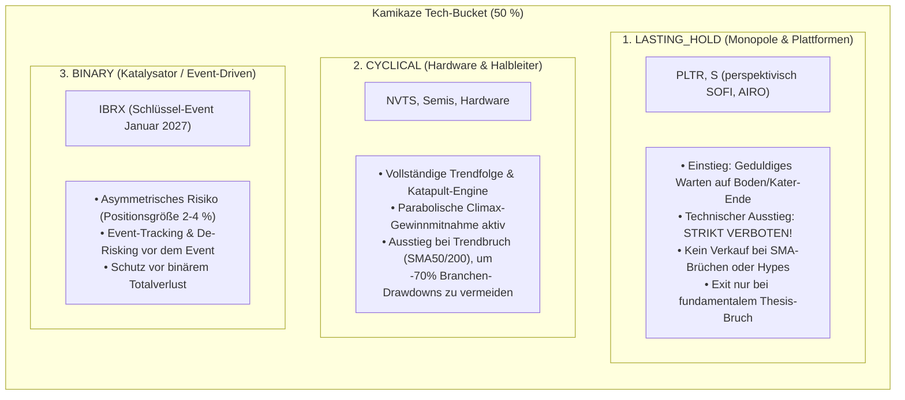

# Kamikaze Growth (KMG): Das 50/50 High-Conviction Radar-Regelwerk
*Organischer High-Beta Tech- & Krypto-Equity-Accelerator mit 90k $ Startpool, S&P 500 Mutterschiff, Makro-Gold-Schild & irregulärem Staking-Satelliten*

> 🧭 **Pipeline-Rolle: STUFE 3 (PORTFOLIO-ALLOKATION & EXECUTION — Risk Management)**  
> ⚙️ **Operative Strategie-Konfiguration & Live-Bestand:** [`config/strategies/kamikaze-growth.json`](file:///D:/GitHub/CrashRadar/config/strategies/kamikaze-growth.json)  
> 🔗 **Schnittstelle zur Einzeltitel-Bewertung:** Die fundamentale Bilanzprüfung und das Einstiegs-Timing für Einzeltitel erfolgen **nicht** hier, sondern sind an [Stufe 2: Stock-Radar-Turnaround-Framework](file:///D:/GitHub/CrashRadar/docs/architecture/strategies/Stock-Radar-Turnaround-Framework.md) delegiert.

---

## 1. Das finale Regelkonstrukt im Überblick

```text
┌─────────────────────────────────────────────────────────────────────────────────┐
│                      KAMIKAZE USER-CURATED MASTER-WATCHLIST                     │
│  • Tier 1 (Core Observe): PLTR, SOFI (Primäre Einstiegsziele)                  │
│  • Tier 2 (Fallback Observe): ZETA, SOUN (Opportunistisch, falls Tier 1 teuer) │
│  • Krypto-Equities: MSTR, MARA, BMNR, BLSH (Gesteuert via BTC 21W-EMA)          │
└────────────────────────────────────────┬────────────────────────────────────────┘
                                         │
             ┌───────────────────────────┴───────────────────────────┐
             ▼                                                       ▼
┌────────────────────────────────────────┐ ┌─────────────────────────────────────┐
│            TECH SUB-BUCKET             │ │          KRYPTO SUB-BUCKET          │
│     (50 % Strategische Allokation)     │ │    (50 % Strategische Allokation)   │
├────────────────────────────────────────┤ ├─────────────────────────────────────┤
│ • Aktive Kern-Bestände (HOLD & BUY):   │ │ • High-Beta Krypto-Equities:        │
│   AIRO, LUMN, IBRX, NVTS, S            │ │   MSTR, MARA, BMNR, BLSH            │
│ • Phase-Out Bestände (HOLD_ONLY):      │ │ • Kein Direktinvestment in BTC!     │
│   SEMI, CDNX, PGY (Verkaufserlöse      │ │ • Regime-Master: BTC 21-Wochen-EMA  │
│   fließen zu 100% ins Mutterschiff)    │ │ • 40/30/30-Gleichgewichts-Pyramide  │
│ • Türsteher: Turnaround-Radar (Stufe 2)│ │ • Bärenmarkt-Parkplatz:             │
│ • Solvenz-Airbag: Runway, Deleveraging │ │   Interner Krypto-Claim im SPY-Pool │
│ • Zündfunken: 35 % aus freiem SPY-Pool │ │                                     │
│ • 3-Stufen-Exit (1/3 Knick, 1/3 SMA200)│ │ 🛰️ EIGENER STAKING-SATELLIT (EUR):  │
│ • Sektor-Relativität (IGV, SMH, QQQ...)│ │ • 2.088,20 € Startkapital (50/50    │
│                                        │ │   ETH- & SOL-Staking aus Gehalt)    │
└───────────────────┬────────────────────┘ └───────────────────┬─────────────────┘
                    │                                          │
                    └────────────────────┬─────────────────────┘
                                         │
                                         ▼
┌─────────────────────────────────────────────────────────────────────────────────┐
│                           DAS S&P 500 MUTTERSCHIFF                              │
│                         (Renditestarker Master-Pool)                            │
│  • Basis-Kapital: ~94.000 $ USD-Depotvolumen (keine monatliche Core-Sparrate)   │
│  • Liquidität: $7.034 freies USD-Cash + $4.287 Limit-Orders (200x S, 25x PGY)   │
│  • Absorbiert ~32.000 $ Erlöse aus den auslaufenden Beständen (SEMI, CDNX, PGY) │
│  • Schüttet dynamische Zündfunken (35 % des freien Mutterschiffs) an Tech aus   │
└────────────────────────────────────────┬────────────────────────────────────────┘
                                         │
                                         ▼
┌─────────────────────────────────────────────────────────────────────────────────┐
│        ÜBERGEORDNETER MAKRO-SCHUTZ: 100 % NOTFALL-EVAKUIERUNG (50/50)           │
│  • Makro ROT (Net Fed Liquidity 8W-Delta < -5,0 % oder Credit Spreads > 4,0 %)  │
│  • 100 % Evakuierung von Tech-Aktien & Mutterschiff in 50 % Gold & 50 % Cash    │
│  • Strikter Neukauf- und Dip-Buying-Stopp bei Makro-Alarm                       │
│  • Dual-Re-Entry-Sniper: Panic-Capitulation (VIX >= 35) oder NetLiq-Wende       │
└─────────────────────────────────────────────────────────────────────────────────┘
```

---

## 2. Die Kernregeln im Detail

### 1. Das Anlage-Universum & Die User-Curated Watchlist

Im Unterschied zum *Muzzled-Cathie-Wood (MCW)* System wird die Watchlist nicht durch externe Fonds-Transaktionen (ARK Invest) gespeist, sondern **vom Investor selbst kuratiert**:
* **Ideen-Pool:** Sobald der Investor eine disruptive High-Growth-Idee identifiziert, wird der Ticker eigenhändig auf die Watchlist gesetzt.
* **Status standardmäßig `OBSERVE`:** Ein manuell hinzugefügter Titel landet ausnahmslos mit dem Status **`OBSERVE`** auf der Watchlist. Ein sofortiger Kauf ist streng verboten!
* **Historischer Anker (`firstSeenDate`):** Jeder Ticker führt ein Registrierungsdatum, ab wann er auf der Beobachtungsliste stand. Ein Stage-2-Ausbruch vor diesem Datum wird vom System ignoriert.

#### A. Das reale Start-Depot (Aktive Bestände zum Stichtag 08.09.2026):

Das Portfolio startet nicht auf der grünen Wiese, sondern übernimmt einen konkreten Realbestand von **8 Positionen** im Gegenwert von **$ 83.064,80**:

| Ticker | Bezeichnung / Sektor | Bestand (Stk.) | Ø Kaufpreis | Investiertes Kapital | Status | Phase-Out / Re-Observe Flag |
| :--- | :--- | :--- | :--- | :--- | :--- | :--- |
| **AIRO** | KI-Autonomie & Aerospace Tech | 2.600 | 6,38 $ | 16.588,00 $ | `HOLD & BUY` | Standard (`return_to_observe: true`) |
| **LUMN** | Lumen Tech / Fiber AI Infra | 2.500 | 6,12 $ | 15.300,00 $ | `HOLD & BUY` | Standard (`return_to_observe: true`) |
| **SEMI** | Semiconductor ETF | 650 | 19,325 $ | 12.561,25 $ | `HOLD_ONLY` | **Auslaufposition (`return_to_observe: false`)** |
| **IBRX** | Immuntherapie & Onkologie | 1.875 | 7,31 $ | 13.706,25 $ | `HOLD & BUY` | Standard (`return_to_observe: true`) |
| **CDNX** | CleanTech Energy ETF | 7,5 | 1.654,04 $ | 12.405,30 $ | `HOLD_ONLY` | **Auslaufposition (`return_to_observe: false`)** |
| **PGY** | Pagaya Technologies (Fintech) | 325 | 21,68 $ | 7.046,00 $ | `HOLD_ONLY` | **Auslaufposition (`return_to_observe: false`)** |
| **NVTS** | GaN / SiC Power Chips | 300 | 9,91 $ | 2.973,00 $ | `HOLD & BUY` | Standard (`return_to_observe: true`) |
| **S** | SentinelOne (Cybersecurity) | 125 | 19,88 $ | 2.485,00 $ | `HOLD & BUY` | Standard (`return_to_observe: true`) |

> [!IMPORTANT]
> **Die Auslauf-Positionen (`SEMI`, `CDNX`, `PGY`):**  
> Diese 3 Positionen binden aktuell **$ 32.012,55 (über 38 % des investierten Kapitals)**. Sie erhalten den Status `HOLD_ONLY` (keine Zündfunken-Nachkäufe). Bei Exit fließen die Erlöse zu 100 % in das S&P 500 Mutterschiff, und die Ticker werden archiviert (`return_to_observe: false`), sodass sie nicht wieder als Kaufsignal aufpoppen.

#### B. Die Zweistufige Watchlist (Core vs. Fallback) & Krypto-Silo:

Die Beobachtungsliste (`OBSERVE`) unterscheidet strikt zwischen primären Kern-Zielen und opportunistischen Fallbacks:

| Ticker | Kategorie | Priorität / Ebene | Logik & Auslöser |
| :--- | :--- | :--- | :--- |
| **PLTR** | Tech | **Tier 1 (Core)** | Primäres Einstiegsziel bei charttechnischer Konsolidierung |
| **SOFI** | Tech | **Tier 1 (Core)** | Primäres Einstiegsziel bei gesundem Stage-2-Rücklauf |
| **ZETA** | Tech | **Tier 2 (Fallback)** | Opportunistisch: Kauf nur wenn Tier 1 nicht konsolidiert / zu heiß läuft |
| **SOUN** | Tech | **Tier 2 (Fallback)** | Opportunistisch: Kauf nur wenn Tier 1 nicht konsolidiert / zu heiß läuft |
| **MSTR** | Krypto-Equity | Krypto-Silo | Zündet über 40/30/30-Pyramide, sobald BTC > 21-Wochen-EMA schließt |
| **MARA** | Krypto-Equity | Krypto-Silo | Zündet über 40/30/30-Pyramide, sobald BTC > 21-Wochen-EMA schließt |
| **BMNR** | Krypto-Equity | Krypto-Silo | Zündet über 40/30/30-Pyramide, sobald BTC > 21-Wochen-EMA schließt |
| **BLSH** | Krypto-Equity | Krypto-Silo | Zündet über 40/30/30-Pyramide, sobald BTC > 21-Wochen-EMA schließt |

* **Besonderheit Krypto Sub-Bucket:** **Kein Direktinvestment in Bitcoin (`BTC`)!** Die Allokation erfolgt ausschließlich in die hochbeta Krypto-Aktien der Watchlist, gesteuert durch den BTC 21W-EMA als Regime-Schalter.
* **Separater Staking-Satellit (EUR):**
  * Unabhängig vom USD-Core-Depot führt der Investor einen eigenen **EUR-Staking-Topf** (Startkapital: **2.088,20 €**).
  * Zielallokation: **50 % Ethereum-Staking / 50 % Solana-Staking** ETPs (`ETHE` wird gegen EUR-Pendant getauscht, `SLNC`).
  * Wird opportunistisch aus Gehaltsüberschüssen dotiert und dient als externer Cashflow-Beschleuniger.

---

### 2. Kapitalallokation & Die realen Cash-Pots

* **Währungs-Regime:** Die Kernstrategie wird nativ auf **US-Dollar-Basis ($ USD)** geführt.
* **Aktives Gesamt-Depotvolumen (Stichtag 08.09.2026):** **$ 94.386,47**
  * **Investiert in 8 Bestände:** **$ 83.064,80**
  * **Freies USD-Cash (verzinst auf Verrechnungskonto):** **$ 7.034,67**
  * **Gebunden in offenen Limit-Orders:** **$ 4.287,00**
    * SentinelOne (`S`): 200 Stk. @ 18,80 $ = $ 3.760,00
    * Pagaya (`PGY`): 25 Stk. @ 21,08 $ = $ 527,00
* **Autarke Finanzierung ohne Sparrate:**
  * In das USD-Hauptdepot fließt keine starre monatliche Sparrate.
  * Das System finanziert sich vollständig autark: Bei Teilverkäufen und insbesondere bei der Liquidation der 3 Auslaufpositionen (~32.000 $) fließt das freiwerdende Kapital in das **S&P 500 Mutterschiff** und nährt neue Zündfunken für `PLTR`, `SOFI` oder das Krypto-Silo.
* **Strategische 50/50-Grundaufteilung:**
  * **50 % Tech-Reserve:** Investiert in aktive Kernbestände bzw. im S&P 500 Mutterschiff (`SPY`).
  * **50 % Krypto-Budget:**
    * Notiert Bitcoin *über* seinem 21-Wochen-EMA $\rightarrow$ Das Kapital wird über die 40/30/30-Pyramide in die 4 Krypto-Aktien investiert.
    * Notiert Bitcoin *unter* seinem 21-Wochen-EMA $\rightarrow$ Das Kapital parkt als zinstragende Leihgabe (`kryptoClaimUSD`) im S&P 500 Mutterschiff.

---

### 3. Einzeltitel-Validierung & Einstiegs-Timing (Delegiert an Stufe 2)

Die fundamentale Solvenzprüfung und das präzise Einstiegs-Timing für alle Einzeltitel auf der Watchlist (`status = 'OBSERVE'`) erfolgen **nicht** in diesem Portfolio-Dokument, sondern sind vollständig an das **[Stock-Radar Turnaround-Framework (Stufe 2)](file:///D:/GitHub/CrashRadar/docs/architecture/strategies/Stock-Radar-Turnaround-Framework.md)** ausgelagert:

* **Der Solvenz-Airbag:** Prüfung auf Net Cash Runway $\ge 12\text{ Monate}$ ($BC_{\text{Monthly}} = |\text{FCF}_Q|/3$), Deleveraging ($\text{Debt}_t \le \text{Debt}_{t-1}$), Peer-Discount $\ge 60\,\%$ und Verwässerung $< 5\,\%$ p.a.
* **Das Einstiegs-Timing:** Wyckoff-Higher-Low Retest ($L_1 \to L_2$) und Institutional Event-Pivot ($t_0$) mit Ausbruch über AVWAP und EMA 20 (beseitigt die Verzögerung des alten SMA-200 Golden Cross).

#### Dynamische Zündfunken-Allokation:
* Gibt das Turnaround-Radar ein verifiziertes `BUY`-Signal, investiert die Portfolio-Engine **35 % des aktuell im S&P 500 Mutterschiff freien Kapitals** in die Aktie (entspricht ca. 5–10 % des Gesamt-Portfolios).
* **Tier-Priorisierung:** Tier-1-Werte (`PLTR`, `SOFI`) haben absolute Priorität. Tier-2-Werte (`ZETA`, `SOUN`) dürfen den 35 %-Zündfunken nur beanspruchen, wenn Tier 1 keine Ausbruchssignale liefert und freies Cash im Mutterschiff liegt.
* Nach dem Kauf wechselt der Status der Position auf **`HOLD & BUY`** (geschützter Gewinner).

---

### 4. Krypto-Sub-Bucket: Der 21-Wochen-EMA Regime-Zyklus

Da Krypto-Equities (`MSTR`, `MARA`, etc.) extreme Volatilität aufweisen, steuert der übergeordnete Trend von Bitcoin den Krypto-Bucket absolut digital:

1. **Bärenmarkt-Exit (BTC bricht 21-Wochen-EMA):**
   * Alle Krypto-Aktien (`MSTR`, `MARA`, `BMNR`, `BLSH`) werden zu **100 % liquidiert**.
   * Status wechselt zurück auf **`OBSERVE (Krypto)`**.
   * Der gesamte Erlös wird als **feste Krypto-Forderung (`kryptoClaimUSD`)** registriert und parkt als Leihgabe im S&P 500 Mutterschiff.
2. **Bullenmarkt-Re-Entry (BTC schließt über 21-Wochen-EMA):**
   * Das Krypto-Silo fordert seine Liquidität aus dem Mutterschiff zurück.
   * **Die 40 / 30 / 30 Gleichgewichtungs-Pyramide:**
     * **Tranche 1 (40 % des Krypto-Kapitals):** Zündet sofort bei Wochenschluss über dem 21W-EMA und teilt sich zu exakt gleichen Anteilen auf alle verfügbaren Krypto-Aktien auf.
     * **Tranche 2 (30 % des Krypto-Kapitals):** Zündet nach 15 Handelstagen stabiler Trendbestätigung.
     * **Tranche 3 (30 % des Krypto-Kapitals):** Vollendet nach 30 Handelstagen die 100 % Allokation.

---

### 5. Tech-Exit: Sektor-Relativität, Flag-System & 3-Stufen-Abbau

Echte Hypergrowth-Gewinner (z. B. Palantir oder SentinelOne) dürfen bei unverschuldeten Branchen-Dips nicht panisch verkauft werden. Gleichzeitig müssen fundamentale Flops konsequent eliminiert werden:

#### A. Sektor-Relativität:
* Gemessen am branchenspezifischen Sektor-ETF (z. B. `IGV` für Software wie PLTR & S, `SMH` für Halbleiter wie NVTS):
  $$\text{rsSector}_t = \frac{\text{Kurs}_{\text{Aktie}, t}}{\text{Kurs}_{\text{Sektor-ETF}, t}}$$
* Solange $\text{rsSector} \ge \text{SMA}_{50}(\text{rsSector})$ gilt, greift die **Branchen-Immunität**: Ein Ausstieg ist verboten, stattdessen darf bei Sektor-Paniken konträr nachgekauft werden.

#### B. Das fundamentale Flag-System & Der 3-stufige Abbau:

```text
┌─────────────────────────────────────────────────────────────────────────┐
│     STUFE 1: EARNINGS-GROWTH-KNICK (1/3 TEIL-EXIT ZU GUTEM PREIS)       │
│  Bedingung: Erstes 10-Q mit YoY-Umsatzwachstum < 15–18 % oder Kollaps.  │
│  Aktion:    • 1/3 der Position wird sofort verkauft (Gewinnsicherung).  │
│             • Status wechselt von HOLD & BUY auf HOLD & OBSERVE.        │
│             • Erlös fließt bevorzugt in HOLD & BUY Titel (sonst SPY).   │
│             • Es verbleiben 2/3 der Position im Depot.                  │
└────────────────────────────────────┬────────────────────────────────────┘
                                     │
                 ┌───────────────────┴───────────────────┐
                 ▼                                       ▼
    [Stabil über SMA 200 bis Folge-Q]       [Sinkflug vor nächsten Zahlen]
    Bestand bleibt bei 2/3.                 Kurs < SMA 200 (3 Tage) &
                 │                          relative Sektor-Schwäche.
                 │                                       │
                 │                                       ▼
                 │                          ┌─────────────────────────────┐
                 │                          │ STUFE 2: DER TREND-NOTANKER │
                 │                          │ • Weiteres 1/3 verkauft.    │
                 │                          │ • Verbleib: 1/3 im Depot.   │
                 └───────────────────┬──────┴─────────────────────────────┘
                                     │
                                     ▼
                     [DIE NÄCHSTEN QUARTALSZAHLEN]
                                     │
                 ┌───────────────────┴───────────────────┐
                 ▼                                       ▼
    [Szenario Positiv: REHABILITATION]      [Szenario Negativ: ENTTÄUSCHUNG]
    Zahlen beschleunigen wieder (>= 20 %)   Zweites schwaches Quartal in Folge.
    • Status zurück auf: HOLD & BUY!        • Status-Wechsel: SELL!
    • Verkaufsblockade wieder aktiv!        • 100 % REST-LIQUIDIERUNG!
    • Restbestand bleibt eisern geschützt.  • Position wird komplett gelöscht.
```

#### C. Konträres Dip-Buying:
* Befindet sich eine Aktie im Status `HOLD & BUY` und erleidet einen Branchen-Dip ($\text{Sektor-Return}_{5d} \le -3,5\,\%$ oder Aktie $\le -10\,\%$ vom 50T-Hoch unter EMA 20):
* Liegt freies Kapital im Mutterschiff vor und ist Makro GRÜN $\rightarrow$ Nachkauf von **15 % des freien Mutterschiff-Kapitals** (mindestens 20 Handelstage Cooldown).

#### D. Phase-Out & Legacy-Positionen-Liquidierung (`SEMI`, `CDNX`, `PGY`):
* **Status `HOLD_ONLY`:** Diese 3 Bestände binden aktuell **$ 32.012,55**. Sie sind von allen künftigen Zündfunken-Nachkäufen strikt ausgeschlossen.
* **Exit-Prozess:** Der Verkauf erfolgt diszipliniert über Trendbrüche (SMA 200), Climax-Exits oder diskretionäre Zielerreichung.
* **100 % Re-Allokation ins Mutterschiff:** Die Verkaufserlöse fließen ausnahmslos in das **S&P 500 Mutterschiff (`SPY`)**, um als Liquiditätspool für neue Stage-2-Zündfunken (`PLTR`, `SOFI`) und Krypto-Tranchen zu dienen.
* **Dauerhafte Archivierung (`return_to_observe: false`):** Nach der vollständigen Liquidation wird der Ticker dauerhaft aus der Watchlist entfernt und rutscht nicht mehr in den Status `OBSERVE` zurück.
* **Sonderfall offene Limit-Order (`PGY`):** Die bestehende Kauf-Limit-Order über 25 Stk. @ 21,08 $ ($ 527) stammt aus der Vorperiode. Sollte sie im Markt noch bedient werden, erhöht sie den Bestand temporär auf 350 Stk., verbleibt jedoch unverändert im Status `HOLD_ONLY` zur vollständigen Liquidation. Weitere Neukäufe sind ausgeschlossen.

---

### 6. Übergeordneter Makro-Schutz: 100 % Notfall-Evakuierung (50 % Gold / 50 % Cash)

Wenn das Finanzsystem unter Liquiditätsentzug leidet, greift der übergeordnete Schutzschirm:

#### A. Trigger Makro ROT:
1. **Druckenmiller Net Fed Liquidity:** $8\text{W-Delta} < -5,0\,\%$.
2. **Credit Spreads:** $\text{BAMLH0A0HYM2} > 4,0\,\%$ und über dem 50-Tage-Durchschnitt.

#### B. Evakuierungs-Aktion:
* **Ausnahmslos ALLE Tech-Positionen UND das S&P 500 Mutterschiff werden zu 100 % liquidiert.**
* **Allokation der Erlöse:**
  * **50 % in physisches Gold (`GLD`)**
  * **50 % in Cash (USD)**
* **0 % Markt- und Beta-Risiko während systemischer Stürme.**

#### C. Dual-Re-Entry-Sniper:
1. **Pfad 1 (Reguläre Hysterese):** Net Fed Liquidity $8\text{W-Delta}$ erholt sich auf $\ge 0,0\,\%$.
2. **Pfad 2 (Panic-Capitulation-Sniper):** Volatilitäts-Spike $\text{VIX} \ge 35$ mit Reversal unter 30 oder CrashRadar Indicator `CRITICAL`.
* Bei Auslösung wird der Schutzschirm aufgelöst: Das gesamte Kapital fließt unbeschadet zurück in das S&P 500 Mutterschiff, um neue Stage-2-Zündfunken am Bärenmarkt-Tief mit voller Kraft einzusammeln!

---

### 7. Live-Broker-Anbindung, Discretionary Override & Telegram-Rolle

Das Kamikaze-Growth-System ist keine theoretische Modellauswertung, sondern steuert das **reale Handelskonto** des Investors:

#### A. Live-Broker-Anbindung (Trading-Konto Ingestion):
* Die SignalEngine zapft über einen Ingestion-Adapter die Schnittstelle des Broker-Kontos an.
* **Permanenter Datenabgleich:**
  * Tatsächlich freies USD-Cash (`cash_pots.free_usd`).
  * In offenen Limit-Orders reserviertes Kapital (`cash_pots.pending_orders_usd`).
  * Alle realen Positionen mit Stückzahl und Einstandskursen.

#### B. Discretionary Override („Broker-Realität ist Gesetz“):
* Weicht der Investor in der Praxis bewusst oder opportunistisch von den Modell-Signalen ab (z. B. vorzeitiger manueller Teilverkauf, Vorwegnahme eines Ausbruchs, Neujustierung von Kauflimits wie bei `S` oder `PGY`):
* **Die Broker-Realität überschreibt bedingungslos den Modell-Zustand.**
* Das System zwingt das Depot nicht in ein theoretisches Schema zurück, sondern übernimmt den Broker-Ist-Zustand als neue Berechnungsbasis (*State Reconciliation*).
* Alle abgeleiteten Berechnungen (z. B. der 35 %-Zündfunken aus dem freien Mutterschiff oder die Krypto-Claim-Allokation) passen sich sofort an das tatsächlich vorhandene Portfolio an.

#### C. Telegram Read-Only Flaggschiff-Stream:
* Auf Telegram wird Kamikaze Growth für alle externen Nutzer als **striktes Read-Only-Flaggschiff** geführt.
* Abonnenten sehen alle realen Transaktionen, Zündfunken, Climax-Exits und Cash-Quoten als unzensierten „Skin in the Game“-Beweis, können das Portfolio im Bot jedoch nicht interaktiv konfigurieren.

---

## 3. Empirischer Proof of Concept (PoC) & Simulations-Ergebnisse (2020–2026)

Die quantitative Leistungsfähigkeit der **Kamikaze-Growth-Architektur** (50/50 Allokation Tech & Krypto-Equities, $ 30.000 Startkapital geparkt im S&P 500 Mutterschiff, $ 10.000 Cash-Pot-Reserve, $ 200/Monat dynamischer BTC-Sparplan, kein Blind-Kauf ohne 10-Q Fundamentaldaten, Sektor-Dip-Buying, 3-Stufen-Abbau und 100 % Notfall-Evakuierung in 50 % Gold / 50 % Cash) wurde über den Zeitraum vom **01.11.2020 (3 Monate vor PLTR-Peak/Crash) bis 04.09.2026** simuliert:

* 💻 **Vollständige Portfolio-Simulation:** [`scratch/architecture/strategies/KamikazeGrowthSimulation.js`](file:///D:/GitHub/CrashRadar/scratch/architecture/strategies/KamikazeGrowthSimulation.js)
* 📊 **Fundamentaldaten-Master-Cache (SEC EDGAR):** [`scratch/architecture/strategies/fundamentals_master.json`](file:///D:/GitHub/CrashRadar/scratch/architecture/strategies/fundamentals_master.json)
* ⚙️ **Realer Portfolio-Zustand & Live-Konfiguration:** [`config/strategies/kamikaze-growth.json`](file:///D:/GitHub/CrashRadar/config/strategies/kamikaze-growth.json)

### A. Performance- und Benchmark-Vergleich (Backtest 01.11.2020 – 04.09.2026):

| Kennzahl | S&P 500 (SPY Buy & Hold) | Nasdaq 100 (QQQ Buy & Hold) | Bitcoin (BTC Buy & Hold) | KAMIKAZE GROWTH STRATEGIE | Delta KMG vs. Benchmarks |
| :--- | :--- | :--- | :--- | :--- | :--- |
| **Startkapital (Tech + Krypto in SPY)** | $ 30.000,00 | $ 30.000,00 | $ 30.000,00 | **$ 30.000,00** | ± $ 0,00 |
| **Cash-Pot (Reserve)** | $ 10.000,00 | $ 10.000,00 | $ 10.000,00 | **$ 10.000,00** | ± $ 0,00 |
| **Eingezahlte Sparraten (200 $/M)** | $ 14.200,00 | $ 14.200,00 | $ 14.200,00 | **$ 14.200,00** | ± $ 0,00 |
| **Gesamt investiertes Eigenkapital** | $ 54.200,00 | $ 54.200,00 | $ 54.200,00 | **$ 54.200,00** | ± $ 0,00 |
| **Endwert Portfolio (04.09.2026)** | $ 136.730,34 | $ 149.353,52 | $ 318.674,32 | **$ 477.560,07** | **+$ 340.829,73 Mehrwert vs. SPY** |
| **Nettorendite** | +152,27 % | +175,56 % | +487,96 % | **+781,11 %** | **+628,84 %-Pkt. vs. SPY** |
| **Nettogewinn** | +$ 82.530,34 | +$ 95.153,52 | +$ 264.474,32 | **+$ 423.360,07** | **+$ 158.885,75 vs. BTC** |
| **Alpha vs. SPY** | Baseline | +23,29 %-Pkt. | +335,69 %-Pkt. | **+628,84 %-Punkte** | **Massive Outperformance** |
| **Alpha vs. QQQ** | -23,29 %-Pkt. | Baseline | +312,40 %-Pkt. | **+605,55 %-Punkte** | **Massive Outperformance** |
| **Alpha vs. BTC** | -335,69 %-Pkt. | -312,40 %-Pkt. | Baseline | **+293,15 %-Punkte** | **Deutliche Krypto-Überflügelung** |
| **Maximaler Drawdown** | -24,50 % | -33,10 % | -76,80 % | **-40,94 %** | **Vollständiger Schutz vor Krypto-Winter (-77 %)** |

---

### B. Reale Depot-Allokation zum Stichtag (08.09.2026):

Die Live-Umsetzung in [`config/strategies/kamikaze-growth.json`](file:///D:/GitHub/CrashRadar/config/strategies/kamikaze-growth.json) gliedert sich in folgende konkrete Bausteine:

* **Aktive Kern-Positionen (`HOLD & BUY`):** **$ 51.052,25 (54,1 %)**
  * AIRO: 2.600 Stk. @ 6,38 $ = $ 16.588,00
  * LUMN: 2.500 Stk. @ 6,12 $ = $ 15.300,00
  * IBRX: 1.875 Stk. @ 7,31 $ = $ 13.706,25
  * NVTS: 300 Stk. @ 9,91 $ = $ 2.973,00
  * S: 125 Stk. @ 19,88 $ = $ 2.485,00
* **Auslauf-Bestände (`HOLD_ONLY` - Phase-Out):** **$ 32.012,55 (33,9 %)**
  * SEMI (Halbleiter-ETF): 650 Stk. @ 19,325 $ = $ 12.561,25
  * CDNX (CleanTech-ETF): 7,5 Stk. @ 1.654,04 $ = $ 12.405,30
  * PGY (Pagaya Tech): 325 Stk. @ 21,68 $ = $ 7.046,00
* **Liquidität & Offene Orders:** **$ 11.321,67 (12,0 %)**
  * Freies verzinstes USD-Cash: **$ 7.034,67**
  * Reserviert in Limit-Orders: **$ 4.287,00** (200x `S` @ 18,80 $ = $ 3.760,00 | 25x `PGY` @ 21,08 $ = $ 527,00)
* **Gesamtes USD-Portfolio:** **$ 94.386,47**
* **Autarker EUR-Satellit:** **2.088,20 €** bereitgestellt für 50/50 Staking-ETPs (ETH & SOL).

---

### C. Empirische Verhaltens-Highlights der Strategie:

1. **PLTR-Crash-Beweis (Schutz vor dem -87 % Absturz von $ 45 auf $ 5,92):**
   * Obwohl `PLTR` ab Tag 1 (01.11.2020) auf der Watchlist stand, kaufte das System die Aktie **kein einziges Mal während des gesamten zweijährigen Crashs**.
   * Der 10-Q-Türsteher (massive SBC-Verluste) und der Weinstein-Filter (`Kurs < SMA 200`) sperrten den Einstieg absolut zuverlässig.
   * Erst am **09.05.2023** bei **$ 9,55** – nach dem ersten GAAP-profitablen Quartal und sauberem Stage-2-Ausbruch – stieg das System ein und ritt die Position bis über $ 157 aus!

2. **Krypto-Equity Taktung via BTC 21W-EMA:**
   * Anstatt in harten Bärenmärkten 70–80 % Drawdown bei Krypto-Minern und High-Beta-Aktien auszusitzen, liquidierte das System bei jedem Bruch des 21-Wochen-EMA von Bitcoin (z. B. August 2024, Januar 2026, Mai 2026) 100 % der Krypto-Aktien und parkte das Kapital als verzinslichen Krypto-Claim im S&P 500 Mutterschiff.
   * Erst bei nachhaltiger Rückeroberung der 21W-Linie stieg das System mit der 40/30/30-Tranchen-Pyramide diszipliniert wieder ein.

3. **Makro-Notfall-Evakuierung (September – Dezember 2025):**
   * Am **18.09.2025** schlug die Makro-Ampel durch akuten Liquiditätsentzug (Net Fed Liquidity $8\text{W-Delta} = -6,44\,\%$) auf **ROT**.
   * Die Strategie evakuierte das gesamte Portfolio (**$ 408.002**) vollständig zu 50 % in Gold (`GLD`) und 50 % in USD-Cash.
   * Am **11.12.2025** triggerte der Panik-Capitulation-Sniper am Marktboden. Der Schutzschirm wurde bei einem Depotwert von **$ 443.643** (+8,74 % Wertzuwachs während der Krise!) aufgelöst und das gesamte Kapital floss unbeschadet zurück in das S&P 500 Mutterschiff, um die Ausbrüche von `GOOG`, `S`, `AMZN` und `NVDA` massiv zu befeuern!

---

### D. Detaillierte Watchlist- & Observe-Analyse (SOFI, NVTS, IBRX, S):

Im Backtest wurden vier vom Investor manuell ausgewählte Tech-Aktien zu konkreten Stichtagen auf die Observe-Liste gesetzt. Der empirische Abgleich zwischen Algorithmus-Entscheidung und realer Investor-Erfahrung liefert fundamentale Lehren für die Weiterentwicklung:

| Ticker | Observe seit | Trades im Backtest | Realer Investor-Verlauf | Algorithmus-Befund & Ursachenanalyse |
| :--- | :--- | :---: | :--- | :--- |
| **SOFI** | 23.12.2023 | **5 Trades** (Kauf @ 10,04 $, 4 Dips, Exit @ 28,11 $) | Früh gekauft, am Hoch verkauft | **Voller Erfolg:** Einstieg am 14.10.2024 nach Stage-2-Ausbruch. Hielt bis 18.09.2025 und wurde bei 28,11 $ durch Makro-Notfall-Schutzschirm evakuiert (+180 % Gewinn gesichert!). 2026 kein Wiedereinstieg, da Kurs unter 20 $ konsolidierte und kein neues Stage-2-Signal lieferte. |
| **NVTS** | 29.11.2024 | **0 Trades** | Squeeze bis > 30 $ beobachtet; unruhig ausgestiegen („Schiss gekriegt“) | **Türsteher-Blockade:** 13 Stage-2-Chart-Ausbrüche (u. a. Mai 2026 Squeeze auf 34 $). Wurde **0-mal gekauft**, weil SEC 10-Q Berichte katastrophal negativ blieben (YoY -1,4 % bis -53,4 % und hohe Nettoverluste). Verpasstes Hyper-Beta-„Zubrot“. |
| **IBRX** | 19.09.2025 | **0 Trades** | Real von ~2 $ auf > 10 $ gehandelt; Aktie hält sich stabil > 6 $ | **Biotech-Cash-Burn-Filter:** 4 Stage-2-Ausbrüche im Frühjahr 2026 (Run auf 11,55 $ bei 2,5x Volumen). Trotz gigantischem Umsatzsprung (+425 % bis +2.400 % durch ANKTIVA) blockierte die Regel $|\text{Net Income}| > 2 \times \text{Umsatz}$ (Verluste von -$67M bis -$632M wegen F&E/Markteinführung) den Kauf als unkalkulierbare Verbrennungsfalle. |
| **S** | 27.10.2025 | **3 Trades** (Kauf @ 19,92 $, 2 Dips, 119k $ Endwert) | Real viel früher aufgebaut (Trade von ca. 12 auf 18 $) | **Spätzünder durch MCW-Altlast:** Kauf erfolgte erst am 14.07.2026 bei 19,92 $. Durch die historische Vorsicht gegenüber Cathie-Wood-Fehlgriffen („Klogriffe“) verlangte das System eine extrem späte institutionelle Bestätigung (Golden Cross `SMA 50 > SMA 200` + 50T-Hoch), wodurch die frühe Boden-Rallye von 12 auf 18 $ ungenutzt blieb. |

---

## 4. Technische Spezifikation & Verwandte Werkzeuge

* **PoC-Simulation:** [`scratch/architecture/strategies/KamikazeGrowthSimulation.js`](file:///D:/GitHub/CrashRadar/scratch/architecture/strategies/KamikazeGrowthSimulation.js)
* **Single-Asset Katapult-Engine (NVTS, IBRX, PLTR):** [`scratch/tools/GrowthStockTradingEngine.js`](file:///D:/GitHub/CrashRadar/scratch/tools/GrowthStockTradingEngine.js)
* **Single-Asset Trading Framework:** [`docs/architecture/single-asset-radar/SingleAssetTrading.md`](file:///D:/GitHub/CrashRadar/docs/architecture/single-asset-radar/SingleAssetTrading.md)
* **Stock Radar & Bewertungs-Framework (Turnaround-Entwurf):** [`docs/architecture/strategies/Stock-Radar-Turnaround-Framework.md`](file:///D:/GitHub/CrashRadar/docs/architecture/strategies/Stock-Radar-Turnaround-Framework.md)
* **Wissensgraph & Architektur:** Verlinkt in [`docs/README.md`](file:///D:/GitHub/CrashRadar/docs/README.md).
* **Verwandte Core-Strategien:**
  * [`docs/architecture/strategies/Muzzled-Cathie-Wood.md`](file:///D:/GitHub/CrashRadar/docs/architecture/strategies/Muzzled-Cathie-Wood.md) (60/40 ARK-Modell auf Euro-Basis mit Sparplan)
  * [`docs/architecture/strategies/Gold-SPY.md`](file:///D:/GitHub/CrashRadar/docs/architecture/strategies/Gold-SPY.md) (Defensives Core-DCA mit Skimming & Notfall-Schutz)

---

## 5. TODO: Weiterentwicklung für explosives High-Beta Growth & Watchlist-Kalibrierung

> [!NOTE]
> Das analytische Fundament für die Turnaround-Bewertung (Net Cash Runway, EV/Sales Kompression, AVWAP und VCP-Bodenbildung) ist als eigenständiger Entwurf in [`docs/architecture/strategies/Stock-Radar-Turnaround-Framework.md`](file:///D:/GitHub/CrashRadar/docs/architecture/strategies/Stock-Radar-Turnaround-Framework.md) hinterlegt und wird in dieser Evolutionsstufe in das Regelwerk überführt.

> [!IMPORTANT]
> **Lehren aus dem empirischen Abgleich (NVTS, IBRX, S):**
> 1. **Das NVTS-Dilemma:** Der starre 10-Q-Türsteher schützt zwar brillant vor fallenden Messern (wie PLTR 2021–2022), blockiert aber explosive Turnarounds und Short-Squeezes (> 30 $), weil SEC-Berichte 6–9 Monate nachhinken.
> 2. **Das IBRX-Dilemma:** Bei revolutionären Biotech-Werten mit zugelassenen Blockbustern (ANKTIVA) explodiert der Umsatz zwar um hunderte Prozent, aber extreme F&E- und Markteinführungskosten führen zu Verlusten $> 2\times$ Umsatz. Wenn eine Aktie sich danach stabil über $ 6 hält, ist dies kein Betrug („kein Lug und Trug“), sondern Markt-Substanz, die das aktuelle Modell noch als „Zombie“ einstuft.
> 3. **Die SentinelOne-Altlast (MCW):** Aus historischer Furcht vor spekulativen ARK-Fehlgriffen („Cathie Woods Klogriffe“) ist die Eintrittshysterese so träge, dass frühe Verdoppler (12 $ auf 18 $) verpasst werden und erst am Allzeithoch über dem SMA 200 eingestiegen wird.

### Konkrete Entwicklungs-Aufgaben für die nächste Evolutionsstufe:

1. **Einführung des parabolischen Climax-Top Exits (`TOP_CLIMAX_ALERT`):**
   * Verknüpfung der erprobten Katapult-Logik aus [`GrowthStockTradingEngine.js`](file:///D:/GitHub/CrashRadar/scratch/tools/GrowthStockTradingEngine.js) mit dem Portfolio-Manager:
     * **Trigger:** Distanz zum 20er EMA $\ge +35\,\%$ bis $+45\,\%$ **ODER** RSI(14) $\ge 80 - 85$ nach starkem Kursanstieg ($> +100\,\%$).
     * **Aktion:** Sofortige Gewinnmitnahme (50 % Skimming oder 100 % Voll-Liquidierung bei Bruch des EMA 20).
     * **Sicherung:** Erlöse fließen sofort als gesicherter Profit in das **S&P 500 Mutterschiff**.
2. **Watchlist-Klausel für Turnaround- & Explosiv-Kandidaten (NVTS-Regel):**
   * Wenn ein Kandidat explizit vom Investor auf die Watchlist gesetzt wurde und ein massives Volume-Breakout-Signal zeigt (relatives Volumen $\ge 1,8\times$ 50-Tage-Schnitt mit Kurs über EMA 20 und SMA 50):
     * Der 10-Q-Umsatzfilter wird temporär außer Kraft gesetzt, um Squeeze- und Turnaround-Wellen mitzunehmen (gesichert durch strikten EMA-20-Trailing-Stop).
3. **Biotech-Katalysator-Klausel (IBRX-Regel):**
   * Bei Biotech-/MedTech-Unternehmen wird die Restriktion $|\text{Net Income}| > 2 \times \text{Umsatz}$ ausgesetzt, sofern:
     * Das YoY-Umsatzwachstum $\ge 100\,\%$ beträgt (Nachweis kommerzieller Marktdurchdringung wie ANKTIVA).
     * Der Kurs relative Stärke gegenüber dem Biotech-Sektor (`XBI`) beweist.
4. **Frühzeitiger Stage-2-Einstieg für Core-Watchlist (Abbau der MCW-Altlast bei S):**
   * Erlaubnis einer ersten 50 %-Starttranche bereits bei Trendlinien-Durchbruch über den SMA 50 und positivem RS-Momentum, ohne zwingend auf ein monatelang verzögertes Golden Cross über dem SMA 200 warten zu müssen.
5. **Simulation Update:**
   * Nach Feinabstimmung dieser Schwellenwerte wird [`KamikazeGrowthSimulation.js`](file:///D:/GitHub/CrashRadar/scratch/architecture/strategies/KamikazeGrowthSimulation.js) um diese 4 Module erweitert und im Backtest evaluiert.

---

## 6. Strategischer Ausblick & RFC: Das Zwei-Phasen-Restrukturierungsmodell (Oktober-Liquidierung & Investment-Typen)

> 💡 **Status:** Strategische Diskussionsgrundlage & Anforderungs-Sammlung (RFC / Change-Log)  
> **Ziel:** Geordnete Dokumentation des bevorstehenden Übergangs vom aktuellen Spätzyklus-Bestand in ein entspanntes, langfristiges Wachstums- und Monopol-Portfolio nach der nächsten großen Bereinigung.

### A. Phase 1: Taktisches Zeitfenster & Spätzyklus-Liquidierung (Mitte / Ende Oktober 2026)
* **Aktuelle Ausgangslage:**
  * Das aktuelle Depot (`AIRO`, `LUMN`, `NVTS`, `S`, `IBRX` sowie die Ausläufer `SEMI`, `CDNX`, `PGY`) befindet sich im Spätzyklus eines überdehnten Gesamtmarktes.
  * Ziel ist es, diese Positionen nicht blind durch einen drohenden systemischen Bärenmarkt oder eine schwere Makro-Korrektur hindurchzuschleppen.
* **Liquidierungs-Horizont:**
  * **Geplantes Ausstiegsfenster:** Mitte bis Ende Oktober 2026.
  * **Frühzeitiger Climax-Exit:** Sollte der Markt oder Einzeltitel bereits vor diesem Zeitfenster neue Höchststände / parabolische Übertreibungen erreichen, werden Positionen über die Climax-Ausstiegsregeln (`TOP_CLIMAX_ALERT`) vorzeitig liquidiert.
  * **Kapital-Sicherung:** Sämtliche Verkaufserlöse fließen zu 100 % in Cash / T-Bills bzw. das S&P 500 Mutterschiff, um eine maximale „War Chest“ (trockenes Pulver) für die Neuausrichtung aufzubauen.

### B. Phase 2: Post-Korrektur-Neustart (Das echte Langzeit-Wachstumsportfolio)
* Nach der Bereinigung wird das Portfolio am Boden neu aufgestellt – frei von kurzfristigem Pseudo-Swing-Trading und getrieben von fundamentaler Überzeugung.
* **Die Krypto-Kapital-Pipeline (50 % Krypto-Silo):**
  * Krypto-Equities (`MSTR`, Miner, `BTC`) bleiben als berechenbare 4-Jahres-Zyklus- und M2-Liquiditäts-Maschine bestehen.
  * **Die Abschöpfungs-Doktrin:** Peak-Gewinne aus dem Krypto-Bucket werden **nicht** wieder zu 100 % in Krypto reinvestiert, sondern planmäßig in den Tech-Bucket kanalisiert. Dies dient als Kapitalhebel, um auf eine langsame monatliche Sparrate verzichten zu können.

### C. Die 3 differenzierten Investment-Typen im Tech-Bucket (50 %)
Um zu verhindern, dass alle Tech-Werte fälschlicherweise über dieselbe starre Ausstiegs-Schablone gesteuert werden, wird das Universum in drei distinkte Investment-Typen unterteilt:



1. **Typ `LASTING_HOLD` (Plattform-Monopole & Generationen-Werte):**
   * **Zielwerte:** `PLTR`, `S` (später evtl. `SOFI`, `AIRO`).
   * **Einstieg:** Selektiv am Wyckoff-Boden nach abgeschlossener Post-IPO-Kater-Phase bzw. nach dem Bärenmarkt.
   * **Ausstiegs-Regel:** **Strikte Verkaufsblockade für technische Signale.** Weder SMA 200-Brüche noch temporäre RSI-Überhitzungen lösen einen Verkauf aus. Die Positionen werden stoisch gehalten, um über Jahre durch Aktiensplits und Plattform-Monopole zu wachsen.
   * **Einziger Not-Ausstieg:** Fundamentaler Bruch der Kern-These (Betrug, Verlust der technologischen Vormachtstellung, irreparable Bilanzschäden).
2. **Typ `CYCLICAL` (Hardware, Halbleiter & CapEx-Zyklen):**
   * **Zielwerte:** `NVTS`, Halbleiter- und Hardware-Hersteller.
   * **Charakteristik:** Unterliegen zyklischen Überangeboten und Nachfrage-Dellen. Ein ungeschütztes Halten führt regelmäßig zu -70 % bis -85 % Drawdowns.
   * **Ausstiegs-Regel:** Die **Katapult-Engine und Climax-Notbremse** bleiben voll aktiv. Bei parabolischen Spitzen (`TOP_CLIMAX_ALERT`) werden Gewinne mitgenommen; bei Trendbruch unter SMA 50/200 wird liquidiert.
3. **Typ `BINARY` (Biotech / Event-Driven Katalysatoren):**
   * **Zielwert:** `IBRX` (Fokus auf das klinische/regulatorische Event im **Januar 2027**).
   * **Charakteristik:** Hohe asymmetrische Chance, aber extremes binäres Risiko (Zulassung vs. Fehlschlag).
   * **Regeln:**
     * Strikte Positions-Deckelung (maximal 2–4 % des Tech-Buckets), um das Gesamtdepot vor Fehlschlägen zu schützen.
     * Gezieltes Pre-Event De-Risking (Gewinnmitnahme des Einsatzes bei Hype-Runs vor dem Event-Stichtag).

### D. Nächste Schritte im Backlog (TODO)
* [ ] Erweiterung der Strategie-Konfiguration [`config/strategies/kamikaze-growth.json`](file:///D:/GitHub/CrashRadar/config/strategies/kamikaze-growth.json) um das Feld `investmentType` (`LASTING_HOLD`, `CYCLICAL`, `BINARY`).
* [ ] Anpassung des Signal-Generators in [`Kamikaze-Stock-Radar.md`](file:///D:/GitHub/CrashRadar/docs/architecture/strategies/Kamikaze-Stock-Radar.md): Deaktivierung technischer Exit-Signale für Ticker mit `LASTING_HOLD`.
* [ ] Erstellung eines Event-Monitorings für `BINARY`-Werte (Countdown bis Januar 2027 für `IBRX`).


