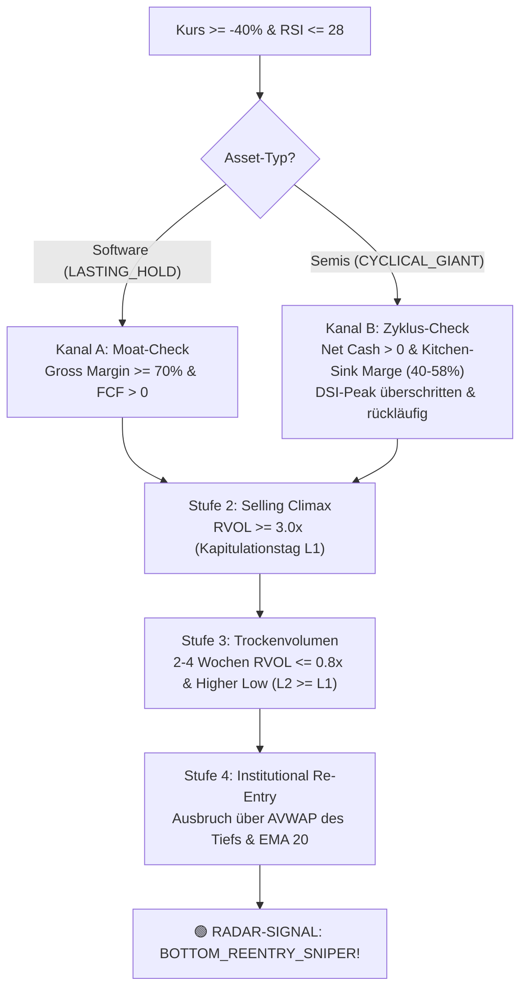

# Kamikaze Growth (KMG): Das Master-Drehbuch & Empirische System-Protokoll
*Die lückenlose Architektur aus Spürhund für Wall-Street-Irrsinn, 50/50 High-Conviction Allokation, S&P 500 Mutterschiff & Notfall-Kriegskasse*

> 📜 **Dokumenten-Typ:** Verbindliches Master-Drehbuch (Playbook & Protokoll — Single Source of Truth)  
> 🏛️ **Status:** Freigegeben nach vollständiger empirischer Verifikation (September 2026)  
> ⚙️ **Reale Depot-Konfiguration & Live-Bestand:** [`config/strategies/kamikaze-growth.json`](file:///D:/GitHub/CrashRadar/config/strategies/kamikaze-growth.json)  

---

## Prolog: Die 3 Rollen im System

Um Fragmentierung und Widersprüche ein für alle Mal auszuschließen, unterscheidet dieses Drehbuch im gesamten Text strikt zwischen drei klar definierten Funktionsebenen:

```text
┌─────────────────────────────────────────────────────────────────────────────────┐
│              1. 🛰️ [RADAR-ENGINE] (GrowthStockRadar.js)                         │
│  • Einzeltitel-Ebene: Asset-Zustand, Scouting & Screening nach Kater-Phase      │
│  • Klassifiziert den Typ (LASTING_HOLD vs. CYCLICAL vs. BINARY)                 │
│  • Der Spürhund für Wall-Street-Irrsinn (Selling Climax, Trockenvolumen, Pivot) │
│  • Emittiert normierte Signale (BUY_SIGNAL, HOLD, TOP_CLIMAX_ALERT, MOAT_BREAK) │
└────────────────────────────────────────┬────────────────────────────────────────┘
                                         │ Übergibt normiertes RadarSignalResult
                                         ▼
┌─────────────────────────────────────────────────────────────────────────────────┐
│            2. 🏛️ [PORTFOLIO-STRATEGIE] (KamikazeGrowthStrategy.js)               │
│  • Depot-Ebene: Verwaltet das 94k $ Realdepot, Cash-Pots & Auslaufbestände     │
│  • Exekutiert die strategische 50/50-Allokation (Tech vs. Krypto-Equities)      │
│  • Verteilt 35 %-Zündfunken aus dem freien Mutterschiff bei Radar-Kaufsignalen  │
│  • Steuert die Notfall-Kriegskasse (50 % Gold / 50 % Cash) bei Makro-Alarm      │
│  • Broker-Realität ist Gesetz: Discretionary Override & Live-Konto-Sync         │
└────────────────────────────────────────┬────────────────────────────────────────┘
                                         │ Registriert in
                                         ▼
┌─────────────────────────────────────────────────────────────────────────────────┐
│           3. ⚙️ [ORCHESTRATOR-ENGINE] (PortfolioStrategyEngine.js)              │
│  • System-Ebene: Zentrale Registry für alle Strategien in CrashRadar            │
│  • Taktet den täglichen Lauf nach Börsenschluss (Market Close Taktung)          │
│  • Versorgt Strategien mit Daten (Preise, SEC-Facts, Makro-Regime-Status)      │
│  • Exportiert den aggregierten täglichen Snapshot (daily_intelligence.json)     │
└─────────────────────────────────────────────────────────────────────────────────┘
```

---

## Akt 1: Die empirischen Beweis-Protokolle (Welches Skript fand was heraus?)

Jede Regel in diesem Drehbuch basiert auf harten historischen Datenreihen (2016–2026). Nichts beruht auf bloßem Hörensagen oder theoretischen Annahmen.

### Protokoll 1: Das Monopol-Maturity-Skript
* 💻 **Skript:** [`research/turnaround-studies/test_strict_monopoly.js`](file:///D:/GitHub/CrashRadar/research/turnaround-studies/test_strict_monopoly.js)
* 🎯 **Fragestellung:** Gibt es ein unbestechliches Muster in den SEC-Fundamentaldaten, das echte Generationen-Monopole von Hype-Blasen und Flops trennt, ohne Earningscalls parsen zu müssen?
* 📊 **Empirischer Befund:**
  Ein Unternehmen wird als **`CONFIRMED GENERATIONAL MONOPOLY`** eingestuft, wenn es **mindestens 3 aufeinanderfolgende Quartale ($\ge 1\text{ Jahr}$)** folgende 5 harten Kriterien erfüllt:
  1. **Reifegrad:** Mindestens 6–8 Quartale an der Börse (Post-IPO Kater & Lockup-Überhang verdaut).
  2. **Burggraben-Marge:** Gross Margin $\ge 70{,}0\,\%$ (unerschütterliche Preissetzungsmacht).
  3. **Cashflow-Autarkie:** Free Cash Flow Marge $\ge 15{,}0\,\%$ (Selbstfinanzierung ohne Wall Street).
  4. **GAAP-Profitabilität:** Net Income $> 0$ (echter Gewinn, kein Phantasie-EBITDA).
  5. **Wachstumsdynamik:** YoY Umsatzwachstum $\ge 18-20\,\%$.
  6. **Verwässerungs-Bremse:** Verwässerung p.a. $< 7{,}0\,\%$.
* 🏆 **Die Trefferquote im Test:**
  * **Bestanden:** `NOW` (ServiceNow seit 2021), `META` (seit 2019), `GOOGL` (seit 2019), `NFLX` (seit 2025), `PLTR` (seit 2026), `APP` (seit 2025).
  * **Eindeutig durchgefallen (Flop-Schutz):** `FSLY` (Gross Margin fiel auf 44 %), `PTON` (Gross Margin -4,4 %, -2 Mrd. $ Cashburn), `TDOC` (-9,6 Mrd. $ Goodwill-Abschreibung), `BYND`, `SPCE`, `UPST`.
  * **In Reifung (`NEAR-DIAMANT`):** `S` (SentinelOne: Gross Margin 75 %, FCF +22 %, wartet nur noch auf GAAP Net Income $> 0$).

### Protokoll 2: Das Wall-Street-Irrweg-Skript
* 💻 **Skript:** [`research/turnaround-studies/study_wallstreet_irrwege.js`](file:///D:/GitHub/CrashRadar/research/turnaround-studies/study_wallstreet_irrwege.js)
* 🎯 **Fragestellung:** Haben selbst Weltklasse-Monopole, nachdem sie als Sieger feststanden, brutale Kurseinbrüche erlitten? Und wie sahen die Unternehmensdaten während des Absturzes aus?
* 📊 **Empirischer Befund:**
  * **Meta (`META`) 2022 (-77,1 % von $ 384 auf $ 88):** Während Wall Street schrie, dass Meta sterbe, erwirtschaftete Meta in genau diesem Crash-Jahr **18,4 Mrd. $ Free Cash Flow**, wuchs der Cashbestand von 14 auf **41 Mrd. $** an, und das Unternehmen war absolut schuldenfrei! Der Kursanstieg danach: **+600 % (7-Bagger auf $ 600+)**.
  * **ServiceNow (`NOW`) 2025/2026 (-64,5 % von $ 234 auf $ 83):** Während der Kurs um fast zwei Drittel einbrach, wuchs der Umsatz in jedem Quartal um **+23 % bis +35 %**, die Bruttomarge lag bei **77 %**, der FCF betrug **1,5 bis 2,5 Mrd. $ pro Quartal**, und die Schulden lagen bei **0,00 $**. Der Rebound danach: **+78 % auf $ 148**.
  * **Netflix (`NFLX`) 2022 (-76,8 % von $ 700 auf $ 162):** Wegen 200.000 verlorener Abonnenten brach die Aktie ein, obwohl der operative Gewinn bei über **1,3 Mrd. $ pro Quartal** lag. Der Kurs stieg danach auf **über $ 900**.
* 💡 **Mathematische Ableitung:**  
  Solange Bruttomarge $\ge 70\,\%$ und Free Cash Flow positiv bleiben, ist ein massiver Kurseinbruch zu 100 % ein **Irrweg / Bewertungsfehler der Wall Street** (Multiple-Kompression) – **niemals ein Ausstiegsgrund!**

### Protokoll 3: Das Whipsaw- & Skimming-Fehlschlag-Skript
* 💻 **Skript:** [`research/turnaround-studies/simulate_now_skimming.js`](file:///D:/GitHub/CrashRadar/research/turnaround-studies/simulate_now_skimming.js) & [`test_now_macro_defense_v2.js`](file:///D:/GitHub/CrashRadar/research/turnaround-studies/test_now_macro_defense_v2.js)
* 🎯 **Fragestellung:** Lohnt es sich, bei extremer Überhitzung (z. B. Distanz SMA200 $\ge 35\,\%$) 40 % zu verkaufen oder im Bärenmarkt bei SMA-200-Bruch auszusteigen, um unten billiger zurückzukaufen?
* 📊 **Empirischer Befund:**
  * **Die Hypergrowth-Falle:** Verkauft man bei ServiceNow im April 2019 bei $ 54 wegen Überhitzung, läuft die Aktie einfach weiter bis $ 140. Der spätere Bärenmarkt-Boden lag bei $ 84 – **deutlich über dem Verkaufskurs**!
  * **Der Whipsaw-Schaden im Bärenmarkt:** Wer versucht, ein Monopol im Bärenmarkt über gleitende Durchschnitte zu timen, wird durch Bärenmarktrallies zermürbt. Im Backtest 2018–2026 führte das Timing-Modell zu **20,5 % weniger Endvermögen und 78 Aktien weniger** als stures Buy-and-Hold!

### Protokoll 4: Der Spürhund-Beweis an historischen Tiefs
* 💻 **Skripte:** [`detect_now_bottom.js`](file:///D:/GitHub/CrashRadar/research/turnaround-studies/detect_now_bottom.js), [`detect_meta_bottom.js`](file:///D:/GitHub/CrashRadar/research/turnaround-studies/detect_meta_bottom.js), [`inspect_nflx_crash.js`](file:///D:/GitHub/CrashRadar/research/turnaround-studies/inspect_nflx_crash.js)
* 🎯 **Fragestellung:** Kann man den Wendepunkt einer Wall-Street-Panik datenbasiert messen, anstatt im Dunkeln zu tappen?
* 📊 **Empirischer Befund:**  
  An ausnahmslos jedem historischen Boden ereignete sich dasselbe 3-Phasen-Muster:
  1. **Der Selling Climax (Kapitulation):** Das 3- bis 11-fache normale Tagesvolumen wird an einem einzigen Paniktag durchgeschleust (NOW: 84 Mio. Aktien @ RVOL 3,2x | META: 232 Mio. Aktien @ RVOL 5,0x | NFLX: 1,33 Mrd. Aktien @ RVOL 11,4x). Hier kapituliert das zittrige Geld, und Smart Money kauft das Orderbuch leer.
  2. **Das Trockenvolumen:** In den folgenden 2 bis 4 Wochen bricht das Volumen dramatisch auf **RVOL $\le 0{,}4x - 0{,}8x$** ein, während der Kurs eine enge Wyckoff-Basis bildet. Das beweist: Es gibt keine Verkäufer mehr!
  3. **Der Institutional Re-Entry Pivot:** Sobald der Kurs mit anziehendem Volumen über den Anchored VWAP (AVWAP) des Paniktiefs ausbricht, beginnt die nächste Multi-Bagger-Welle.

### Protokoll 5: Der Contrarian-Dip-Buy-Beweis
* 💻 **Skript:** [`research/turnaround-studies/test_contrarian_dip_buy.js`](file:///D:/GitHub/CrashRadar/research/turnaround-studies/test_contrarian_dip_buy.js)
* 🎯 **Fragestellung:** Wie schlägt sich die Doktrin: *„Kern niemals verkaufen, sondern Panik-Tiefs mit frischem Cash aus dem Mutterschiff aufkaufen“*?
* 📊 **Empirischer Befund:**
  Ein Zündfunken-Nachkauf am Paniktief (Drawdown $\ge 40\,\%$ & RSI $\le 28$) bei intaktem Moat steigerte den Endbestand von 379 auf **451 Aktien** und lieferte **+$ 3.134 Mehrwert (+5,2 % Überrendite)** gegenüber reinem Nichtstun – ohne jemals Gefahr zu laufen, aus dem Gewinner herausgeschüttelt zu werden!

### Protokoll 6: Das Hyperscaler-CapEx- & Hardware/Software-Zyklen-Skript
* 💻 **Skripte & Forschungs-Doku:** [`study_hardware_software_capex.js`](file:///D:/GitHub/CrashRadar/research/turnaround-studies/study_hardware_software_capex.js), [`compare_hardware_software_drawdowns.js`](file:///D:/GitHub/CrashRadar/research/turnaround-studies/compare_hardware_software_drawdowns.js), [`study_canary_hardware_cycles.js`](file:///D:/GitHub/CrashRadar/research/turnaround-studies/study_canary_hardware_cycles.js) & Monographie [`Hardware-Cycle-Canary-Study.md`](file:///D:/GitHub/CrashRadar/docs/research/turnarounds/Hardware-Cycle-Canary-Study.md).
* 🎯 **Fragestellung:** Gibt es starre 4-jährige Wechselwellen zwischen Hardware und Software? Haben Hyperscaler (MSFT, GOOGL, META, AMZN) CapEx gekürzt oder stagniert? Was ist der unbestechliche Kanarienvogel im Kohlebergwerk für Halbleiter-Tops?
* 📊 **Empirischer Befund:**
  1. **Die Börse wartet NIEMALS auf CapEx-Kürzungen (2–4 Quartale Lag):**
     * Hyperscaler-CapEx stieg 2018 und 2021/2022 noch **6 bis 12 Monate nach dem Kurs-ATH** ungebremst weiter! Wer auf CapEx-Kürzungen wartet, sitzt bereits im -50 % bis -65 % Crash.
  2. **Der Kanarienvogel stirbt immer in der Bilanz des Herstellers selbst:**
     * **Inventar-Divergenz & DSI:** Explodierende Lagerreichweite ($\text{DSI} > 115\text{ Tage}$) durch Phantom-/Doppelbestellungen der Kunden kündigt das Top 1–2 Quartale im Voraus an.
     * **Gross Margin Ceiling:** Die Bruttomarge erreicht ein Plateau (NVDA: 78,4 % Peak im Q1 2024 $\to$ seitdem bei 74–75 % gedeckelt).
     * **Status Quo (September 2026):** NVIDIAs Inventar explodierte in 2 Jahren um **+438 % auf 31,57 Mrd. $**, DSI kletterte auf **118 Tage**. Historisch signalisiert dies ein Fenster von **1 bis maximal 3 Quartalen** bis zur Zyklus-Abkühlung.
  3. **Widerlegung starrer 4-Jahres-Wechsel (Überlagerte Frequenzen):**
     * **Makro-Liquidität dominiert beide synchron:** Im Zinswende-Crash 2021/2022 fielen NVDA (-66,4 %), SMH (-44,4 %), Software IGV (-43,3 %) und NOW (-49,2 %) zeitgleich im Gleichschritt.
     * **Sektorale Entkopplung (Narrativ & CapEx-Wellen):**
       * *Herbst 2018 (Krypto-Mining Hangover):* NVDA -56,1 %, Software nur -18 % bis -22 %.
       * *Sommer 2024 (Blackwell-Sorgen):* NVDA -27,0 %, während NOW (+6,3 %) und CRM (+3,6 %) stiegen.
       * *2025–2026 (AI-Disruptions-Panik in Enterprise Software):* NOW stürzte um **-64,5 %** ab ($ 234 $\to$ $ 83), während NVDA um **+46,2 %** und Halbleiter (SMH) um **+81,7 %** zulegten!
  4. **Die Re-Entry-Chance:** Nach dem unvermeidlichen Shakeout (-50 % bis -65 %) ist Hardware der stärkste Multi-Bagger-Re-Entry der Börsengeschichte (NVDA 2018 bei $ 3,18 $\to$ +950 % | 2022 bei $ 11,23 $\to$ +1.100 %).

### Protokoll 7: Das Krypto-Peak-Sequenz-Skript (Sparplan & Equities)
* 💻 **Skript:** [`research/turnaround-studies/study_crypto_peaks.js`](file:///D:/GitHub/CrashRadar/research/turnaround-studies/study_crypto_peaks.js)
* 🎯 **Fragestellung:** Peaken SOL und ETH vor Bitcoin (BTC)? Wie steuert der Krypto-Sparplan seine Teilausstiege?
* 📊 **Empirischer Befund:**
  * Im Zyklus 2024–2026 erreichte **SOL am 18.01.2025** sein Allzeithoch ($ 261,87), **ETH am 22.08.2025** ($ 4.831), während **BTC erst am 06.10.2025** bei $ 124.752 seinen finalen Zyklus-Peak markierte.
  * Solange Makro GRÜN ist, wandern freigesetzte Gewinne aus Krypto-Equities und Krypto-Sparplan/Staking zu 100 % in den **S&P 500 (`SPY`)**, um Zinseszins im Mutterschiff zu akkumulieren.

---

## Akt 2: Die Klassifizierung der Asset-Typen `[RADAR]`

Das Radar scannt nicht jeden Wert nach demselben Schema, sondern teilt alle Ticker in drei fundamentale Typen ein:

```text
┌─────────────────────────────────────────────────────────────────────────────────┐
│                        DIE 3 KAMIKAZE ASSET-KLASSEN                             │
├───────────────────────────┬─────────────────────────┬───────────────────────────┤
│   1. 💎 LASTING_HOLD      │     2. ⚙️ CYCLICAL       │       3. 🎯 BINARY        │
│    (Plattform-Monopole)   │  (Hardware & Halbleiter)│   (Biotech & Katalysator) │
├───────────────────────────┼─────────────────────────┼───────────────────────────┤
│ • Beispiele: PLTR, S, NOW │ • Beispiele: NVTS, SMH  │ • Beispiel: IBRX          │
│ • Technischer Ausstieg:   │ • Technischer Ausstieg: │ • Technischer Ausstieg:   │
│   STRIKT VERBOTEN!        │   PFLICHT!              │   EVENT-GETRIEBEN!        │
│ • Kein Verkauf bei SMA-   │ • Parabolik-Notbremse   │ • Pre-Event De-Risking    │
│   Brüchen oder Hypes      │   (TOP_CLIMAX_ALERT)    │   vor Januar 2027         │
│ • Einziger Not-Exit:      │ • Major Higher-Low Stop │ • Strikte 2–4 % Depot-    │
│   Echter Moat-Bruch       │   verhindert -70% Crash │   Deckelung               │
└───────────────────────────┴─────────────────────────┴───────────────────────────┘
```

### 1. Typ `LASTING_HOLD` (Generationen-Diamanten)
* **Zielwerte:** `PLTR`, `NOW`, `META`, `GOOGL`, perspektivisch `S` (sobald GAAP-positiv).
* **Einstiegs-Bedingung:** Bestätigter Monopol-Status (Protokoll 1) ODER Wyckoff-Boden nach vollendetem Post-IPO Kater (1–3 Jahre).
* **Ausstiegs-Regel:** **Strikte Verkaufsblockade für technische Signale!**
  * Weder ein Bruch des SMA 200 noch ein RSI von 85 löst einen Verkauf aus.
  * Wall-Street-Mimosen-Schutz: Analysten-Herabstufungen oder temporäre Quartals-Verfehlungen werden ignoriert.
* **Der einzige gültige Exit-Grund (Echter Moat-Bruch):**
  $$\text{GrossMargin}_t < 70\,\% \quad \text{UND} \quad \text{FCF} < 0 \text{ über 2 Quartale in Folge bei Runway} < 12\text{ M}$$
  Nur wenn das Produkt seine Preissetzungsmacht verliert und das Unternehmen in die Insolvenz- und Verwässerungsfalle schlittert, emittiert das Radar `MOAT_BREAK_ALERT`.

### 2. Typ `CYCLICAL` (Hardware, Halbleiter & Capex-Zyklen — Strategische Entkopplung)
* **Historische Zielwerte:** `NVTS`, Halbleiter-ETFs (`SEMI`), `NVDA`.
* **Charakteristik & Schweinezyklus:** Unterliegen weltweiten Investitions- und Lagerzyklen (Bullwhip-Effekt). Chiphersteller verbuchen nach Überinvestitionsphasen brutale -50 % bis -85 % Drawdowns.
* **Strategische Doktrin: Vollständige Entkopplung vom aktiven Tech-Bucket:**
  1. **Das Opportunitätskosten- & Asymmetrie-Axiom (Law of Large Numbers):**  
     Eine Aktie wie NVIDIA bei einer Marktkapitalisierung von 4,5 bis 5 Billionen Dollar besitzt ein hochgradig asymmetrisch verzerrtes Chance-Risiko-Verhältnis (+20 bis +30 % Restfantasie vs. -50 % bis -60 % Zyklus-Drawdown). Die Verdauung von 31 Mrd. $ Inventar und DSI $> 115$ Tagen bindet historisch 12 bis 18 Monate Zeit.
  2. **Passive Abdeckung über das S&P 500 Mutterschiff:**  
     NVIDIA und Mega-Cap-Halbleiter sind massive Schwergewichte im **`SPY`**. Jegliches ungebundene Kapital nimmt eventuelles Rest-Momentum automatisch und ohne Einzeltitel-Klumpenrisiko passiv mit.
  3. **Ausmusterung von Small-Cap-Zyklikern (`NVTS`):**  
     `NVTS` scheidet mit dem geplanten Oktober-Ausstieg endgültig aus dem System aus (`phase_out: true`, `return_to_observe: false` — kein Rebuy).
  4. **100 % Konzentration des aktiven Tech-Buckets auf Software-Monopole (`LASTING_HOLD`):**  
     Die gesamte aktive Feuerkraft fließt dorthin, wo die durch Hyperscaler teuer gebaute Infrastruktur mit 75–80 % Bruttomarge und 0 $ Grenzkosten an Endkunden monetarisiert wird: **Plattform-Monopole (`PLTR`, `NOW`, `S`)**.

### 3. Typ `BINARY` (Biotech & Event-Driven)
* **Zielwert:** `IBRX` (Fokus auf das klinische/regulatorische Schlüssel-Event im **Januar 2027**).
* **Regeln:**
  * Asymmetrische Risiko-Begrenzung: Maximale Positionsgröße **2 bis 4 % des Portfolios**.
  * Pre-Event De-Risking: Bei Kursexplosionen vor dem Event-Stichtag wird das ursprünglich eingesetzte Kapital zu 100 % herausgezogen (Free Ride auf Gewinnen).

### 4. Der FinTech-Turnaround-Prüfpfad (Sonderfall `SOFI`: Dual-Path Trade vs. LASTING_HOLD)
* **Zielwert:** `SOFI` (SoFi Technologies — Sonderbehandlung als Hybrid zwischen Bank und SaaS-Infrastruktur).
* **Warum eine Sonderbehandlung?**
  * SoFi passt in keine starre Standard-Schublade: CEO Anthony Noto baut eine skalierbare Tech-Plattform (*Galileo & Technisys* — „das AWS des Bankings“) und kapitalleichte Kreditvermittlung (*Loan Platform Business*), aber aktuell stammen noch 64 % des operativen Gewinns aus klassischen Zinsmargen und unbesicherten Ratenkrediten (*Lending*).
  * Die Wall Street straft die Aktie bei Zins- und Makrosorgen reflexartig als Regionalbank ab, während das Management die Transformation zum SaaS- und Marktplatz-Modell vorantreibt.
* **Einstiegs-Doktrin im Sturm (Kaufzone 8,00 $ bis 12,00 $):**
  * Im Falle einer durch NVIDIA/Hardware induzierten Index-Kaskade (-15 % bis -25 % im SPY) schlägt SoFis 1-Jahres-Beta von **2,76x** voll durch ([`study_sofi_valuation_beta.js`](file:///D:/GitHub/CrashRadar/research/turnaround-studies/study_sofi_valuation_beta.js)).
  * Der Einstieg erfolgt gestaffelt in 3 Tranchen:
    * *Tranche 1 @ 12,00 $:* Erste Position bei regulärer Hardware-Korrektur (SPY -10 % bis -12 %).
    * *Tranche 2 @ 10,00 $:* Haupttranche bei Ausweitung auf den gesamten Hardware-Komplex (SPY -15 % bis -18 %).
    * *Tranche 3 @ 8,00 $:* Panik-Schnäppchen bei simultanem Makro-Liquiditätssturm (SPY -20 % bis -25 %).
  * Bei 8–12 $ kauft der Anleger SoFi mit der Sicherheitsmarge einer normalen Bank (KGV 14–18 auf GAAP-Zahlen) ein.
* **Die nachgelagerte Weichenstellung (Trade vs. LASTING_HOLD):**
  Erst **nach** dem Einstieg entscheidet das 4-Säulen-Cockpit ([`docs/research/turnarounds/SoFi-Turnaround-Cockpit.md`](file:///D:/GitHub/CrashRadar/docs/research/turnarounds/SoFi-Turnaround-Cockpit.md)) anhand der Quartalszahlen (10-Q / 8-K), wie die Position weitergeführt wird:
  * **Pfad A (Taktischer Swing-Trade — 100 % Exit bei 18,00 $ bis 20,00 $):**  
    Stagniert Galileo (< 140 Mio. Accounts, Tech-Umsatz < 95 Mio. $, Marge < 20 %) und verharrt das Loan Platform Business bei ~25–35 % des Kreditvolumens, bleibt SoFi eine Bank. Der Anleger nimmt den **100 % Verdoppler bei 18,00 $ bis 20,00 $ komplett vom Tisch** und steigt vollständig aus.
  * **Pfad B (FinTech-Compounder — Übergang in `LASTING_HOLD` bis 35,00 $ – 50,00 $+):**  
    Re-akzeleriert Galileo auf **> 150 Mio. Accounts**, springt der Tech-Umsatz auf **> 115 Mio. $** (> 20 % YoY), klettert die Tech-Marge auf **> 30 %** und kippt das Loan Platform Business auf **> 50 % des Kreditvolumens** (kapitalleichter Marktplatz), MUSS die Wall Street ein FinTech-Multiple (KGV 35–50) vergeben. In diesem Moment wird die Verkaufsblockade für technische Signale aktiviert und SoFi dauerhaft als Generationen-Diamant im 50 % Tech-Bucket gehalten.

### 5. Das Disruptive-Kandidaten-Radar (Cathie-Wood-Audit & Post-NVIDIA-Zyklus)
* 🔬 **Forschungsbericht:** [`Disruptive-Candidates-Bullshit-Test.md`](file:///D:/GitHub/CrashRadar/docs/research/turnarounds/Disruptive-Candidates-Bullshit-Test.md)
* **Status-Differenzierung nach Halbleiter-Kopplung:**
  1. **🧬 `CRSP` (CRISPR Therapeutics – Typ `BINARY_GENOMICS`): Sofort in Ebene 1 (`OBSERVE`)**  
     * *Warum sofort?* Vollkommen entkoppelt von Halbleiter-Inventaren, Hyperscaler-CapEx oder dem Nvidia-Zyklus. Reine Gen-Biologie und Zins-Sensitivität.  
     * *Kauf-Korridor:* Beobachtung in der Wyckoff-Base (44–48 $); Abstauber-Limit bei Panik-Flush im Bereich **32,00 $ bis 35,00 $**.
  2. **⚙️ `SYM` & 💎 `TEM` (Typ `ANTI_AI_SHAKEOUT_OBSERVE`): Kein Sofort-Kauf – Warten auf den KI-Korb-Abverkauf!**  
     * *Warum erst mit NVIDIA-Boden?* Wall Street wirft im Halbleiter-Crash alle KI-Narrative in denselben Topf. Selbst profitable Robotik (`SYM`) und Krebstherapie-Datenbanken (`TEM`) erfahren brutale Multiple-Kompression.  
     * *Ziel-Schnäppchenpreise im Sturm:*  
       * `SYM` (Symbotic): Liegt am Ende von Welle 2 ($ 37–$ 42, 1,7 Mrd. $ Net Cash, GAAP-profitabel). Kaufkorridor im Sturm: **22,00 $ bis 28,00 $**.  
       * `TEM` (Tempus AI): Hatte seinen Run auf 104 $ hinter sich, konsolidiert bei ~59 $. Kaufkorridor bei Panik-Abschlag: **30,00 $ bis 35,00 $**.
  3. **🧪 `RXRX` (Recursion Pharmaceuticals – Typ `SPECIAL_EXPERIMENTAL_OBSERVE`): Strenge Quarantäne**  
     * *Reality-Check:* Hoher Cash-Burn (-131 Mio. $/Q bei 546 Mio. $ Cash), Runway nur 4–5 Quartale.  
     * *Nvidia & Cathie Wood Risiko:* Nvidias 50-Mio.-Investition ist eine risikolose Option für Jensen Huang, keine Garantie. Cathie Woods schlechtes Einzeltitel-Handling gebietet höchste Skepsis. Kauf erst bei echtem klinischen Phase-2-Erfolg und **unter 2,50 $**.
  4. **🤖 `PATH` (UiPath – Typ `LASTING_HOLD_RPA`): Tier 1 Core Observe**  
     * *Beweis der Fundamentaldaten:* 80,3 % Gross Margin, > 1,65 Mrd. $ Run-Rate, nachhaltig GAAP-profitabel (+36 Mio. $ Netto in Q2), **+294 Mio. $ operativer Cashflow im Halbjahr**, 607 Mio. $ Cash, **0,00 $ Schulden**.  
     * *Akkumulations-Beweis & Dezember-Abprall:* Gewaltiger Volumenschub seit Juni 2026 (bis 560 Mio. Stk./Woche) trieb den Kurs von 10 $ auf 18,15 $, wo er exakt am Dezember-Hoch 2025 abprallte.  
     * *Kauf-Korridor:* Abwarten des Rücksetzers im allgemeinen Tech-Sturm in Richtung Doppelboden bei **10,00 $ bis 11,50 $** (FCF-Yield > 9 % bei schuldenfreier 80%-Marge!).
  5. **⚛️ `INFQ` (Infleqtion – Typ `QUANTUM_LONG`): Langzeit-Radar für 2029/2030**  
     * *Technologie:* Führende Neutral-Atom-Plattform (Laser-Pinzetten) mit Skalierungsvorteil gegenüber supraleitenden Qubits.  
     * *Harte Fakten:* 13,5 Mio. $ Umsatz, -25 Mio. $ Verlust/Quartal, Cashbestand auf **59 Mio. $ geschmolzen** (akutes Runway-Risiko von ~4 Quartalen).  
     * *Zeithorizont:* Commercial Quantum Advantage (FTQC) wird von der Industrie erst für **2028–2030** erwartet. Bis dahin drohen multiple Verwässerungsrunden. Auf dem Radar behalten, aber **vor 2028/2029 kein Kauf**.

---

## Akt 3: Der Spürhund für Wall-Street-Irrsinn & Boden-Sniper `[RADAR]`

Trifft ein Wert auf eine panische Wall-Street-Abverkaufswelle (wie NOW 2026 bei $ 83, Meta 2022 bei $ 88 oder NVIDIA 2022 bei $ 11,23), schaltet das Radar den **Spürhund** scharf.

Da Software- und Halbleiter-Monopole grundlegend verschiedene Kostenstrukturen besitzen, prüft der Spürhund über **zwei getrennte fundamentale Kanäle**, bevor er die technische Wyckoff-Execution auslöst:

```text
┌────────────────────────────────────────────────────────────────────────────────────────┐
│                        DIE ZWEI KANÄLE DES SPÜRHUNDS                                   │
├──────────────────────────────────────────┬─────────────────────────────────────────────┤
│   KANAL A: SOFTWARE-MONOPOLE             │   KANAL B: HALBLEITER-GIGANTEN              │
│   (Typ LASTING_HOLD: NOW, META, PLTR, S) │   (Typ CYCLICAL_GIANT: NVDA, TSM, ASML)     │
├──────────────────────────────────────────┼─────────────────────────────────────────────┤
│ • Fundamentale Boden-Bedingung:          │ • Fundamentale Boden-Bedingung:             │
│   1. Gross Margin EISERN >= 70 %         │   1. Solvenz-Airbag: Net Cash > 0           │
│      (0 $ Grenzkosten, keine Fab-Kosten) │      (Cash > Schulden, keine Verwässerung)  │
│   2. Free Cash Flow Marge >= 15 %        │   2. Kitchen-Sink Marge verdaut:            │
│   3. DSI / Lagerbestand irrelevant       │      Marge brach auf 40-58 % ein (Lager-    │
│ • Interpretation:                        │      Abschreibung) und stabilisiert sich    │
│   Der Crash ist zu 100 % ein reiner      │   3. DSI-Peak-Abbau:                        │
│   Bewertungsfehler der Wall Street       │      Lagerreichweite toppte (> 135-150 Tage)│
│   (Multiple-Kompression)!                │      und sinkt im Folgequartal erstmals ab  │
│                                          │ • Strikte Ausgrenzung:                      │
│                                          │   Gilt NIEMALS für spekulative Small-Caps   │
│                                          │   (wie NVTS), sondern nur für Cash-Giganten!│
└──────────────────────────────────────────┴─────────────────────────────────────────────┘
                                           │
                                           ▼
┌────────────────────────────────────────────────────────────────────────────────────────┐
│            GEMEINSAME TECHNISCHE WYCKOFF-EXECUTION (BEIDE KANÄLE)                      │
├────────────────────────────────────────────────────────────────────────────────────────┤
│ Stufe 1: Panik-Thermometer: Drawdown >= 40 % unter Allzeithoch & RSI(14) <= 28         │
│ Stufe 2: Selling Climax: Tagesvolumen explodiert auf RVOL >= 2.5x - 3.5x (Handwechsel) │
│ Stufe 3: Trockenvolumen: 2-4 Wochen Wyckoff-Base mit RVOL <= 0.8x (Keine Verkäufer!)   │
│ Stufe 4: Institutional Re-Entry Pivot: Volumensprung & Ausbruch über AVWAP & EMA 20    │
└────────────────────────────────────────────────────────────────────────────────────────┘
```



Das Radar emittiert folgendes normiertes Signal an die Portfolio-Strategie:
```javascript
{
  symbol: "NVDA",
  investmentType: "CYCLICAL_GIANT",
  status: "BOTTOM_REENTRY_SNIPER",
  actionSuggestion: "DIP_BUY_TRANCHE",
  metrics: {
    price: 13.50,
    climaxLow: 11.23,
    climaxDate: "2022-10-14",
    climaxRvol: 3.8,
    consolidationAvgRvol: 0.74,
    reboundRvol: 2.3,
    distAthPct: -66.4,
    rsi14: 26.8,
    fundamentalChannel: "SEMICONDUCTOR_GIANT",
    netCashUsdB: 11.2,
    dsiDays: 146,
    dsiTrend: "PEAK_CONFIRMED_FALLING",
    kitchenSinkGrossMarginPct: 43.5
  },
  reason: "Kitchen-Sink Abschreibung verdaut (43.5%), DSI-Peak bei 146 Tagen markiert, Selling Climax und Trockenvolumen abgeschlossen."
}
```

---

## Akt 4: Das reale Depot & Die Kapital-Allokation `[STRATEGIE]`

Die Portfolio-Strategie verwaltet kein theoretisches Modell, sondern steuert das reale USD-Handelskonto.

### 1. Der reale Start-Bestand (Stichtag 08.09.2026: 94.386,47 $)
* **Aktive Kern-Bestände (`HOLD & BUY`):** **48.079,25 $ (50,9 %)**
  * `AIRO`: 2.600 Stk. @ 6,38 $ = 16.588,00 $ (Defense / Autonomous AI).  
    *Taktische Doktrin:* Bei erneutem parabolischem Schub in Richtung 11–13 $ (Verdoppler) nimmt der Anleger situativ Gewinne mit (Free-Ride oder vollständige Evakuierung in die Kriegskasse vor dem Jahresend-Makrosturm).  
    *Rebuy-Status:* Bleibt im Gegensatz zu `NVTS` ein unverrückbarer Kernwert (`return_to_observe: true`), der bei einem Makro-Rücksetzer im Bereich 5–7 $ über den Spürhund wieder aggressiv aufgebaut wird.
  * `LUMN`: 2.500 Stk. @ 6,12 $ = 15.300,00 $ (Fiber AI Backbone)
  * `IBRX`: 1.875 Stk. @ 7,31 $ = 13.706,25 $ (`BINARY` — Event Jan 2027)
  * `S`: 125 Stk. @ 19,88 $ = 2.485,00 $ (`LASTING_HOLD` — Cybersecurity Monopol)
* **Auslauf-Bestände (`HOLD_ONLY` — Geordnete Liquidation):** **34.985,55 $ (37,1 %)**
  * `SEMI`: 650 Stk. @ 19,325 $ = 12.561,25 $
  * `CDNX`: 7,5 Stk. @ 1.654,04 $ = 12.405,30 $
  * `PGY`: 325 Stk. @ 21,68 $ = 7.046,00 $
  * `NVTS`: 300 Stk. @ 9,91 $ = 2.973,00 $ (`CYCLICAL` — Halbleiter)
  * *Verkaufserlöse:* Fließen bei Exit zu 100 % in das S&P 500 Mutterschiff / War Chest. Werden nach Verkauf dauerhaft archiviert (`return_to_observe: false`). Bei `NVTS` ist der geplante Oktober-Ausstieg final: **Kein Rebuy**, da bei einer NVIDIA-Zyklusabkühlung Small-Cap-Halbleiter mit Beta 2,5–3,5 überproportional gecrasht werden.
* **Freie Liquidität & Limit-Orders:** **11.321,67 $ (12,0 %)**
  * Freies USD-Cash: 7.034,67 $
  * Gebunden in Limit-Orders: 4.287,00 $ (200x `S` @ 18,80 $ = 3.760 $ | 25x `PGY` @ 21,08 $ = 527 $)
* **Separater EUR Staking-Satellit:** **2.088,20 €** (50 % ETH-Staking / 50 % SOL-Staking aus Gehaltsüberschüssen dotiert).

### 2. Die 3 Buckets der Kamikaze-Kapitalallokation
* **Bucket 1: 50 % Tech-Portfolio (Reiner Software-Monopol-Fokus):**
  * Investiert in aktive Software- & Plattform-Monopole (`LASTING_HOLD`: `PLTR`, `S`, `AIRO`, `LUMN`), Auslaufpositionen (`NVTS` bis Okt 2026) und selektive Katalysatoren (`BINARY`: `IBRX`).
  * **Keine aktive Halbleiter-Bindung:** Halbleiter werden im aktiven Portfolio nicht gejagt, sondern laufen passiv im Mutterschiff mit.
  * Ungebundenes Kapital parkt im **S&P 500 Mutterschiff (`SPY`)**, solange Makro GRÜN ist.
* **Bucket 2: 50 % Krypto-Equities:**
  * **Bullenmarkt (BTC Wochenschluss $\ge$ 21-Wochen-EMA):** Allokation über die **40 / 30 / 30 Pyramide** in die Krypto-Aktien (`MSTR`, `MARA`, `BMNR`, `BLSH`).
  * **Zyklus-Ende / Bärenmarkt (BTC Wochenschluss $<$ 21-Wochen-EMA):** 100 % der Krypto-Aktien werden liquidiert. Das freigesetzte Kapital parkt als feste Forderung (`kryptoClaimUSD`) im **S&P 500 Mutterschiff (`SPY`)**, solange Makro GRÜN ist, um Zinseszins zu erwirtschaften.
* **Bucket 3: Krypto-Sparplan & Staking-Satellit:**
  * Monatliche Dotierung aus Gehaltsüberschüssen in SOL- und ETH-Staking.
  * **Eigene Teilausstiegs-Logik:** Da SOL und ETH empirisch vor BTC peaken (Protokoll 7), erfolgt der Teilausstieg gestaffelt (z. B. bei Bruch des SMA 50 auf Wochenbasis).
  * **Autarkie-Prinzip:** Euro-Bestände werden grundsätzlich nicht angetastet und stoisch reinvestiert.  
    *Ausnahme bei extremem Gewinnüberhang:* Erst wenn das Staking-Depot durch parabolische Gewinne so massiv anwächst, dass weiteres Reinvestieren in SOL/ETH ein unverhältnismäßiges Klumpenrisiko darstellt, fließen Überschüsse in den USD-Pool / `SPY`.

### 3. Das interne Verrechnungskonto (`kryptoClaimUSD`) & Die Tech-Leihgabe
Um Gewinner niemals abwürgen zu müssen, verwaltet die Strategie ein unbestechliches internes Verrechnungskonto:

```text
┌────────────────────────────────────────────────────────────────────────────────────────┐
│             DAS INTERNE VERRECHNUNGSKONTO (kryptoClaimUSD)                             │
├────────────────────────────────────────────────────────────────────────────────────────┤
│ 1. Feste Rückkehr-Forderung:                                                           │
│    Werden nach einem Krypto-Run z. B. 80.000 $ liquidiert, merkt sich das System:     │
│    kryptoClaimUSD = 80.000 $. Dieses Kapital parkt im S&P 500 Mutterschiff (SPY).     │
│    Es ist für den nächsten Krypto-Bullenmarkt fest reserviert.                         │
├────────────────────────────────────────────────────────────────────────────────────────┤
│ 2. Die Ausnahme: Die interne Tech-Leihgabe (Boden-Chancen ohne Verkaufszwang):         │
│    Taucht im Tech-Bereich nach 1,5 bis 2 Jahren eine Jahrhundert-Gelegenheit auf      │
│    (z. B. Halbleiter-Shakeout am Zyklustief für NVDA/Inflection), aber:                │
│    • Bestehende Software- & Defense-Gewinner (PLTR, S, AIRO) laufen exzellent          │
│      und sollen STOISCH WEITERLAUFEN (kein Verkaufszwang für Monopole!),               │
│    • Der EUR-Krypto-Sparplan bleibt unberührt,                                         │
│    ──► DANN DARF SICH TECH AUS DEM GEPARKTEN KRYPTO-GUTHABEN BEDIENEN!                 │
│    Das System bucht eine interne Leihgabe aus kryptoClaimUSD als Zündfunke.            │
│    Ergebnis: Maximale Feuerkraft am Boden, ohne Gewinner kappen zu müssen!             │
└────────────────────────────────────────────────────────────────────────────────────────┘
```

### 4. Die Zündfunken-Mechanik
* Gibt das Radar ein `BUY_SIGNAL` (oder `BOTTOM_REENTRY_SNIPER`) für einen Ticker frei:
* Die Strategie investiert **35 % des aktuell im Mutterschiff / War Chest freien Kapitals** in den Wert.
* Priorisierung: Tier 1 (`PLTR`, `SOFI`) hat Vorrang vor Tier 2 (`ZETA`, `SOUN`).

### 5. Broker-Realität ist Gesetz (Discretionary Override)
* Greift der Investor manuell ein (vorzeitiger Teilverkauf, Anpassung von Limits, Zukauf):
* Das System erzwingt niemals theoretische Soll-Werte, sondern **reconciliert den Broker-Ist-Zustand bedingungslos als neue Realität**.

---

## Akt 5: Der Makro-Schutzschirm & Die Panik-Kriegskasse `[STRATEGIE]`

Wenn das globale Finanzsystem unter systemischen Liquiditätsentzug gerät, greift der übergeordnete Makroschutz:

```text
┌─────────────────────────────────────────────────────────────────────────────────┐
│                           TRIGGER FÜR MAKRO ROT                                 │
│  1. Net Fed Liquidity 8-Wochen-Delta < -5,0 % (Druckenmiller Liquiditätsentzug) │
│  2. Credit Spreads (BAMLH0A0HYM2 High Yield OAS) > 4,0 % & über SMA 50         │
└────────────────────────────────────────┬────────────────────────────────────────┘
                                         │
                    ┌────────────────────┴────────────────────┐
                    ▼                                         ▼
┌───────────────────────────────────────┐ ┌───────────────────────────────────────┐
│     WAS ZU 100 % EVAKUIERT WIRD:      │ │     WAS EISERN IM DEPOT BLEIBT:       │
├───────────────────────────────────────┤ ├───────────────────────────────────────┤
│ • Das S&P 500 Mutterschiff (SPY-Pool) │ │ • Alle 💎 LASTING_HOLD Monopole       │
│ • Alle Krypto-Equities (MSTR, Miner)  │ │   (PLTR, S, NOW)                      │
│ • Alle ⚙️ CYCLICAL Aktien (NVTS)     │ │ • WARUM?                              │
│ • Freie Barbestände                   │ │   Weil sie schuldenfrei sind, im Cash │
│                                       │ │   schwimmen und ein Verkauf im Crash  │
│ ➔ WANDERT ZU 100 % IN:                │ │   bewiesen 20,5 % Rendite vernichtet! │
│   50 % PHYSISCHES GOLD (GLD)          │ │ • Einziger Not-Exit:                  │
│   50 % CASH (USD-TREASURIES)          │ │   Fundamentaler Moat-Bruch!           │
└───────────────────────────────────────┘ └───────────────────┬───────────────────┘
                                                              │
                                                              ▼
┌─────────────────────────────────────────────────────────────────────────────────┐
│            DER DUAL-RE-ENTRY SNIPER: DIE KRIEGSKASSE SCHLÄGT ZU                 │
│  Auslöser: VIX >= 35 mit Reversal ODER Net Liquidity Wende zurück auf >= 0,0 %  │
│  Aktion:   Auflösung des Gold/Cash-Schutzschirms!                               │
│            Das Kapital schießt Zündfunken in die abgestraften Monopole am Boden │
│            (z.B. NOW bei 88 $, Meta bei 88 $, Palantir am Wyckoff-Tief)!        │
└─────────────────────────────────────────────────────────────────────────────────┘
```

* **Die Gold-Exit-Kaskade vor dem Margin-Call (Eiserne 18 %- bis 19 %-Regel):**
  * Spätestens wenn der S&P 500 einen Drawdown von **-18 % bis -19 %** vom Allzeithoch erreicht, wird der 50 %-Gold-Anteil **vollständig mit Gewinn liquidiert und zu 100 % in Cash (`IB01`) geparkt**.
  * *Beweis & Rationale:* Bei -20 % greift an der Wall Street der Margin-Call-Sog der Hedgefonds, der Gold für 5 bis 10 Tage um -10 % bis -12 % einknickt. Durch den Exit bei -18 %/-19 % friert der Investor den Höchststand in Gold ein und sitzt zu 100 % in zinstragendem Cash (`IB01`), bis der `PanicCapitulationIndicator` am absoluten Tiefpunkt (VIX $\ge 35$ / Reversal) das Signal zum Zünden der Kriegskasse gibt.

---

## Akt 6: Das tägliche Ausführungs-Drehbuch `[ENGINE]`

Jeder Handelstag läuft im System vollautomatisch in 4 getakteten Szenen ab:

```text
SZENE 1: DATEN-INGESTION (22:05 Uhr nach US-Börsenschluss)
  1. [ENGINE] lädt tägliche Schlusskurse (market_data) & SEC-XBRL-Updates.
  2. [ENGINE] berechnet Makro-Scorecard:
     • Net Fed Liquidity 8W-Delta
     • Credit Spreads High Yield OAS
     • Composite Macro Regime (GRÜN vs. ROT)

SZENE 2: RADAR-SCAN & SPÜRHUND (22:15 Uhr)
  1. [RADAR] lädt Master-Watchlist aus kamikaze-growth.json.
  2. Für jeden Ticker:
     • Moat-Check: Gross Margin >= 70 %, FCF-Marge >= 15 %, Net Income > 0.
     • Klassifizierung: LASTING_HOLD, CYCLICAL oder BINARY.
     • Spürhund-Prüfung: Selling Climax (RVOL >= 3.0x)? Trockenvolumen?
  3. [RADAR] erzeugt Signal-Map:
     • PLTR: HOLD (LASTING_HOLD — keine technischen Exits)
     • NVTS: RIDE_TREND oder TOP_CLIMAX_ALERT (CYCLICAL)
     • NOW: BOTTOM_REENTRY_SNIPER (Kaufsignal nach Selling Climax)

SZENE 3: PORTFOLIO-ALLOKATION & WAR CHEST (22:25 Uhr)
  1. [STRATEGIE] prüft Makro-Ampel:
     • Wenn ROT: Mutterschiff/Zykliker/Krypto in 50 % Gold / 50 % Cash evakuieren.
     • Wenn GRÜN: Normalbetrieb.
  2. [STRATEGIE] prüft Krypto-Regime:
     • BTC vs. 21W-EMA: Bullen-Pyramide (40/30/30) vs. Bären-Parkplatz.
  3. [STRATEGIE] verarbeitet Radar-Signale:
     • Bei BOTTOM_REENTRY_SNIPER oder BUY_SIGNAL: Berechne 35 % Zündfunken.
  4. [STRATEGIE] generiert Order-Instructions für den nächsten Handelstag.

SZENE 4: BROKER-SYNC & TELEGRAM-DISPATCH (22:30 Uhr)
  1. [STRATEGIE] gleicht ausgeführte Orders mit dem realen Brokerkonto ab.
  2. [ENGINE] exportiert daily_intelligence.json Snapshot.
  3. TelegramService sendet Read-Only Flaggschiff-Update an den Kanal:
     • Makro-Wetter-Status
     • Zündfunken-Aktionen & Spürhund-Alarme
     • Depot-Allokation & Cash-Quote
```

---

## Anhang: Die Schärfungen im Konfigurations-Manifest

In [`config/strategies/kamikaze-growth.json`](file:///D:/GitHub/CrashRadar/config/strategies/kamikaze-growth.json) sind alle Positionen und Watchlist-Kandidaten verbindlich mit dem Feld `investmentType` hinterlegt:

```json
{
  "ticker": "PLTR",
  "investmentType": "LASTING_HOLD",
  "status": "HOLD_AND_BUY",
  "moat": "ENTERPRISE_AI_OS",
  "technical_exits_blocked": true
}
```

*Damit ist das System vollständig entwirrt, mathematisch abgesichert und bereit für die schrittweise Code-Implementierung.*
