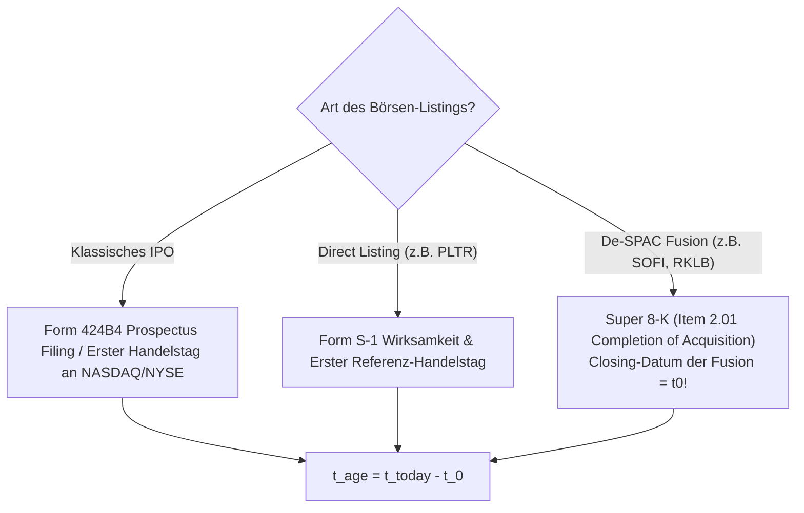

# System-Architektur & Master-Spezifikation: Post-IPO Growth Engine (PIGE)

> 📄 **Dokumenttyp:** Architektur-Konzept & Spezifikation (V2-Zukunftsprojekt)  
> 🎯 **Fokus:** Automatisierte Markt-Screening-Pipeline für qualitative Wachstums- und Turnaround-Aktien im Reife- und Bodenbildungs-Zeitfenster von **1 bis 5 Jahren nach Börsengang**.  
> ⚙️ **Technologie-Ausrichtung für V2:** Node.js, MySQL (`market_data`), REST-APIs (SEC EDGAR, NASDAQ Screener, Polygon/Tiingo).

---

## 1. Universum & Sektor-Definitionen

Klassische GICS-Sektorfilter versagen bei FinTech, Defense-Tech und New Energy, da diese Unternehmen über Industrials, Financials, Utilities und Information Technology verstreut sind. Die Engine arbeitet daher primär über **SIC- und NAICS-Industrieklassifikationen**.

### 1.1 Einschluss-Kriterien nach SIC- und NAICS-Codes

| Vertikale | Relevante Kernbereiche | Relevante SIC-Codes | NAICS-Referenz |
| :--- | :--- | :--- | :--- |
| **Core Tech** | SaaS, Enterprise Software, Halbleiter, AI-Hardware, Cloud | 7372 (Prepackaged Software)<br>7370–7379 (Data Processing/Services)<br>3674 (Semiconductors & Related Devices)<br>3571–3577 (Computer Hardware) | 511210, 541511, 334413 |
| **FinTech & Krypto-Infrastruktur** | Krypto-Broker, Handelsplattformen, Neobanken, Payment Processing, BNPL | 6211 (Security Brokers & Dealers)<br>7374 (Data Processing - Payments)<br>6199 (Finance Services)<br>6141 (Personal Credit Institutions) | 523120, 522320, 522291 |
| **Defense-Tech & Space/ISR** | Drohnensysteme, Aufklärungssatelliten, Cyber-Defense, elektronische Kriegsführung | 3760 (Guided Missiles & Space Vehicles)<br>3812 (Search, Detection, Navigation Instruments)<br>7373 (Computer Integrated Systems Design) | 336414, 334511, 541512 |
| **New Energy & Grid Tech** | Small Modular Reactors (SMR), Solar-Tracker, Großbatteriespeicher, Netzoptimierung | 3690 (Electrical Machinery/Storage)<br>4911 (Clean Power Generation / Nuclear)<br>3620 (Industrial Controls / Grid) | 221113, 221114, 335999 |

### 1.2 Konsequente Ausschluss-Kriterien (Blacklist)

Jedes Listing mit folgenden Merkmalen wird vorab ohne weitere Prüfung aussortiert:
* **Fossile Energien:** SIC 1311 (Crude Petroleum & Natural Gas), SIC 1381 (Drilling Oil & Gas Wells), SIC 2911 (Petroleum Refining).
* **Konventionelle Kleinwaffen & Munition:** SIC 3482 (Small Arms Ammunition), SIC 3484 (Small Arms), SIC 3489 (Ordnance & Accessories).
* **Unvollendete Blank-Check / SPAC-Mäntel:** SIC 6770 (Blank Checks – vor vollzogenem De-SPAC).
* **Penny-Stocks & OTC:** Nicht an NASDAQ oder NYSE notierte Werte (OTC, Pink Sheets) sowie Titel mit Marktkapitalisierung $< 300\text{ Mio. \$}$.

---

## 2. Bestimmung des Börsen-Alters ($t_{\text{age}}$) & Sonderklauseln

Das Ziel ist die exakte Identifikation von Unternehmen im **Reife- und Kater-Zeitfenster**:
$$365\text{ Tage} \le t_{\text{age}} \le 1.825\text{ Tage} \quad (1 \text{ bis } 5 \text{ Jahre})$$

Die Bestimmung des Referenz-Börsendatums ($t_0$) unterscheidet strikt nach der Art des Börsengangs:



1. **Klassisches IPO:**  
   $t_0$ entspricht dem Datum des finalen Emissionsprospekts (**Form 424B4**) bzw. dem ersten regulären Handelstag an der Hauptbörse.
2. **Direct Listing (z. B. Palantir `PLTR`):**  
   $t_0$ ist der Tag der Wirksamkeit der Registrierungserklärung und der Eröffnung der Referenzauktion.
3. **De-SPAC-Sonderklausel (WICHTIG für `SOFI`, `RKLB`, `NVTS`, `AIRO`):**  
   Ein SPAC notiert oft 1–2 Jahre als leere Mantelgesellschaft bei 10 $.  
   *Regel:* Als operatives Börsendatum $t_0$ gilt **nicht** der Handelsstart des leeren Mantels, sondern das offizielle **Closing-Datum der Fusion**, belegt durch das Einreichen des **Super 8-K (Item 2.01 Completion of Acquisition)** bei der SEC!

---

## 3. Zweistufige Screening-Architektur

```text
┌────────────────────────────────────────────────────────────────────────┐
│            US EQUITY MASTER UNIVERSE (NASDAQ & NYSE, ~4.000 TITEL)     │
└───────────────────────────────────┬────────────────────────────────────┘
                                    │ 
                                    ▼ 
┌────────────────────────────────────────────────────────────────────────┐
│ FILTER 0: VORFILTERUNG VIA NASDAQ-SCREENER CSV (Latenzfrei & Schnell)  │
│ • Marktkapitalisierung >= $ 300 Mio. & Mindestvolumen                  │
│ • Sektor-Whitelist (Tech, FinTech, Defense, New Energy) & Blacklist    │
│ • Reduziert das Universum von ~4.000 auf ca. 150–250 Fokus-Kandidaten  │
└───────────────────────────────────┬────────────────────────────────────┘
                                    │ 
                                    ▼ 
┌────────────────────────────────────────────────────────────────────────┐
│ FILTER 1: POST-IPO GATEKEEPER (Monatlicher Admission-Lauf)             │
│ • Börsenalter: 365 <= t_age <= 1.825 Tage (1 bis 5 Jahre)              │
│ • Keine Pleite-Gefahr: Distanz zum 52-Wochen-Tief D_Low >= +20 %       │
│ • Kein Penny-Stock-Ruin: Distanz zum ATH D_ATH >= -85 %                │
│ • Mindest-Runway: Bei negativem FCF mindestens 12 Monate Cash-Puffer   │
└───────────────────────────────────┬────────────────────────────────────┘
                                    │ Bestanden: Aufnahme in PIGE-Pool
                                    ▼ 
┌────────────────────────────────────────────────────────────────────────┐
│ PHASE 2: DEEP-DIVE TRACKING & SCORING (Laufender Pool)                 │
│ • Quartalsweises Fundamental-Assessment: Rule of 40 & Top-Line Dynamic │
│ • Verwässerungs-Wachhund: Dilution Rate < 7 % p.a.                     │
│ • Technischer Weinstein Stage-2 Check & Relative Stärke (RS vs QQQ)    │
│ • Qualifizierte Top-Scorer wandern automatisch auf Kamikaze 'OBSERVE'  │
└───────────────────────────────────┬────────────────────────────────────┘
                                    │ t_age > 1.825 Tage / Delisting / Buyout
                                    ▼ 
┌────────────────────────────────────────────────────────────────────────┐
│                         ARCHIVIERUNG ('EXPIRED_5Y')                    │
└────────────────────────────────────────────────────────────────────────┘
```

---

## 4. Mathematische Formeln & Screening-Metriken

### 4.1 Wachstumsdynamik & Rentabilität

* **YoY Quartals-Umsatzwachstum:**
  $$g_{\text{Rev YoY}} = \frac{\text{Revenue}_Q - \text{Revenue}_{Q-4}}{\text{Revenue}_{Q-4}} \times 100$$

* **Umsatz-Beschleunigung (Sequenziell YoY):**
  $$\Delta g_{\text{Rev}} = g_{\text{Rev YoY}, Q} - g_{\text{Rev YoY}, Q-1}$$
  *Signal: $\Delta g_{\text{Rev}} > 0$ signalisiert einen operativen Wendepunkt (Turnaround).*

* **Free Cash Flow Marge (FCF-Marge):**
  $$\text{FCF Margin} = \frac{\text{Operating Cash Flow} - \text{CapEx}}{\text{Revenue}} \times 100$$

* **Rule of 40 (SaaS- & Software-Benchmark):**
  $$\text{Score}_{\text{Rule40}} = g_{\text{Rev YoY}} + \text{FCF Margin}$$
  *Zielwert:* $\ge 40\,\%$ für Elite-Wachstumsstatus; $\ge 25\,\%$ als Mindest-Eintritt für Turnarounds.

---

### 4.2 Runway & Solvenz-Check (Schutz vor Pleiten)

> [!IMPORTANT]
> **Korrektur der Berechnungsbasis:** Da SEC 10-Q-Berichte Quartalszahlen (3 Monate) darstellen, muss der Cash-Burn auf Monatsbasis normiert werden. Eine Division durch 12 bei Quartalswerten würde die Runway fälschlich um den Faktor 4 aufblähen!

* **Monatliche Net Cash Burn Rate ($BC_{\text{Monthly}}$):**
  $$BC_{\text{Monthly}} = \begin{cases} \frac{|\text{FCF}_Q|}{3} & \text{wenn } \text{FCF}_Q < 0 \\ 0 & \text{wenn } \text{FCF}_Q \ge 0 \end{cases}$$

* **Cash Runway (in Monaten):**
  $$\text{Runway}_{\text{Months}} = \frac{\text{Cash \& Cash Equivalents} + \text{Short-Term Marketable Securities}}{BC_{\text{Monthly}}}$$

* **Gatekeeper-Schwellenwert:**
  * Ist $\text{FCF}_Q \ge 0$ (Free Cash Flow positiv): **Bestanden** (Selbstragend).
  * Ist $\text{FCF}_Q < 0$: Es gilt die harte Bedingung:
    $$\text{Runway}_{\text{Months}} \ge 12{,}0\text{ Monate}$$
    *(Schutz vor Not-Kapitalerhöhungen und Verwässerungs-Tod).*

---

### 4.3 Verwässerungs-Matrix (Dilution Control)

Frühe Wachstumsunternehmen kompensieren Mitarbeiter oft exzessiv über Stock-Based Compensation (SBC).

* **YoY Verwässerungsrate (Diluted Shares Outstanding):**
  $$\text{Dilution}_{\text{Rate}} = \frac{\text{Shares}_{\text{Diluted}, Q} - \text{Shares}_{\text{Diluted}, Q-4}}{\text{Shares}_{\text{Diluted}, Q-4}} \times 100$$
* **Schwellenwerte & Scoring-Malus:**
  * $< 3{,}0\,\%$ p.a.: **Exzellent** (Aktionärsfreundliche Kapitaldisziplin).
  * $3{,}0\,\% - 7{,}0\,\%$ p.a.: **Akzeptabel** für aggressive Wachstumsphasen.
  * $> 10{,}0\,\%$ p.a.: **Rote Flagge!** Schwerer Punkteabzug im Composite Score.

---

### 4.4 Technische Bodenbildung & Base-Building

* **Distanz zum 52-Wochen-Tief ($D_{\text{Low}}$):**
  $$D_{\text{Low}} = \frac{P_{\text{Aktuell}} - P_{\text{52W Low}}}{P_{\text{52W Low}}} \times 100$$
  *Bedingung:* $D_{\text{Low}} \ge +20{,}0\,\%$ (Beweis für Wyckoff-Akkumulation; Aktie macht keine neuen Tiefs mehr).

* **Distanz zum Allzeithoch ($D_{\text{ATH}}$):**
  $$D_{\text{ATH}} = \frac{P_{\text{Aktuell}} - P_{\text{ATH}}}{P_{\text{ATH}}} \times 100$$
  *Bedingung:* $D_{\text{ATH}} \ge -85{,}0\,\%$ bis $-88{,}0\,\%$.
  > [!NOTE]
  > Ein zu enger Filter (z. B. $-70\,\%$) würde Jahrhundert-Chancen wie Palantir ($ 45 \to \$ 6 = -86\,\%$) oder SentinelOne ($ 78 \to \$ 12{,}50 = -84\,\%$) am perfekten Boden eliminieren. Der $-85\,\%$-Filter trennt überlebensfähige Plattform-Turnarounds von ausradierten Penny-Stocks ($-98\,\%$).

---

## 5. Datenquellen & CrashRadar-Integrationsstrategie (Node.js & MySQL)

Zur Vermeidung von Medienbrüchen und Doppel-Infrastrukturen fügt sich PIGE in die bestehende CrashRadar-Architektur ein:

```text
┌─────────────────────────────────────────────────────────────────────────────────┐
│                      PIGE INTEGRATIONS-STACK IN CRASHRADAR                      │
├───────────────────┬─────────────────────────────────────────────────────────────┤
│ Universums-Filter │ Kostenloser NASDAQ Screener CSV Download (ca. 4.000 Ticker)  │
│                   │ Filterung via Node.js Stream-Parser nach Sektor & Cap       │
├───────────────────┼─────────────────────────────────────────────────────────────┤
│ Marktdaten        │ Bestehender Polygon.io- & Tiingo-Adapter in CrashRadar       │
├───────────────────┼─────────────────────────────────────────────────────────────┤
│ Fundamentaldaten  │ SEC EDGAR Company Submissions & Facts API (JSON/XBRL)        │
│                   │ mit Token-Bucket Pacer (strikt <= 10 Requests/Sekunde)      │
├───────────────────┼─────────────────────────────────────────────────────────────┤
│ Speicherung       │ Native MySQL Tabellen in CrashRadar                         │
│                   │ (`post_ipo_companies`, `post_ipo_fundamentals`,             │
│                   │  `post_ipo_evaluations`) via DatabaseConnectionPool         │
├───────────────────┼─────────────────────────────────────────────────────────────┤
│ Übergabe          │ Qualifizierte Spitzenkandidaten wandern automatisiert mit   │
│                   │ Status 'OBSERVE' in die Kamikaze- / MCW-Watchlist-Tabelle   │
└───────────────────┴─────────────────────────────────────────────────────────────┘
```

---

## 6. Datenmodell-Spezifikation (Relationales MySQL Schema für V2)

Folgende drei Tabellen werden in V2 über eine DB-Migration (`src/db/migrations/create_post_ipo_engine_tables.sql`) bereitgestellt:

1. **`post_ipo_companies` (Stammdaten & Börsen-Lifecycle):**
   * `symbol` (VARCHAR 16, PK)
   * `cik` (VARCHAR 10)
   * `company_name` (VARCHAR 255)
   * `sector`, `industry` (VARCHAR 128)
   * `sic_code` (INT)
   * `ipo_date` (DATE, referenziert echtes $t_0$ inkl. De-SPAC Super 8-K)
   * `listing_type` (ENUM: `'IPO'`, `'DIRECT_LISTING'`, `'DE_SPAC'`)
   * `exchange` (VARCHAR 16)
   * `status` (ENUM: `'TRACKING'`, `'EXPIRED_5Y'`, `'DELISTED'`, `'FAILED_GATE'`)
   * `created_at`, `updated_at` (TIMESTAMP)

2. **`post_ipo_fundamentals` (Quartalsweise Finanzdaten):**
   * `id` (BIGINT AUTO_INCREMENT, PK)
   * `symbol` (FK auf `post_ipo_companies`)
   * `fiscal_date` (DATE)
   * `revenue`, `revenue_yoy_growth` (DOUBLE)
   * `gross_margin`, `fcf`, `fcf_margin` (DOUBLE)
   * `rule_of_40` (DOUBLE)
   * `cash_and_equivalents` (DOUBLE)
   * `shares_diluted`, `shares_diluted_yoy` (DOUBLE)
   * `runway_months` (DOUBLE, basierend auf $BC_{\text{Monthly}}$)
   * UNIQUE-Key auf `(symbol, fiscal_date)`

3. **`post_ipo_evaluations` (Monatliches Screening- & Scoring-Ergebnis):**
   * `id` (BIGINT AUTO_INCREMENT, PK)
   * `symbol` (FK auf `post_ipo_companies`)
   * `eval_date` (DATE)
   * `price`, `ath_distance_pct`, `low_52w_distance_pct` (DOUBLE)
   * `growth_score`, `solvency_score`, `momentum_score`, `composite_score` (DOUBLE)
   * `gate_passed` (BOOLEAN)
   * UNIQUE-Key auf `(symbol, eval_date)`

---

## 7. Wartungs- & Betriebs-Plan (V2 Betrieb)

* **Ausführungs-Taktung:** Einmal monatlich am **ersten Samstag nach Monatsschluss** (nach vollständigen Monatskerzen und frischen SEC-Veröffentlichungen).
* **Automatisierte Lifecycle-Bereinigung:**
  * Ticker mit $t_{\text{age}} > 1.825\text{ Tagen}$ wechseln automatisch auf den Status `'EXPIRED_5Y'`. Sie scheiden aus dem PIGE-Pool aus (haben die Kater-Phase hinter sich und gelten ab dann als etablierte Werte).
  * Titel mit Insolvenz oder Delisting erhalten den Status `'DELISTED'` (keine Verfälschung historischer Auswertungen).
* **Schnittstelle zur Strategie-Engine:**  
  Kandidaten mit `gate_passed = TRUE` und überdurchschnittlichem Composite Score werden als Vorschlag mit Metadaten an das Kamikaze- / MCW-Radar übergeben (`status = 'OBSERVE'`).