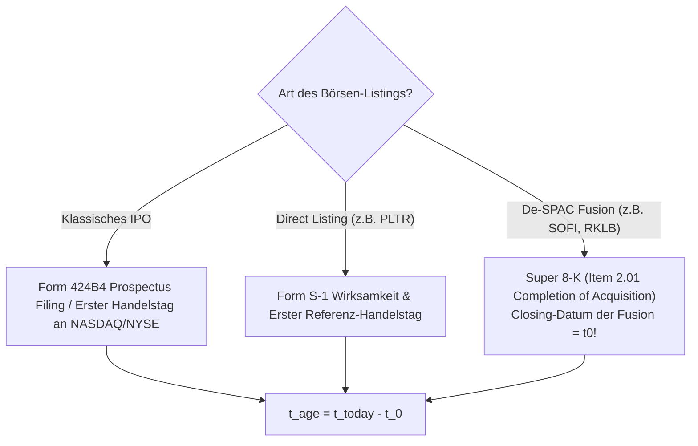

# System-Architektur & Master-Spezifikation: Post-IPO Growth Engine (PIGE)

> 📄 **Dokumenttyp:** Architektur-Konzept & Spezifikation (V2-Zukunftsprojekt)  
> 🧭 **Pipeline-Rolle: STUFE 1 (Aktien FINDEN — Scouting & Screening)**  
> 🎯 **Fokus:** Automatisierte Markt-Screening-Pipeline für qualitative Wachstums- und Turnaround-Aktien im Reife- und Bodenbildungs-Zeitfenster von **1 bis 5 Jahren nach Börsengang**.  
> 
> * **Kernaufgabe:** Durchforstet das gesamte US-Marktuniversum (~4.000 Ticker) nach fundamental gesunden Wachstumsunternehmen nach dem IPO-Kater.  
> * **Übergabe:** Qualifizierte Titel erhalten den Status **`status = 'OBSERVE'`** und werden an [Stufe 2: Stock-Radar-Turnaround-Framework](file:///D:/GitHub/CrashRadar/docs/architecture/strategies/Stock-Radar-Turnaround-Framework.md) zur Kauf-Validierung und zum Timing übergeben.  
> ⚙️ **Technologie-Ausrichtung für V2:** Node.js, MySQL (`market_data`), REST-APIs (SEC EDGAR, NASDAQ Screener, Polygon/Tiingo).

---

## 1. Universum & Sektor-Definitionen

Klassische GICS-Sektorfilter versagen bei FinTech, Defense-Tech und New Energy, da diese Unternehmen über Industrials, Financials, Utilities und Information Technology verstreut sind. Die Engine arbeitet daher primär über **SIC- und NAICS-Industrieklassifikationen**.

### 1.1 Einschluss-Kriterien nach SIC- und NAICS-Codes

| Vertikale | Relevante Kernbereiche | Relevante SIC-Codes | NAICS-Referenz |
| :--- | :--- | :--- | :--- |
| **Core Tech** | SaaS, Enterprise Software, Halbleiter, AI-Hardware, Cloud | 7372 (Prepackaged Software)<br>7370–7379 (Data Processing/Services)<br>3674 (Semiconductors & Related Devices)<br>3571–3577 (Computer Hardware) | 511210, 541511, 334413 |
| **FinTech & Krypto-Infrastruktur** | Krypto-Broker, Handelsplattformen, Neobanken, Payment Processing, BNPL | 6211 (Security Brokers & Dealers)<br>7374 (Data Processing - Payments)<br>6199 (Finance Services)<br>6141 (Personal Credit Institutions) | 523120, 522320, 522291 |
| **Defense-Tech & Space/ISR** | Drohnensysteme, Aufklärungssatelliten, Cyber-Defense, elektronische Kriegsführung | 3760 (Guided Missiles & Space Vehicles)<br>3812 (Search, Detection, Navigation Instruments)<br>7373 (Computer Integrated Systems Design) | 336414, 334511, 541512 |
| **New Energy & Grid Tech** | Small Modular Reactors (SMR), Solar-Tracker, Großbatteriespeicher, Netzoptimierung | 3690 (Electrical Machinery/Storage)<br>4911 (Clean Power Generation / Nuclear)<br>3620 (Industrial Controls / Grid) | 221113, 221114, 335999 |

### 1.2 Konsequente Ausschluss-Kriterien (Blacklist)

Jedes Listing mit folgenden Merkmalen wird vorab ohne weitere Prüfung aussortiert:
* **Fossile Energien:** SIC 1311 (Crude Petroleum & Natural Gas), SIC 1381 (Drilling Oil & Gas Wells), SIC 2911 (Petroleum Refining).
* **Konventionelle Kleinwaffen & Munition:** SIC 3482 (Small Arms Ammunition), SIC 3484 (Small Arms), SIC 3489 (Ordnance & Accessories).
* **Unvollendete Blank-Check / SPAC-Mäntel:** SIC 6770 (Blank Checks – vor vollzogenem De-SPAC).
* **Penny-Stocks & OTC:** Nicht an NASDAQ oder NYSE notierte Werte (OTC, Pink Sheets) sowie Titel mit Marktkapitalisierung $< 300\text{ Mio. \$}$.
* **Biotech / BioPharma & frühe Wirkstoffforschung (SIC 2833–2836):**
  * *Begründung des bewussten Ausschlusses:* Unternehmen in der klinischen Phase I bis III operieren ohne planbare Umsätze, weisen chronisch negative FCF-Margen von oft $-300\,\%$ auf und scheitern zwangsläufig an der Rule of 40. Ein mechanischer Post-IPO-Screener würde entweder alle echten Biotech-Chancen fälschlich aussortieren oder durch Not-Ausnahmeregeln die Filter für gesunde Software- und Hardware-Monopole zerstören.
  * *Strategische Einordnung:* Biotech-Werte (wie `IBRX`) werden **bewusst nicht** über PIGE gescreent. Sie verbleiben im Kamikaze-System als manuell kuratierte, asymmetrische `BINARY`-Sonderwetten mit eigenem Event-Katalysator-Risikomanagement!

---

## 2. Bestimmung des Börsen-Alters ($t_{\text{age}}$) & Sonderklauseln

Das Ziel ist die exakte Identifikation von Unternehmen im **Reife- und Kater-Zeitfenster**:
$$365\text{ Tage} \le t_{\text{age}} \le 1.825\text{ Tage} \quad (1 \text{ bis } 5 \text{ Jahre})$$

Die Bestimmung des Referenz-Börsendatums ($t_0$) unterscheidet strikt nach der Art des Börsengangs:



1. **Klassisches IPO:**  
   $t_0$ entspricht dem Datum des finalen Emissionsprospekts (**Form 424B4**) bzw. dem ersten regulären Handelstag an der Hauptbörse.
2. **Direct Listing (z. B. Palantir `PLTR`):**  
   $t_0$ ist der Tag der Wirksamkeit der Registrierungserklärung und der Eröffnung der Referenzauktion.
3. **De-SPAC-Sonderklausel (WICHTIG für `SOFI`, `RKLB`, `NVTS`, `AIRO`):**  
   Ein SPAC notiert oft 1–2 Jahre als leere Mantelgesellschaft bei 10 $.  
   *Regel:* Als operatives Börsendatum $t_0$ gilt **nicht** der Handelsstart des leeren Mantels, sondern das offizielle **Closing-Datum der Fusion**, belegt durch das Einreichen des **Super 8-K (Item 2.01 Completion of Acquisition)** bei der SEC!

---

## 3. Zweistufige Screening-Architektur

```text
┌────────────────────────────────────────────────────────────────────────┐
│            US EQUITY MASTER UNIVERSE (NASDAQ & NYSE, ~4.000 TITEL)     │
└───────────────────────────────────┬────────────────────────────────────┘
                                    │ 
                                    ▼ 
┌────────────────────────────────────────────────────────────────────────┐
│ FILTER 0: VORFILTERUNG VIA NASDAQ-SCREENER CSV (Latenzfrei & Schnell)  │
│ • Marktkapitalisierung >= $ 300 Mio. & Mindestvolumen                  │
│ • Sektor-Whitelist (Tech, FinTech, Defense, New Energy) & Blacklist    │
│ • Reduziert das Universum von ~4.000 auf ca. 150–250 Fokus-Kandidaten  │
└───────────────────────────────────┬────────────────────────────────────┘
                                    │ 
                                    ▼ 
┌────────────────────────────────────────────────────────────────────────┐
│ FILTER 1: POST-IPO GATEKEEPER (Monatlicher Admission-Lauf)             │
│ • Börsenalter: 365 <= t_age <= 1.825 Tage (1 bis 5 Jahre)              │
│ • Keine Pleite-Gefahr: Distanz zum 52-Wochen-Tief D_Low >= +20 %       │
│ • Kein Penny-Stock-Ruin: Distanz zum ATH D_ATH >= -85 %                │
│ • Mindest-Runway: Bei negativem FCF mindestens 12 Monate Cash-Puffer   │
└───────────────────────────────────┬────────────────────────────────────┘
                                    │ Bestanden: Aufnahme in PIGE-Pool
                                    ▼ 
┌────────────────────────────────────────────────────────────────────────┐
│ PHASE 2: DEEP-DIVE TRACKING & SCORING (Laufender Pool)                 │
│ • Quartalsweises Fundamental-Assessment: Rule of 40 & Top-Line Dynamic │
│ • Verwässerungs-Wachhund: Dilution Rate < 7 % p.a.                     │
│ • Technischer Weinstein Stage-2 Check & Relative Stärke (RS vs QQQ)    │
│ • Qualifizierte Top-Scorer wandern automatisch auf Kamikaze 'OBSERVE'  │
└───────────────────────────────────┬────────────────────────────────────┘
                                    │ t_age > 1.825 Tage / Delisting / Buyout
                                    ▼ 
┌────────────────────────────────────────────────────────────────────────┐
│                         ARCHIVIERUNG ('EXPIRED_5Y')                    │
└────────────────────────────────────────────────────────────────────────┘
```

---

## 4. Mathematische Formeln & Screening-Metriken

### 4.1 Wachstumsdynamik & Rentabilität

* **YoY Quartals-Umsatzwachstum:**
  $$g_{\text{Rev YoY}} = \frac{\text{Revenue}_Q - \text{Revenue}_{Q-4}}{\text{Revenue}_{Q-4}} \times 100$$

* **Umsatz-Beschleunigung (Sequenziell YoY):**
  $$\Delta g_{\text{Rev}} = g_{\text{Rev YoY}, Q} - g_{\text{Rev YoY}, Q-1}$$
  *Signal: $\Delta g_{\text{Rev}} > 0$ signalisiert einen operativen Wendepunkt (Turnaround).*

* **Free Cash Flow Marge (FCF-Marge):**
  $$\text{FCF Margin} = \frac{\text{Operating Cash Flow} - \text{CapEx}}{\text{Revenue}} \times 100$$

* **Rule of 40 (SaaS- & Software-Benchmark):**
  $$\text{Score}_{\text{Rule40}} = g_{\text{Rev YoY}} + \text{FCF Margin}$$
  *Zielwert:* $\ge 40\,\%$ für Elite-Wachstumsstatus; $\ge 25\,\%$ als Mindest-Eintritt für Turnarounds.

---

### 4.2 Runway & Solvenz-Check (Schutz vor Pleiten)

> [!IMPORTANT]
> **Korrektur der Berechnungsbasis:** Da SEC 10-Q-Berichte Quartalszahlen (3 Monate) darstellen, muss der Cash-Burn auf Monatsbasis normiert werden. Eine Division durch 12 bei Quartalswerten würde die Runway fälschlich um den Faktor 4 aufblähen!

* **Monatliche Net Cash Burn Rate ($BC_{\text{Monthly}}$):**
  $$BC_{\text{Monthly}} = \begin{cases} \frac{|\text{FCF}_Q|}{3} & \text{wenn } \text{FCF}_Q < 0 \\ 0 & \text{wenn } \text{FCF}_Q \ge 0 \end{cases}$$

* **Cash Runway (in Monaten):**
  $$\text{Runway}_{\text{Months}} = \frac{\text{Cash \& Cash Equivalents} + \text{Short-Term Marketable Securities}}{BC_{\text{Monthly}}}$$

* **Gatekeeper-Schwellenwert & Die Wall-Street-SBC-Falle:**
  * **Die SBC-Täuschung:** Gemäß US-GAAP wird aktienbasierte Vergütung (Stock-Based Compensation / SBC) im operativen Cashflow addiert. Dadurch kann ein Unternehmen rechnerisch „FCF-positiv“ wirken, obwohl es operativ Geld verbrennt und Altaktionäre durch massive Aktienausgabe enteignet.
  * **Kombinierte Gatekeeper-Regel:**
    * Ein positiver FCF ($\text{FCF}_Q \ge 0$) wird nur dann als echter, selbstragender Status anerkannt, wenn die jährliche Verwässerung zeitgleich unter Kontrolle ist:
      $$\text{Dilution}_{\text{Rate}} < 5{,}0\,\%\text{ p.a.}$$
    * Liegt $\text{Dilution}_{\text{Rate}} \ge 5{,}0\,\%$, greift trotz positivem FCF die strikte Solvenz-Bedingung: Die Cash-Runway muss zwingend $\ge 12{,}0\text{ Monate}$ betragen!
  * Ist $\text{FCF}_Q < 0$ (negativer FCF), gilt ausnahmslos:
    $$\text{Runway}_{\text{Months}} \ge 12{,}0\text{ Monate}$$
    *(Schutz vor Not-Kapitalerhöhungen und Verwässerungs-Tod).*

---

### 4.3 Verwässerungs-Matrix (Dilution Control)

Frühe Wachstumsunternehmen kompensieren Mitarbeiter oft exzessiv über Stock-Based Compensation (SBC).

* **YoY Verwässerungsrate (Diluted Shares Outstanding):**
  $$\text{Dilution}_{\text{Rate}} = \frac{\text{Shares}_{\text{Diluted}, Q} - \text{Shares}_{\text{Diluted}, Q-4}}{\text{Shares}_{\text{Diluted}, Q-4}} \times 100$$
* **Schwellenwerte & Scoring-Malus:**
  * $< 3{,}0\,\%$ p.a.: **Exzellent** (Aktionärsfreundliche Kapitaldisziplin).
  * $3{,}0\,\% - 7{,}0\,\%$ p.a.: **Akzeptabel** für aggressive Wachstumsphasen.
  * $> 10{,}0\,\%$ p.a.: **Rote Flagge!** Schwerer Punkteabzug im Composite Score.

---

### 4.4 Technische Bodenbildung & Die Re-Admission-Regel

* **Distanz zum 52-Wochen-Tief ($D_{\text{Low}}$):**
  $$D_{\text{Low}} = \frac{P_{\text{Aktuell}} - P_{\text{52W Low}}}{P_{\text{52W Low}}} \times 100$$
  *Bedingung:* $D_{\text{Low}} \ge +20{,}0\,\%$ (Beweis für Wyckoff-Akkumulation; Aktie macht keine neuen Tiefs mehr).

* **Distanz zum Allzeithoch ($D_{\text{ATH}}$):**
  $$D_{\text{ATH}} = \frac{P_{\text{Aktuell}} - P_{\text{ATH}}}{P_{\text{ATH}}} \times 100$$
  *Bedingung:* $D_{\text{ATH}} \ge -85{,}0\,\%$ bis $-88{,}0\,\%$.
  > [!NOTE]
  > Ein zu enger Filter (z. B. $-70\,\%$) würde Jahrhundert-Chancen wie Palantir ($ 45 \to \$ 6 = -86\,\%$) oder SentinelOne ($ 78 \to \$ 12{,}50 = -84\,\%$) am perfekten Boden eliminieren. Der $-85\,\%$-Filter trennt überlebensfähige Plattform-Turnarounds von ausradierten Penny-Stocks ($-98\,\%$).

* **Die Re-Admission-Regel (Zweite Chance bei echtem Turnaround):**
  * Erhält eine Aktie in einem monatlichen Screening den Status `'FAILED_GATE'` (z. B. wegen temporärer Verwässerungs-Spikes, Cash-Runway $< 12$ Monate oder Kurs im freien Fall), ist sie **nicht** permanent ausgeschlossen!
  * Solange das Unternehmen im Zeitfenster $365 \le t_{\text{age}} \le 1.825$ Tage notiert, wird es an jedem Monatsersten erneut vollautomatisch evaluiert.
  * Sobald der operative Turnaround vollzogen ist (z. B. Palantir erreicht 2023 GAAP-Profitabilität oder SentinelOne stabilisiert die Runway und verteidigt den Boden $\ge +20\,\%$ über dem 52W-Tief), wechselt der Status automatisch von `'FAILED_GATE'` zurück auf `'TRACKING'` und die Aktie wandert auf die `OBSERVE`-Watchlist.

---

### 4.5 Der Composite Growth Score (Gewichtung & Ranking)

Zur Priorisierung der qualifizierten Kandidaten für die `OBSERVE`-Watchlist berechnet die Engine einen standardisierten Gesamt-Score von 0 bis 100 Punkten:

$$\text{Composite Score} = 0{,}35 \times S_{\text{Growth}} + 0{,}25 \times S_{\text{Rule40}} + 0{,}20 \times S_{\text{Dilution}} + 0{,}20 \times S_{\text{Momentum}}$$

| Säule | Metrik | Gewichtung | Punkte-Verteilung (0 bis 100) |
| :--- | :--- | :---: | :--- |
| **Top-Line ($S_{\text{Growth}}$)** | $g_{\text{Rev YoY}}$ & Beschleunigung $\Delta g_{\text{Rev}}$ | **35 %** | 100 Pkt bei $g \ge 35\,\%$ & $\Delta g > 0$; 0 Pkt bei $g < 0\,\%$ |
| **Effizienz ($S_{\text{Rule40}}$)** | $\text{Score}_{\text{Rule40}} = g + \text{FCF Margin}$ | **25 %** | 100 Pkt bei $\ge 40\,\%$; 50 Pkt bei $25\,\%$; 0 Pkt bei $< 0\,\%$ |
| **Kapitaldisziplin ($S_{\text{Dilution}}$)** | Verwässerung $\text{Dilution}_{\text{Rate}}$ | **20 %** | 100 Pkt bei $< 3\,\%$; 50 Pkt bei $3-7\,\%$; 0 Pkt bei $> 10\,\%$ |
| **Boden & Trend ($S_{\text{Momentum}}$)** | $D_{\text{Low}}$ & Relative Stärke vs. QQQ | **20 %** | 100 Pkt bei $D_{\text{Low}} \ge 35\,\%$ & $\text{RS} > \text{SMA}_{50}$; 0 Pkt bei Schwäche |

* **Mindestschwelle:** Nur qualifizierte Titel mit $\text{Composite Score} \ge 65{,}0$ Punkten werden an das Kamikaze- und MCW-System zur weiteren Ausbruchs-Beobachtung übergeben (`status = 'OBSERVE'`).

---

## 5. Datenquellen & CrashRadar-Integrationsstrategie (Node.js & MySQL)

Zur Vermeidung von Medienbrüchen und Doppel-Infrastrukturen fügt sich PIGE in die bestehende CrashRadar-Architektur ein:

```text
┌─────────────────────────────────────────────────────────────────────────────────┐
│                      PIGE INTEGRATIONS-STACK IN CRASHRADAR                      │
├───────────────────┬─────────────────────────────────────────────────────────────┤
│ Universums-Filter │ Kostenloser NASDAQ Screener CSV Download (ca. 4.000 Ticker)  │
│                   │ Filterung via Node.js Stream-Parser nach Sektor & Cap       │
├───────────────────┼─────────────────────────────────────────────────────────────┤
│ Marktdaten        │ Bestehender Polygon.io- & Tiingo-Adapter in CrashRadar       │
├───────────────────┼─────────────────────────────────────────────────────────────┤
│ Fundamentaldaten  │ Offizielle SEC EDGAR Facts API (JSON/XBRL, data.sec.gov)    │
│                   │ 100 % kostenlos & Public Domain (10 Req/s Token-Pacer)      │
│                   │ Flankiert durch yahoo-finance2 für schnelle Snapshots       │
├───────────────────┼─────────────────────────────────────────────────────────────┤
│ Speicherung       │ Native MySQL Tabellen in CrashRadar                         │
│                   │ (`post_ipo_companies`, `post_ipo_fundamentals`,             │
│                   │  `post_ipo_evaluations`) via DatabaseConnectionPool         │
├───────────────────┼─────────────────────────────────────────────────────────────┤
│ Übergabe          │ Qualifizierte Spitzenkandidaten wandern automatisiert mit   │
│                   │ Status 'OBSERVE' in die Kamikaze- / MCW-Watchlist-Tabelle   │
└───────────────────┴─────────────────────────────────────────────────────────────┘
```

> [!NOTE]
> **API-Prüfung Tiingo Fundamentals vs. SEC EDGAR:**  
> Während Tiingo End-of-Day-Preise und IEX-Echtzeitkurse im Basistarif liefert, liegt die **Tiingo Fundamental Data API hinter einer Paywall** (im Free-Tier künstlich auf die 30 DOW-Aktien beschränkt).  
> Für den dauerhaften 0,00-€-Betrieb in CrashRadar nutzt PIGE daher die offizielle, unbeschränkte **SEC EDGAR API (`https://data.sec.gov/api/xbrl/companyfacts/`)** als regulatorische Primärquelle für FCF, SBC, Diluted Shares und Umsatz.

### 5.1 Verbindlicher Architekturbeschluss: SEC EDGAR Facts API als Single Source of Truth

* **Status des Beschlusses:** Einstimmig beschlossen für die V2-Implementierung (0,00 € dauerhafte Betriebskosten).
* **Technischer Endpunkt:**
  ```text
  GET https://data.sec.gov/api/xbrl/companyfacts/CIK{cik_10_digits}.json
  ```
* **Verbindliche Spezifikations-Vorgaben:**
  1. **Compliance & Header-Pflicht:** Gemäß SEC-Fair-Access-Richtlinie muss jeder Request einen deklarierten User-Agent im Header führen (z. B. `User-Agent: CrashRadar/2.0 (contact@crashradar.local)`).
  2. **Rate-Limiting (Token-Bucket Pacer):** Das SEC-Limit liegt bei maximal 10 Requests/Sekunde. Der Node.js Ingestion-Adapter nutzt den bereits in CrashRadar erprobten Pacer mit einem Sicherheitsabstand von **max. 8 Requests/Sekunde**.
  3. **Laufzeit-Optimierung:** Durch die vorherige Filterung via NASDAQ-Screener CSV (Filter 0) müssen monatlich nur ca. 150 CIKs abgefragt werden $\to$ **Laufzeit unter 25 Sekunden für den gesamten Monatslauf!**
  4. **Datenhoheit & Audit-Sicherheit:** Da die SEC Facts direkt aus den eingereichten 10-Q- und 10-K-XBRL-Dateien generiert werden, gibt es keine Verzerrungen oder Verzögerungen durch Drittanbieter.

### 5.2 Skalierungs- & Freetier-Architektur 2027 (300-Ticker-Universum, Speicher-Footprint & Supabase-Rolle)

Im voll ausgebauten V2-System (2027) laufen PIGE, das 7-Slot-Guru-Konsenssystem, Muzzled-Cathie-Wood und Kamikaze-Growth parallel. Damit wächst das aggregierte Marktuniversum auf **rund 300 beobachtete Ticker**.  
Um dieses Volumen **dauerhaft zu 100 % im Freetier (0,00 €)** und ohne Speicher- oder Quoten-Engpässe zu betreiben, gilt folgendes verbindliches Architektur-Modell:

#### 1. Die 2-Ebenen-Trennung (Scouting vs. Hotlist)
Das System fragt niemals 300 Ticker im 5-Minuten-Intraday-Takt (M5) ab. Dies verbietet sich rechnerisch bereits durch das Polygon-Free-Tier-Limit ($300 \text{ Ticker} / 5 \text{ Calls/Min} = 60 \text{ Minuten Laufzeit}$ je Zyklus!). Die Ingestion wird strikt zweigeteilt:

```text
┌─────────────────────────────────────────────────────────────────────────────┐
│                      2027 UNIVERSUM (ca. 300 Ticker)                        │
└──────────────────────────────────────┬──────────────────────────────────────┘
                                       │
         ┌─────────────────────────────┴─────────────────────────────┐
         ▼                                                           ▼
┌──────────────────────────────────┐        ┌──────────────────────────────────┐
│ EBENE 1: SCOUTING & SCREENING    │        │ EBENE 2: DIE HOTLIST & PORTFOLIO │
│ (~280 Ticker)                    │        │ (~10 bis 20 Ticker)              │
├──────────────────────────────────┤        ├──────────────────────────────────┤
│ • PIGE-Kandidaten, Gurus, Cathie │        │ • Aktive Bestände (Kamikaze)     │
│ • Nur TAGESKERZEN (1D / EOD)     │        │ • Akute Stage-2 Ausbruchskand.   │
│ • 1x täglich um 22:30 Uhr MEZ    │        │ • INTRADAY-KERZEN (M5)           │
│ • Trendfolge, SMA50/200, RS      │        │ • Climax-Tops & Katapult-Trigger │
└──────────────────────────────────┘        └──────────────────────────────────┘
```

#### 2. Freetier-API-Kontingente & Abruf-Orchestrierung
1. **Tagesendkurse (Daily EOD für ~300 Ticker):**
   * **Tiingo Free Tier:** Bietet 500 Requests/Tag (50/Stunde). Ein einzelner Abruflauf nach US-Börsenschluss (22:30 Uhr MEZ) verbraucht exakt **300 Requests/Tag** ($\mathbf{60\,\% \text{ Quoten-Auslastung}}$).
   * **Yahoo Finance (`yahoo-finance2`):** Als robuster Fallback direkt in `package.json` integriert. Ermöglicht parallele Batch-Abrufe ohne harte Key-Quota für EOD-Historien.
2. **Fundamentaldaten (SEC EDGAR Facts API für ~150–300 Ticker):**
   * **100 % kostenlos & unlimitiert** (US-Regierungs-API, data.sec.gov).
   * Mit dem 8 Req/s Token-Pacer läuft das monatliche Screening aller CIKs in **unter 30 Sekunden** durch.
3. **M5-Intraday-Kerzen (nur 10–20 Hotlist-Ticker):**
   * Verbleibt auf Polygon.io (5 Calls/Minute). Der Delta-Sync für 20 Ticker ist in **4 Minuten** abgeschlossen.

#### 3. Empirischer Speicherplatz-Bedarf (Datenbank-Footprint)
Entgegen intuitiven Befürchtungen generiert ein 300-Ticker-Universum bei relationaler Datensparsamkeit nur minimales Datenvolumen:
* **Tagesdaten (1D EOD) für 300 Ticker:**  
  $300 \text{ Ticker} \times 250 \text{ Handelstage} = 75.000 \text{ Zeilen/Jahr} \approx \mathbf{3{,}75 \text{ MB / Jahr}}$!  
  *(Selbst 5 Jahre Historie für 300 Aktien belegen unter 20 MB).*
* **SEC 10-Q Fundamentaldaten (PIGE):**  
  Es werden keine unstrukturierten 2-MB-Roh-JSONs gespeichert, sondern ausschließlich die 5 extrahierten Kennzahlen ($g_{\text{Rev}}$, $\text{FCF}$, $\text{Cash}$, $\text{Diluted Shares}$, $\text{Debt}$).  
  $300 \text{ Ticker} \times 4 \text{ Quartale} \times 5 \text{ Kennzahlen} = 6.000 \text{ Werte} \approx \mathbf{0{,}2 \text{ MB / Jahr}}$.
* **M5-Kerzen für die 20 Hotlist-Aktien:**  
  $20 \text{ Ticker} \times 78 \text{ Kerzen/Tag} \times 250 \text{ Tage} = 390.000 \text{ Zeilen} \approx \mathbf{29{,}2 \text{ MB / Jahr}}$.

$$\mathbf{\text{Gesamter DB-Zuwachs im Vollbetrieb 2027: }} 3{,}75 + 0{,}2 + 29{,}2 \approx \mathbf{33 \text{ MB pro Jahr!}}$$

#### 4. Die architektonische Rolle von Supabase (Free-Tier 500 MB)
Die freie Supabase-Instanz (Free Tier: **500 MB Postgres Disk**) wird gezielt positioniert:
* **NICHT als Rohdaten- oder Kursdaten-Speicher:**
  * **Die 7-Tage-Pause-Falle (Auto-Pausing):** Supabase Free Tier versetzt inaktive Projekte nach 7 Tagen ohne externe Web-Requests in den Schlafmodus. Lokale Cronjobs würden blockieren.
  * **Latenz-Vorteil:** Die bestehende lokale MySQL/TiDB-Datenbank (`src/core/Storage.js`) arbeitet mit 0–3 ms Latenz, ist wartungsfrei, schläft niemals ein und besitzt auf der lokalen SSD unbegrenzte Kapazität.
* **SONDERN als Cloud-Signal-Hub & Mobile-Bridge (V2-Feature):**
  * CrashRadar berechnet alle Kennzahlen, Radar-Indikatoren und Regime lokal auf dem Hauptrechner.
  * Entsteht ein scharfes Signal (`BUY`, `CLIMAX_TOP`, `GURU_CONSENSUS_ENTRY`), pusht CrashRadar **nur diesen kompakten Alert-Datensatz** (wenige Kilobyte) in eine schlanke Supabase-Tabelle `signals_feed`.
  * **Einsatzzweck:** Ermöglicht ein mobiles Smartphone-Dashboard / Webhook-Zugriff von unterwegs über Supabase Realtime, ohne den lokalen PC per Port-Forwarding oder VPN ins offene Internet exposen zu müssen.
  * **Kapazität:** Für reine Signal-Logs reichen die 500 MB der Supabase-DB für Jahrzehnte.

---

## 6. Datenmodell-Spezifikation (Relationales MySQL Schema für V2)

Folgende drei Tabellen werden in V2 über eine DB-Migration (`src/db/migrations/create_post_ipo_engine_tables.sql`) bereitgestellt:

1. **`post_ipo_companies` (Stammdaten & Börsen-Lifecycle):**
   * `symbol` (VARCHAR 16, PK)
   * `cik` (VARCHAR 10)
   * `company_name` (VARCHAR 255)
   * `sector`, `industry` (VARCHAR 128)
   * `sic_code` (INT)
   * `ipo_date` (DATE, referenziert echtes $t_0$ inkl. De-SPAC Super 8-K)
   * `listing_type` (ENUM: `'IPO'`, `'DIRECT_LISTING'`, `'DE_SPAC'`)
   * `exchange` (VARCHAR 16)
   * `status` (ENUM: `'TRACKING'`, `'EXPIRED_5Y'`, `'DELISTED'`, `'FAILED_GATE'`)
   * `created_at`, `updated_at` (TIMESTAMP)

2. **`post_ipo_fundamentals` (Quartalsweise Finanzdaten):**
   * `id` (BIGINT AUTO_INCREMENT, PK)
   * `symbol` (FK auf `post_ipo_companies`)
   * `fiscal_date` (DATE)
   * `revenue`, `revenue_yoy_growth` (DOUBLE)
   * `gross_margin`, `fcf`, `fcf_margin` (DOUBLE)
   * `rule_of_40` (DOUBLE)
   * `cash_and_equivalents` (DOUBLE)
   * `shares_diluted`, `shares_diluted_yoy` (DOUBLE)
   * `runway_months` (DOUBLE, basierend auf $BC_{\text{Monthly}}$)
   * UNIQUE-Key auf `(symbol, fiscal_date)`

3. **`post_ipo_evaluations` (Monatliches Screening- & Scoring-Ergebnis):**
   * `id` (BIGINT AUTO_INCREMENT, PK)
   * `symbol` (FK auf `post_ipo_companies`)
   * `eval_date` (DATE)
   * `price`, `ath_distance_pct`, `low_52w_distance_pct` (DOUBLE)
   * `growth_score`, `solvency_score`, `momentum_score`, `composite_score` (DOUBLE)
   * `gate_passed` (BOOLEAN)
   * UNIQUE-Key auf `(symbol, eval_date)`

---

## 7. Wartungs- & Betriebs-Plan (V2 Betrieb)

* **Ausführungs-Taktung:** Einmal monatlich am **ersten Samstag nach Monatsschluss** (nach vollständigen Monatskerzen und frischen SEC-Veröffentlichungen).
* **Automatisierte Lifecycle-Bereinigung:**
  * Ticker mit $t_{\text{age}} > 1.825\text{ Tagen}$ wechseln automatisch auf den Status `'EXPIRED_5Y'`. Sie scheiden aus dem PIGE-Pool aus (haben die Kater-Phase hinter sich und gelten ab dann als etablierte Werte).
  * Titel mit Insolvenz oder Delisting erhalten den Status `'DELISTED'` (keine Verfälschung historischer Auswertungen).
* **Schnittstelle zur Strategie-Engine:**  
  Kandidaten mit `gate_passed = TRUE` und überdurchschnittlichem Composite Score werden als Vorschlag mit Metadaten an das Kamikaze- / MCW-Radar übergeben (`status = 'OBSERVE'`).