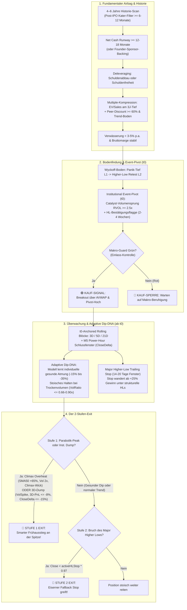
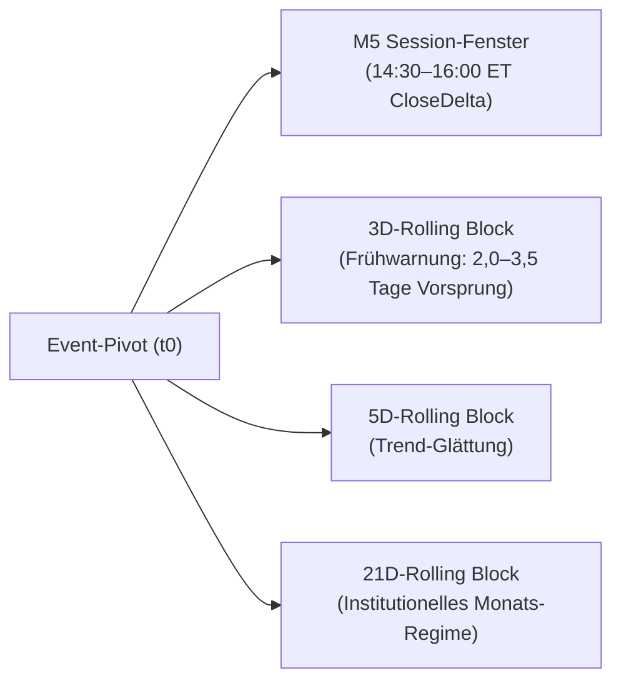

# Stock Radar & Bewertungs-Framework: Turnarounds & High-Beta Growth

> 🏛️ **Status: Produktions-Architektur (Freigegeben) — Single Source of Truth**  
> 🧭 **Pipeline-Rolle: STUFE 2 (Aktien PRÜFEN & KAUFEN — Scharfschütze & Timing)**  
> Dient als analytische Entscheidungs-Engine zur Identifikation, fundamentalen Validierung und dem präzisen Timing von abgestraften Qualitäts-Wachstumswerten (Small/Mid-Caps wie `IBRX`, `NVTS`, `S`, `SOFI`, `PLTR`) sowie Plattform-Monopolen (`META`, `NFLX`, `NOW`).  
> 
> * **Vorgelagert:** [Stufe 1: Post-IPO Growth Engine](file:///D:/GitHub/CrashRadar/docs/architecture/strategies/Post-Ipo-Growth-Engine.md) (Automatisierter Markt-Screener) liefert qualifizierte Kandidaten mit Status `status = 'OBSERVE'`. Ergänzend fließen manuell kuratierte Ideen des Investors ein.  
> * **Nachgelagert:** Kauf- und Verkaufsentscheidungen (`BUY`, `TOP_CLIMAX_ALERT`, `SELL_STAGE`) werden an [Stufe 3: Kamikaze Growth Portfolio](file:///D:/GitHub/CrashRadar/docs/architecture/strategies/Kamikaze-Growth.md) übergeben, wo die Depot-Allokation (50/50) und Execution erfolgen.

---

Dieses Dokument definiert die vollständige End-to-End-Architektur des High-Beta Turnaround- und Wachstums-Radars. Es integriert die fundamentale Bilanz-Filterung, den **Institutional Event-Pivot ($t_0$)**, **$t_0$-verankerte rollierende Timeframe-Blöcke**, das **adaptive Lernen der Korrektur-DNA** sowie das **2-Stufen-Exit-Modell**.

Empirische 10-Jahres-Backtests, M5-Volumen-Messungen und Verifikations-Protokolle sind in den separaten Forschungsberichten unter [`docs/research/turnarounds/`](file:///D:/GitHub/CrashRadar/docs/research/turnarounds/) dokumentiert.

---



---

## 1. Fundamentaler Airbag & Solvenz-Filter

Die fundamentale Prüfung dient als **Airbag**: Sie schließt vor jeder technischen Betrachtung aus, dass das System bei einem Kurssturz von -50 % bis -85 % in eine Insolvenz- oder Massenverwässerungsfalle greift.

### 1.1 Der Mindest-Historie-Filter & Watchlist-Lifecycle
* **Watchlist-Lifecycle & Metadaten-Schema:**  
  Eine Aktie wird vom Investor mit `firstSeenDate`, ihrem Branchenführer (`sector_peer`) und dem Sektor-ETF (`sector_etf`) auf die Beobachtungsliste gesetzt:
  ```json
  {
    "ticker": "S",
    "name": "SentinelOne",
    "status": "OBSERVE",
    "firstSeenDate": "2023-06-01",
    "sector_peer": "PANW",
    "sector_etf": "CIBR"
  }
  ```
  Das Radar startet daraufhin den 4–6-Jahres-Scan. Ein Einstieg erfolgt niemals instantan am Tag der Aufnahme, sondern erst nach Durchlaufen aller 4 Gates.
* **Post-IPO Kater-Regel:**  
  Wachstumsaktien durchlaufen nach dem Börsengang regelmäßig ein typisches Muster: IPO-Hype $\rightarrow$ Kater-Phase (Lockup-Ablauf, Bewertungs-Kompression, Marktbereinigung) $\rightarrow$ Bodenbildung.
* **Boden-Zwang (Kein Griff ins fallende Messer):**  
  Eine Aktie darf nach dem IPO oder einem Crash **niemals im freien Fall** gekauft werden. Das Radar fordert zwingend eine **Mindest-Konsolidierung von 6 bis 12 Monaten**, in der sich die Bewertung normalisiert und ein stabiles Preis-Fundament etabliert.

### 1.2 Qualitätskriterien für Small/Mid-Caps
*Fokus-Sektoren: Next-Gen Halbleiter, Cybersecurity, Biotech, Cloud-Infrastruktur, FinTech.*

* **1. Net Cash Runway (Liquiditäts-Check):**  
  $$\text{Net Cash Runway (Monate)} = \frac{\text{Barmittel} + \text{Kurzfristige Finanzanlagen} - \text{Finanzschulden}}{|\text{FCF}_Q| / 3}$$
  * *Standard-Regel:* Mindestens **12 bis 18 Monate operative Liquidität**, um Not-Kapitalerhöhungen zu Tiefstkursen auszuschließen.
  * *Founder/Sponsor-Backing Klausel (`IBRX`-Regel):* Bei Unternehmen mit nachgewiesenem Gründer-/Großinvestor-Backing ($> 50\,\%$ Anteilsbesitz, bestätigte Gesellschafterdarlehen oder Promissory Notes im SEC Form 8-K) genügt eine operative Runway von **3 bis 6 Monaten**, da Liquiditätsengpässe über Insider-Kreditlinien überbrückt werden.
* **2. Deleveraging-Gate (Finanzschulden-Disziplin):**  
  * *Prüfung über SEC 10-Q:* $\text{Total Debt}_t \le \text{Total Debt}_{t-1}$ (kontinuierlicher Schuldenabbau) **ODER** $\text{Total Debt} = 0$ (Schuldenfreiheit).  
  * Steigende Finanzschulden bei negativem operativen Cashflow führen zur sofortigen Disqualifikation.
* **3. Automatisches Multiple-Tracking & Sektor-Peer-Abschlag (EV / Sales TTM):**  
  Das Radar ruft im täglichen Scan vollautomatisch (0,00 € via `yahoo-finance2` `quoteSummary`) das aktuelle $\text{EV / Sales}$ Multiple des Kandidaten sowie seines hinterlegten `sector_peer` ab:
  $$\text{PeerDiscount}(t) = 1 - \left( \frac{\text{EV/Sales}_{\text{Kandidat}}(t)}{\text{EV/Sales}_{\text{Peer}}(t)} \right)$$
  * **Historische Multiple-Kompression:**  
    $$\text{EV / Sales}_{\text{Kandidat}}(t) \le \text{3-Jahres-Tief} \quad \text{ODER} \quad \le \text{10. Perzentil der Historie}$$
  * **Sektor-Peer-Benchmark (Das SentinelOne-Kriterium):**  
    $\text{PeerDiscount}(t) \ge 60 - 75\,\%$ gegenüber dem profitablen Sektor-Primus (z. B. `S` bei EV/Sales ~5,5x vs. `PANW` bei ~24x $\rightarrow$ **77 % Bewertungsabschlag**).
  * **Tracking des Kompressions-Trends (Wird noch komprimiert oder steht der Boden?):**  
    Das Radar trackt die Zeitreihe von $\text{PeerDiscount}(t)$ und $\text{EV/Sales}(t)$:
    * *Aktive Kompression (Gefahr / Fallendes Messer):* $\text{EV/Sales}(t) < \text{EV/Sales}(t-20d)$ und $\text{PeerDiscount}$ weitet sich weiter aus $\rightarrow$ Kein Kauf!
    * *Boden-Inflection (Freigabe):* Die Multiple-Kompression flacht über mindestens 4 bis 8 Wochen ab ($\Delta\text{EV/Sales}_{20d} \ge 0$) und bildet ein höheres Tief im Gleichschritt mit dem Chart.
  * **Bruttomargen-Parität (Qualitäts-Beweis):**  
    $$\text{GrossMargin}_{\text{Kandidat}} \ge \text{GrossMargin}_{\text{Peer}} - 5\,\%$$
    Beweist, dass der Bewertungsabschlag rein marktpsychologisch ist und nicht auf einem minderwertigen Produkt beruht (`S` 72,5 % vs. `PANW` 70,5 %).
* **4. Bereinigte Rule of 40 (SBC-bereinigt):**  
  $$\text{Bereinigte Rule of 40} = \text{YoY Umsatzwachstum (\%)} + \text{Bereinigte FCF-Marge (\%)} \ge 20 - 30\,\%$$
  * *SBC-Abzug:* $\text{Echter FCF} = \text{Operativer Cashflow} - \text{Capex} - \text{Stock-Based Compensation}$.
* **5. Verwässerungsquote (Dilution Rate):**  
  * Jährlicher Zuwachs der ausstehenden Aktien (Weighted Average Diluted Shares) $< 3 - 5\,\%$ p.a.
* **6. Bruttomargen-Stabilität & Deferred Revenue:**  
  * Bruttomarge $\ge 70 - 80\,\%$ stabil (kein Preisverfall).
  * $\text{Deferred Revenue}_t \ge \text{Deferred Revenue}_{t-1}$ (Kunden schließen weiterhin mehrjährige Vorauszahlungsverträge ab).

### 1.3 Kriterien für Plattform-Monopole & Big Tech (`META`, `NFLX`, `NOW`)
* **KGV-Kollaps / FCF-Yield:** KGV $< 15x$ oder FCF-Rendite $> 6 - 8\,\%$ bei intakter Marktführerschaft.
* **Moat-Klassifizierung:** Manuelles Watchlist-Tag `moat_type: "SYSTEM_OF_RECORD"`.
* **Capex-Hebel („Year of Efficiency“):** Operativer Gewinn wächst schneller als der Umsatz ($\Delta\text{OpInc} > \Delta\text{Rev}$) durch Kostendisziplin.

### 1.4 Sektorspezifischer Check: FinTech & Lending (z. B. `SOFI`)
* **P/TBV (Price-to-Tangible-Book-Value):** Bewertung am materiellen Buchwert ($1{,}2x - 1{,}8x$ TBV).
* **Net Charge-Off Rate (NCO):** Kreditverluste stabil unter Branchenschnitt.
* **Fee-based Erlös-Mix:** Anteil gebührenbasierter Plattformerlöse steigt gegenüber dem zinsabhängigen Kreditbuch.

---

## 2. Technische Bodenfindung (Der Wyckoff-Retest)

Bevor Kapital allokiert wird, muss der Markt die Erschöpfung des Verkaufsdrucks charttechnisch bestätigen:

```text
 1. Panik-Tief (Selling Climax)           2. Rebound (Erste Erholung)
            \                                   /
             \                                 /
              \                               /
               ▼                             ▼
              [TIEF L1: Panik-Ausverkauf]   [Erholung: +15 % bis +25 %]
                                              \
                                               \  3. DER LACKMUSTEST (Der Retest!)
                                                \    Zweiter Abverkauf rollt an,
                                                 \   DREHT ABER VOR DEM ALTEN TIEF:
                                                  ▼
                                                [HÖHERES TIEF L2: Bestätigter Boden!]
```

* **Phase 1: Selling Climax (Panik-Tief $L_1$):**  
  Tagesvolumen $\ge 3{,}0\times$ 50d-Schnitt (RVOL $\ge 3.0$), oft mit Gap-Down nach Hiobsbotschaften. **Absolutes Kaufverbot!** Startpunkt für die Verankerung des Crash-AVWAP.
* **Phase 2: Technischer Rebound & VCP:**  
  Erste Erholung um $+15\,\%$ bis $+25\,\%$ über $L_1$, gefolgt von einer mindestens 4-wöchigen Volatilitätskontraktion bei austrocknendem Volumen ($\text{RVOL} < 0{,}8$).
* **Phase 3: Der Lackmustest (Higher-Low Retest $L_2$):**  
  Ein erneuter Abverkauf testet das Tiefstkurs-Niveau. **Bedingung:** Der Kurs dreht signifikant vor dem alten Tief ($L_2 \ge L_1 \times 1{,}03$) oder bildet ein Doppeltief mit massiver bullischer RSI-Divergenz. Smart Money absorbiert das Restangebot.

---

## 3. Der Einstiegs-Trigger: Institutional Event-Pivot ($t_{\text{event}}$) & Breakout ($t_{\text{entry}}$)

Klassische gleitende Durchschnitte (z. B. Golden Cross `SMA 50 > SMA 200`) erzeugen im Turnaround ein untragbares Lag (+130 % Preisnachteil bei `PLTR`). Das Radar zündet den Einstieg stattdessen präzise in einer **3-Schritte-Sequenz**:

1. **Schritt 1: Das Katalysator-Event ($t_{\text{event}}$ bzw. $t_0$):**  
   Ein substanzielles Event (z. B. erster GAAP-profitabler Quartalsgewinn bei `PLTR` am 14.02.2023, FDA-Zulassung bei `IBRX`, massiver Earnings-Beat) erzeugt ein explosionsartiges Volumen-Gap mit $\text{RVOL} \ge 2{,}5\times - 5{,}0\times$.  
   $\rightarrow$ **Aktion:** Verankerung des **Event-AVWAP** ab diesem Tag. Zu diesem Zeitpunkt erfolgt noch **kein Kauf**, da Market Maker frühe Nachzügler oft abverkaufen.
2. **Schritt 2: Die Higher-Low Konsolidierungs-Flagge:**  
   In den folgenden 2 bis 4 Wochen konsolidiert die Aktie in einer engen Spanne.  
   $\rightarrow$ **Bedingung:** Es entstehen keine tieferen Tiefs mehr unter das Vor-Event-Niveau ($HL \ge \text{Pre-Gap Low}$). Das Smart Money verteidigt den Event-Kurs.
3. **Schritt 3: Der finale Kauf-Trigger ($t_{\text{entry}}$):**  
   Sobald der Tagesschlusskurs über den **Event-AVWAP** und gleichzeitig über das lokale Pivot-Hoch der Konsolidierungsflagge ausbricht:  
   $\rightarrow$ **Aktion:** Das Radar schaltet von `OBSERVE` auf **`BUY_TURNAROUND`** zum aktuellen Ausbruchskurs $P(t_{\text{entry}})$ (z. B. Palantir im April 2023 bei 8,61 $).

---

## 4. Multi-Timeframe-Sensorik & $t_0$-Anchored Rolling Blöcke

Mit dem Kauf bei $t_0$ aktiviert das Radar ein dynamisches Überwachungssystem. Statt starrer Kalenderwochen (die bei Ausbrüchen an Dienstagen/Mittwochen tagelang blind bleiben) verankert das System rollierende Blöcke direkt am Event $t_0$:



### 4.1 Intraday-Sensorik: Das M5-Schlussfenster (Power Hour)
Während das Eröffnungsfenster (09:30–11:00 ET) von Privatanleger-Emotionen dominiert wird, zeigt die **Power Hour (14:30–16:00 ET)** das wahre institutionelle Sentiment über das normalisierte Volumendelta:
$$CloseDelta = \left( \frac{\text{UpVolume} - \text{DownVolume}}{\text{UpVolume} + \text{DownVolume}} \right) \times 100$$
* **$CloseDelta \ge -5\,\%$ bis $+50\,\%$:** Institutionelle Absorption im Dip (Käufer fangen den Markt vor Börsenschluss ab).
* **$CloseDelta \le -15\,\%$ bis $-50\,\%$:** Institutionelle Distribution (Großanleger liquidieren aktiv in die Schlussauktion).

### 4.2 Frühwarnung über rollierende 3D-Blöcke
Der rollierende 3-Tage-Block ($3D$) aggregiert Volumen und Kursdynamik über die letzten 3 Handelstage unabhängig vom Kalendertag. Bei institutionellen Abverkäufen liefert er das Alarmsignal **2,0 bis 3,5 Tage vor dem offiziellen Wochenschluss**.

### 4.3 Marktkapitalisierungs- & Float-Staffelung
Die Volumenschwellen für gesunde Dips vs. Dumps skalieren zwingend mit der Asset-Klasse:

| Parameter | Large-Caps (`PLTR`, `SOFI`, $> 10\text{ Mrd. \$}$) | Small/Mid-Caps (`NVTS`, `IBRX`, `S`, $< 5\text{ Mrd. \$}$) |
| :--- | :--- | :--- |
| **Gesunder Dip (Volumen-Trocknung)** | $\text{VolRatio} \le 0{,}85\times - 0{,}95\times$ | $\text{VolRatio} \le 0{,}40\times - 0{,}66\times$ (extremes Austrocknen) |
| **Dump / Distribution (Volumensprung)** | $\text{VolRatio} \ge 1{,}35\times$ | $\text{VolRatio} \ge 2{,}5\times - 35\times$ (explosiver Volumenspike) |
| **Short-Interest Einfluss** | Geringer Squeeze-Effekt | Starker Short-Squeeze Hebel; erfordert strikte Climax-Notbremse |

---

## 5. Trend-Ritt & Adaptives Korrektur-Lernen (Dip-DNA)

Um Multi-Hundert-Prozent-Wellen (`PLTR` +492 %, `NVTS` +248 %) voll auszuschöpfen, ersetzt das Radar starre Stop-Losses durch adaptive Toleranz und strukturelles Trailing:

### 5.1 Das kontinuierliche Lernen der Dip-DNA
Jede Korrektur während des Aufwärtstrends ist ein Lernprozess für das System:
1. **Erfassung des Dips:** Die Aktie korrigiert vom relativen Hoch (z. B. um $-15\,\%$).
2. **Qualitätsprüfung:**  
   * Trocknet das Volumen im Verhältnis zum Vorlauf aus?
   * Bleibt das M5-Schlussfenster stabil ($CloseDelta \ge -5\,\%$)?
3. **Absorptions-Bestätigung:**  
   Fängt sich die Aktie und markiert anschließend ein **neues relatives Hoch**, speichert das System diesen Rücksetzer als erfolgreich absorbiert ab:
   $$\text{LearnedDipDepthMax} = \min(\text{LearnedDipDepthMax}, \text{DrawdownFromPeak})$$
4. **Verhaltens-Gedächtnis:**  
   In Folge-Korrekturen gilt absolutes Verkaufsverbot, solange der Rücksetzer innerhalb der gelernten DNA liegt (`SOFI` $-15\,\%$, `NVTS` $-34\,\%$, `IBRX` $-38\,\%$). Erst wenn ein Dip die gelernte DNA signifikant bricht und M5-Liquidationssignale zeigt, schlägt das System an.

### 5.2 Der Major Higher-Low Trailing Stop (Ruhige Hand)
* **Initialer Stop & Startphase ($\text{Buchgewinn} < +25\,\%$):**  
  Vom Kauftag $t_{\text{entry}}$ bis zum Erreichen von $+25\,\%$ Buchgewinn ist das aktive Stop-Niveau formal definiert als:
  $$\text{Stop-Level}_{\text{initial}} = HL_{\text{aktiv}} \times 0{,}97 \quad \text{mit} \quad HL_{\text{aktiv}} = \max(L_1, \text{Pre-Gap Low})$$
  *(Schützt gegen Fehlausbrüche mit 3–5 % Puffer unter dem soliden Wyckoff-Fundament).*
* **Reifephase ($\text{Buchgewinn} \ge +25\,\%$):**  
  Sobald die Aktie expandiert, wandert $HL_{\text{aktiv}}$ stufenweise unter jedes neu bestätigte **Major Higher Low (14–20 Tage Bestätigungsfenster)**:
  $$\text{Stop-Level} = HL_{\text{aktiv}} \times 0{,}97$$

---

## 6. Das 2-Stufen-Exit Modell

Das 2-Stufen-Exit-Modell löst den Zielkonflikt zwischen frühzeitigem Schutz an der Parabolik-Spitze und stoischem Trendhalten:

### Stufe 1: Der Smarte Parabolik-Exit (Sterbende Parabolik & Distribution)
Greift vor dem Bruch der Marktstruktur, wenn die Parabolik vertikal überhitzt oder institutionell abverkauft wird:

* **Bedingung A (Climax-Top Überhitzung / Short Squeeze Exit):**  
  Tritt an der absoluten Spitze auf:
  1. Distanz zum 50-Tage-SMA: $\text{Dist}_{\text{SMA50}} \ge +65\,\%$.
  2. Tagesvolumen $\ge 2{,}0\times$ des 20-Tage-Schnitts.
  3. Erschöpfungskerze: Oberer Docht (Upper Wick) $\ge 40\,\%$ der Tagesrange ODER Tagesschluss in der unteren Kurshälfte.  
  *(Sichert Gewinne an vertikalen Spitzen vor dem freien Fall: `NVTS` bei 30,84 $, `IBRX` bei 8,99 $).*
* **Bedingung B (3D-Bestätigter institutioneller Dump):**  
  Tritt in reifen Trends ($\text{Buchgewinn} \ge +40\,\%$ oder $\text{Dist}_{\text{SMA50}} \ge +35\,\%$) auf:
  1. Rollierendes 3-Tage-Volumen explodiert auf $\ge 1{,}35\times$ des 3D-Normalniveaus.
  2. 3-Tage-Kursverlust $\le -8{,}0\,\%$.
  3. M5-Schlussfenster bestätigt institutionellen Notverkauf: $CloseDelta \le -15{,}0\,\%$.  
  *(Zieht die Reißleine bei schweren Qualitätswerten vor mehrmonatigen Bärenphasen: `PLTR` bei 157,75 $, `S` bei 25,78 $).*

$\rightarrow$ **Aktion bei Stufe 1:** **100 % Sofort-Exit zum Tagesschlusskurs.**

### Stufe 2: Der Eiserne Fallback (Major Higher Low Bruch)
Greift, falls ein Trend ohne vorangegangenes Climax-Signal langsam kippt oder in der Startphase scheitert:
$$\text{Close} < HL_{\text{aktiv}} \times 0{,}97$$
*(In der Startphase schützt dieser Stop am Basistief $L_1$ / Pre-Gap Low; in der Reifephase unter dem jüngsten bestätigten Major Higher Low).*  
$\rightarrow$ **Aktion bei Stufe 2:** **100 % Sofort-Exit.** Schützt das Restkapital kompromisslos bei Trendbruch.

### Sonderfall: 50 % Skimming bei reinem Rebound-Turnaround (`hasEventCatalyst: false`)
Handelt es sich um eine schleppende Bodenbildung ohne substanzielles Katalysator-Event (z. B. reines Schließen eines Crash-Gaps wie bei `SentinelOne` 2023 ohne Gewinnsprung, Flag `hasEventCatalyst: false`):
* Bei Erreichen des Gap-Close oder des 50 % Fibonacci-Retracements wird **50 % der Position verkauft** und der Gewinn in das S&P 500 Mutterschiff gesichert. Die verbleibenden 50 % laufen im 2-Stufen-Modell weiter.
* Liegt hingegen ein echter **Institutional Event-Pivot** vor (`hasEventCatalyst: true`, wie bei `PLTR`, `NVTS`), bleibt die Position zu **100 % investiert**, um die volle Parabolik mitzunehmen.

---

## 7. Risikomanagement & Portfolio-Integration

Das Framework arbeitet vollintegriert mit dem [Kamikaze-Portfolio](file:///D:/GitHub/CrashRadar/docs/architecture/strategies/Kamikaze-Growth.md):

* **Positions-Sizing:**  
  Jeder Kauf erfolgt standardmäßig als **35 %-Zündfunke aus dem freien Mutterschiff-Kapital** (entspricht ca. 5–10 % des Gesamt-Portfolios). Kein Turnaround-Wert erhält eine übergroße Klumpen-Allokation.
* **Makro-Guard Interaktion (Asymmetrische Einlass-Kontrolle):**  
  Der übergeordnete [Makro-Guard](file:///D:/GitHub/CrashRadar/docs/architecture/macro/Makro-Kalender-Szenarien-Konzept.md) (Katastrophen-Matrix / Net Fed Liquidity / VIX-Spikes) agiert **ausschließlich als Einstiegs-Sperre (Kauf-Verbot)**:
  * *Bei Makro ROT:* Strikter Neukauf- und Zündfunken-Stopp aus dem Mutterschiff.
  * *Verbot des Makro-Notverkaufs laufender Positionen:* Ein Makro-Alarm darf **niemals** eine bestehende, gesunde Parabolik zwangsliquidieren.  
    *Empirischer Beweis:* Ein Makro-Zwangsverkauf hätte `PLTR` im Frühjahr 2025 bei 76,38 $ (+224 %) aus der Hand geschlagen und den weiteren Anstieg auf 157,75 $ / 187 $ (**+345 %-Punkte Renditeverlust**) vernichtet. Bei `NVTS` hätte ein Makro-Exit im März 2026 bei 8,28 $ mit **-9,2 % Verlust** liquidiert – unmittelbar vor der Kursexplosion auf 31 $ (+238 %).  
    *Führung im Trade:* Laufende Positionen werden im Aufwärtstrend ausschließlich durch die einzelwert-spezifische **Dip-DNA**, den **3D-Dump** (Stufe 1) und den **Major Higher-Low Stop** (Stufe 2, $HL_{\text{aktiv}} \times 0{,}97$) geschützt.
* **Der Fundamentale Thesis-Stop:**  
  Ein Not-Ausstieg mit Verlust erfolgt unabhängig vom Chart, wenn fundamentale Eckdaten brechen:
  1. Net Cash Runway sinkt im Folge-10-Q unter 3 Monate (ohne neue Kreditlinien im 8-K).
  2. Bruttomarge bricht im Folgequartal um $> 15\,\%$ ein (Preisverfall / Produktentwertung).
  3. Unerklärte Massenverwässerung: Ausstehende Aktien steigen um $> 20\,\%$ im Quartal.
* **Übergang in Kamikaze Stage-2 Trendfolge:**  
  Etabliert die Aktie nach dem Turnaround ein nachhaltiges Golden Cross (`SMA 50 > SMA 200`), übernimmt das reguläre [Kamikaze-Stock-Radar](file:///D:/GitHub/CrashRadar/docs/architecture/strategies/Kamikaze-Stock-Radar.md) die Betreuung mit dem Status `HOLD & BUY`.

### 7.1 Differenzierung nach Investment-Typen (`investmentType`)

Um Fehlausstiege bei echten Generations-Monopolen zu verhindern, differenziert das Radar das Exit-Verhalten strikt nach dem hinterlegten `investmentType`:

| Typ | Primäre Vertreter | Verhalten bei Stufe 1 (Climax Overheat) & Stufe 2 (Trailing Stop) | Rebalancing & Exit-Bedingung |
| :--- | :--- | :--- | :--- |
| **`LASTING_HOLD`** | `PLTR`, `S`, später `SOFI`, `AIRO` | **TECHNISCHE EXITS DEAKTIVIERT!** Kein Verkauf an Spitzen, kein Stoppen in Dips. Stoisches Halten durch Korrekturen hindurch. | Verkauf **ausschließlich bei Fundamentaler Thesis-Bruch** (Runway-Kollaps, Bruttomargen-Verfall, Betrug). Bei parabolischen Spitzen ist maximal ein Rebalancing (Teil-Gewinnmitnahme) ins S&P 500 Mutterschiff erlaubt. |
| **`CYCLICAL`** | `NVTS` | **VOLLER 2-STUFEN-EXIT AKTIV!** Parabolik-Notbremse und Major Higher-Low Stop greifen vollumfänglich. | Schützt das Kapital vor den brutalen -70 % bis -85 % Bärenmärkten des Halbleiter-Schweinezyklus. Re-Entry erst am nächsten Wyckoff-Boden. |
| **`BINARY`** | `IBRX` | **EVENT-GESTEUERTES RISK-MANAGEMENT:** Fester Portfolio-Deckel (2–4 % maximales Risiko). Runway-Filter auf 3–6 Monate verkürzt (Founder-Backing). | Systematisches De-Risking (50 % Gewinnmitnahme) im Vorfeld binärer Zulassungs- und Studienergebnisse (z. B. PDUFA-Entscheidungen). |

---

## 8. Referenzen & Verifizierte Test-Artefakte

* 📄 **Forschungsberichte & Mathematische Beweise:**
  * 10-Jahres-Gesamtbeweis (2016–2026, 8 Ticker): [`docs/research/turnarounds/Turnaround-Research-Proof.md`](file:///D:/GitHub/CrashRadar/docs/research/turnarounds/Turnaround-Research-Proof.md)
  * M5-Volumen- & Schlussauktions-Analyse: [`docs/research/turnarounds/Parabolic-Volume-Analysis.md`](file:///D:/GitHub/CrashRadar/docs/research/turnarounds/Parabolic-Volume-Analysis.md)
  * 5-Ebenen-Pyramide & 3D-Vorlauf-Nachweis: [`docs/research/turnarounds/Multi-Timeframe-Pyramide-Analysis.md`](file:///D:/GitHub/CrashRadar/docs/research/turnarounds/Multi-Timeframe-Pyramide-Analysis.md)
* 🧪 **Ausführbare Test-Skripte:**
  * Validierter 2-Stufen-Exit Prototyp: [`scratch/research/turnarounds/adaptive_growth_prototype.js`](file:///D:/GitHub/CrashRadar/scratch/research/turnarounds/adaptive_growth_prototype.js)
  * Multi-Timeframe M5 Aggregator: [`scratch/research/turnarounds/aggregate_all_growth_m5.js`](file:///D:/GitHub/CrashRadar/scratch/research/turnarounds/aggregate_all_growth_m5.js)
  * 10-Jahres-Gesamtsimulation: [`scratch/research/turnarounds/run_refined_growth_test.js`](file:///D:/GitHub/CrashRadar/scratch/research/turnarounds/run_refined_growth_test.js)