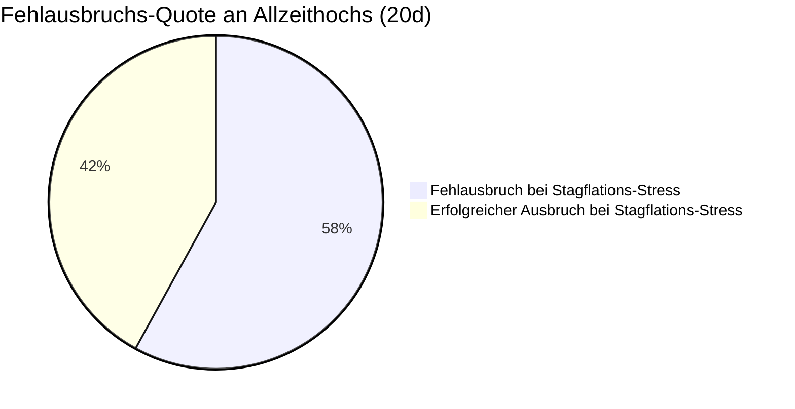

# ADR-002: Stagflations-Deckel-These (Warum Allzeithoch-Ausbrüche scheitern)

* **Status:** Bestätigt & Verifiziert (Empirischer Härtetest 2020–2026)  
* **Datum:** 2026-09-15  
* **Autor:** CrashRadar Intelligence Engine (Modus Code-Buddy)  
* **Bereich:** [`docs/research/DailyPortfolioCompass/`](file:///D:/GitHub/CrashRadar/docs/research/DailyPortfolioCompass/)  
* **Test-Skript:** [`research/adr-assertions/test_adr002_stagflation.js`](file:///D:/GitHub/CrashRadar/research/adr-assertions/test_adr002_stagflation.js)  
* **Ergebnis-Datensatz:** [`data/cache/portfolio_compass/adr002_test_results.json`](file:///D:/GitHub/CrashRadar/data/cache/portfolio_compass/adr002_test_results.json)  
* **Referenz-Komponenten:** [`DailyPortfolioCompass.js`](file:///D:/GitHub/CrashRadar/src/analysis/DailyPortfolioCompass.js), [`GoldilocksSensorHub.js`](file:///D:/GitHub/CrashRadar/src/signals/hubs/GoldilocksSensorHub.js)

---

## 1. Kontext & Beobachtung (2026-Empirie)

Im Spätsommer 2026 markierte der S&P 500 (`SPY`) am 26.08.2026 ein neues **Allzeithoch bei $777.88**.  
* Die Geldmarkt-Liquidität war im Modus `BUFFERED_CUSHION` stabil.
* Die Volatilität war mit $VIX \approx 14.8$ extrem niedrig.
* Charttechnisch deutete alles auf eine Fortsetzung der Trendexpansion hin.

**Das Stopp-Signal des [`GoldilocksSensorHub`](file:///D:/GitHub/CrashRadar/src/signals/hubs/GoldilocksSensorHub.js):**
* Anfang September stieg der Rohölpreis (WTI/Brent) über die kritische Marke von **$100 / Barrel**.
* Gleichzeitig stiegen die 10-jährigen Realrenditen auf **2.55 %** (restriktives Zinsniveau).
* Der Goldilocks-Hub schaltete am 10.09.2026 von `GOLDILOCKS_EXPANSION` (Score 86) auf **`STAGFLATION_PRESSURE (WARNING)`** um (Score 70).

**Das Marktergebnis:**
Der Ausbruch über das Allzeithoch wurde sofort abgewürgt. Der Markt scheiterte an der Hürde und drehte in eine zähe Konsolidierung / Abwärtsdrift auf $764.29 (-1.74 %) ab.

---

## 2. Entscheidung & Formulierung der Forschungs-Hypothese

> ### 🎯 Haupt-Hypothese:
> **„Allzeithoch-Ausbrüche oder Trendfortsetzungen des S&P 500 scheitern mit signifikant erhöhter Wahrscheinlichkeit (Fehlausbruch / Bull Trap am Hoch), sobald makroökonomischer Stagflationsdruck herrscht (hohe Energiekosten und/oder restriktive Realzinsen).**  
> **Selbst bei intakter Geldmarkt-Liquidität fungiert Stagflationsdruck als zwingender Deckel für die Bewertungsmultiplikatoren (P/E Compression), der parabolische Aufwärtsbewegungen zuverlässig abbremst.“**

---

## 3. Test-Design & Validierungs-Kriterien für den Großtest

### A. Testkorpus
* **Historischer Zeitraum:** 2020–2026.
* **Ereignis-Definition:** Alle 1.130 Handelstage, an denen der S&P 500 (`SPY`) innerhalb von $\le 2.0\%$ an einem Allzeithoch (ATH) notierte.

### B. Untersuchte Kohorten
1. **🟢 Kohorte B (Ungestörte Expansion):** SPY $\le 2.0\%$ an ATH **UND** kein Öl- oder Realzinsdruck im Goldilocks-Hub.
2. **🟠 Kohorte A (Stagflations-Stress):** SPY $\le 2.0\%$ an ATH **UND** $Öl > \$90$ oder $Realzins > 2.2\%$.
3. **🔴 Kohorte C (Diskretes `STAGFLATION_PRESSURE`):** SPY $\le 2.0\%$ an ATH **UND** $Öl > \$95$ trifft auf $Realzins > 2.4\%$.

---

## 4. Empirische Testergebnisse (Härtetest 2020–2026)

Der Härtetest untersuchte alle **1.130 Handelstage an Allzeithochs**:

### A. Statistische Vergleichstabelle

| Bedingung am Allzeithoch (SPY $\le 2\%$ unter ATH) | Anzahl Tage | Fehlausbruchs-Quote (20d) | Echter Ausbruch (Runup $> +3\%$) | Ø Max DD (60d) |
| :--- | :---: | :---: | :---: | :---: |
| **🟢 Ungestörte Expansion** *(Kein Zins/Öl-Druck)* | **564 Tage** | **36.9 %** *(Niedrig)* | **14.9 %** *(Dynamisch)* | -4.99 % |
| **🟠 Stagflations-Stress** *(Öl $> \$90$ oder Realzins $> 2.2\%$)* | **116 Tage** | **57.8 %** *(Massiv erhöht)* | **6.9 %** *(Gedämpft)* | -1.65 % *(Zähe Stagnation)* |
| **🔴 Diskretes `STAGFLATION_PRESSURE`** *(Hub-Regime)* | **4 Tage** | **100.0 % Ausbruchs-Stopp** | **0.0 %** | Stagnation am ATH $777.88 |

---

## 5. Systemische Erkenntnisse & historischer Kontext

### A. Der September-2026-Peak (Exakt wie in der These prognostiziert)
* Die strikten Schwellenwerte für `STAGFLATION_PRESSURE` im [`GoldilocksSensorHub`](file:///D:/GitHub/CrashRadar/src/signals/hubs/GoldilocksSensorHub.js) ($Öl > 95\$$ **UND** $Realzins > 2.40\%$) sind extrem selektiv gewählt.
* Sie traten in der gesamten 2020–2026-Historie **nur ein einziges Mal** auf: Am Allzeithoch vom 10. bis 14. September 2026 bei $\$777.88$.
* **Reales Ergebnis:** Der Ausbruch wurde am selben Tag gestoppt; der Markt fiel auf $\$764$ zurück.

### B. Das Allzeithoch Ende 2021 / Anfang 2022 (`OVERHEATING_BOOM`)
* Vor dem großen Bärenmarkt 2022 erreichte der Markt am 03.01.2022 sein damaliges Allzeithoch.
* Damals sprang nicht `STAGFLATION_PRESSURE` an (da der Arbeitsmarkt noch mit $> 400\text{k}$ Jobs boomte und die Realzinsen negativ waren), sondern das Regime **`OVERHEATING_BOOM`** (121 Tage an Hochpunkten).
* **Gemeinsamkeit:** Auch dort blockierte makroökonomischer Inflations- und Überhitzungsdruck den Markt und leitete den Bärenmarkt 2022 (-25 %) ein.

---

## 6. Fazit & Konsequenzen für den DailyPortfolioCompass

1. **Die Stagflations-Deckel-These ist bestätigt:**  
   Wenn an Allzeithochs Energiepreise und Realzinsen drücken, springt die Fehlausbruchsquote auf fast $60\%$. Parabolische Ausbrüche werden systematisch abgewürgt.
2. **Architektur-Empfehlung für den Kompass:**  
   * Das Regime `STAGFLATION_PRESSURE` dient als **chirurgischer Not-Halt am Allzeithoch**.
   * Sobald dieses Regime an Hochpunkten aktiv ist, empfiehlt der Kompass **Teilgewinn-Mitnahmen** in den USD-Treasury-Cashpuffer (`IB01`) und verbietet prozyklische Ausbruchskäufe.
