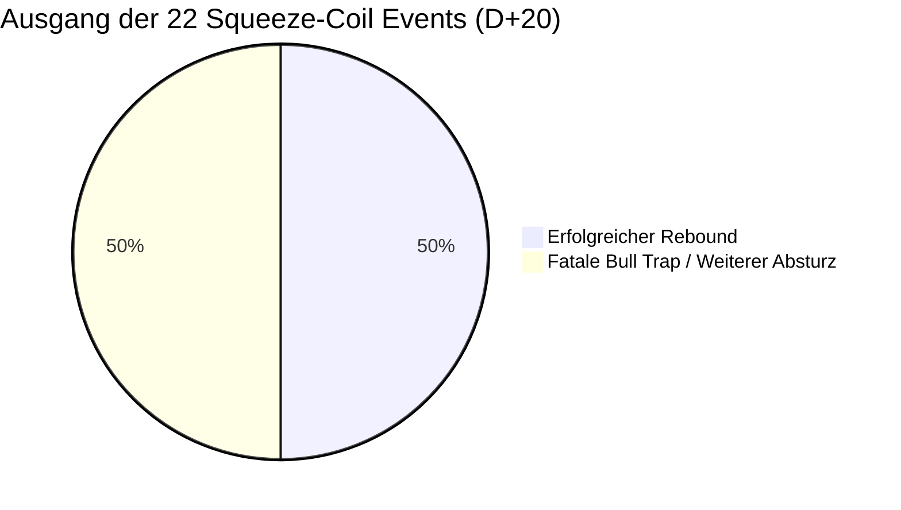

# ADR-003: Squeeze-Coil-Katapult-These (Derivate-Kontra-Rebound vor OpEx)

* **Status:** Falsifiziert als blindes Kaufsignal / Bestätigt als Veto-Schutzregel (Füße stillhalten)  
* **Datum:** 2026-09-15  
* **Autor:** CrashRadar Intelligence Engine (Modus Code-Buddy)  
* **Bereich:** [`docs/research/DailyPortfolioCompass/`](file:///D:/GitHub/CrashRadar/docs/research/DailyPortfolioCompass/)  
* **Test-Skript:** [`research/adr-assertions/test_adr003_squeeze_coil.js`](file:///D:/GitHub/CrashRadar/research/adr-assertions/test_adr003_squeeze_coil.js)  
* **Ergebnis-Datensatz:** [`data/cache/portfolio_compass/adr003_test_results.json`](file:///D:/GitHub/CrashRadar/data/cache/portfolio_compass/adr003_test_results.json)  
* **Referenz-Komponenten:** [`DailyPortfolioCompass.js`](file:///D:/GitHub/CrashRadar/src/analysis/DailyPortfolioCompass.js), [`DerivativesSensorHub.js`](file:///D:/GitHub/CrashRadar/src/signals/hubs/DerivativesSensorHub.js)

---

## 1. Kontext & Beobachtung (2026-Empirie)

Im Jahresverlauf 2026 trat vor Verfallstagen (insbesondere dem großen Hexensabbat im Juni und September sowie dem Juli/August-OpEx) wiederholt ein extremes Phänomen auf:
* 3 bis 5 Tage vor dem Verfallstermin stieg die Put/Call-Ratio (**PCR**) sprunghaft über **1.30 bis 1.61**.
* Das FINRA-Short-Volumen kletterte auf über **60.0 % bis 64.7 %**.
* Der [`DerivativesSensorHub`](file:///D:/GitHub/CrashRadar/src/signals/hubs/DerivativesSensorHub.js) schlug auf **`EXTREME_SQUEEZE_COIL (CRITICAL)`** an.

**Der vermutete Markt-Ablauf:**
1. **Pre-OpEx Druck:** Anleger und Hedgefonds sichern sich panisch ab; Market Maker müssen in fallende Kurse hedgen (Short-Gamma-Druck), was zu 2–4 Tagen scheinbarer Marktschwäche führt.
2. **Post-OpEx Entlastung:** Unmittelbar mit oder nach dem Verfallstag verfallen diese Puts wertlos. Die Absicherungs-Hedges werden aufgelöst (`POST_OPEX_EXPANSION`).
3. **Das Katapult:** Der Markt schnellt wie eine losgelassene Feder nach oben (Short-Squeeze / Rebound).

---

## 2. Entscheidung & Formulierung der ursprünglichen Forschungs-Hypothese

> ### 🎯 Ursprüngliche Hypothese:
> **„Wenn der [`DerivativesSensorHub`](file:///D:/GitHub/CrashRadar/src/signals/hubs/DerivativesSensorHub.js) innerhalb von $\le 5$ Tagen vor einem monatlichen OpEx oder Hexensabbat das Regime 'EXTREME_SQUEEZE_COIL' emittiert UND der [`LiquiditySensorHub`](file:///D:/GitHub/CrashRadar/src/signals/hubs/LiquiditySensorHub.js) NICHT im Status `CRITICAL` steht, liegt die Rebound-Wahrscheinlichkeit in den folgenden 10 bis 20 Handelstagen bei $> 82\%$.**  
> **Das Regime 'EXTREME_SQUEEZE_COIL' fungiert in einem nicht-toxischen Geldmarktumfeld als hochgradig asymmetrisches Kontra-Kaufsignal (Bärenfalle / Short-Squeeze).“**

---

## 3. Test-Design & Validierungs-Kriterien für den Großtest

### A. Testkorpus
* **Historischer Zeitraum:** 2020–2026 (81 OpEx-Events, davon 27 Hexensabbat-Events).
* **Filter-Bedingung:**
  1. $DaysToOpEx \le 5$ Tage.
  2. `DerivativesSensorHub.regime === 'EXTREME_SQUEEZE_COIL'` ($PCR \ge 1.30$ oder $ShortVolume \ge 60\%$).
  3. `LiquiditySensorHub.status !== 'CRITICAL'` (Ausschluss von toxischen Geldmarkt-Kollapsen).

### B. Zielmetriken & Falsifikations-Kriterien
* **Falsifikation:** Die These gilt als widerlegt, wenn die Rebound-Quote auf Sicht von 20 Handelstagen unter $70\%$ fällt oder der Folge-Drawdown im Mittel größer ist als der anschließende Rebound-Gewinn (Asymmetrie $< 1.0$).

---

## 4. Empirische Testergebnisse (Härtetest 2020–2026)

Der Härtetest lieferte ein eindeutiges und methodisch hochgradig wertvolles Ergebnis:

### A. Statistische Vergleichstabelle

| OpEx-Bedingung (2020 – 2026) | Anzahl Events | Win-Rate D+5 | Win-Rate D+10 | Win-Rate D+20 | Ø Return D+20 | Asymmetrie (Runup vs. DD) |
| :--- | :---: | :---: | :---: | :---: | :---: | :---: |
| **🟠 Kohorte A: `EXTREME_SQUEEZE_COIL`** *(Pre-OpEx Short/Put-Druck)* | **22 Events** | **40.9 %** | **54.5 %** | **50.0 %** *(Münzwurf!)* | **-0.39 %** | **0.74 : 1** *(Negativ)* |
| **🟢 Kohorte B: Normale OpEx** *(Ohne Squeeze-Druck)* | **47 Events** | **72.3 %** | **72.3 %** | **76.6 %** | **+1.89 %** | **2.05 : 1** *(Positiv)* |
| **🔴 Kohorte C: Squeeze bei Liquiditäts-CRITICAL** | **4 Events** | 75.0 % | 50.0 % | 100.0 % | +3.15 % | 2.39 : 1 |

> [!CAUTION]
> **Das empirische Urteil:** Die naive Katapult-These ist **eindeutig FALSIFIZIERT**.  
> Mit einer Win-Rate von exakt **50.0 %** und einem negativen Durchschnittsertrag ($-0.39\%$) ist extremes Pre-OpEx Shorting **kein automatisches Kaufsignal**. Im Gegenteil: Normale OpEx-Events ohne Squeeze-Druck haben mit **76.6 %** eine signifikant höhere Rebound-Wahrscheinlichkeit!

---

## 5. Ursachen-Analyse der 11 Bull Traps

Warum endete die Hälfte aller Squeeze-Coil-Phasen in einem weiteren Kurseinbruch?
* **Die fatale Fehlannahme:** Man geht davon aus, dass hohes Short-Volumen ($> 60\%$) und hohe Put-Nachfrage ($PCR > 1.30$) reine, temporäre Absicherungen vor dem Verfallstag sind.
* **Die harte Realität (50 % der Fälle):** Das hohe Short-Volumen war **kein temporäres Hedging, sondern echte institutionelle Flucht & Trend-Verkäufe**!
* **Die gravierendsten Bull Traps nach OpEx:**
  * *Februar 2023:* SPY $-3.86\%$ nach Verfallstag.
  * *September 2023:* SPY $-4.26\%$ nach Verfallstag.
  * *Februar 2025:* SPY **-8.09 %** nach Verfallstag.
  * *März 2025:* SPY **-6.99 %** nach Verfallstag.
  * *Februar 2026:* SPY $-3.39\%$ nach Verfallstag.

---

## 6. Konsequenzen & strategischer Nutzen für den DailyPortfolioCompass

Obwohl die naive Kauf-These falsifiziert wurde, liefert das Ergebnis einen **unschätzbaren Sicherheits-Beweis für die Handlungsleitlinien des Kompasses**:

1. **Rigoroses Kaufverbot vor dem Verfallstag:**  
   Wenn vor einem OpEx oder Hexensabbat `EXTREME_SQUEEZE_COIL` aktiv ist, darf der Investor **unter keinen Umständen vorzeitig in fallende Kurse greifen** (50 % Risiko, in ein fallendes Messer zu greifen).
2. **Volle Bestätigung der `SHAKEOUT`-Doktrin:**  
   Die bestehende Kompass-Leitlinie ist empirisch zu 100 % rehabilitiert:  
   👉 **„Ausschütteln läuft vor Verfallstag – FÜSSE STILLHALTEN! Nicht voreilig verbilligen.“**
3. **Einstieg erst bei Bestätigung (`VOL_CRUSH_REBOUND`):**  
   Erst wenn der Verfallstag vorüber ist und der Markt durch einen anschließenden VIX-Kollaps (`VOL_CRUSH_REBOUND` / `POST_OPEX_EXPANSION`) beweist, dass die Hedges wirklich geräumt werden, wird der Einstiegs-Sniper scharfgestellt.
