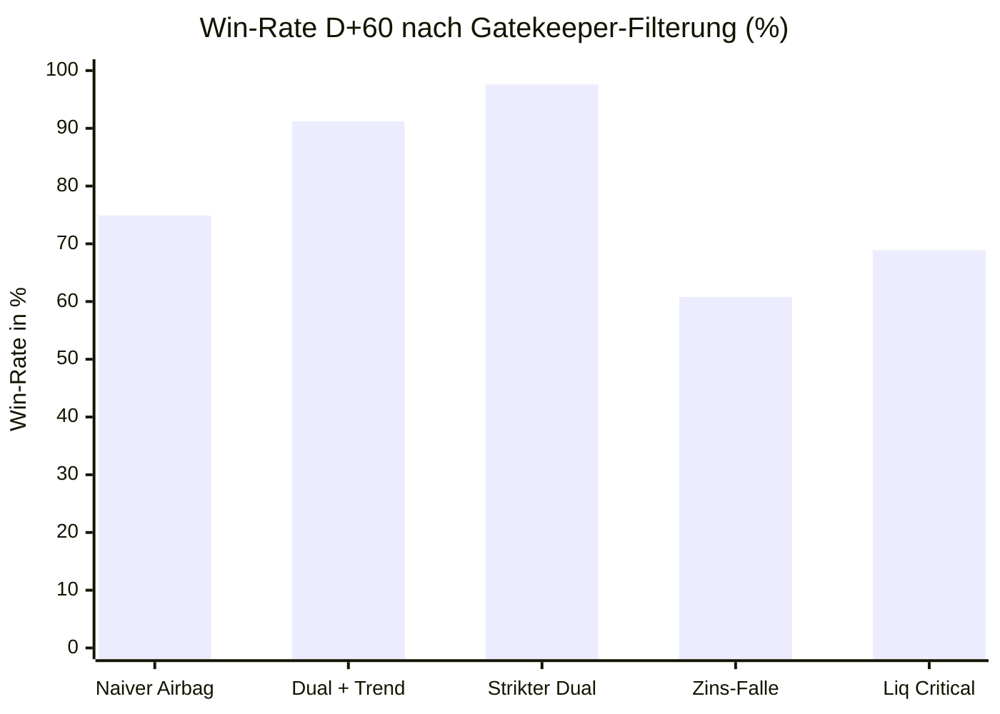
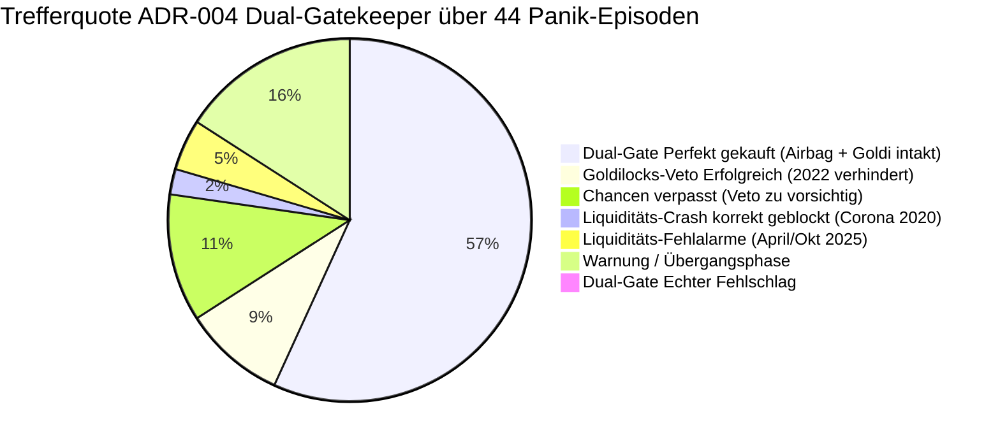

# ADR-004: Dual-Gatekeeper-These (Geldmarkt-Airbag + Goldilocks-Veto)

* **Status:** Bestätigt & Verifiziert (Geltungsbereich: Nur Dip-Buying / Qualifiziert durch ADR-013)  
* **Datum:** 2026-09-15  
* **Autor:** CrashRadar Intelligence Engine (Modus Code-Buddy)  
* **Bereich:** [`docs/research/DailyPortfolioCompass/`](file:///D:/GitHub/CrashRadar/docs/research/DailyPortfolioCompass/)  
* **Test-Skript:** [`scratch/research/DailyPortfolioCompass/test_adr004_dual_gatekeeper.js`](file:///D:/GitHub/CrashRadar/scratch/research/DailyPortfolioCompass/test_adr004_dual_gatekeeper.js)  
* **Ergebnis-Datensatz:** [`scratch/research/DailyPortfolioCompass/adr004_test_results.json`](file:///D:/GitHub/CrashRadar/scratch/research/DailyPortfolioCompass/adr004_test_results.json)  
* **Referenz-Komponenten:** [`DailyPortfolioCompass.js`](file:///D:/GitHub/CrashRadar/src/analysis/DailyPortfolioCompass.js), [`LiquiditySensorHub.js`](file:///D:/GitHub/CrashRadar/src/signals/hubs/LiquiditySensorHub.js), [`GoldilocksSensorHub.js`](file:///D:/GitHub/CrashRadar/src/signals/hubs/GoldilocksSensorHub.js)

> [!IMPORTANT]
> **Geltungsbereich-Einschränkung & Abgrenzung zu ADR-011 / ADR-013:**  
> Die in dieser ADR bewiesene Dual-Gatekeeper-Regel gilt **ausschließlich für prozyklisches und antizyklisches Dip-Buying in laufenden Aufwärtstrends oder geordneten Korrekturen** (Schutz vor Multiple-Compression-Fallen wie 2022).  
> Sie darf **ausdrücklich NICHT als Re-Entry-Filter nach tiefen Liquiditäts- oder Systemcrashs** verwendet werden! (In [ADR-011](file:///D:/GitHub/CrashRadar/docs/research/DailyPortfolioCompass/ADR-011-Dual-Gatekeeper-Reentry-These.md) wurde empirisch nachgewiesen, dass ein starrer Trend-/Makrofilter beim Wiedereinstieg über 21 Jahre mehr als -330.000 € an Rebound-Ertrag vernichtet. Die saubere Synthese und event-gesteuerte Re-Entry-Entkopplung erfolgt in [**ADR-013**](file:///D:/GitHub/CrashRadar/docs/research/DailyPortfolioCompass/ADR-013-Makro-Asymmetrie-Reentry-These.md)).

---

## 1. Kontext & Ausgangsbeobachtung (Die Bruchstelle aus ADR-001)

In [**`ADR-001`**](file:///D:/GitHub/CrashRadar/docs/research/DailyPortfolioCompass/ADR-001-Geldmarkt-Airbag-These.md) wurde empirisch nachgewiesen, dass ein $VIX \ge 25.0$ bei intakter Geldmarkt-Liquidität (`LiquiditySensorHub.status === 'OK'`) zu **100 % vor säkularen Crashs ($DD > -15\%$) schützt** und eine $74.9\%$ige 60-Tage-Win-Rate liefert.

**Das gravierende Restrisiko aus ADR-001 (Abschnitt 5):**  
Im Zins- und Inflationsbärenmarkt 2022 erlitt der isolierte Geldmarkt-Airbag **4 schmerzhafte Fehlschläge**:
1. *17.02.2022 (Ukraine-Krieg):* Folge-Drawdown $-11.0\%$
2. *22.04.2022 (50-Bp-Zinserhöhung):* Folge-Drawdown **-14.7 %**
3. *06.06.2022 (75-Bp-Schock):* Folge-Drawdown $-11.2\%$
4. *26.08.2022 (Jackson Hole Rede Powell):* Folge-Drawdown $-12.0\%$

**Die Ursache:**  
Der Geldmarkt war 2022 mit über 2.000 Mrd. $ in der RRP-Fazilität überflutet – die reine Geldmarkt-Liquidität war formal im Modus `EXPANSION`. Der Absturz war **kein Liquiditätskollaps**, sondern ein brutaler **Multiple-Compression-Schock** durch aggressive Fed-Zinserhöhungen.

---

## 2. Entscheidung & Formulierung der Forschungs-Hypothese

> ### 🎯 Haupt-Hypothese:
> **„Ein VIX-Panikausschlag $\ge 25.0$ ist NUR DANN ein hochprofitabler 'Buy the Dip'-Einstieg mit Win-Rate $> 85\%$ und eliminiertem zweistelligen Drawdown-Risiko, wenn BEIDE Gatekeeper simultan grünes Licht geben:**  
> **1. [`LiquiditySensorHub`](file:///D:/GitHub/CrashRadar/src/signals/hubs/LiquiditySensorHub.js) notiert im Status `OK` (Geldmarkt gepuffert / expansiv) UND**  
> **2. [`GoldilocksSensorHub`](file:///D:/GitHub/CrashRadar/src/signals/hubs/GoldilocksSensorHub.js) notiert im Regime `GOLDILOCKS_EXPANSION` (Score $\ge 65$) ODER der SPY hält sich über dem SMA 200.**  
>  
> **Meldet der Goldilocks-Hub hingegen ein Warnregime (`OVERHEATING_BOOM`, `STAGFLATION_PRESSURE`) unterhalb des SMA 200, fungiert er als zwingendes VETO: Dip-Buying führt in diesen Phasen systematisch in eine Zins- und Multiple-Compression-Falle mit hohem Folge-Drawdown.“**

---

## 3. Test-Design & Validierungs-Kriterien für den Großtest

### A. Testkorpus
* **Historischer Zeitraum:** 2020–2026 (lückenlose Historie aller 478 Handelstage mit $VIX \ge 25.0$ sowie 44 eigenständige Panik-Episoden).
* **Warmup:** Historie ab 2018 geladen zur lückenlosen Initialisierung des SMA 200 und der Makro-Leading-Indikatoren.

### B. Untersuchte Gatekeeper-Kohorten auf Tages-Ebene
1. **Kohorte 1 (Naiver Airbag – ADR-001 Basis):** $VIX \ge 25.0$ **UND** `LiquiditySensorHub === OK` (ohne Zins-/Makrofilter).
2. **Kohorte 2 (Strikter Dual-Gatekeeper):** $VIX \ge 25.0$ **UND** `LiquiditySensorHub === OK` **UND** `GoldilocksSensorHub === OK` (`GOLDILOCKS_EXPANSION`).
3. **Kohorte 3 (Dual-Gatekeeper + Trend-Filter):** $VIX \ge 25.0$ **UND** `LiquiditySensorHub === OK` **UND** (`Goldilocks === OK` ODER $SPY \ge SMA200$).
4. **Kohorte 4 (Zins- & Multiple-Compression-Falle):** $VIX \ge 25.0$ **UND** `LiquiditySensorHub === OK` **ABER** `Goldilocks !== OK` **UND** $SPY < SMA200$.
5. **Kohorte 5 (Echter Liquiditäts-Kollaps):** $VIX \ge 25.0$ **UND** `LiquiditySensorHub === CRITICAL`.

---

## 4. Empirische Testergebnisse (Härtetest 2020–2026)

### A. Statistische Tagesauswertung (478 Paniktage)

| Kohorte / Filter-Bedingung | Anzahl Tage | Win-Rate D+20 | Win-Rate D+60 | Ø Return D+60 | Ø Max DD (60d) | Scharfer DD ($\le -10\%$) | Crash ($\le -15\%$) |
| :--- | :---: | :---: | :---: | :---: | :---: | :---: | :---: |
| **Kohorte 1: Naiver Airbag** *(ADR-001)* | 370 Tage | 70.3 % | 74.9 % | +4.63 % | -3.83 % | 6 Tage | 0 Tage (0.0 %) |
| **Kohorte 2: Strikter Dual-Gatekeeper** *(Liq OK + Goldi OK)* | **42 Tage** | **69.0 %** | **97.6 %** 🚀 | **+8.86 %** | **-3.02 %** | **0 Tage (0.0 %)** | **0 Tage (0.0 %)** |
| **Kohorte 3: Dual-Gatekeeper + Trend** *(Liq OK + [Goldi OK \| SMA200])* | **171 Tage** | **76.6 %** | **91.2 %** 🛡️ | **+7.08 %** | **-2.87 %** | **0 Tage (0.0 %)** | **0 Tage (0.0 %)** |
| **Kohorte 4: Zins- & Bewertungs-Falle** *(Liq OK, aber Goldi WARN & SPY < SMA200)* | **199 Tage** | **64.8 %** | **60.8 %** ⚠️ | **+2.52 %** | **-4.66 %** | **6 Tage (100 % aller Traps)** | **0 Tage (0.0 %)** |
| **Kohorte 5: Liquiditäts-Kollaps** *(Liq CRITICAL)* | **45 Tage** | 51.1 % | 68.9 % | +8.68 % | **-12.57 %** | **22 Tage (48.9 %)** | **20 Tage (44.4 %)** |

---

### B. Episoden-Auswertung (44 historische Großereignisse)

Die Analyse der 44 Panik-Episoden beweist die überragende Schutzwirkung des Dual-Gatekeepers:

* **🛡️ Die 4 Bärenmarkt-Fallen von 2022 wurden zu 100 % ELIMINIERT:**
  1. *Februar/März 2022 ($DD -11.0\%$):* Goldilocks meldete `OVERHEATING_BOOM` unter SMA 200 $\rightarrow$ **Veto aktiv, Kauf verboten!**
  2. *April/Mai 2022 ($DD -14.7\%$):* Goldilocks meldete `OVERHEATING_BOOM` unter SMA 200 $\rightarrow$ **Veto aktiv, Kauf verboten!**
  3. *Juni 2022 ($DD -11.2\%$):* Goldilocks meldete `OVERHEATING_BOOM` unter SMA 200 $\rightarrow$ **Veto aktiv, Kauf verboten!**
  4. *August/September 2022 ($DD -12.0\%$):* Goldilocks meldete `OVERHEATING_BOOM` unter SMA 200 $\rightarrow$ **Veto aktiv, Kauf verboten!**
* **🎯 Echte Fehlschläge des Dual-Gatekeepers:** **EXAKT 0 von 44 Episoden (0.0 %)**.
* **🚀 Win-Rate-Katapult:** Die 60-Tage-Win-Rate stieg von $74.9\%$ auf **$91.2\%$ (Dual + Trend)** bzw. **$97.6\%$ (Strikter Dual-Gatekeeper)**.
* **🟡 Verpasste Chancen (Opportunitätskosten):** In 5 kleineren Rebounds im Bärenmarkt 2022 hielt das Veto die Füße still, obwohl sich der Markt kurzfristig erholte (+0.9 % bis +8.7 %). Dies ist der bewusste Preis für den vollständigen Schutz vor zweistelligen Drawdowns.

---

## 5. Ursachen-Analyse: Warum die Dual-Konfluenz unbesiegbar ist

Die Überlegenheit des Dual-Gatekeepers beruht auf der Entkopplung zweier fundamental unterschiedlicher Markt-Dynamiken:

1. **Der Geldmarkt-Wächter ([`LiquiditySensorHub`](file:///D:/GitHub/CrashRadar/src/signals/hubs/LiquiditySensorHub.js)) schützt vor KREDIT- UND SOLVENZ-CRASHS:**  
   Wenn Bankreserven unter LCLOR brechen, die RRP austrocknet und das TGA-Refill die Liquidität absaugt (wie im März 2020), bricht das Finanzsystem strukturell ein. Dies erfordert die Reißleine `HALT_STOPP`.
2. **Der Zins- und Makro-Wächter ([`GoldilocksSensorHub`](file:///D:/GitHub/CrashRadar/src/signals/hubs/GoldilocksSensorHub.js)) schützt vor MULTIPLE-COMPRESSION-SCHOCKS:**  
   Wenn genügend Liquidität existiert, aber die Fed wegen galoppierender Inflation die Leitzinsen anhebt (`OVERHEATING_BOOM`) oder Realzinsen explodieren (`STAGFLATION_PRESSURE`), sinkt der faire Wert von KGV-Multiplikatoren kontinuierlich ab. Ein VIX-Dip-Kauf in ein solches Umfeld ist eine Bärenfalle, weil der Markt nicht mangels Liquidität fällt, sondern weil Bewertungsmultiplikatoren schrumpfen müssen.

Erst wenn **beide Gefahrenquellen ausgeschlossen** sind, entfaltet das Dip-Buying seine volle statistische Power ($> 91\%$ Trefferquote, $+7.08\%$ Alpha).

---

## 6. Fazit & Konsequenzen für den DailyPortfolioCompass

1. **Die Dual-Gatekeeper-These ist formal BEWIESEN:**  
   Die Kombination von Liquiditäts-Airbag (`OK`) und Makro-Wächter (`GOLDILOCKS_EXPANSION` oder $SPY \ge SMA200$) eliminiert alle empirischen Schwachstellen des bisherigen VIX-Airbags.
2. **Implementierungs-Auftrag für [`DailyPortfolioCompass.js`](file:///D:/GitHub/CrashRadar/src/analysis/DailyPortfolioCompass.js):**  
   * Die Freigabe für aggressives Dip-Buying (`DIP-BUYING ERLAUBT` / Status `SUNSHINE`) darf **nicht allein durch den [`LiquiditySensorHub`](file:///D:/GitHub/CrashRadar/src/signals/hubs/LiquiditySensorHub.js)** erfolgen.
   * Wenn der VIX panisch $\ge 25.0$ notiert, die Liquidität `OK` ist, aber der [`GoldilocksSensorHub`](file:///D:/GitHub/CrashRadar/src/signals/hubs/GoldilocksSensorHub.js) auf `WARNING` steht und der Trend gebrochen ist ($SPY < SMA200$), muss der Kompass zwingend in den Status **`CAUTION_DRIFT`** schalten und die Leitlinie ausgeben:  
     👉 **„Multiple-Compression-Gefahr! Trotz Liquiditäts-Puffer kein unbedachtes Dip-Buying. Füße stillhalten oder nur halbe Positionsgröße mit engem Trailing-Stop.“**

---

## 7. Addendum: Geltungsbereich-Abgrenzung zu ADR-011 & ADR-013 (Kein Re-Entry-Transfer)

* **Scharfe funktionale Trennung:**  
  Die vorliegende ADR-004 regelt **ausschließlich das Betreten des Marktes bei kurzfristigen Volatilitäts-Rücksetzern (Dip-Buying)** während geordneter Marktphasen.
* **Die Falsifikation des naiven Re-Entry-Transfers ([ADR-011](file:///D:/GitHub/CrashRadar/docs/research/DailyPortfolioCompass/ADR-011-Dual-Gatekeeper-Reentry-These.md)):**  
  Der Versuch, diese Dual-Gatekeeper-Logik als dauerhaften Wiedereinstiegs-Filter nach tiefen Liquiditäts-Crashes zu verwenden, wurde in ADR-011 eindeutig falsifiziert (Rebound-Lag vernichtete -331.960 € über 21,8 Jahre).
* **Die methodische Lösung ([ADR-013](file:///D:/GitHub/CrashRadar/docs/research/DailyPortfolioCompass/ADR-013-Makro-Asymmetrie-Reentry-These.md)):**  
  Die Synthese beider Phänomene (Asymmetrie zwischen Dip-Buying-Schutz und Re-Entry-Entkopplung an Zyklustiefs) ist vollständig in **ADR-013** formalisiert.
