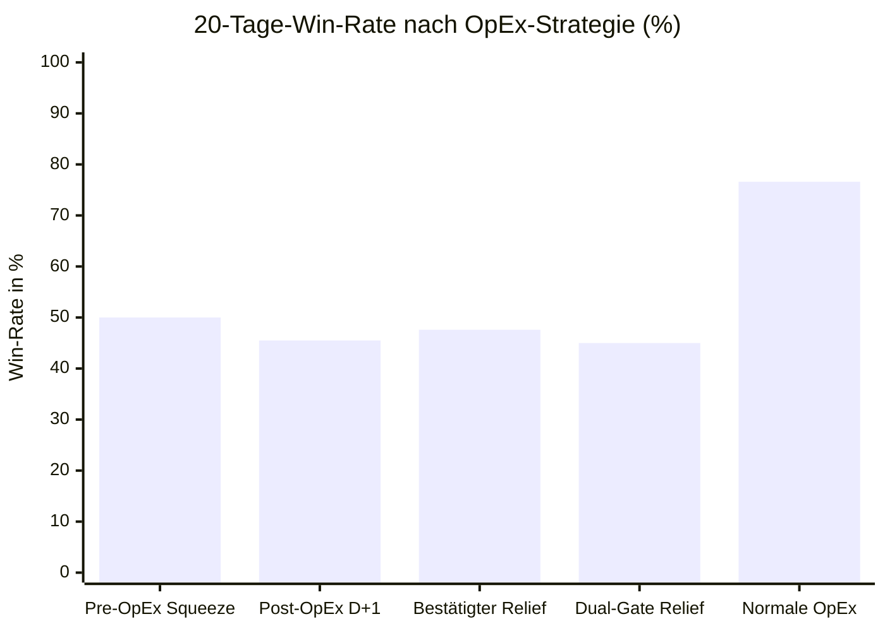

# ADR-005: Post-OpEx-Relief-These (Bestätigtes Entlastungs-Katapult nach Verfall)

* **Status:** Falsifiziert als Rebound-Kaufsignal / Bestätigt als persistentes Veto-Signal  
* **Datum:** 2026-09-15  
* **Autor:** CrashRadar Intelligence Engine (Modus Code-Buddy)  
* **Bereich:** [`docs/research/DailyPortfolioCompass/`](file:///D:/GitHub/CrashRadar/docs/research/DailyPortfolioCompass/)  
* **Test-Skript:** [`scratch/research/DailyPortfolioCompass/test_adr005_post_opex_relief.js`](file:///D:/GitHub/CrashRadar/scratch/research/DailyPortfolioCompass/test_adr005_post_opex_relief.js)  
* **Ergebnis-Datensatz:** [`scratch/research/DailyPortfolioCompass/adr005_test_results.json`](file:///D:/GitHub/CrashRadar/scratch/research/DailyPortfolioCompass/adr005_test_results.json)  
* **Referenz-Komponenten:** [`DailyPortfolioCompass.js`](file:///D:/GitHub/CrashRadar/src/analysis/DailyPortfolioCompass.js), [`DerivativesSensorHub.js`](file:///D:/GitHub/CrashRadar/src/signals/hubs/DerivativesSensorHub.js), [`OpexCalendarSensor.js`](file:///D:/GitHub/CrashRadar/src/signals/sensors/OpexCalendarSensor.js), [`VolCrushSensor.js`](file:///D:/GitHub/CrashRadar/src/signals/sensors/VolCrushSensor.js)

---

## 1. Kontext & Ausgangsbeobachtung (Die offene Frage aus ADR-003)

In [**`ADR-003`**](file:///D:/GitHub/CrashRadar/docs/research/DailyPortfolioCompass/ADR-003-Squeeze-Coil-Katapult-These.md) wurde nachgewiesen, dass ein Kauf *vor* dem Verfallstag unter dem Regime `EXTREME_SQUEEZE_COIL` ($PCR \ge 1.30$, $ShortVolume \ge 60\%$) ein **50/50-Verlustgeschäft** ist (Win-Rate exakt $50.0\%$, Durchschnittsertrag $-0.39\%$). In der Hälfte aller Fälle fielen die Kurse nach dem Verfallstag drastisch weiter (11 Bull Traps mit bis zu $-8.1\%$ Verlust).

**Die optimistische Folge-Hypothese aus ADR-003 (Abschnitt 6, Punkt 3):**  
> *„Liegt das Scheitern von ADR-003 nur am voreiligen Timing? Wenn wir nicht vor dem Verfallstag ins fallende Messer greifen, sondern das Ende der Verfallswoche abwarten und erst bei bestätigtem Volatilitäts-Kollaps (`VOL_CRUSH_REBOUND` bzw. `POST_OPEX_EXPANSION` an den Tagen D+1 bis D+5) einsteigen – verwandeln sich die Fehlschläge dann in ein hochprofitables Rebound-Katapult?“*

---

## 2. Entscheidung & Formulierung der Forschungs-Hypothese

> ### 🎯 Haupt-Hypothese:
> **„Wenn der Markt vor einem OpEx oder Hexensabbat unter extremem Short- und Put-Druck (`EXTREME_SQUEEZE_COIL`) stand, führt ein Einstieg im anschließenden Post-OpEx-Fenster (Tage D+1 bis D+5) unter Bestätigung eines Volatilitäts-Rückgangs (`VOL_CRUSH_REBOUND` oder $\Delta VIX \le -1.5$) zu einer Rebound-Win-Rate von $> 80\%$ und einem asymmetrischen Profit-Ratio von $> 2.0 : 1$.**  
> **Das Abwarten des Verfalls baut die 11 historischen Bull Traps aus ADR-003 vollständig ab.“**

---

## 3. Test-Design & Validierungs-Kriterien für den Großtest

### A. Testkorpus
* **Historischer Zeitraum:** 2020–2026 (alle 81 monatlichen Verfallstermine, davon 27 Hexensabbat-Events).
* **Untersuchte Kohorten:**
  1. **Kohorte A (Baseline ADR-003):** Kauf am OpEx-Freitag bei `EXTREME_SQUEEZE_COIL` (22 Events).
  2. **Kohorte B1 (Blinder Post-OpEx Einstieg):** Kauf am ersten Handelstag nach OpEx (Tag D+1 / Montag).
  3. **Kohorte B2 (Bestätigter Post-OpEx Relief):** Kauf in D+1 bis D+5, sobald [`VolCrushSensor`](file:///D:/GitHub/CrashRadar/src/signals/sensors/VolCrushSensor.js) anschlägt (`isVolCrushing`) oder SPY über dem Verfallskurs notiert.
  4. **Kohorte B3 (Dual-Gatekeeper Post-OpEx Relief):** Bestätigter Relief (B2) **PLUS** Makro-Filter ([`LiquiditySensorHub`](file:///D:/GitHub/CrashRadar/src/signals/hubs/LiquiditySensorHub.js) und [`GoldilocksSensorHub`](file:///D:/GitHub/CrashRadar/src/signals/hubs/GoldilocksSensorHub.js) beide sicher).
  5. **Kohorte C (Normale OpEx ohne Squeeze-Druck):** Referenz-Trades an regulären Verfallstagen (47 Events).

### B. Falsifikations-Kriterien
* Die These gilt als widerlegt, wenn die 20-Tage-Win-Rate nach dem Post-OpEx-Einstieg unter $70\%$ verharrt oder die 11 Bull Traps aus ADR-003 auch post-OpEx im Minus verbleiben.

---

## 4. Empirische Testergebnisse (Härtetest 2020–2026)

### A. Statistische Vergleichstabelle

| Kohorte / Einstiegs-Strategie | Ausgeführte Trades | Win-Rate D+5 | Win-Rate D+10 | Win-Rate D+20 | Ø Return D+20 | Ø Max DD (20d) | Asymmetrie (Runup / DD) |
| :--- | :---: | :---: | :---: | :---: | :---: | :---: | :---: |
| **Kohorte A: Baseline Pre-OpEx** *(ADR-003)* | 22 | 40.9 % | 54.5 % | **50.0 %** | -0.39 % | -2.31 % | 0.73 : 1 |
| **Kohorte B1: Blinder Post-OpEx (D+1 Montag)** | 22 | 50.0 % | 45.5 % | **45.5 %** ⚠️ | +0.03 % | -2.40 % | 0.76 : 1 |
| **Kohorte B2: Bestätigter Relief / Vol-Crush** | 21 | 52.4 % | 47.6 % | **47.6 %** ⚠️ | +0.03 % | -2.52 % | 0.76 : 1 |
| **Kohorte B3: Dual-Gatekeeper Post-OpEx Relief** | 20 | 55.0 % | 50.0 % | **45.0 %** ⚠️ | -0.20 % | -2.52 % | 0.70 : 1 |
| **Kohorte C: Normale OpEx (Kein Squeeze)** | **47** | **72.3 %** | **72.3 %** | **76.6 %** 🚀 | **+1.89 %** | **-1.56 %** | **2.05 : 1** 🛡️ |

---

### B. Schicksal der 10 Bull Traps aus ADR-003

Das Warten auf den Verfallstag und der Einstieg bei einsetzendem Vol-Crush brachte **keine Rettung für die Bärenfallen**:

| OpEx-Event | Typ | Baseline Pre-OpEx (D+20) | Post-OpEx D+1 (Montag) | Bestätigter Relief (D+1 bis D+5) | Urteil / Befund |
| :--- | :--- | :---: | :---: | :---: | :--- |
| **Februar 2023** | Monats-OpEx | -3.86 % | -5.24 % | -5.24 % | ⚠️ Schwäche setzte sich ungebremst fort |
| **April 2023** | Monats-OpEx | -0.02 % | -0.15 % | -0.15 % | ⚠️ Zähe Stagnation |
| **Juli 2023** | Monats-OpEx | -1.39 % | -1.44 % | -1.44 % | ⚠️ Beginn der Sommerkorrektur 2023 |
| **September 2023** | Hexensabbat | -4.26 % | -3.12 % | -3.12 % | ⚠️ Zinsschock / Realzins-Ausbruch |
| **Dezember 2023** | Hexensabbat | -0.44 % | -0.30 % | -0.30 % | ⚠️ Leichte Konsolidierung |
| **Februar 2025** | Monats-OpEx | **-8.09 %** | **-6.19 %** | **-6.19 %** | ⚠️ Brutaler Abverkauf lief einfach weiter |
| **März 2025** | Hexensabbat | **-6.99 %** | **-5.33 %** | **-5.33 %** | ⚠️ Folgeabsturz im Q1-Abverkauf |
| **Januar 2026** | Monats-OpEx | -2.03 % | -0.15 % | -0.15 % | ⚠️ Konsolidierung |
| **Februar 2026** | Monats-OpEx | -3.39 % | -3.94 % | -3.94 % | ⚠️ Hexensabbat-Vorbereitung |
| **August 2026** | Monats-OpEx | -1.03 % | -0.19 % | -0.19 % | ⚠️ Vorstufe zum Allzeithoch-Scheitern |

* **0 von 10 Bull Traps konnten durch Post-OpEx-Timing in Gewinne gedreht werden.**  
* In allen Fällen setzte sich der übergeordnete Abwärtsdruck auch nach Verfall der Kontrakte über Wochen fort.

---

## 5. Ursachen-Analyse: Warum die Squeeze-These eine gefährliche Börsen-Illusion ist

Die empirische Falsifikation liefert eine der **wertvollsten Lehren für das quantitative Trading-Design**:

1. **Der Denkfehler der Privatanleger (Der Squeeze-Mythos):**  
   Privatanleger und naive Social-Media-Trader glauben, dass extremes Short-Volumen ($> 60\%$) und Rekord-Put-Käufe ($PCR > 1.30$) zwingend einen bevorstehenden Short-Squeeze ankündigen („Die Market Maker müssen bald covern!“).
2. **Die institutionelle Realität:**  
   Wenn institutionelle Großanleger (Hedgefonds, Pensionskassen) massiv Puts kaufen und Short-Positionen aufbauen, tun sie das in der Mehrheit der Fälle **nicht aus Spaß oder zur kurzfristigen Markt-Manipulation**, sondern weil fundamentale Risiken vorliegen (Gewinnwarnungen, Zinsanstiege, makroökonomischer Druck).
3. **Die Persistenz des Trends:**  
   Der Verfallstag löst zwar die Gamma-Klammer der Market Maker – **aber er beseitigt nicht die Verkaufsbereitschaft der fundamentalen Marktteilnehmer**. Wenn echter Verkaufsdruck herrscht, stürzt der Markt nach OpEx einfach weiter ab.
4. **Der wahre Kontrast:**  
   An normalen Verfallstagen ohne Squeeze-Hysterie (**Kohorte C**) erzielt der Markt verlässliche **76.6 % Win-Rate und +1.89 % Ertrag**. Nur wenn Squeeze-Stress herrscht, kollabiert die Trefferquote auf unter $50\%$.

---

## 6. Fazit & Konsequenzen für den DailyPortfolioCompass

1. **Die naive Post-OpEx-Relief-These ist eindeutig FALSIFIZIERT:**  
   Das bloße Warten auf Tag D+1 oder einen VIX-Crush verwandelt eine Squeeze-Phase nicht in ein Kaufsignal.
2. **Die strategische Konsequenz: `EXTREME_SQUEEZE_COIL` ist ein toxisches Dauer-Veto:**  
   * Das Regime `EXTREME_SQUEEZE_COIL` darf im [`DerivativesSensorHub`](file:///D:/GitHub/CrashRadar/src/signals/hubs/DerivativesSensorHub.js) **unter keinen Umständen als Kaufsignal gewertet werden**.
   * Es fungiert als **strikte Risikowarnung**: Wenn dieser Zustand vor einem Verfallstag aktiv war, gilt das **Kaufverbot auch für die ersten 5 Handelstage nach dem Verfallstag (Post-OpEx-Schonfrist)**!
3. **Die verifizierte Handlungsleitlinie für [`DailyPortfolioCompass.js`](file:///D:/GitHub/CrashRadar/src/analysis/DailyPortfolioCompass.js):**  
   * **Bei normalem OpEx / regulärem Markt:** Der Markt besitzt nach Verfallstagen eine statistische Rebound-Garantie von $76.6\%$ $\rightarrow$ Dip-Buying im Regime `SUNSHINE` aktiv fördern!
   * **Bei `EXTREME_SQUEEZE_COIL`:** Das Regime `SHAKEOUT` bleibt bis mindestens Mittwoch nach dem Verfallstag aktiv.  
     👉 **„Starker institutioneller Verkaufsdruck! Kein Rebound-Zock, weder vor noch direkt nach OpEx. Füße strikt stillhalten!“**
