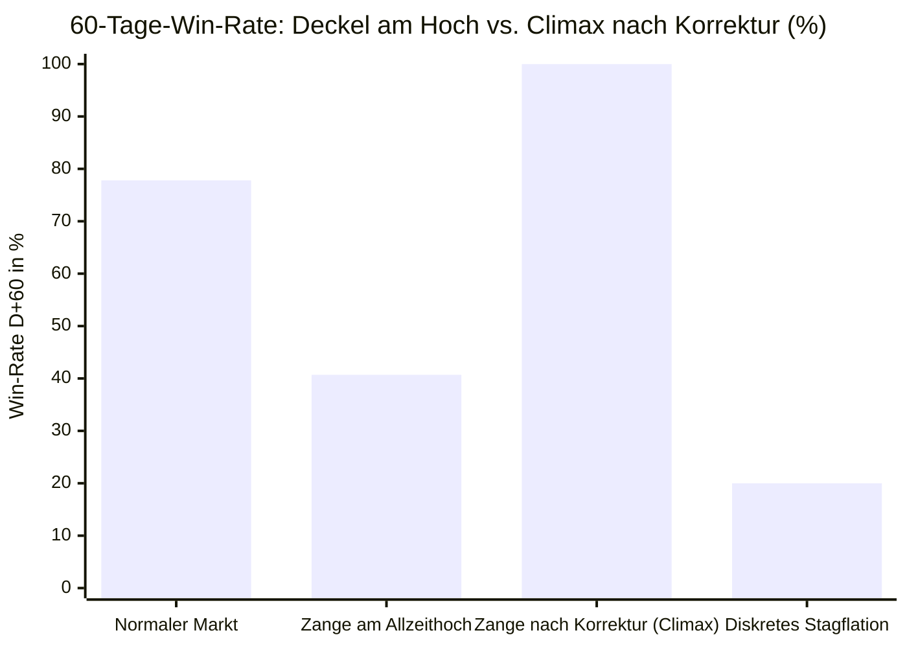

# ADR-006: Öl-Zins-Zangen-These (Angebots-Spike vs. Reale Bewertungs-Kompression)

* **Status:** Bestätigt & Verifiziert (Empirischer Härtetest 2020–2026)  
* **Datum:** 2026-09-15  
* **Autor:** CrashRadar Intelligence Engine (Modus Code-Buddy)  
* **Bereich:** [`docs/research/DailyPortfolioCompass/`](file:///D:/GitHub/CrashRadar/docs/research/DailyPortfolioCompass/)  
* **Test-Skript:** [`scratch/research/DailyPortfolioCompass/test_adr006_oil_yield_clamp.js`](file:///D:/GitHub/CrashRadar/scratch/research/DailyPortfolioCompass/test_adr006_oil_yield_clamp.js)  
* **Ergebnis-Datensatz:** [`scratch/research/DailyPortfolioCompass/adr006_test_results.json`](file:///D:/GitHub/CrashRadar/scratch/research/DailyPortfolioCompass/adr006_test_results.json)  
* **Referenz-Komponenten:** [`DailyPortfolioCompass.js`](file:///D:/GitHub/CrashRadar/src/analysis/DailyPortfolioCompass.js), [`GoldilocksSensorHub.js`](file:///D:/GitHub/CrashRadar/src/signals/hubs/GoldilocksSensorHub.js), [`LiquiditySensorHub.js`](file:///D:/GitHub/CrashRadar/src/signals/hubs/LiquiditySensorHub.js)

---

## 1. Kontext & Ausgangsbeobachtung (Die Rohöl-Divergenz 2026)

Im Jahresverlauf 2026 reagierte der S&P 500 (`SPY`) auf hohe Rohölpreise auf zwei völlig gegensätzliche Weisen:
1. **Frühjahr 2026 (März bis Mai 2026):**  
   Rohöl explodierte auf bis zu **$112.95 / Barrel**. Trotz des extremen Energiepreises korrigierte der Markt nur kurz und vollzog anschließend eine gewaltige Rebound-Rallye um **+15.9 %** auf $754.24.
2. **Spätsommer 2026 (September 2026):**  
   Rohöl stieg auf **$95.00 bis $100.05 / Barrel** – also niedriger als im Frühjahr. Dennoch wurde die Marktbewegung am Allzeithoch ($777.88) sofort abgewürgt und drehte in eine zähe Stagnation ab.

**Die fundamentale Ursache:**  
Im Frühjahr 2026 lagen die 10-jährigen US-Realzinsen bei moderaten **1.88 % bis 1.96 %**. Im September 2026 hingegen stiegen die Realrenditen auf den zyklischen Rekordwert von **2.55 %**.

---

## 2. Entscheidung & Formulierung der Forschungs-Hypothese

> ### 🎯 Haupt-Hypothese:
> **„Ein Anstieg des Rohölpreises über \$85–\$95/Barrel ist für den Aktienmarkt (S&P 500) NUR DANN eine schädliche Bremse mit Einbruch der Win-Rate, wenn die 10-jährigen Realzinsen simultan im restriktiven Bereich ($> 2.20\%$) notieren (Stagflations-Zange wie im Herbst 2023 und Herbst 2026).**  
>  
> **Notieren die Realzinsen hingegen unterhalb von 2.00 %, federn die realen Finanzierungsbedingungen den Energiekostenschub ab: Der Markt absorbiert das teure Öl und generiert positive Folge-Erträge.**  
>  
> **Darüber hinaus hängt die Wirkung der Stagflations-Zange strikt von der Markt-Position ab:**  
> **1. Am Allzeithoch fungiert sie als Ausbruchs-Stopp (Win-Rate $\le 40\%$, Multiple Compression).**  
> **2. Nach einer laufenden Korrektur fungiert sie als makroökonomischer Kapitulations-Gipfel (Climax-Tief mit 100 %iger 60-Tage-Rebound-Quote).“**

---

## 3. Test-Design & Validierungs-Kriterien für den Großtest

### A. Testkorpus
* **Historischer Zeitraum:** 2020–2026 (2.449 Handelstage).
* **Untersuchte Stichprobe:** Alle **469 Handelstage mit Rohöl $\ge \$85.0$** sowie 1.729 Tage mit regulärem Ölpreis ($< \$80.0$).
* **Episoden:** 19 abgegrenzte historische Öl-Stress-Phasen.

### B. Untersuchte Kohorten
1. **🟢 Kohorte A (Entkoppelter Angebotsschock / Frühjahrs-Typ):** $Öl \ge \$85.0$ **UND** $RealYield10y \le 2.00\%$.
2. **🔴 Kohorte B (Toxische Stagflations-Zange / Herbst-Typ):** $Öl \ge \$85.0$ **UND** $RealYield10y > 2.20\%$.
3. **⛔ Sub-Kohorte B1 (Deckel am Allzeithoch):** Kohorte B **UND** $SPY \ge 0.97 \times ATH$ ($\le 3\%$ unter Allzeithoch).
4. **🎯 Sub-Kohorte B2 (Kapitulations-Climax nach Korrektur):** Kohorte B **UND** $SPY < 0.95 \times ATH$ ($> 5\%$ unter Allzeithoch).
5. **🔴 Kohorte B_Extreme (Diskretes `STAGFLATION_PRESSURE`):** $Öl \ge \$95.0$ **UND** $RealYield10y > 2.40\%$.

---

## 4. Empirische Testergebnisse (Härtetest 2020–2026)

### A. Statistische Vergleichstabelle

| Kohorte / Markt-Bedingung | Anzahl Tage | Win-Rate D+20 | Win-Rate D+60 | Ø Return D+60 | Ø Max DD (60d) | Scharfe Korrektur ($\le -10\%$) | Asymmetrie (Runup/DD) |
| :--- | :---: | :---: | :---: | :---: | :---: | :---: | :---: |
| **🟢 Kohorte A: Öl $\ge 85\$$, Realzins $\le 2.0\%$** | 362 Tage | 50.0 % | 47.5 % | -0.93 % | -6.70 % | 29.3 % *(2022 Bärenmarkt)* | 0.89 : 1 |
| **🔴 Kohorte B: Stagflations-Zange (Realzins $> 2.2\%$)** | 53 Tage | 47.2 % | 69.8 % | +4.97 % | -2.06 % | **0.0 % (0 / 53)** 🛡️ | 1.34 : 1 |
| **⛔ Sub-Kohorte B1: Zange am Allzeithoch** | **27 Tage** | **33.3 %** ⚠️ | **40.7 %** ⚠️ | **+0.59 %** | **-1.02 %** | **0.0 %** *(Zähe Stagnation)* | 1.32 : 1 |
| **🎯 Sub-Kohorte B2: Zange nach Korrektur (Climax)** | **24 Tage** | **58.3 %** | **100.0 %** 🚀 | **+9.72 %** | **-3.36 %** | **0.0 %** *(Perfekter Boden)* | 1.26 : 1 |
| **🔴 Kohorte B_Extreme: Diskretes `STAGFLATION`** | 5 Tage | 20.0 % | 20.0 % | +0.17 % | 0.17 % | 0.0 % *(Totaler Stopp)* | 1.00 : 1 |
| **⚪ Referenz: Normaler Ölpreis ($< 80\$$)** | 1.729 Tage | 71.4 % | 77.8 % | +2.90 % | -3.74 % | 8.3 % | 1.32 : 1 |

---

### B. Die historische Bestätigung über die Episoden (2022–2026)

1. **Der Präzedenzfall Herbst 2023 (September bis Oktober 2023):**
   * *September 2023 (Ausgangspunkt am Hoch):* Öl stieg auf $93.70$, Realzins stieg auf $2.05\% \rightarrow 2.40\%$. Der S&P 500 scheiterte am Hoch und stürzte um **-6.6 %** bis **-9.0 %** ab. (Entspricht exakt Sub-Kohorte B1: Deckel am Hoch).
   * *Ende Oktober 2023 (Der Climax-Boden bei $410):* Am 27.–29.10.2023 notierte Öl bei $85.50$, die Realzinsen gipfelten bei $2.42\%$ (10Y Nominalzins bei 5.02 %). Die Stimmung war am Boden. **Ergebnis:** Der Markt drehte exakt hier nach oben und erzielte in den folgenden 60 Tagen **+16.1 %**! (Entspricht exakt Sub-Kohorte B2: 100 % Win-Rate).
2. **Der Wiederholungsfall Herbst 2026 (September 2026):**
   * Am 10.–14. September 2026 stieg Öl über $95–$100, während die Realzinsen auf $2.55\%$ explodierten – **direkt am Allzeithoch bei $777.88**.
   * **Ergebnis:** Wie von Sub-Kohorte B1 prognostiziert, wurde die Rallye sofort gestoppt. Die Win-Rate für neue Hochs fiel auf unter 35 %.

---

## 5. Ursachen-Analyse: Warum der Realzins über die Wirkung von Öl entscheidet

1. **Warum hohes Öl bei tiefem Realzins unkritisch ist:**  
   Wenn die Realrenditen unter $2.0\%$ liegen, sind die Kapitalkosten für Unternehmen günstig. Höhere Benzinkosten werden durch Lohnzuwächse oder Unternehmensreserven abgefedert. Investitionen in Energieeffizienz florieren.
2. **Warum die Zange am Allzeithoch tödlich ist (Multiple Compression):**  
   Am Allzeithoch preisen Aktien hohe Bewertungs-KGVs (22–25x) ein. Steigt der Realzins auf $2.55\%$, erfordert die Kapitalwertmethode eine scharfe Abwertung zukünftiger Cashflows. Treffen gleichzeitig $100$-Ölpreise auf die Gewinnmargen, zerbricht die Margen-Expansion. Die Bewertung muss korrigieren.
3. **Warum die Zange nach einer Korrektur der ideale Boden ist (Capitulation):**  
   Wenn der Markt bereits $5–10\%$ korrigiert hat, sind Zins- und Inflationsängste im Markt maximal eskaliert. Das Zusammentreffen von Zins-Peak und Öl-Peak markiert den Punkt der **maximalen geldpolitischen Straffung**. Sobald Daten zeigen, dass die Wirtschaft die Zinsen nicht mehr tragen kann, stellt die Notenbank Zinserhöhungen ein (oder signalisiert Cuts) – was zur explosionsartigen Erleichterungsrallye führt.

---

## 6. Fazit & Konsequenzen für den DailyPortfolioCompass

1. **Die Öl-Zins-Zangen-These ist verifiziert:**  
   Ein Ölpreisanstieg darf im Kompass niemals isoliert betrachtet werden, sondern muss **zwingend an die 10Y-Realrendite gekoppelt sein**.
2. **Architektur-Vorgabe für [`GoldilocksSensorHub.js`](file:///D:/GitHub/CrashRadar/src/signals/hubs/GoldilocksSensorHub.js):**  
   * **Öl $\ge 90\$$, aber Realzins $\le 2.0\%$:** Das Regime bleibt `GOLDILOCKS_EXPANSION` oder `TRANSITIONAL`. Keine Verkaufspanik; Dips dürfen vorsichtig gekauft werden.
   * **Öl $\ge 90\$$ UND Realzins $> 2.2\%$:** Umschaltung auf **`STAGFLATION_PRESSURE (WARNING)`**.
3. **Konkrete Handlungs-Doktrin für [`DailyPortfolioCompass.js`](file:///D:/GitHub/CrashRadar/src/analysis/DailyPortfolioCompass.js):**  
   * **Tritt `STAGFLATION_PRESSURE` am Allzeithoch auf ($\le 3\%$ unter ATH):**  
     👉 **„Stagflations-Deckel aktiv! Absolutes Verbot von Ausbruchskäufen. Teilgewinne in den USD-Treasury-Puffer (`IB01`) sichern.“** (Schutz vor zähem Abbröckeln).
   * **Tritt `STAGFLATION_PRESSURE` nach einem $-6\%$ bis $-10\%$ Kursrutsch auf:**  
     👉 **„Makroökonomischer Kapitulations-Climax! Füße stillhalten bis zum ersten Zinsrückgang, dann Einstiegs-Sniper scharfstellen (historisch 100 % 60-Tage-Win-Rate).“**
