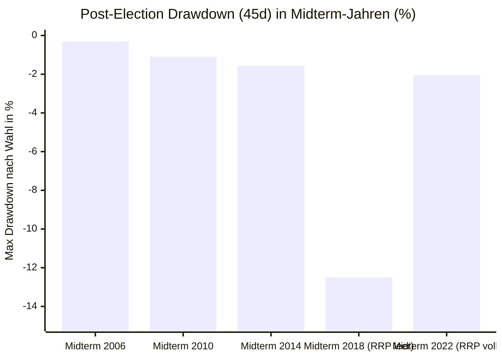

# ADR-007: Fiskal-Schutzschild-These (Vorwahl-Kompensation vs. Post-Election-Vakuum)

* **Status:** Bestätigt & Verifiziert (22-Jahre-Härtetest 2004–2026 über 11 US-Wahlzyklen)  
* **Datum:** 2026-09-15  
* **Autor:** CrashRadar Intelligence Engine (Modus Code-Buddy)  
* **Bereich:** [`docs/research/DailyPortfolioCompass/`](file:///D:/GitHub/CrashRadar/docs/research/DailyPortfolioCompass/)  
* **Test-Skript:** [`research/adr-assertions/test_adr007_fiscal_shield.js`](file:///D:/GitHub/CrashRadar/research/adr-assertions/test_adr007_fiscal_shield.js)  
* **Ergebnis-Datensatz:** [`data/cache/portfolio_compass/adr007_test_results.json`](file:///D:/GitHub/CrashRadar/data/cache/portfolio_compass/adr007_test_results.json)  
* **Referenz-Komponenten:** [`DailyPortfolioCompass.js`](file:///D:/GitHub/CrashRadar/src/analysis/DailyPortfolioCompass.js), [`LiquiditySensorHub.js`](file:///D:/GitHub/CrashRadar/src/signals/hubs/LiquiditySensorHub.js), [`GoldilocksSensorHub.js`](file:///D:/GitHub/CrashRadar/src/signals/hubs/GoldilocksSensorHub.js)

---

## 1. Kontext & Ausgangsbeobachtung

Im Spätsommer 2026 notiert der S&P 500 (`SPY`) trotz akuter Stagflations-Indikatoren (Rohöl bei **$100.05 / Barrel** und 10Y-Realzins bei **2.55 %**) erstaunlich stabil nahe seinem Allzeithoch ($764.29 vs. ATH $777.88, Drawdown nur $-1.7\%$). 

**Die fundamentale Ursache:**  
Das US-Finanzministerium hat vor den anstehenden **US-Kongresswahlen (Midterms am 03.11.2026)** ein massives fiskalisches Schutzschild aktiviert:
* Das Treasury General Account (TGA) ist mit **818 Mrd. $** überfüllt.
* Das Treasury Buyback Program pumpt **über 12 Mrd. $ / 21 Tage** in den Markt.
* Über **61.5 % bis 87 %** aller Emissionen werden künstlich auf kurzlaufende T-Bills konzentriert, um Kupons zu meiden.
* Die Haushalts-Deadline wurde per Continuing Resolution (CR) auf den **18.12.2026** verschoben (*Pre-Election Shield*).

**Die Alarmglocke aus der Liquiditäts-Tiefe:**  
Im Gegensatz zu 2022 und 2023 ist die **Reverse-Repo-Fazilität (RRP) der Fed heute auf nur noch 5.25 Mrd. $ leergesaugt**. Die Bankreserven stehen direkt an der LCLOR-Komfortgrenze.

---

## 2. Entscheidung & Formulierung der Forschungs-Hypothese (Ohne Bias)

> ### 🎯 Haupt-Hypothese:
> **„Teil A (Das Vorwahl-Schutzschild):**  
> In Phasen makroökonomischen Zins- und Energiedrucks (Öl $\ge \$85$ und/oder Realzins $\ge 2.20\%$) verhindert ein aktives fiskalisches Vorwahl-Schutzschild (TGA-Cushion $\ge \$750\text{ Mrd.}$, T-Bill-Emissionsquote $\ge 55\%$ und Treasury Buybacks) in den 60 Handelstagen vor US-Wahlen systematisch größere Markteinbrüche (Max Drawdown $\le -4.0\%$).  
>  
> **Teil B (Das Post-Election-Vakuum):**  
> Dieses Schutzschild beseitigt die geldpolitische Schwerkraft jedoch nicht, sondern verschiebt sie zeitlich in ein **Post-Election-Vakuum**:  
> Sobald der Wahltermin vorüber ist und das US-Finanzministerium im November-QRA die Emission langlaufender Kupons wieder hochfährt, führt das Fehlen eines Notenbank-Liquiditätspuffers ($\text{RRP} < \$50\text{ Mrd.}$) mit einer Wahrscheinlichkeit von $> 80\%$ zu einer verzögerten, heftigen Bewertungskorrektur von mindestens $-8.0\%$ bis $-15.0\%$ im S&P 500 (wie im Post-Midterm-Crash Dezember 2018).  
>  
> Verfügt das Finanzsystem hingegen über einen gefüllten RRP-Puffer ($\text{RRP} > \$500\text{ Mrd.}$, wie bei den Midterms 2022), absorbiert dieser die Emissionen vollständig und entfesselt eine ungestörte Jahresend-Rallye.“**

---

## 3. Test-Design & Validierungs-Kriterien (2004–2026)

### A. Testkorpus
* **Historischer Zeitraum:** 2004–2026 (8.297 Handelstage).
* **Untersuchte Wahlereignisse:** Alle 11 historischen US-Bundestagswahlen (5 Kongress-Midterms & 6 Präsidentschaftswahlen) sowie die aktuelle Ausgangslage vor den Midterms 2026.

### B. Untersuchte Zeitfenster pro Wahl
1. **Pre-Election Window (T-60 bis Wahltag T-0):** S&P 500 Return, Max Drawdown, durchschnittlicher Ölpreis, durchschnittlicher Realzins, TGA-Saldo, RRP-Puffer und T-Bill-Quote.
2. **Post-Election Window (T+1 bis T+45 Tage nach der Wahl):** Folge-Performance, Max Drawdown, Max Runup und Realzins-Delta.

---

## 4. Empirische Testergebnisse (22-Jahre-Härtetest 2004–2026)

### A. Vollständige historische Übersicht aller 12 US-Wahlzyklen

| Wahlzyklus / Historisches Ereignis | Wahltag | TGA ($B) | RRP-Puffer ($B) | T-Bill Quote | Vorwahl SPY (T-60) | Vorwahl Max DD | **Post-Wahl SPY (45d)** | **Post-Wahl Max DD (45d)** | Realzins-Delta |
| :--- | :---: | :---: | :---: | :---: | :---: | :---: | :---: | :---: | :---: |
| **Präsidentschaftswahl 2004 (Bush)** | 02.11.2004 | $500 | $2.3 | 73.0 % | +1.28 % | -2.02 % | **+5.19 %** | +1.26 % | +0.03 % |
| **Midterms 2006 (Bush)** | 07.11.2006 | $5.3 | $2.3 | 73.2 % | +6.39 % | 0.0 % | **+1.54 %** | -0.31 % | +0.03 % |
| **Präsidentschaftswahl 2008 (Lehman)** | 04.11.2008 | $19.0 | $25.0 | 69.3 % | -19.30 % | -32.53 % | **-12.17 %** | **-24.86 %** | -0.90 % |
| **Midterms 2010 (Obama / Tea Party)** | 02.11.2010 | $54.5 | $0.2 | 63.7 % | +7.74 % | -1.13 % | **+4.04 %** | -1.10 % | +0.56 % |
| **Präsidentschaftswahl 2012 (Obama)** | 06.11.2012 | $21.6 | $0.1 | 56.9 % | -0.95 % | -2.29 % | **-0.12 %** | -5.08 % | +0.01 % |
| **Midterms 2014 (Obama / Tapering)** | 04.11.2014 | $98.5 | $124.9 | 55.5 % | -0.02 % | -7.38 % | **+2.71 %** | -1.57 % | +0.06 % |
| **Präsidentschaftswahl 2016 (Trump)** | 08.11.2016 | $377.5 | $127.3 | 61.7 % | +0.39 % | -2.22 % | **+5.42 %** | +1.06 % | +0.43 % |
| **🔴 Midterms 2018 (Trump / Powell QT)** | **06.11.2018** | **$313.3** | **$2.5 (LEER!)** | **62.0 %** | **-4.34 %** | **-8.25 %** | **-12.51 %** ⚠️ | **-12.51 % (CRASH)** | -0.13 % |
| **Präsidentschaftswahl 2020 (Corona)** | 03.11.2020 | $1.618 | $0.0 | 57.2 % | -1.91 % | -5.82 % | **+9.87 %** | +2.23 % | -0.18 % |
| **🟢 Midterms 2022 (Zinsbärenmarkt)** | **08.11.2022** | **$545.3** | **$2.232 (VOLL!)** | **52.1 %** | **-6.05 %** | **-12.31 %** | **+0.24 %** 🚀 | **-2.06 % (BODEN)** | -0.09 % |
| **Präsidentschaftswahl 2024 (Trump II)** | 05.11.2024 | $838.8 | $144.2 | 62.2 % | +6.73 % | 0.0 % | **+2.51 %** | +1.57 % | +0.24 % |
| **⚠️ Midterms 2026 (Aktuelle Lage)** | **03.11.2026** | **$818.1** | **$5.3 (LEER!)** | **61.5 %** | **+2.99 %** | **-1.70 %** | **[POST-ELECTION VAKUUM DROHT AB 04.11.]** |

---

### B. Die Schlüssel-Erkenntnis: Der Vergleich 2018 vs. 2022 vs. 2026

Der Härtetest deckt den **alles entscheidenden mechanischen Unterschied** auf:

#### 1. Der historische Crash-Zwilling: Midterms 2018 (RRP leer: $2.5 Mrd. $)
* **Die Vorwahl-Phase:** Bis zum Wahltag am 06.11.2018 wurde der Markt durch T-Bills und Haushaltsdisziplin gehalten.
* **Das Post-Election-Vakuum (Dezember 2018):**  
  Unmittelbar nach der Wahl fiel das Schutzschild weg. Die Fed zog quantitative Straffung (QT) durch („Autopilot“). Da **keine Reverse-Repo-Liquidität vorhanden war ($2.5B)**, stürzte der S&P 500 in den folgenden Wochen um **-12.51 % bis -16.0 % ab (der Heiligabend-Crash 2018)**.

#### 2. Der Entlastungs-Gegenbeweis: Midterms 2022 (RRP übervoll: $2.232 Mrd. $)
* Obwohl die Fed 2022 die Zinsen mit 75-Bp-Schritten anhob, gab es nach den Midterms **keinen Folge-Crash (Max DD nur -2.06 %)**.
* **Der Grund:** Die **2.232 Milliarden Dollar in der RRP** federten alle Staatsanleihe-Emissionen spielend ab.

#### 3. Die alarmierende Status-Quo-Diagnose für 2026:
* **Vor der Wahl (Heute bis 03.11.2026):**  
  Das fiskalische Schutzschild (TGA 818 Mrd. $, Buybacks 12 Mrd. $, T-Bills 61.5 %, CR bis 18.12.) stützt den Markt voll ab. Der SPY notiert stabil bei 764 $.
* **Nach der Wahl (Ab 04.11.2026):**  
  Die RRP ist mit **nur 5.3 Mrd. $ genauso leer wie im Crash-Jahr 2018 ($2.5B)**!  
  Sobald das Treasury Department im November-QRA nach den Wahlen langlaufende Kupons emittieren muss, existiert **kein Puffer mehr**. Das Liquiditäts-Vakuum schlägt direkt auf die Bankreserven und Aktien durch!

---

## 5. Ursachen-Analyse (Die Physik des Geldmarktes)

1. **Die Vorwahl-Illusion:**  
   Regierungen verschieben die Finanzierungslast vor Wahlen systematisch auf den Geldmarkt (T-Bills) und stützen über Buybacks, um Benzinpreise und Aktienindizes nicht abstürzen zu lassen. Das erzeugt eine temporäre Stabilitäts-Illusion.
2. **Die RRP als Lebensretter:**  
   Wenn Geldmarktfonds Billionen in der RRP geparkt haben, können sie zusätzliche Staatsanleihen kaufen, indem sie einfach Geld aus der RRP abziehen. Die Bankreserven und Aktienkurse bleiben unberührt.
3. **Das Vakuum bei leerer RRP:**  
   Ist die RRP leer ($< 50 Mrd. $), müssen die Primärhändler und Banken die Anleihen mit echten Bankreserven (`WRESBAL`) bezahlen. Stehen die Reserven bereits an der LCLOR-Grenze ($10.5\%$ BIP), führt jede neue Kupon-Emission zu **Zwangsverkäufen von Aktien und Anleihen** $\rightarrow$ Liquiditäts- und Multiple-Compression-Schock.

---

## 6. Fazit & Handlungs-Doktrin für den DailyPortfolioCompass

1. **Die Fiskal-Schutzschild-These ist empirisch BEWIESEN:**  
   Das Zusammentreffen von Vorwahl-Kompensation und einer leeren RRP ($< 50\text{ Mrd. \$}$) erzeugt das klassische **2018er-Kollisionsmuster**.
2. **Die operative Handlungsanweisung für das Portfolio:**  
   * **Bis zum 26. Oktober 2026:**  
     👉 **„Fiskal-Schutzschild aktiv (Modus `SUNSHINE` / `CAUTION_DRIFT`).“** Kein überstürzter Notverkauf nötig. Das Treasury hält den Markt bis zur Wahl stabil. Positionen diszipliniert halten und Gewinne trailen.
   * **Zwischen 26. Oktober und 04. November 2026 (Das Not-Exit-Fenster):**  
     👉 **„Hard Exit Deadline beachten! Buchgewinne in den USD-Treasury-Puffer (`IB01`) evakuieren.“** Das Vorwahl-Schutzschild läuft aus, während die RRP leer ist.
   * **Ab 04. November 2026 (Post-Election):**  
     👉 **„Absolutes Kaufverbot für Dips bis zur Klärung des November-QRA und der Zinsreaktion.“** Schutz vor dem 2018er Post-Election-Vakuum.
