# DailyPortfolioCompass: Research & Hypothesen-Verzeichnis (ADRs)

In diesem Verzeichnis liegen die formalen **Analysis & Research Decision Records (ADRs)** für den [`DailyPortfolioCompass`](file:///D:/GitHub/CrashRadar/src/analysis/DailyPortfolioCompass.js). Jede Datei formuliert eine quantifizierbare, am Gesamtmarkt überprüfbare Forschungs-Hypothese, abgeleitet aus den empirischen Mustern des Jahres 2026.

---

## Übersicht der Research-ADRs

| ADR-ID | Dokument | Thema & Forschungsfrage | Status |
| :--- | :--- | :--- | :--- |
| **ADR-001** | [**`ADR-001-Geldmarkt-Airbag-These.md`**](file:///D:/GitHub/CrashRadar/docs/research/DailyPortfolioCompass/ADR-001-Geldmarkt-Airbag-These.md) | **Geldmarkt-Airbag (VIX-Panik vs. Echter Liquiditäts-Crash):** Führt ein VIX-Peak $> 25/30$ nur bei kritischer Liquidität zum Crash, während er bei gepufferter Liquidität eine $> 85\%$ige Buy-the-Dip-Chance darstellt? | `VERIFIED` 🟢 |
| **ADR-002** | [**`ADR-002-Stagflations-Deckel-These.md`**](file:///D:/GitHub/CrashRadar/docs/research/DailyPortfolioCompass/ADR-002-Stagflations-Deckel-These.md) | **Stagflations-Deckel (Warum Allzeithoch-Ausbrüche scheitern):** Scheitern Trend-Ausbrüche am Allzeithoch systematisch ($> 75\%$), sobald Goldilocks auf `STAGFLATION_PRESSURE` (Öl $> \$100$, Realzins $\ge 2.5\%$) umschlägt? | `VERIFIED` 🟢 |
| **ADR-003** | [**`ADR-003-Squeeze-Coil-Katapult-These.md`**](file:///D:/GitHub/CrashRadar/docs/research/DailyPortfolioCompass/ADR-003-Squeeze-Coil-Katapult-These.md) | **Squeeze-Coil-Katapult (Derivate-Kontra-Rebound vor OpEx):** Fungiert extremes Pre-OpEx Shorting/Put-Hedging (`EXTREME_SQUEEZE_COIL`) bei stabiler Liquidität als $> 80\%$iges Rebound-Katapult? | `FALSIFIED / VETO-VERIFIED` 🛡️ |
| **ADR-004** | [**`ADR-004-Dual-Gatekeeper-These.md`**](file:///D:/GitHub/CrashRadar/docs/research/DailyPortfolioCompass/ADR-004-Dual-Gatekeeper-These.md) | **Dual-Gatekeeper (Geldmarkt-Airbag + Goldilocks-Veto):** Beseitigt die synchrone Konfluenz von Geldmarkt-Liquidität und Goldilocks-Makrowächter die Fehlschläge aus Zinsbärenmärkten (2022) vollständig? | `VERIFIED` 🟢 |
| **ADR-005** | [**`ADR-005-Post-OpEx-Relief-These.md`**](file:///D:/GitHub/CrashRadar/docs/research/DailyPortfolioCompass/ADR-005-Post-OpEx-Relief-These.md) | **Post-OpEx-Relief (Bestätigtes Entlastungs-Katapult nach Verfall):** Wandelt das Abwarten des Verfallstages und der Einstieg bei Vol-Crush (D+1 bis D+5) die Pre-OpEx Squeeze-Fallen in profitable Rebounds um? | `FALSIFIED / PERSISTENT VETO` 🛡️ |
| **ADR-006** | [**`ADR-006-Oel-Zins-Zangen-These.md`**](file:///D:/GitHub/CrashRadar/docs/research/DailyPortfolioCompass/ADR-006-Oel-Zins-Zangen-These.md) | **Öl-Zins-Zange (Angebots-Spike vs. Reale Bewertungs-Kompression):** Ist teures Öl nur bei Realzinsen $> 2.2\%$ schädlich (Deckel am ATH, aber 100 % Climax-Rebound nach Korrekturen)? | `VERIFIED` 🟢 |
| **ADR-007** | [**`ADR-007-Fiskal-Schutzschild-These.md`**](file:///D:/GitHub/CrashRadar/docs/research/DailyPortfolioCompass/ADR-007-Fiskal-Schutzschild-These.md) | **Fiskal-Schutzschild (Vorwahl-Kompensation vs. Post-Election-Vakuum):** Schützt ein aktives fiskalisches Vorwahl-Schutzschild vor Midterm-Crashes, verlagert den Einbruch bei leerem RRP-Puffer ($< \$50\text{ Mrd.}$) jedoch unvermeidbar in ein brutales Post-Election-Vakuum ($-8\%$ bis $-15\%$)? | `VERIFIED` 🟢 |
| **ADR-008** | [**`ADR-008-LCLOR-Bankreserven-These.md`**](file:///D:/GitHub/CrashRadar/docs/research/DailyPortfolioCompass/ADR-008-LCLOR-Bankreserven-These.md) | **LCLOR-Bankreserven-These (Notenbank-Liquiditäts-Kipppunkt):** Führt das Unterschreiten der LCLOR-Grenzschwelle ($< \$3.000\text{ Mrd.}$) bei entleertem RRP-Puffer ($< \$50\text{ Mrd.}$) innerhalb von 30–60 Tagen zu einem scharfen Liquiditäts-Schock ($\ge -8\%$)? | `PROPOSED / TEST-DESIGN` 🟡 |
| **ADR-009** | [**`ADR-009-Bull-Steepener-Falle-These.md`**](file:///D:/GitHub/CrashRadar/docs/research/DailyPortfolioCompass/ADR-009-Bull-Steepener-Falle-These.md) | **Bull-Steepener-Falle (Zinskurven-Entinversion 10Y-2Y):** Ist die Normalisierung der Zinskurve über 0 % in Wahrheit eine trügerische Erleichterungs-Bull-Trap mit 60- bis 250-Tage Rezessions-Lag ($-15\%$ bis $-30\%$ Drawdown)? | `VERIFIED` 🟢 |
| **ADR-010** | [**`ADR-010-Credit-Spread-Divergenz-These.md`**](file:///D:/GitHub/CrashRadar/docs/research/DailyPortfolioCompass/ADR-010-Credit-Spread-Divergenz-These.md) | **Credit-Spread-Divergenz (High-Yield HYG vs. SPY-Allzeithoch):** Signalisiert eine relative Schwäche von High-Yield-Bonds (`HYG`) an Aktien-Höchstständen eine institutionelle Risikoaversion mit $\ge 70\%$ Trefferquote für Korrekturen? | `PROPOSED / TEST-DESIGN` 🟡 |
| **ADR-011** | [**`ADR-011-Dual-Gatekeeper-Reentry-These.md`**](file:///D:/GitHub/CrashRadar/docs/research/DailyPortfolioCompass/ADR-011-Dual-Gatekeeper-Reentry-These.md) | **Dual-Gatekeeper-Reentry (Systematischer Wiedereinstieg nach Crashes):** Verhindert das Re-Entry-Veto bei Liquidität `CRITICAL` verfrühte Einstiege in fallende Messer (Corona 2020) und halbiert den Allzeit-Drawdown von $-40.67\%$ auf $< -22\%$? | `PROPOSED / TEST-DESIGN` 🟡 |

---

## Verknüpfung zur Core-Architektur

```mermaid
flowchart TD
    DPC["DailyPortfolioCompass.js<br>(3-Hub Composite)"]
    
    DPC --> ADR1["ADR-001: Geldmarkt-Airbag<br>(LiquiditySensorHub)"]
    DPC --> ADR2["ADR-002: Stagflations-Deckel<br>(GoldilocksSensorHub)"]
    DPC --> ADR3["ADR-003: Squeeze-Coil-Katapult<br>(DerivativesSensorHub)"]
    DPC --> ADR4["ADR-004: Dual-Gatekeeper<br>(Liquidity + Goldilocks)"]
    DPC --> ADR5["ADR-005: Post-OpEx Relief<br>(Derivatives Post-Timing)"]
    DPC --> ADR6["ADR-006: Öl-Zins-Zange<br>(Oil vs Real Yield Climax)"]
    DPC --> ADR7["ADR-007: Fiskal-Schutzschild<br>(Fiscal Shield vs. Post-Election Vacuum)"]
    DPC --> ADR8["ADR-008: LCLOR-Bankreserven<br>(Bank Reserves < $3.0T vs RRP)"]
    DPC --> ADR9["ADR-009: Bull-Steepener-Falle<br>(Yield Curve Disinversion Lag)"]
    DPC --> ADR10["ADR-010: Credit-Spread-Divergenz<br>(HYG vs SPY ATH Warning)"]
    DPC --> ADR11["ADR-011: Dual-Gatekeeper-Reentry<br>(Crash Re-Entry Optimization)"]
    
    ADR1 --> BACKTEST1["Backtest 2020-2026<br>(VIX vs. Net Liquidity)"]
    ADR2 --> BACKTEST2["Backtest 2020-2026<br>(ATH vs. Real Yield/Oil)"]
    ADR3 --> BACKTEST3["Backtest 2020-2026<br>(OpEx Squeeze Returns)"]
    ADR4 --> BACKTEST4["Backtest 2020-2026<br>(Dual Gatekeeper Proof)"]
    ADR5 --> BACKTEST5["Backtest 2020-2026<br>(Post-OpEx Relief Falsification)"]
    ADR6 --> BACKTEST6["Backtest 2020-2026<br>(Oil-Yield-Clamp Verification)"]
    ADR7 --> BACKTEST7["Backtest 2004-2026<br>(11 US Elections + 2026 Status Quo)"]
```

