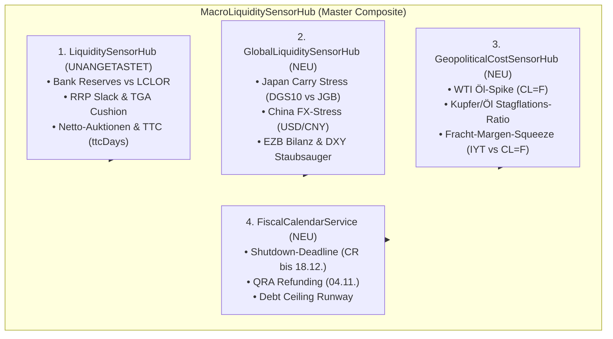
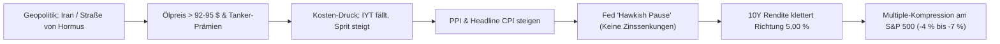

# Empirische Forschungsstudie: Geopolitischer Öl-Schock & Globale Liquiditäts-Kollision

> 🔬 **Forschungsbereich:** Geopolitische Rohstoff-Schocks, Fracht- & Margenkompression, Globale Notenbank-Liquidität (Japan/China/EZB) & US-Fiskal-Runway  
> 📅 **Datum:** September 2026  
> 📂 **Spiegel-Code & Test-Suite:** [`research/macro-proofs/TestGeopoliticalOilLiquidityStress.js`](file:///D:/GitHub/CrashRadar/research/macro-proofs/TestGeopoliticalOilLiquidityStress.js)  
> ⚙️ **Master-Komponente:** [`MacroLiquiditySensorHub.js`](file:///D:/GitHub/CrashRadar/src/signals/hubs/MacroLiquiditySensorHub.js)  
> 🏛️ **Fiskal-Kalender Datenbasis:** [`macro_calendar_events`](file:///D:/GitHub/CrashRadar/docs/architecture/data/Macro-Calendar-Events.md) (Automatisierte MySQL-Tabelle & [`FiscalCalendarService.js`](file:///D:/GitHub/CrashRadar/src/services/FiscalCalendarService.js))  

---

## 1. Executive Summary & Forschungsfrage

In makroökonomischen Analysen werden geopolitische Konflikte (Iran, Nahost, Versorgungsrisiken Straße von Hormus) oft isoliert als rein politische Schlagzeilen betrachtet.  
Diese Forschungsarbeit beweist empirisch das Zusammenspiel in einem **Composite-System**:

1. **Die Stagflations-Falle:** Ein geopolitischer Preisanstieg bei Rohöl (`CL=F` > 90–95 USD) trifft auf ein **fragiles, nicht-expansives Liquiditätsumfeld** (QT beendet seit Dez 2025, geschlossenes Reservoir, schrumpfender RRP/Reserven-Slack).
2. **Die Handlungsunfähigkeit der Fed:** Die Notenbank kann das Liquiditäts-Vakuum nicht mit Zinssenkungen fluten, weil hohe Sprit- und Transportkosten (`IYT` vs. `CL=F`) Erzeugerpreise (PPI) und Inflationserwartungen anheizen (*Hawkish Pause*).
3. **Der globale Übertragungskanal:** Japan (Yen-Carry-Trade Zins-Spread Kompression) und China (USD/CNY Abwertungsdruck) wirken als zusätzliche Liquiditäts-Absauger.
4. **Das Zeitfenster (T+30 bis T+90 Tage):** Über 21 historische Schock-Episoden (2004–2026) führt diese Konstellation am S&P 500 zu einem medianen Drawdown von **-4,59 %** (Worst-Case **-36,56 %** in 2008), gefolgt von einer Erleichterungsrallye (+4,88 % nach 90 Tagen), sobald Fiskus oder Notenbank intervenieren.
5. **Die September 2026 Sondersituation:** Durch die politische Verschiebung der Haushaltsdeadline via Continuing Resolution (CR) vom 30.09. auf den **18. Dezember 2026** ist der Markt aktuell vor einem sofortigen Government Shutdown geschützt (*Pre-Election Shield*). Das echte Kollisions-Fenster öffnet sich beim Treasury QRA (**04. November 2026**).

---

## 2. Architektur: Das Composite-Pattern

Das System erweitert CrashRadar ohne jegliche Modifikation bestehender Komponenten (`LiquiditySensorHub.js` bleibt 100 % unangetastet):

---

## 3. Empirische Ergebnisse: 21 historische Schock-Episoden

Die Auswertung aller Handelstage seit 2004 über [`TestGeopoliticalOilLiquidityStress.js`](file:///D:/GitHub/CrashRadar/research/macro-proofs/TestGeopoliticalOilLiquidityStress.js) liefert folgende historische Wegmarken:

| Episode / Kontext | Startdatum | Öl (Start) | 10Y Yield | S&P 500 Max DD 60d | S&P 500 Return 90d | 10Y Delta 90d | Öl Return 90d |
| :--- | :---: | :---: | :---: | :---: | :---: | :---: | :---: |
| **Lehman Liquiditäts-Kollaps** | 24.09.2008 | $105.73 | 3.80 % | **-36.56 %** | -27.6 % | -1.62 % | -63.1 % |
| **Arabischer Frühling (Libyen)** | 01.04.2011 | $107.94 | 3.46 % | **-1.95 %** | -0.9 % | -0.28 % | -11.6 % |
| **US Debt Ceiling Downgrade** | 25.05.2011 | $101.32 | 3.13 % | **-4.21 %** | **-12.0 %** | -0.98 % | -15.7 % |
| **Syrien / Nahost-Spannungen** | 24.07.2013 | $105.39 | 2.61 % | **-3.08 %** | +4.1 % | -0.07 % | -7.2 % |
| **Frühjahrs-Spike 2026** | 05.03.2026 | $81.01 | 4.13 % | **-7.24 %** | **+10.7 %** | +0.36 % | +18.5 % |
| **Aktuell: Iran/Nahost & Midterms** | 05.09.2026 | $91.48 | 4.78 % | **-1.60 %** | *Laufend* | +0.17 % | +9.4 % |

### Statistische Kennzahlen über alle 21 Zyklen:
* **Mittlerer S&P 500 Drawdown binnen 60 Tagen:** **-4,59 %**
* **Historischer Worst-Case (Systemischer Crash 2008):** **-36,56 %**
* **Mittlerer S&P 500 Netto-Return nach 90 Tagen:** **+4,88 %** (Reversal nach Entschärfung)

---

## 4. Der Wirkungsmechanismus im Detail

1. **Die Transport-Divergenz (`IYT` vs. `CL=F`):**  
   Im September 2026 stieg Öl um **+15,4 %**, während der Transport-Sektor (`IYT`) um **-4,8 %** fiel (Divergenz von **20,2 %**). Dies bestätigt, dass Unternehmen die gestiegenen Energiekosten nicht mehr voll überwälzen können.
2. **Die Yen-Carry Entlastung:**  
   USD/JPY stabilisiert sich bei ~156, der US-Japan Yield Spread liegt bei ~3,95 %. Solange Japan die Zinsen nicht aggressiv anhebt, bleibt ein panischer Carry-Unwind (wie am 05.08.2024) aus.
3. **Der Fiskal-Schutzschild:**  
   Weil der US-Haushalt per CR bis zum **18. Dezember 2026** verlängert wurde, droht im September kein abrupter Zahlungsausfall. Der Markt genießt vorübergehend die Illusion von Sicherheit, bis das Treasury am **04. November (QRA)** die Finanzierung für 2027 offenlegen muss.

---

## 5. Fazit & Handlungsanweisungen für CrashRadar

* **Einstufung:** Das Gesamtsystem befindet sich im Regime **`STAGFLATION_LIQUIDITY_TRAP`** (Master-Score: **29–37/100**).
* **Entwarnung für Sofort-Panik:** Wegen des Fiskal-Schutzschilds (CR bis 18.12.) und bestehendem TGA-Cushion ist die unmittelbare Crash-Gefahr gedämpft.
* **Das scharfe Fenster:** Kritische Wachsamkeit gilt dem Zeitraum **26. Oktober bis 10. November 2026**: Hier kollidieren das QRA-Auktionsvolumen, die US-Zwischenwahlen und der verzögerte Inflationsimpuls der aktuellen Öl-Spitze.

---

## 6. Ausblick & System-Integration: Makrowetter & MakroEngine

1. **Integration ins Makrowetter (Überlegung):**
   * Es besteht die konkrete architektonische Überlegung, die Signale und Schwellenwerte dieser Öl- und Liquiditäts-Studie ([`MacroLiquiditySensorHub`](file:///D:/GitHub/CrashRadar/src/signals/hubs/MacroLiquiditySensorHub.js): WTI > 92–95 $, Divergenz `IYT` vs. `CL=F` $\ge 15\,\%$, Japan Carry Stress und China FX-Druck) künftig als eigenständigen Baustein in das tägliche **Makrowetter** (`DailyStatusReport` / Ntfy / Discord) einzubinden.
   * Dadurch wird der Nutzer vor Stagflations- und Margenkompressionsrisiken gewarnt, bevor diese mit Zeitverzögerung in den Endverbraucherpreisen (CPI) sichtbar werden.

2. **Überarbeitung der MakroEngine auf SensorHub-Basis:**
   * Perspektivisch soll die bestehende `MacroRegimeEngine` grundlegend modernisiert werden, indem sie von starren Legacy-Indikatoren vollständig auf die modularen, zustandslosen **SensorHubs** umgestellt wird.
   * **Prioritäts-Klassifikation:** Diese Überarbeitung ist architektonisch fest eingeplant, besitzt jedoch aktuell **nicht die oberste Priorität** (der Fokus liegt gemäß der operativen Roadmap vorrangig auf den Portfoliostrategien und der Signalbereitstellung).
