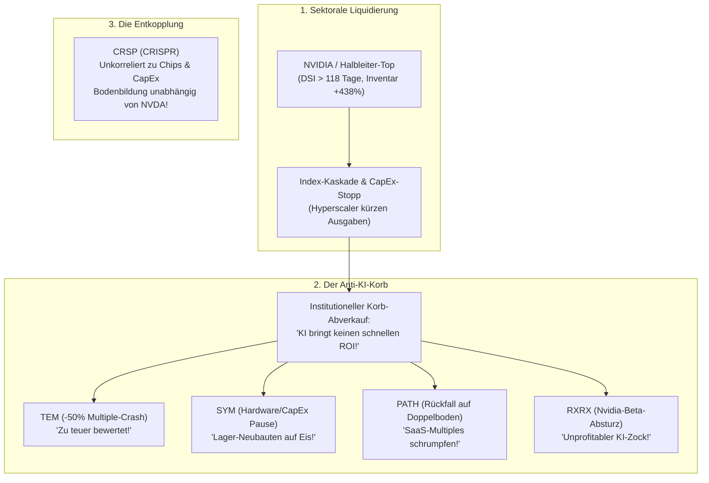

# Forschungsbericht: Der Bullshit-Test für disruptive Wachstumskandidaten (SYM, TEM, RXRX, CRSP, PATH, INFQ)

## 1. Executive Summary & Forschungs-Fragestellung

* 💻 **Audits & Daten-Basis:** [`audit_disruptive_candidates.js`](file:///D:/GitHub/CrashRadar/research/turnaround-studies/audit_disruptive_candidates.js) & [`bullshit_test_disruptors.json`](file:///D:/GitHub/CrashRadar/data/cache/turnarounds/bullshit_test_disruptors.json).
* 🎯 **Zielsetzung:**  
  Evaluation potenzieller High-Conviction-Kandidaten für das Kamikaze-Portfolio abseits der bekannten Megacaps und der bereits extrem heiß gelaufenen Gewinner (wie Palantir `PLTR`).
  Gnadenlose empirische Prüfung von sechs Technologiewerten auf Herz und Nieren:
  1. **Symbotic (`SYM`)** – KI-gestützte Lagerhaus- und Lieferketten-Robotik.
  2. **Tempus AI (`TEM`)** – Multimodale Healthcare- & Onkologie-Datenplattform.
  3. **Recursion Pharmaceuticals (`RXRX`)** – KI-getriebene Phänomik & Wirkstoffforschung (Nvidia-Partner).
  4. **CRISPR Therapeutics (`CRSP`)** – Pionier der Genom-Editierung (Nobelpreis-IP, *Casgevy*).
  5. **UiPath (`PATH`)** – Führende Enterprise-Automatisierungs- & Agentic-Execution-Plattform.
  6. **Infleqtion (`INFQ`)** – Führender Entwickler neutraler Quantenatom-Technologie & Quantensensoren.
* 🔬 **Die Leitfragen des Tests:**
  * Was macht sie potenziell so unersetzbar wie ein `PLTR` (Burggraben / Moat)?
  * Steuern die Fundamentaldaten in Richtung nachhaltiger Profitabilität (der „SOFI-Moment“)?
  * Was will die Wall Street für ein nachhaltiges Re-Rating sehen?
  * Was sind historisch verifizierte Schnäppchenpreise (analog zum PLTR-Fall von 35 $ auf 6 $)?
  * **Zyklus-Kopplung:** Werden diese Werte im unvermeidlichen „Anti-KI-Strudel“ mitgerissen, bis NVIDIA (`NVDA`) den Boden erreicht, oder können sie sich früher entkoppeln?
  * **Zeithorizont-Validierung:** Ist `INFQ` tatsächlich erst ein Thema für 2029/2030, und warum prallt `PATH` am Dezember-Hoch ab?

---

## 2. Empirischer Direktvergleich (SEC-XBRL-Fakten Stand Q2/Q3 2026)

```text
┌──────────────────────────────────────────────────────────────────────────────────────────────────────────────────┐
│                             DIE 6 KANDIDATEN IM NACKTEN FUNDAMENTAL-VERGLEICH                                    │
├────────┬─────────┬──────────────┬───────────────┬────────────┬─────────────┬──────────────┬──────────────────────┤
│ Ticker │ Kurs    │ 52W-Spanne   │ Allzeithoch   │ Cashbestand│ Schulden    │ Letzter GAAP │ SOFI-Moment          │
│        │         │              │ (Datum)       │            │             │ Nettogewinn  │ (Profitabilität)     │
├────────┼─────────┼──────────────┼───────────────┼────────────┼─────────────┼──────────────┼──────────────────────┤
│ SYM    │ $ 42.13 │ $37.68-$87.88│ $83.77 (11/25)│ 1.746 M$   │ 0,00 $      │ +11.7 M$     │ BEREITS ERREICHT     │
│ TEM    │ $ 59.01 │ $40.77-$104.3│ $96.39 (10/25)│   600 M$   │ 0,00 $      │ +5.6 M$ (Q2) │ Im Übergang (-80M OCF│
│ PATH   │ $ 13.75 │ $ 9.20-$19.84│ $56.14 (11/21)│   607 M$   │ 0,00 $      │ +36.1 M$     │ BEREITS ERREICHT     │
│ CRSP   │ $ 51.72 │ $44.12-$78.48│ $124.5 (09/21)│   291 M$   │ 586 M$ (CB) │ -91.2 M$     │ WEIT ENTFERNT        │
│ RXRX   │ $  3.20 │ $ 2.77-$ 7.18│ $26.81 (09/21)│   546 M$   │ 0,7 M$      │ -131.0 M$    │ WEIT ENTFERNT        │
│ INFQ   │ $ 13.12 │ $ 8.52-$21.28│ $17.42 (04/26)│    59 M$   │ 0,00 $      │ -24.7 M$     │ WEIT ENTFERNT        │
└────────┴─────────┴──────────────┴───────────────┴────────────┴─────────────┴──────────────┴──────────────────────┘
```

---

## 3. Die Tiefenprüfung der 6 Kandidaten

### A. Symbotic Inc. (`SYM`) – Die physische KI-Infrastruktur

* **Burggraben (Moat) vs. PLTR:**
  * Symbotic baut keine punktuellen Roboter, sondern ein geschlossenes Betriebssystem für Distributionszentren (autonome Flotten in 3D-Strukturen).
  * **Der Walmart-Lock-in:** Walmart hält ~11 % der Anteile und rüstet alle 42 regionalen US-Distributionszentren mit Symbotic aus. Dazu Verträge mit Target, Albertsons und das Joint Venture *GreenBox* mit SoftBank.
  * **Wechselkosten:** Ein Kunde investiert über 100 Mio. $ und 2 Jahre Bauzeit in eine Anlage. Ein Systemwechsel ist operativer Selbstmord $\rightarrow$ **Monopol-Charakter in der Halle**.
* **Fundamentaler Kurs:**
  * Umsatz explodierte von 592 Mio. $ (Q3 2025) auf **720,8 Mio. $ (Q3 2026)** (Jahres-Run-Rate: ~2,9 Mrd. $).
  * **Der SOFI-Moment ist da:** Symbotic drehte in Q1 2026 ins Plus (+2,6 Mio. $) und steigerte den GAAP-Nettogewinn in Q3 2026 auf **+11,7 Mio. $**.
  * **Bilanz:** Überragende **1,746 Mrd. $ Cash**, schuldenfrei.
* **Was Wall Street sehen will:**
  * Nachweis von Neukunden abseits von Walmart (Abbau des Klumpenrisikos).
  * Skalierung der Software- und Wartungslizenzen, um die Bruttomarge von ~16 % auf > 25 % zu heben.
* **Schnäppchen-Kaufbereich:**
  * Welle-2-Support aktuell: **36 $ – 38 $**.
  * **Panik-Boden im Zyklus-Crash:** **22 $ – 28 $** (wo die Aktie zu fast 30 % durch ihr Net Cash gedeckt ist).

---

### B. Tempus AI (`TEM`) – Das Palantir der Onkologie

* **Burggraben (Moat) vs. PLTR:**
  * Gegründet von Eric Lefkofsky. Tempus besitzt das führende multimodale Datengewebe der Krebsmedizin: Verknüpfung von klinischen Patientenakten, molekularen Sequenzierungsdaten und bildgebenden Verfahren aus über 50 % aller US-Onkologie-Zentren.
  * **Der Moat:** Pharma-Konzerne lizenzieren Tempus-Daten für das Design klinischer Studien. Ohne Tempus fliegen Pharmaforscher im Blindflug.
* **Fundamentaler Kurs:**
  * Umsatz wuchs um +21,6 % YoY auf **382,5 Mio. $ in Q2 2026** (Run-Rate > 1,5 Mrd. $).
  * **Noch kein stabiler Breakeven:** Zwar wies Q2 2026 auf GAAP-Ebene einen Einmal-Gewinn von +5,6 Mio. $ aus, aber im gesamten Halbjahr 2026 verbrannte das operative Geschäft **-80,8 Mio. $ Cash**.
  * **Bilanz:** Solide **600 Mio. $ Cash**, keine Bankschulden.
* **Was Wall Street sehen will:**
  * Nachhaltig positiver operativer Cashflow (OCF) über mehrere Quartale in Folge.
* **Schnäppchen-Kaufbereich:**
  * Lokaler Support: **40 $ – 43 $** (Sommertief 2026).
  * **Idealer PLTR-Bargain-Einstieg:** **30 $ – 35 $** (Niveau des Post-IPO-Tiefs).

---

### C. UiPath Inc. (`PATH`) – Der unterschätzte Agentic-Execution-Champion

* **Burggraben (Moat) vs. PLTR:**
  * **Das Missverständnis der Wall Street:** Die Börse stufte UiPath ab 2023 reflexartig als „totes RPA-Relikt“ ab (*„LLMs machen Tastatur-Roboter überflüssig!“*). Das Gegenteil ist der Fall: Ein Sprachmodell (ChatGPT, Claude) kann zwar Text generieren, kann aber ohne API- und UI-Konnektoren weder in SAP Rechnungen buchen, noch Mainframe-Transaktionen freigeben oder Bankkonten abstimmen.
  * **Der echte Moat:** UiPath besitzt die tiefste Integrations-Schicht der Welt in Altsystemen von Fortune-500-Konzernen. Sie sind nicht das Gehirn, sondern die **Hand- und Fuß-Exekution der künstlichen Intelligenz (Agentic Automation & Autopilot)**.
* **Fundamentale Realität (Überraschend bärenstark!):**
  * **Umsatz:** Konstant über **410 Mio. $ pro Quartal** (FY27 Q1: 418,4 Mio. $, FY27 Q2: 410,3 Mio. $ $\rightarrow$ Run-Rate über **1,65 Mrd. $**).
  * **Monopol-Bruttomarge:** Phänomenale **80,3 % Bruttomarge** (329,7 Mio. $ Gross Profit auf 410,3 Mio. $ Umsatz).
  * **Der SOFI-Moment ist REAL:** UiPath ist nachhaltig GAAP-profitabel!  
    * Q1 FY27: **+22,5 Mio. $ Netto**  
    * Q2 FY27: **+36,1 Mio. $ Netto**
  * **Massiver Free Cashflow:** Operativer Cashflow von **+294,5 Mio. $ im ersten Halbjahr** (~600 Mio. $ annualisiert!).
  * **Schuldenfreie Festung:** **607,4 Mio. $ Cash**, **0,00 $ langfristige Schulden**.
* **Chart- & Volumen-Analyse (Die Bestätigung deiner Intuition!):**
  * Von Juni bis August 2026 explodierten die Wochenvolumina von 150 Mio. auf **über 560 Mio. gehandelte Aktien** (massive institutionelle Akkumulation!).
  * Der Kurs schoss von 10,27 $ auf **18,15 $** nach oben – und prallte **exakt am Dezember-2025-Widerstand (18 $ – 20 $)** ab.
* **Warum prallt PATH ab und wann kommt sie in die Puschen?**
  * Das Dezember-Hoch markiert die Nackenlinie der jahrelangen Bodenbildung. Institutionelle nehmen dort Gewinne mit, weil das Top-Line-Umsatzwachstum mit ~10-12 % noch zu verhalten ist, um ein Multi-Bagger-Multiple zu rechtfertigen.
  * **Katalysator für den Ausbruch:** Sobald UiPath nachweist, dass ihre Agentic-KI-Module (Autopilot) das ARR-Wachstum wieder auf **> 18–20 % re-akzelerieren**, MUSS die Wall Street die Aktie von KUV 3,5x auf 7–9x neu bewerten.
* **Schnäppchen-Kaufbereich:**
  * Aktuell bei **13,75 $**. Ein erneuter Abverkauf im allgemeinen Tech-Sturm in Richtung des Doppelbodens bei **10,00 $ bis 11,50 $** (nahe ATL 9,38 $) bietet ein sensationelles asymmetrisches Chance-Risiko-Verhältnis (Free Cash Flow Yield > 9 % bei 80 % Marge!).

---

### D. Infleqtion Inc. (`INFQ`) – Die Quanten-Zukunft (Neutral Atoms)

* **Burggraben (Moat) vs. PLTR:**
  * Führendes Unternehmen für **Neutral-Atom-Quantentechnologie** (ehemals *ColdQuanta*). Neutral-Atome (gefangen in optischen Laser-Pinzetten) gelten gegenüber supraleitenden Qubits (IBM/Google) und Ionenfallen (IonQ) physikalisch als am besten skalierbar für Millionen Qubits.
  * Echte Produkte im Feld: Quanten-RF-Empfänger (abhörsicherer Funk für Verteidigung), Quanten-Inertialnavigation (GPS-unabhängige Flugführung) und Tiqker-Atomuhren.
* **Die harte finanzielle Realität:**
  * Umsatz Q2 2026: **13,5 Mio. $** (fast ausschließlich staatliche DARPA- und Militär-Forschungszuschüsse).
  * Bruttomarge: Schwach (15–25 %), da prototypenlastige Hardware-Auftragsfertigung.
  * **Dauer-Verlust:** Nettoverlust von **-24,7 Mio. $ bis -30 Mio. $ pro Quartal** (~100 Mio. $ Jahresverlust).
  * **Akutes Runway-Risiko:** Cashbestand per 30.06.2026 auf **59,3 Mio. $ geschmolzen**. Das Geld reicht bei aktuellem Burn nur noch für **knapp 4 Quartale**. Eine Verwässerung (Kapitalerhöhung) ist unausweichlich.
* **Zeithorizont-Validierung: Warum 2029/2030 absolut goldrichtig ist!**
  * **Kommerzieller Quantenvorteil (Quantum Advantage):** Fehlertolerantes Quantenrechnen mit logischen Qubits (FTQC) wird von der wissenschaftlichen und industriellen Gemeinschaft (DARPA, IBM, Quantinuum) einhellig erst für das Zeitfenster **2028 bis 2030** prognostiziert.
  * Wer 2026 in INFQ investiert, finanziert 3 bis 4 brutale Verwässerungsrunden mit.
  * **Fazit:** Aktie gehört auf den Langzeit-Radar für 2028/2029, ist aber 2026/2027 noch kein investierbarer Core-Wert.

---

### E. Recursion Pharmaceuticals (`RXRX`) – Das Nvidia-Plattform-Experiment

* **Burggraben (Moat) vs. PLTR:**
  * Roboterlabore führen über 2 Millionen Experimente pro Woche durch. Die daraus generierten Mikroskopie-Bilder werden von Nvidias Supercomputern (BioNeMo) in mathematische Krankheitsmodelle übersetzt.
  * **Moat-Problem:** Ein theoretischer Daten-Burggraben nützt an der Börse nichts, wenn die Moleküle in Phase-2-Studien am Menschen scheitern.
* **Fundamentaler Kurs:**
  * Umsatz ist mit **7,7 Mio. $ / Quartal** irrelevant.
  * **Extremer Cash-Burn:** Verlust von **-131,0 Mio. $ allein im Q2 2026**.
  * **Runway-Alarm:** Die 546 Mio. $ Cash reichen bei aktuellem Tempo nur noch für **4 bis 5 Quartale**. Verwässerungsgefahr ist akut.
* **Was Wall Street sehen will:**
  * Ein echtes klinisches Phase-2/3-Ergebnis mit statistisch signifikanter Wirksamkeit oder einen Multi-Milliarden-Dollar-Pharma-Buyout.
* **Schnäppchen-Kaufbereich:**
  * Aktuell bei **3,20 $** bereits nahe Allzeittief (2,77 $). Echte Sicherheitsmarge erst **unter 2,50 $** (Cash-Backing liegt bei ~1,80 $).

---

### F. CRISPR Therapeutics (`CRSP`) – Das Nobelpreis-Biotech

* **Burggraben (Moat) vs. PLTR:**
  * Emmanuelle Charpentiers Originalpatente für CRISPR/Cas9. Mit *Casgevy* die erste zugelassene In-Vivo/Ex-Vivo-Gentherapie der Geschichte.
  * **Moat:** Absoluter Patentschutz, unangefochtene Führungsrolle bei Hämoglobinopathien.
* **Fundamentaler Kurs:**
  * Kommerzieller Rollout ist extrem zäh (Q2 2026 Umsatz: **10,2 Mio. $**), da Behandlungszentren Wochen für die Vorbereitung jedes einzelnen Patienten benötigen.
  * Nettoverlust: **-91,2 Mio. $ (Q2 2026)**.
* **Was Wall Street sehen will:**
  * Exponentieller Anstieg behandelter Patienten und Fortschritte bei *In-Vivo*-Verabreichung (Spritze statt Stammzell-Transplantation).
* **Schnäppchen-Kaufbereich:**
  * Mehrjährige Wyckoff-Base: **44 $ – 48 $**.
  * **Panik-Niveau:** **32 $ – 35 $** (März-Tiefs 2025).

---

## 4. Die Zyklen-Frage: Der Anti-KI-Strudel vs. NVIDIA-Bodenfindung

### Werden sich SYM, TEM, PATH und RXRX vor NVIDIA erholen?

**Die Antwort aus 25 Jahren Technologie-Historie lautet: NEIN – mit einer spannenden Nuance bei PATH.**



1. **Die Korb-Psychologie der Wall Street:**  
   In einem Halbleiter- und Hardware-Abschwung liquidieren Großanleger thematische ETFs (wie ARKK, BOTZ, ROBO). Der Markt unterscheidet in Phase 1 nicht zwischen „guter Software“ und „schlechter Hardware“. Alles, was auf der KI-Welle mitgeritten ist, erfährt **Multiple-Kompression**:
   * **Tempus (`TEM`):** Das KUV schrumpft unbarmherzig von 8x auf 3x, selbst wenn Krebspatienten weiter sequenziert werden.
   * **Symbotic (`SYM`):** Wenn Großkonzerne CapEx zurückhalten, verschieben sich Aufträge um 1–2 Quartale. Das reicht für einen 30–40 % Kursknick.
   * **Recursion (`RXRX`):** Gilt als Nvidias verlängerter Arm. Wenn Nvidia fällt, wird RXRX liquidiert.
   * **UiPath (`PATH`):** Fällt im SaaS-Korb mit zurück auf 10–11 $, erholt sich aber dank 300 Mio. $ FCF als eine der Ersten nach dem Sturm!
2. **Der Bodenbildungs-Mechanismus:**  
   `SYM`, `TEM` und `RXRX` werden ihre finalen Tiefs **nicht vor Nvidia** finden, sondern **synchron mit oder leicht nachlaufend zu Nvidia** – genau in dem Moment, in dem die Panik über das Ende des KI-Booms ihren Höhepunkt erreicht.
3. **Die Ausnahme: CRISPR Therapeutics (`CRSP`):**  
   Gen-Editing hat null funktionale Verbindung zu GPUs, Rechenzentren oder Halbleiter-Inventaren. CRSP ist rein an Zins- und Biotech-Liquidität gekoppelt. **CRSP kann und wird seinen Boden völlig unabhängig von NVIDIA finden.**

---

## 5. Sonderfall Recursion (`RXRX`): Der Nvidia- & Cathie-Wood-Reality-Check

* **Nvidia ist keine Garantie:**  
  Nvidia streut strategische Investments mit der Gießkanne (SoundHound `SOUN`, Recursion `RXRX`, Serve Robotics `SERV`, Nano-X). 50 Mio. $ sind für Nvidia ein Trinkgeld zur Auslastung ihrer Cloud-GPUs. Scheitert ein Startup, schmerzt es Nvidia nicht.
* **Das Cathie-Wood-Phänomen:**  
  Cathie Wood neigt historisch dazu, Visionen auf dem Höhepunkt zu kaufen und Werte nach 80 % Verlust am Tiefpunkt zu liquidieren (siehe `NVDA` vor dem Boom verkauft, `PATH` nach -80 % abgestoßen). 
* **Schlussfolgerung für RXRX:**  
  Die Aktie darf **niemals** blind wegen Cathie Wood oder Nvidia gekauft werden. Sie bleibt auf einer rein experimentellen Beobachtungsstufe, bis eine klinische Wirksamkeit am Menschen schwarz auf weiß vorliegt.

---

## 6. Strategische Klassifizierung für das Kamikaze-Portfolio

```text
┌──────────────────────────────────────────────────────────────────────────────────────────────────┐
│                            NEUE STUFEN-EINORDNUNG IM MASTER-RADAR                                │
├──────────────────────────┬──────────────────────────┬────────────────────────────────────────────┤
│ Ticker & Asset-Typ       │ Watchlist-Ebene          │ Taktische Einsatz-Doktrin                  │
├──────────────────────────┼──────────────────────────┼────────────────────────────────────────────┤
│ 🧬 CRSP (BINARY_GENOMICS)│ TIER 1: SOFORT OBSERVE   │ Unkorreliert zum Halbleiterzyklus. Sofort  │
│                          │                          │ auf dem Radar für Boden-Sniper ($35-$44).  │
├──────────────────────────┼──────────────────────────┼────────────────────────────────────────────┤
│ 🤖 PATH (LASTING_HOLD_RPA)│ TIER 1: CORE OBSERVE     │ FCF-Monster (600M$/J), 80% Marge, 0 Schul- │
│                          │                          │ den. Rebound an 18$ abgewartet -> Ziel 10$ │
├──────────────────────────┼──────────────────────────┼────────────────────────────────────────────┤
│ ⚙️ SYM (LASTING_HOLD_ROB) │ ANTI-KI STURM-OBSERVE    │ Auf die Lauer legen! Einstieg erst, wenn   │
│                          │                          │ der Hardware-Shakeout $22-$28 serviert.    │
├──────────────────────────┼──────────────────────────┼────────────────────────────────────────────┤
│ 💎 TEM (LASTING_HOLD_MED) │ ANTI-KI STURM-OBSERVE    │ Auf die Lauer legen! Einstieg bei Multiple-│
│                          │                          │ Kompression im Bereich $30-$35.            │
├──────────────────────────┼──────────────────────────┼────────────────────────────────────────────┤
│ 🧪 RXRX (EXPERIMENTAL)   │ TIER 3: SONDER-OBSERVE   │ Strenge Quarantäne. Kein Kauf vor Phase-2- │
│                          │                          │ Daten & unter 2,50 $ Cash-Schnitt.         │
├──────────────────────────┼──────────────────────────┼────────────────────────────────────────────┤
│ ⚛️ INFQ (QUANTUM_LONG)   │ LANGZEIT-RADAR (2029/30) │ Neutral-Atom-Pionier. Akutes 4Q-Runway-    │
│                          │                          │ Risiko. Erst ab 2028/2029 reif für Allok.  │
└──────────────────────────┴──────────────────────────┴────────────────────────────────────────────┘
```
