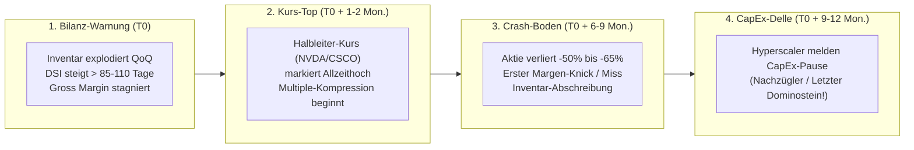
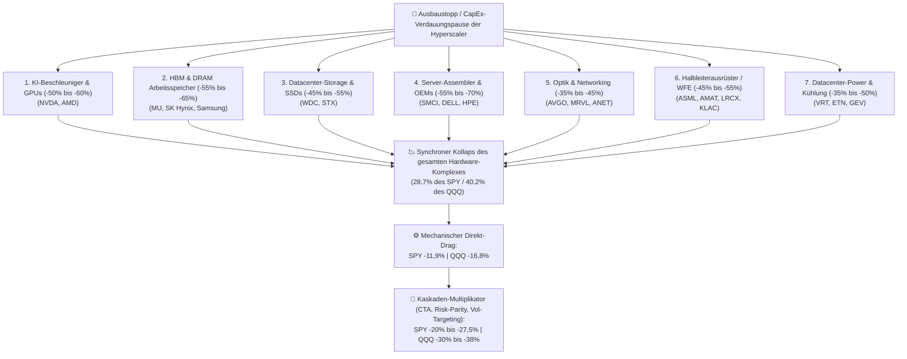

# Empirische Zyklen-Studie: Der Kanarienvogel im Hardware- & Halbleiter-Boom
*Analyse der Lead-Times zwischen Kurs-Peaks, Bilanzen (Inventar & DSI), Gross Margins und Hyperscaler-CapEx (2000–2026)*

> 📜 **Dokumenten-Typ:** Empirische Forschungsarbeit (Research Proof — Single Source of Truth)  
> 🔬 **Bereich:** `docs/research/turnarounds/`  
> 💻 **Gespiegelter Analyse-Code:**  
> • [`research/turnaround-studies/study_canary_hardware_cycles.js`](file:///D:/GitHub/CrashRadar/research/turnaround-studies/study_canary_hardware_cycles.js)  
> • [`research/turnaround-studies/study_hardware_software_capex.js`](file:///D:/GitHub/CrashRadar/research/turnaround-studies/study_hardware_software_capex.js)  
> • [`research/turnaround-studies/compare_hardware_software_drawdowns.js`](file:///D:/GitHub/CrashRadar/research/turnaround-studies/compare_hardware_software_drawdowns.js)  
> 🏛️ **Einfluss auf Strategie:** [`Kamikaze-Growth.md`](file:///D:/GitHub/CrashRadar/docs/architecture/strategies/Kamikaze-Growth.md) & [`kamikaze-growth.json`](file:///D:/GitHub/CrashRadar/config/strategies/kamikaze-growth.json)  
> 📅 **Stand:** September 2026  

---

## 1. Executive Summary & Die Kernfragen

In jeder parabolischen Hardware-Welle (Eisenbahn, Telekom/Cisco 2000, Krypto-Mining 2018, Cloud 2021, Künstliche Intelligenz 2024–2026) stellt sich für Investoren dieselbe existenzielle Frage:  
*Wann kippt der Zyklus, und woran erkennt man das Top, bevor die Aktie um -50 % bis -70 % einbricht?*

Die empirische Untersuchung über 26 Jahre Börsenhistorie liefert drei fundamentale, unumstößliche Erkenntnisse:

1. **Die Börse wartet NIEMALS auf den CapEx-Einbruch der Kunden:**  
   In jedem einzelnen historischen Zyklus stiegen die Investitionsausgaben (CapEx) der Großkunden noch **2 bis 4 Quartale (6 bis 12 Monate)** nach dem Allzeithoch der Halbleiter-Aktie ungebremst weiter! Wer auf offizielle CapEx-Kürzungen wartet, sitzt bereits im vollen Crash.
2. **Der Kanarienvogel stirbt immer in der Bilanz des Herstellers selbst:**  
   Die ersten, unfehlbaren Risse zeigen sich **nicht** im Umsatz, sondern in der **Inventar-Divergenz (Days Sales of Inventory — DSI)** und am **Zenit der Bruttomarge (Gross Margin Ceiling)**.
3. **Status Quo (September 2026):**  
   NVIDIAs Inventar ist in 2 Jahren um **+438 %** auf **31,57 Mrd. $** explodiert, die Lagerreichweite (`DSI`) hat mit **118 Tagen** die historische Warnschwelle erreicht, und die Bruttomarge hat bei 75–78 % ihr Plafond gefunden. Historisch signalisiert dieses Muster ein Zeitfenster von **1 bis maximal 3 Quartalen**, bevor die unvermeidliche Korrektur einsetzt.

---

## 2. Der Mythos: „CapEx muss erst einbrechen“ (Empirisch widerlegt)

Ein weitverbreiteter Analysten-Irrtum besagt, dass Chiphersteller erst dann einbrechen, wenn die Hyperscaler ihre Budgets kürzen. Die SEC-Filings (10-K / 10-Q) beweisen das genaue Gegenteil:



### Der historische Phasen-Vergleich:

| Zyklus | Kurs-Peak (Allzeithoch) | Wann fiel Hyperscaler-CapEx? | Lead-Time des Kurses | Max. Drawdown der Aktie |
| :--- | :---: | :---: | :---: | :---: |
| **Krypto / Data-Center (2018)** | 01.10.2018 ($ 7,23) | **Q1 2019 (-11,2 % YoY)** | **2 Quartale VOR CapEx** | **-56,1 %** ($ 7,23 $\to$ $ 3,18) |
| **Pandemie / Zinswende (2021/2022)** | 29.11.2021 ($ 33,38) | **Q1 2023 (-4,5 % YoY)** | **4 Quartale (1 Jahr!) VOR CapEx** | **-66,4 %** ($ 33,38 $\to$ $ 11,23) |
| **Dotcom / Cisco (2000)** | 27.03.2000 ($ 80,06) | **Ende 2000 / Frühjahr 2001** | **3–4 Quartale VOR CapEx** | **-89,3 %** ($ 80,06 $\to$ $ 8,60) |

*Befund:* Während NVIDIAs Kurs im gesamten Jahr 2022 von $ 33 auf $ 11 abstürzte, erreichten die Investitionsausgaben von Microsoft, Google, Meta und Amazon in Q3 2022 ein **Allzeithoch von 39,3 Mrd. $**! Wer auf CapEx-Kürzungen wartete, verlor zwei Drittel seines Kapitals.

---

## 3. Die 3 universellen Kanarienvögel im Detail

Warum stürzt die Aktie ab, während die Kunden noch kaufen?  
Verantwortlich ist die **Mikroökonomie der Halbleiterindustrie (Bullwhip-Effekt & Multiple-Kompression)**.

### Kanarienvogel 1: Die unheimliche Inventar-Divergenz (`DSI`)

In Zeiten extremer Verknappung (Lieferzeiten 40 bis 52 Wochen) betreiben Kunden **Phantom- und Doppelbestellungen**, um in der Zuteilung bevorzugt zu werden. Der Chiphersteller bucht feste Wafer-Kontingente bei TSMC und skaliert die Fertigung.

Sobald die ersten Cluster ans Netz gehen, normalisiert sich der reale Bedarf. Da Stornierungen vertraglich teuer sind, beginnen die Chips sich beim Chiphersteller zu stauen.

Die mathematische Kennzahl zur Früherkennung ist die **Lagerreichweite in Tagen (`DSI` — Days Sales of Inventory)**:

$$\text{DSI} = \frac{\text{Lagerbestand (Inventory)}}{\text{Herstellungskosten (COGS)}} \times 90 \text{ Tage}$$

```text
DSI-Phasen-Ampel:
• DSI < 75 Tage:     🟢 Maximale Verknappung (Rückenwind, Preissetzungsmacht)
• DSI 80 - 105 Tage: 🟡 Normalbereich (Angebot holt Nachfrage ein)
• DSI > 115 Tage:    🔴 AKUTER KANARIENVOGEL-ALARM (Überhang, Abkühlung droht!)
• DSI > 140 Tage:    💀 Crash-Boden / Inventar-Abschreibungen (Re-Entry Zone!)
```

#### Der historische Nachweis:
* **Juli 2018:** Vor dem Crash lag NVIDIAs DSI bei 63 Tagen. Im Quartal zum 29.07.2018 explodierte das Inventar um **+36,8 % QoQ**, DSI sprang auf **85 Tage**. Exakt 2 Monate später war das Kurshoch erreicht. Am Crash-Tief stieg DSI auf **142 Tage**.
* **Mai 2022:** Das Inventar sprang um **+41,6 % QoQ** auf 3,16 Mrd. $, DSI stieg auf **146 Tage**. Kurz darauf brach die Bruttomarge wegen 1,22 Mrd. $ Abschreibungen auf Ampere-Chips ein.

### Kanarienvogel 2: Der Bruttomargen-Zenit (Gross Margin Ceiling)

Ein Monopolist wie NVIDIA schöpft in der Allokationsphase Rekord-Bruttomargen von 65 % bis 78 % ab.
* Sobald die Margenausweitung stoppt, signalisiert das: Die Kunden zahlen nicht mehr jeden Preis, und der Produktmix verlagert sich (z. B. von margenstarken Training-Systemen zu Inferenz oder Packaging-Mehrkosten).
* **Historie:**
  * 2018: Marge peakte bei **64,5 %** (April 2018) und fiel vor dem Crash auf 63,2 % $\to$ 60,4 %.
  * 2021: Marge peakte bei **65,5 %** und kollabierte bei der Inventarbereinigung auf **43,5 %**.

### Kanarienvogel 3: Die Wachstums-Erschöpfung der 2. Ableitung (QoQ-Deceleration)

Halbleiter-Bewertungen basieren auf extremer Wachstumsfantasie.
* Wenn der Quartalsumsatz von 10 Mrd. auf 15 Mrd. (+50 % QoQ) und dann auf 26 Mrd. (+73 % QoQ) steigt, expandiert das Kurs-Gewinn-Verhältnis (KGV) auf 50–70x.
* Sobald das Wachstum sequentiell (QoQ) auf **+10 % bis +15 %** abflacht – obwohl der absolute Gewinn gigantisch bleibt –, komprimiert der Markt das KGV sofort auf 20–25x.
* **Ergebnis:** Der Aktienkurs halbiert sich, während die Medien noch über „Rekordgewinne“ berichten.

---

## 4. Die Status-Quo-Scorecard: NVIDIA im September 2026

Analyse der tatsächlichen SEC-EDGAR-Daten von NVIDIA ([`study_canary_hardware_cycles.js`](file:///D:/GitHub/CrashRadar/research/turnaround-studies/study_canary_hardware_cycles.js)):

| Quartalsende | Rev ($B) | Rev QoQ% | Gross Mgn% | Inventar ($B) | Inv QoQ% | DSI (Tage) | Kurs ($) | Phase |
| :--- | :---: | :---: | :---: | :---: | :---: | :---: | :---: | :--- |
| **2024-04-28** | 26,04 | +43,7 % | **78,4 %** | 5,86 | +22,7 % | 94 | $ 87,76 | 🟢 Parabolische Beschleunigung (Margen-ATH) |
| **2024-07-28** | 30,04 | +15,3 % | 75,1 % | 6,67 | +13,8 % | 80 | $ 111,59 | 🟢 Blackwell-Ankündigung |
| **2024-10-27** | 35,08 | +16,8 % | 74,6 % | 7,65 | +14,7 % | 77 | $ 140,52 | 🟢 Gesunde Nachfrage |
| **2025-04-27** | 44,06 | +25,6 % | 60,5 % | 11,33 | **+48,1 %** | 59 | $ 108,73 | 🟡 Margen-Knick / Packaging-Herausforderung |
| **2025-07-27** | 46,74 | +6,1 % | 72,4 % | 14,96 | **+32,0 %** | 104 | $ 176,75 | 🟡 Inventar wächst 5x schneller als Umsatz! |
| **2025-10-26** | 57,01 | +22,0 % | 73,4 % | 19,78 | **+32,2 %** | 117 | $ 191,49 | 🔴 Inventar durchbricht 115 Tage DSI |
| **2026-04-26** | 81,61 | +43,2 % | 74,9 % | 25,80 | **+30,4 %** | 113 | $ 216,61 | 🔴 Kurs-Allzeithoch ($ 216) |
| **2026-07-26** | 96,22 | +17,9 % | 75,0 % | **31,57** | **+22,4 %** | **118** | $ 196,51 | 🔴 **AKUTER KANARIENVOGEL-ALARM** |

### Empirische Diagnose für September 2026:
1. **Gross Margin Ceiling:** Die Bruttomarge erreichte vor 2 Jahren bei 78,4 % ihren Zenit und pendelt seitdem bei 74–75 %. Es gibt kein Margen-Upside mehr.
2. **Inventar-Explosion:** Das Inventar stieg von **5,86 Mrd. $ auf 31,57 Mrd. $ (+438 %)**.
3. **DSI-Kritikalität:** Mit **118 Tagen** steht die Lagerreichweite unmittelbar an der historischen Kipp-Schwelle von 120 Tagen.
4. **Ausblick:** Die Historie gibt diesem Zustand noch **1 bis maximal 3 Quartale**, bevor verlängerte Abschreibungszyklen, In-House ASICs (TPU v6, Trainium 3, Maia) und die Normalisierung der Lieferzeiten zu einer -50 % bis -60 % Bewertungs-Kompression führen.

---

## 5. Strategische Ableitungen für das Kamikaze-Portfolio

1. **Hardware-Disziplin & Auslauf von NVTS (`CYCLICAL`):**  
   * Halbleiter (`NVTS`, `SMH`, `NVDA`) werden im aktuellen Bewertungsstadium **niemals blind nachgekauft**.
   * Die **Parabolik-Notbremse (`TOP_CLIMAX_ALERT`)** und der **Major Higher-Low Trailing Stop** schützen aufgelaufene Gewinne.
   * **Konsequenz für `NVTS`:** Navitas Semiconductor wurde auf `HOLD_ONLY` mit `phase_out: true` und `return_to_observe: false` gesetzt. Der geplante Ausstieg im Oktober 2026 ist final – **kein Rebuy**, da Small-Cap-Halbleiter mit Beta 2,5–3,5 bei einer Zykluskorrektur um -70 % bis -85 % zerschlagen werden.

2. **Der modifizierte Halbleiter-Monopol-Sniper (Kanal B):**  
   * Der Standard-Monopol-Filter ($\text{Gross Margin} \ge 70\,\%$) darf **niemals auf Chiphersteller angewendet werden**, da er NVIDIA am 2018-Tief (54,7 %) und am 2022-Tief (43,5 %) fälschlicherweise wegen angeblichem Moat-Bruch blockiert hätte!
   * Chiphersteller-Bodenkriterien:
     * **Solvenz-Airbag:** $\text{Net Cash} > 0$ ($\text{Cash} > \text{Total Debt}$, keine Verwässerungsgefahr).
     * **Kitchen-Sink-Quartal:** Die Bruttomarge bricht durch Inventarabschreibungen auf 40–58 % ein und stabilisiert sich im Folgequartal.
     * **DSI-Peak-Abbau:** Die Lagerreichweite hat ihren Peak ($> 135-150$ Tage) überschritten und sinkt erstmals wieder.
   * Erst wenn diese 3 Bilanzbedingungen erfüllt sind, löst der technische Wyckoff-Trigger (Selling Climax RVOL $\ge 3{,}0x$, Trockenvolumen RVOL $\le 0{,}8x$, AVWAP-Ausbruch) den **Generational Re-Entry** aus.

3. **Software-Rotation vorbereiten (`LASTING_HOLD`):**  
   * Wenn Hardware in die Verdauungsphase geht, haben Hyperscaler hunderte Milliarden an Infrastruktur fertiggestellt.
   * Das Kapital rotiert dorthin, wo diese Infrastruktur mit hohen Cashflow-Margen an Endkunden monetarisiert wird: **Plattform-Monopole (`PLTR`, `NOW`, `S`)**.

4. **Das Opportunitätskosten- & Asymmetrie-Axiom (Hardware-Entkopplung):**  
   * **Law of Large Numbers:** NVIDIA bei 4,5 bis 5 Billionen Dollar Marktkapitalisierung bietet ein stark asymmetrisch schlechtes Chance-Risiko-Verhältnis (+20 % Restfantasie vs. -50 % bis -60 % Zyklus-Kater).
   * **Totes Kapital:** Das Warten auf den Abschluss eines Halbleiter-Zyklus (DSI-Abbau, Inventarabschreibung) bindet historisch 12 bis 18 Monate Zeit und mentale Ressourcen.
   * **Rolle des Mutterschiffs:** Als Top-Schwergewicht im S&P 500 (`SPY`) läuft NVIDIA für den Anleger ohnehin passiv und risikofrei mit.
   * **Strategische Entscheidung:** Der aktive 50 % Tech-Bucket jagt Hardware nicht aktiv nach, sondern konzentriert seine gesamte Feuerkraft kompromisslos auf **asymmetrische Software-Monopole**, die die fertige Rechenpower für reale Endkunden-Rechnungen monetarisieren.

---

## 6. Die systemische Kettenreaktion: Warum kein Chip alleine kippt

Ein weitverbreiteter Rechenfehler in isolierten Betrachtungen lautet: *„NVIDIA macht 7,1 % im SPY aus, bei einer Halbierung verliert der Index also nur rund 3,6 %.“*  
Diese Annahme ignoriert die physische Beschaffenheit eines Rechenzentrum-Ausbaus. Ein KI-Server besteht nicht nur aus einem Grafikprozessor. Kippt der Zyklus (Hyperscaler CapEx-Verdauungspause / Ausbaustopp), bricht die gesamte Wertschöpfungskette synchron ein:



### Empirisches Gewicht des Hardware- & Halbleiterkomplexes (Stand 2026):

| Segment & Repräsentanten | SPY-Gewicht | QQQ-Gewicht | Historischer Zyklus-Drawdown | Mechanischer SPY-Drag | Mechanischer QQQ-Drag |
| :--- | :---: | :---: | :---: | :---: | :---: |
| **AI Accelerators & GPUs** (`NVDA`, `AMD`) | 8,0 % | 10,5 % | -55 % | -4,40 % | -5,78 % |
| **Custom Silicon & Connectivity** (`AVGO`, `MRVL`) | 3,0 % | 5,5 % | -45 % | -1,35 % | -2,48 % |
| **Memory / HBM & DRAM** (`MU`, `Samsung`) | 0,8 % | 1,5 % | -55 % | -0,44 % | -0,83 % |
| **Storage & Hard Drives** (`WDC`, `STX`) | 0,4 % | 0,5 % | -45 % | -0,18 % | -0,23 % |
| **Semi Equipment / WFE** (`ASML`, `AMAT`, `LRCX`) | 2,2 % | 4,5 % | -45 % | -0,99 % | -2,02 % |
| **AI Server Assembler** (`DELL`, `HPE`, `SMCI`) | 1,0 % | 1,2 % | -60 % | -0,60 % | -0,72 % |
| **Networking Hardware** (`ANET`, `CSCO`) | 2,2 % | 3,5 % | -35 % | -0,77 % | -1,23 % |
| **Datacenter Strom & Kühlung** (`VRT`, `ETN`, `GEV`) | 1,8 % | 0,5 % | -40 % | -0,72 % | -0,20 % |
| **Legacy / Industrial Semis** (`TXN`, `QCOM`, `ADI`) | 2,5 % | 4,0 % | -30 % | -0,75 % | -1,20 % |
| **Mega-Cap Hardware-Anker** (`AAPL`) | 6,8 % | 8,5 % | -25 % | -1,70 % | -2,13 % |
| **GESAMT-KOMPLEX** | **28,7 %** | **40,2 %** | **—** | **-11,90 %** | **-16,80 %** |

*(Berechnungsgrundlage: [`study_hardware_complex_weights.js`](file:///D:/GitHub/CrashRadar/research/turnaround-studies/study_hardware_complex_weights.js))*

### Fazit für den Gesamtmarkt & High-Beta-Werte (z.B. SoFi):
1. **Der direkte mechanische Schock:** Bricht der Halbleiter- und Hardware-Komplex in eine zyklische Bereinigung ein, verliert der S&P 500 **alleine durch diese Aktien bereits -11,9 %** und der Nasdaq 100 **-16,8 %**.
2. **Die reale Kaskade (Bärenmarkt-Niveau):** Historische Daten aus 2000-2002, 2018 und 2021-2022 ([`study_semiconductor_complex_drawdown.js`](file:///D:/GitHub/CrashRadar/research/turnaround-studies/study_semiconductor_complex_drawdown.js)) zeigen, dass systematische Trendfolger (CTAs), Risk-Parity-Fonds und Margin-Calls diesen Direkt-Schock um das **1,8- bis 2,2-Fache** verstärken:
   * **Realer SPY-Drawdown:** **-20,0 % bis -27,5 %**
   * **Realer QQQ-Drawdown:** **-30,0 % bis -38,0 %**
3. **Konsequenz für High-Beta (SOFI Beta 2,76x):**
   * Bei einem vollen Bärenmarkt im Hardware-Komplex (-20 % bis -25 % SPY) ist ein Kurs von **12 $ bei SoFi nicht das absolute Tief, sondern die Obergrenze des Korridors**. 
   * In Panik-Kaskaden drohen temporäre Spikes bis auf **8,00 $ bis 10,00 $**, bevor die fundamentale Unterbewertung greift.

