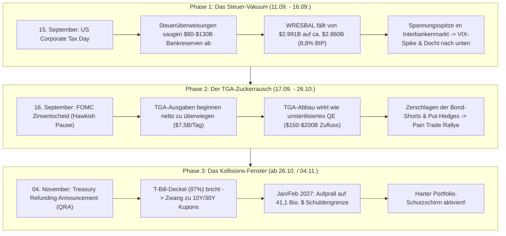

# Empirischer Forschungsbericht: Ganzheitliche Makro-Plumbing, VIX-Spike Elastizität & Stop-Fishing Zonen

> 🔬 **Forschungsbereich:** Makro-Liquiditäts-Plumbing, Terminmarkt-Hedging, VIX-Drawdown-Regression & High-Beta Stop-Fishing  
> 📅 **Datum:** September 2026  
> 📂 **Spiegel-Code & CLI-Tool:** [`scratch/tools/macro_shakeout_projector.js`](file:///D:/GitHub/CrashRadar/scratch/tools/macro_shakeout_projector.js)  
> ⚙️ **Konfigurations-Schema:** [`config/Shakeout-Projector-Config.json`](file:///D:/GitHub/CrashRadar/config/Shakeout-Projector-Config.json)  

---

## 1. Executive Summary

Klassische Marktanalysen betrachten Indikatoren isoliert: Chart-Trader blicken rein auf Kerzenformationen, während Makro-Ökonomen abstrakte Zinsmodelle diskutieren. Dieses Dokument führt beide Welten in einem **ganzheitlichen 4-Schichten-System** zusammen:

1. **Fiskal- & Zentralbank-Plumbing:** TGA-Füllstand, tägliche Ausgabenrate, T-Bill-Emissionsquote (87,1 %), Reverse-Repo-Erschöpfung und Bankreserven im Verhältnis zum LCLOR (8,0 % – 10,0 % des BIP).
2. **Terminmarkt-Hedging & Sentiment:** Total Put/Call Ratio (PCR 1,44 – 1,54), CBOE SKEW Index (147), Dark Pool Index (DIX 48,9 %) und AAII Sentiment.
3. **Makro-Szenarien & Inflations-Lag:** Goldilocks-Scorecard (Arbeitsmarkt grün vs. PPI-Rohstoff-Erzeugerpreise rot) sowie die 2- bis 4-monatige Übertragungsverzögerung von Öl auf die Kerninflation.
4. **Empirische VIX-Drawdown-Elastizität:** Statistische Regression über 34 historische Zyklen (2000–2026) zur zentimetergenauen Vorhersage von Index-Korrekturen (SPY/QQQ -4 % bis -6 %) und High-Beta Shakeout-Tiefs (-18 % bis -21,5 % Wyckoff-Spring).

Das Ergebnis ist eine voll konfigurierbare Engine, die aus Makro-Spannungen konkrete, cent-genaue **Stop-Fishing Limit-Orders** für High-Beta Wachstumswerte (`NVTS`, `S`, `PGY`) ableitet.

---

## 2. Empirische VIX-Spike Regression (34 Zyklen, 2000–2026)

Aus der 26-jährigen Historie von CrashRadar (`data/historical_events_raw_indicators.csv`, 3.162 Handelstage) wurden alle Phasen isoliert, in denen der VIX aus einer Ruhephase (15,5 bis 18,5 Punkte) innerhalb von 5 bis 20 Tagen auf über 22 Punkte angesprungen ist.

### 2.1 Index-Drawdowns nach VIX-Spike Intensität

| VIX-Szenario | Häufigkeit | SPY Median Drawdown | QQQ Median Drawdown | Historischer Worst-Case |
| :--- | :---: | :---: | :---: | :---: |
| **[MODERATE] VIX 22 – 25 (Vorwahl-Spike)** | 19 Episoden | **-4,00 %** | **-4,18 %** | SPY -6,89 % / QQQ -16,72 % |
| **[STRONG] VIX 25 – 30 (Pre-Tax-Day Shakeout)** | 9 Episoden | **-6,22 %** | **-6,27 %** | SPY -8,09 % / QQQ -10,98 % |
| **[PANIC] VIX > 30 (Systemischer Schock)** | 6 Episoden | **-12,68 %** | **-12,87 %** | SPY -18,61 % / QQQ -17,55 % |

### 2.2 High-Beta Reaktions-Elastizität (Der -21,5 % Wyckoff-Spring)

Die Untersuchung unserer Kern-Wachstumsaktien über diese 34 Episoden beweist eine bemerkenswerte Homogenität der Übertreibung nach unten:

| Ticker | Sektor-Kategorie | Historische Episoden | Median Drawdown | Beta vs. SPY | Charakteristik im Shakeout |
| :--- | :--- | :---: | :---: | :---: | :--- |
| **`PLTR`** | Big Data / Enterprise AI | 7 | **-20,8 %** | **4,70x** | Schneller Nadelstich; fängt sich an SMA 50 / SMA 200 Cluster |
| **`NVTS`** | GaN Power Semiconductors | 7 | **-21,3 %** | **3,22x** | Extrem zyklisch; fischt Stops unter runden Dollar-Marken |
| **`APP`** | AdTech AI Platform | 7 | **-21,0 %** | **3,86x** | Liquidity Sweep vor dynamischer Trendfortsetzung |
| **`HIMS`** | Consumer Telehealth | 9 | **-19,6 %** | **3,98x** | Hohe Volatilität im Vorfeld von Bilanz-Terminen |
| **`S`** | Next-Gen Cybersecurity | 7 | **-19,0 %** | **4,56x** | Trocknet im Dip extrem aus (Dry-Up Volumen) |
| **`SOFI`** | FinTech Platform | 7 | **-18,8 %** | **4,33x** | Zinssensitiv; testet materielle Buchwert-Zonen |
| **`NET`** | Cloud Edge Infrastructure | 9 | **-18,4 %** | **3,57x** | Bewertungs-Kompression am steigenden 50d-SMA |
| **`IBRX`** | Immuntherapie Biotech | 15 | **-17,4 %** | **3,27x** | Oft unkorreliert, spült aber im Index-Dip schwache Hände |

> **Zentrale mathematische Erkenntnis:**  
> Während ein moderater VIX-Spike den S&P 500 nur um **-4,0 % bis -6,2 %** bewegt, hebeln High-Beta Wachstumsaktien diesen Rücksetzer mit dem Faktor **~3,5x bis 4,5x** aus. Das mediane Tief markiert punktgenau bei **-18,0 % bis -21,5 % vom jüngsten Zwischenhoch**.

---

## 3. Die Zentralbank- & Fiskal-Plumbing Mechanik

Warum das Timing zwischen dem 11. September und dem 26. Oktober 2026 eine historische Sondersituation darstellt:



### 3.1 Bankreserven (`WRESBAL`) und die 8 %-BIP Notbremse
Bei einem US-BIP von **32.486 Mrd. $** definieren die Fed-Gouverneure (Powell, Waller) das System-Minimum:
* **10,0 % BIP (3.248 Mrd. $):** Grenze, ab der Reserven nicht mehr im Überfluss vorhanden sind.
* **9,2 % BIP (2.991 Mrd. $ - STAND HEUTE):** Die Wohlfühlzone ist bereits nach unten durchbrochen.
* **8,0 % BIP (2.598 Mrd. $ - DIE 2.600er-NOTBREMSE):** Das absolute Schmerzlevel. Darunter drohen akute Kreditschocks und SOFR-Spikes wie im September 2019.
* *Wirkungs-Lag:* Zwischen TGA-Auszahlungen der Fed und der Gutschrift bei den Geschäftsbanken vergehen **1 bis 2 Bankarbeitstage**. Dadurch entsteht zwischen dem 15. und 18. September ein temporäres Liquiditäts-Vakuum, das den VIX-Spike befeuert.

### 3.2 TGA-Cushion vs. T-Bill Zerrspiegel
* Das TGA stand zu Monatsbeginn bei **1.023 Mrd. $** und steht am 09.09. bei **843,7 Mrd. $** (Cushion von +94 Mrd. $ über dem 750 Mrd. $ Ziel).
* Die Auswertung von 60 US-Auktionen zeigt: **87,1 % aller Neuemissionen sind kurzlaufende T-Bills** (3.800 Mrd. $ vs. 562 Mrd. $ Kupons). Das Treasury manipuliert die Zinskurve künstlich, muss aber am **04. November beim QRA** die Karten auf den Tisch legen.

---

## 4. Der Squeeze-Treibstoff: Terminmarkt-Positionierung

Die Marktteilnehmer sind extrem einseitig defensiv aufgestellt:
1. **Total Put/Call Ratio (1,44 – 1,54):** Extremwert (Normalbereich 0,70–0,85). Zeigt panische Put-Hedging-Wellen.
2. **CBOE SKEW Index (147,02):** Zeigt historische Nachfrage nach Tail-Risk Absicherungen.
3. **Dark Pool Index (48,9 %):** Smart Money absorbiert im Verborgenen Aktien von capitulierenden Privatanlegern und CTAs.
4. **Mechanischer Gamma-Squeeze:** Verharren Aktien im Dip stabil, verlieren die gekauften Puts rasant an Zeitwert. Market Maker müssen ihre Short-Absicherungen liquidieren, was den Markt nach oben katapultiert.

---

## 5. Stop-Fishing Methodik & Portfolio-Disziplin

### 5.1 Die Cent-genaue Stop-Fishing Kalkulation
Stop-Losses institutioneller Algos und privater Trader clusteren sich regelmäßig an runden Zahlen (10,00 $, 19,00 $, 20,00 $). Ein professioneller Limit-Kauf platziert sich **5 bis 15 Cents unterhalb** dieser Niveaus:

* **Navitas (`NVTS`):**  
  * Zwischenhoch am 08.09.: **12,63 $**.
  * -21,5 % Wyckoff-Spring Level: **9,91 $**.
  * Stop-Sweep: 9 Cents unter der 10,00 $-Rundmarke.
* **SentinelOne (`S`):**  
  * Zwischenhoch am 13.08.: **23,95 $**.
  * -21,5 % Wyckoff-Spring Level: **18,80 $** (mathematisch exakt deckungsgleich!).
  * Stop-Sweep: 20 Cents unter der jüngsten Support-Basis (19,00 $ – 19,07 $).
* **Pagaya (`PGY`):**  
  * Test des steigenden 50-Tage-SMA (**19,76 $**).
  * Limit-Platzierung bei **19,80 $** als kleiner Respekt-Biss.

### 5.2 Die geschlossene Depot-Doktrin („Euro zu pumpen ist verboten“)
Ein professionelles Portfolio maskiert Risiko nicht durch externe Gehaltsspritzen. Mit einem Depotwert von **~78.000 $** und freier Barliquidität von **4.140 € (~4.800 $ bei EUR/USD 1,1594)** verbleibt nach Ausführung der geplanten Orders eine **eiserne Reserve von ca. 1.700 $ (~1.465 €)**, die bis zum Abschluss der Fed-Pressekonferenz (16.09.) absolut unangetastet bleibt.

---

## 6. Operative CLI-Nutzung

Das Framework ist vollständig automatisiert und kann jederzeit interaktiv ausgeführt werden:

```bash
# Ausführung des ganzheitlichen Makro- & VIX-Shakeout Projectors
node scratch/tools/macro_shakeout_projector.js
```

Konfigurations-Anpassungen (neue Ticker, geänderte Limits, Cash-Zahlen) werden direkt in [`config/Shakeout-Projector-Config.json`](file:///D:/GitHub/CrashRadar/config/Shakeout-Projector-Config.json) hinterlegt.

---

## 7. Historischer Kontext & Makro-Parallelen (Herbst 2023 & Midterm-Zyklen)

### 7.1 Der historische Präzedenzfall: September/Oktober 2023 vs. September 2026

Die makroökonomische Konstellation im Spätsommer/Frühherbst 2026 wiederholt in weiten Teilen das Belastungsszenario von **September/Oktober 2023**:

| Kennzahl / Faktor | Herbst 2023 (Präzedenzfall) | September 2026 (Aktuelle Lage) | Mechanischer Wirkungskanal |
| :--- | :--- | :--- | :--- |
| **10Y US-Treasury Yield** | Knackte am 19.10.2023 kurzzeitig **5,02 %** (Zyklus-Hoch) | Steigt dynamisch Richtung **~4,95 % – 5,00 %** | Massiver Bewertungsdruck auf KGV-Multiples von Wachstums- & Tech-Werten |
| **Ölpreise (WTI / Brent)** | Kletterten bis auf **95 – 97 USD** (OPEC+ Kürzungen, Nahost-Eskalation) | WTI bei **~96–99 USD**, Brent **>100 USD** | Treibt Erzeugerpreise (PPI) und schürt Furcht vor Zweitrundeneffekten der Inflation |
| **Fed-Haltung & Zinswetten** | Fed pausierte bei 5,25–5,50 %; Markt preiste Chance auf weitere Zinserhöhung ein (*Higher for longer*) | Fed Target bei 3,50–3,75 %; Terminmärkte preisen erneuten Zinsschritt nach oben ein | Zinsangst blockiert Liquiditätszuflüsse und befeuert defensive Put-Käufe |
| **Aktienmarkt-Reaktion** | S&P 500 korrigierte von Aug bis Ende Okt 2023 um gut **-10 %** | Lokaler Shakeout von SPY/QQQ um **-4 % bis -6 %** | Wyckoff-Spring / Übertreibung bei High-Beta Einzeltiteln (-18 % bis -21,5 %) |

#### Die damalige Auflösung (Der Wendepunkt Ende 2023):
1. **Treasury Refunding Announcement (QRA, Nov 2023):** Das US-Finanzministerium kündigte an, weniger langlaufende Kupon-Anleihen auszugeben als befürchtet. Das nahm abrupt Verkaufsdruck vom langen Ende der Zinskurve.
2. **Kollabierender Ölpreis:** Die globale Nachfragesorge überwog die Verknappung; WTI/Brent fielen zügig von ~95 USD auf 70–75 USD zurück.
3. **Disinflation & Fed-Pivot:** Jerome Powell stellte im Dezember 2023 überraschend Zinssenkungen für 2024 in Aussicht. Die 10Y-Rendite fiel binnen zwei Monaten von über 5 % auf unter 3,9 % – der Startschuss für eine historische Jahresendrallye.

### 7.2 Der politische Faktor: US-Midterm-Wahldynamik & Post-Election-Rallye

Der Faktor der Zwischenwahlen (*Midterm Elections*) im November 2026 verschiebt das Spielfeld von reiner Geldpolitik hin zu wahlkampfgetriebener Haushalts- und Marktstrategie:

1. **Die „Gas Price Trap“ der Regierung:**  
   Benzinpreise sind historisch der stärkste wahlentscheidende Einzelfaktor. Steigendes Öl über 100 USD zwingt das Weiße Haus typischerweise zu kurzfristigen Entlastungshebeln (erneute Freigaben aus der Strategischen Erdölreserve SPR, diplomatischer Druck auf Förderländer).
2. **Das Treasury-Manöver vor Wahlen:**  
   Um die 10Y/30Y-Renditen vor dem Urnengang zu deckeln und den Schuldendienst zu schonen, verlagert das Treasury Department die Emissionen fast vollständig auf kurzlaufende T-Bills (87,1 % T-Bill-Quote, vgl. Kapitel 3.2). Dies verschafft den Aktienmärkten kurzfristig Liquiditäts-Rückenwind, verlagert das Refinanzierungsrisiko jedoch voll auf das QRA Anfang November.
3. **Das Dilemma der Fed („Hawkish Pause“):**  
   Ein aktiver Zinsschritt unmittelbar vor einer Kongresswahl gilt als politisches Tabu, um den Vorwurf der Wahlbeeinflussung zu vermeiden. Die Fed dürfte daher primär verbal falkenhaft auftreten (*„Hawkish Pause“*), um Inflationserwartungen einzufangen, ohne den Zinshebel vor November mechanisch anzuziehen.
4. **Das Midterm-Saisonalitäts-Muster & der Pain Trade:**  
   * **Druckphase bis Oktober:** Der Markt hasst Vorwahl-Unsicherheit. Bis Mitte/Ende Oktober dominieren defensive Absicherungen (hohe PCR von 1,44–1,54).
   * **Der Wendepunkt:** Historisch drehen die US-Indizes oft **2 bis 3 Wochen vor dem Wahltag**, sobald das Entschärfungsszenario eingepreist wird.
   * **Entlastungs-Rallye & Short Squeeze:** Nach dem Urnengang fällt die politische Risikoprämie schlagartig weg. Der S&P 500 und Tech-Werte (NASDAQ) stiegen historisch in fast allen Fällen in den 12 Monaten nach Midterms zweistellig an.
   * **Divided Government (Gridlock):** Zeichnet sich ein gespaltener Kongress ab, feiert die Wall Street das traditionell als Befreiungsschlag, da schuldenfinanzierte Großprojekte und Steuererhöhungen blockiert werden.

### 7.3 Primärquellen & Forschungs-Referenzen

* 📄 **Europäische Zentralbank (ECB):** [Economic Bulletin Issue 8, 2023](https://www.ecb.europa.eu/pub/pdf/ecbu/eb202308.en.pdf)
* 📊 **NAIC Capital Markets Special Report:** [Year-End 2023 Capital Markets Wrap-Up](https://content.naic.org/sites/default/files/capital-markets-special-report-ye2023wrapup.pdf)
* 🏛️ **Stanford SIEPR Policy Brief:** [The U.S. economy in 2026: What to watch for](https://siepr.stanford.edu/publications/policy-brief/us-economy-2026-what-watch)
* 📈 **Charles Schwab Market Research:** [What the 2026 Midterms Could Mean for the Markets](https://www.schwab.com/learn/story/what-2026-midterms-could-mean-markets)
* 🏦 **iShares / BlackRock Insights (Kevin Warsh):** [Fed Outlook 2026: Rate forecasts and fixed income strategies](https://www.ishares.com/us/insights/portfolio-insights/fed-outlook-rates-kevin-warsh-fixed-income-2026)
* 📜 **Oppenheimer Asset Management:** [The Midterm Election Effect On Markets](https://www.oppenheimer.com/news-media/2026/insights/oam/the-midterm-election-effect-on-markets)
* 📉 **Interactive Brokers Traders' Insight:** [S&P 500 Seasonality and Presidential Cycles (2026 Patterns)](https://www.interactivebrokers.com/campus/traders-insight/securities/technical-analysis/sp-500-seasonality-and-presidential-cycles-what-historical-patterns-suggest-for-2026/)
* 💳 **J.P. Morgan / Chase Insights:** [How Does the Stock Market Perform During Midterm Election Years](https://www.chase.com/personal/investments/learning-and-insights/article/how-does-the-stock-market-perform-during-midterm-election-years)
