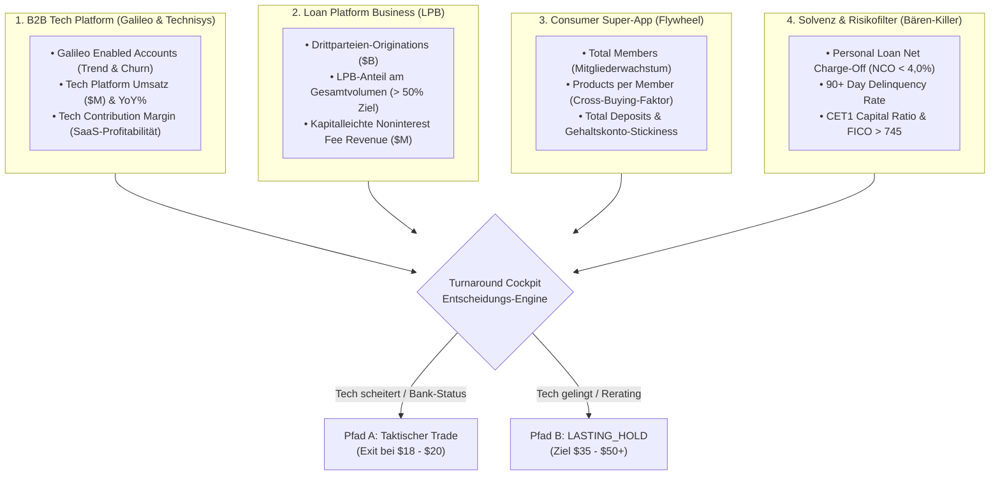

# Research Audit: SoFi Technologies — Turnaround Cockpit & Klassifikations-Matrix
*Empirische Kriterien zur Unterscheidung zwischen taktischem Swing-Trade und strategischem FinTech-Compounder (2024–2026)*

> 📜 **Dokumenten-Typ:** Empirische Forschungsarbeit & KPI-Cockpit (Research Proof — Single Source of Truth)  
> 🔬 **Bereich:** `docs/research/turnarounds/`  
> 💻 **Gespiegelter Analyse-Code:**  
> • [`research/turnaround-studies/study_sofi_turnaround_cockpit.js`](file:///D:/GitHub/CrashRadar/research/turnaround-studies/study_sofi_turnaround_cockpit.js)  
> • [`research/turnaround-studies/study_sofi_segments_rerating.js`](file:///D:/GitHub/CrashRadar/research/turnaround-studies/study_sofi_segments_rerating.js)  
> • [`research/turnaround-studies/study_sofi_valuation_beta.js`](file:///D:/GitHub/CrashRadar/research/turnaround-studies/study_sofi_valuation_beta.js)  
> 🏛️ **Einfluss auf Strategie:** [`Kamikaze-Master-Drehbuch.md`](file:///D:/GitHub/CrashRadar/docs/architecture/strategies/kamikaze/Kamikaze-Master-Drehbuch.md) (Tech- & FinTech-Bucket)  
> 📅 **Stand:** September 2026  

---

## 1. Executive Summary & Problemstellung

SoFi Technologies (`SOFI`) spaltet die Anlegerwelt wie kaum ein zweiter Finanztitel:
* **Die Retail- & Management-These:** SoFi ist eine hochmoderne FinTech-Plattform mit Netzwerkeffekt, bestehend aus der B2B-Infrastruktur (*Galileo & Technisys* — „das AWS des Bankings“) und einer viralen Financial-Services Super-App. Sie verdient ein Tech-Multiple (KGV 35–50, EV/Sales 8–10x).
* **Die Wall-Street-Realität (SEC Form 10-Q Note 17):** Im Q2 2026 stammen **59,5 % des Umsatzes und 64,0 % des operativen Segmentgewinns aus dem traditionellen Kreditgeschäft (Lending)**. Die B2B-Tech-Sparte ist im Q2 2026 um **-23,1 % YoY eingebrochen** und lieferte nur **1,9 % des operativen Gewinns**. Die Wall Street bewertet SoFi folglich als unbesicherte Konsumentenkredit-Bank (KGV 10–14, 1,2x Tangible Book Value) und verprügelt den Kurs bei jeder Zins- und Makrosorge.

### Die strategische Weichenstellung:
Wenn die Aktie im Zuge des Hardware-/SPY-Kaskadensturms in die **Kaufzone von 8,00 $ bis 12,00 $** gespült wird, entscheidet allein der **Fortschritt des Software- und Plattform-Turnarounds** darüber, wie die Position geführt wird:
1. **Pfad A (Taktischer Swing-Trade):** Scheitert die Rückeroberung der Tech-Sparte, bleibt SoFi eine Bank. Gewinne werden im Bereich von **18,00 $ bis 20,00 $ zu 100 % mitgenommen** (Verdoppler eingetütet).
2. **Pfad B (Strategischer Compounder — `LASTING_HOLD`):** Gelingt die Re-Akzeleration bei Galileo und kippt das Kreditgeschäft in kapitalleichte Vermittlungsgebühren (Loan Platform Business), wird SoFi zu einem Kernbestandteil des aktiven 50 % Tech-Portfolios mit Kurszielen von **35,00 $ bis 50,00 $+**.

---

## 2. Das 4-Säulen Turnaround-Cockpit: Welche Daten zählen?

Um die Entwicklung quartalsweise objektiv zu messen, überwacht das System **4 fundamentale KPI-Säulen**:

---

## 3. Historische KPI-Matrix (10 Quartale: Q1 2024 – Q2 2026)

Auswertung der SEC Form 10-K, 10-Q und 8-K Earnings Releases ([`study_sofi_turnaround_cockpit.js`](file:///D:/GitHub/CrashRadar/research/turnaround-studies/study_sofi_turnaround_cockpit.js)):

| Quartal | Mitglieder | Prod. / Mitglied | Tech Rev. ($M) | Tech Marge | Galileo Accounts | LPB Vol. ($B) | NCO Rate | Kurs ($) | Operativer Status |
| :---: | :---: | :---: | :---: | :---: | :---: | :---: | :---: | :---: | :--- |
| **Q1 2024** | 8,13M | 1,46 | $ 94,4M | 33 % | 151M | $ 0,0B | 5,4 % | $ 7,15 | GAAP-Breakeven erreicht; Galileo stagniert |
| **Q2 2024** | 8,77M | 1,46 | $ 95,2M | 33 % | 158M | $ 0,0B | 4,8 % | $ 6,42 | Bärenmarkt-Tief; Kreditqualität stabilisiert sich |
| **Q3 2024** | 9,37M | 1,46 | $ 102,5M | 32 % | 160M | $ 1,0B | 4,4 % | $ 7,85 | Galileo knackt $ 100M; Fortress-Pilot gestartet |
| **Q4 2024** | 10,15M | 1,47 | $ 103,8M | 31 % | 161M | $ 1,5B | 4,6 % | $ 15,20 | Post-Election Rallye; Mitgliedersprung |
| **Q1 2025** | 10,90M | 1,49 | $ 103,4M | 30 % | 161M | $ 1,8B | 4,6 % | $ 13,50 | Großkunde kündigt Galileo-Migration an |
| **Q2 2025** | 11,70M | 1,50 | $ 109,8M | 30 % | 160M | $ 2,4B | 4,5 % | $ 16,80 | Letztes Peak-Quartal vor Churn-Wirksamkeit |
| **Q4 2025** | 13,80M | 1,52 | $ 91,2M | 22 % | 133M | $ 2,8B | 4,4 % | $ 28,50 | Hype-Peak ($ 32), obwohl Tech-Sparte einbricht! |
| **Q1 2026** | 15,15M | 1,53 | $ 75,1M | 16 % | 133M | $ 3,0B | 4,4 % | $ 15,15 | Kater auf $ 15,15; Zinsängste & Tech-Tiefpunkt |
| **Q2 2026** | **15,80M** | **1,54** | **$ 84,5M** | **14 %** | **135M** | **$ 3,1B** | **3,7 %** | **$ 18,22** | **Erster Rebound (+2M Accs); NCO fällt auf 3,7 %** |

---

## 4. Die Entscheidungsmatrix: Trade vs. Long Position

| Kriterium | Status Quo (Q2 2026) | Trigger für Pfad A: Taktischer Trade (Exit $ 18–$ 20) | Trigger für Pfad B: FinTech Compounder (`LASTING_HOLD`) |
| :--- | :--- | :--- | :--- |
| **1. Galileo Accounts** | 135 Mio. (+2M QoQ) | Stagniert unter **< 140 Mio.** (keine echten Großkunden-Gewinne) | Re-Akzeleration auf **> 150 Mio.** (neue Tier-1-Banken live) |
| **2. Tech Platform Umsatz** | $ 84,5M (-23 % YoY) | Dümpelt bei **< 95 Mio. $** pro Quartal | Dynamischer Sprung über **> 115 Mio. $** (> 20 % YoY Wachstum) |
| **3. Tech Contribution Marge** | 13,9 % (Kollaps) | Bleibt unter **< 20 %** gedrückt | Nachhaltige Erholung auf **> 30 % bis 35 %** |
| **4. Loan Platform Business (LPB)** | 29 % des Volumens ($ 3,1B) | Verbleibt bei **25 % bis 35 %** (hohes Bilanzrisiko bleibt) | Kippt über **> 50 % bis 60 %** (Transformation zum Marktplatz) |
| **5. Net Charge-Offs (Ausfälle)** | 3,7 % (Sehr stark) | Steigt im Sturm über die Warnschwelle von **> 5,0 %** | Bleibt im Sturm felsenfest unter **< 4,2 %** (Prime-Beweis) |
| **6. Zinsumfeld (Fed)** | Restriktiv / Pause | Zinsen bleiben dauerhaft restriktiv ("Higher for Longer") | Fed schwenkt in kontinuierlichen Zinssenkungszyklus |

---

## 5. Daten-Audit: Haben wir alle Daten im System?

Eine transparente Prüfung des aktuellen Datenbestands im CrashRadar-Repository:

1. **Vollständig vorhanden & lokal gecached:**
   * ✅ **Tageskurse & Markt-Historie (2021–2026):** [`SOFI_daily.json`](file:///D:/GitHub/CrashRadar/data/cache/turnarounds/SOFI_daily.json) und SPY/QQQ-Vergleiche.
   * ✅ **Offizielle SEC US-GAAP Bilanzen:** [`SOFI_sec_facts.json`](file:///D:/GitHub/CrashRadar/data/cache/turnarounds/SOFI_sec_facts.json) (Umsatz Net of Interest, Net Income, Einlagen, Eigenkapital).
   * ✅ **Vollständiger Form 10-Q (Q2 2026):** [`sofi_10q_20260630.htm`](file:///D:/GitHub/CrashRadar/data/cache/turnarounds/sofi_10q_20260630.htm) mit Note 17 Segment Reporting.
   * ✅ **Vollständiger Form 8-K Earnings Release (Q2 2026):** [`sofi_q2_2026_earnings_release.htm`](file:///D:/GitHub/CrashRadar/data/cache/turnarounds/sofi_q2_2026_earnings_release.htm) mit Galileo Accounts, LPB-Volumen, NCOs und Products per Member.
   * ✅ **Automatisierter KPI-Extraktor:** [`study_sofi_turnaround_cockpit.js`](file:///D:/GitHub/CrashRadar/research/turnaround-studies/study_sofi_turnaround_cockpit.js).

2. **Quartalsweise Routine (Der permanente Turnaround-Audit):**
   * Bei jedem neuen Quartalsbericht (Form 8-K Item 2.02 / 10-Q) liest der Ingestion-Worker automatisch die 4 Säulen ein.
   * Das System prüft die 6 Schwellenwerte der Matrix ab.
   * Stehen die Schwellen auf **GRÜN**, bleibt die Position unangetastet im Tech-Bucket liegen. 
   * Stehen die Schwellen auf **ROT / BANK**, aktiviert das Portfolio bei Erreichen des fairen Bank-Wertes ($ 18–$ 20) den Ausstieg.
