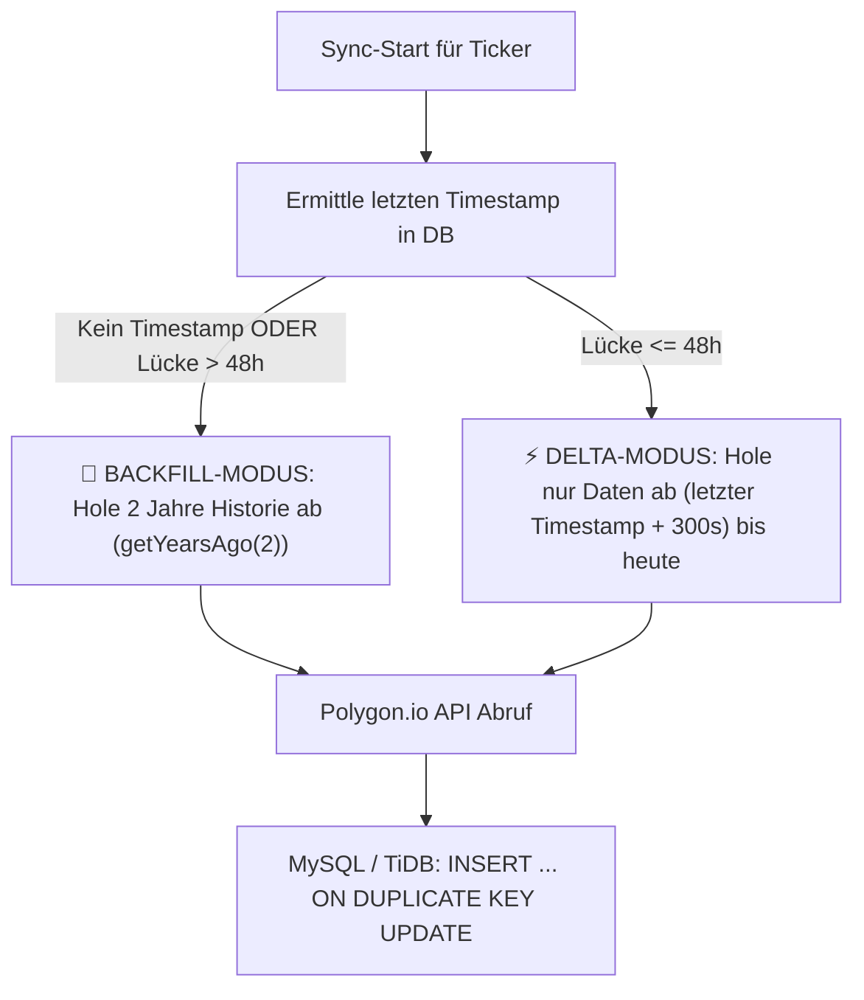

# M5-Candles Data Architecture & Ingestion Pipeline

> **Master-Architektur:** Dieses Dokument ist Bestandteil des übergeordneten Frameworks [`Single-Asset-Radar-Architecture.md`](file:///D:/GitHub/CrashRadar/docs/single-asset-radar/Single-Asset-Radar-Architecture.md). Für die Trading-Modelle siehe [`SingleAssetTrading.md`](file:///D:/GitHub/CrashRadar/docs/single-asset-radar/SingleAssetTrading.md).

Dieses Dokument beschreibt die Architektur, Datenquellen, Endpunkte, Transformationen und Betriebsmodi für den Bezug und die Verarbeitung von **5-Minuten-Intraday-Kerzen (M5)** im Projekt `CrashRadar`.

---

## 1. Ursprungs-Referenzen im Schwesterprojekt (`datacenter`)

Zur lückenlosen Nachvollziehbarkeit und als Referenz für die bestehende Implementierung sind die Original-Dateien aus `datacenter` verlinkt:

* 🕹️ **M5-Hauptcontroller:** [`D:\GitHub\datacenter\src\controllers\M5Controller.js`](file:///D:/GitHub/datacenter/src/controllers/M5Controller.js)  
  *Steuert den M5-Sync-Zyklus, prüft Marktöffnungszeiten und triggert den Delta-/Backfill-Abruf.*
* 🌐 **Polygon.io Service:** [`D:\GitHub\datacenter\src\services\PolygonIoService.js`](file:///D:/GitHub/datacenter/src/services/PolygonIoService.js)  
  *Führt die REST-Calls aus, handhabt Paginierung (`next_url`) und Rate-Limit Pacing.*
* 💾 **Candle Repository:** [`D:\GitHub\datacenter\src\repositories\CandleRepository.js`](file:///D:/GitHub/datacenter/src/repositories/CandleRepository.js)  
  *Verwaltet die Ermittlung des letzten Timestamps und den `upsert` der M5-Kerzen.*
* 📅 **Date & Range Helper:** [`D:\GitHub\datacenter\src\core\DateHelper.js`](file:///D:/GitHub/datacenter/src/core/DateHelper.js)  
  *Berechnet Start-/Enddaten (`fromDate`, `toDate`), Backfill-Schwellen ($> 48\text{h}$) und Timestamps.*
* 🚦 **Job-Router & MarketStatus:** [`D:\GitHub\datacenter\src\core\Router.js`](file:///D:/GitHub/datacenter/src/core/Router.js)  
  *Routet den Task `m5:sync` und prüft vorab den Polygon-Marktstatus.*

---

## 2. Datenquelle & Polygon.io Endpunkte

Die 5-Minuten-Kerzen werden über die offizielle REST-API von **Polygon.io** bezogen.

### A. 5-Minuten Aggregates (OHLCV + VWAP)
* **Endpoint:**  
  `GET https://api.polygon.io/v2/aggs/ticker/{TICKER}/range/5/minute/{FROM}/{TO}?adjusted=true&sort=asc&limit=50000&apiKey=${POLYGONIO_API_KEY}`
* **Parameter:**
  * `{TICKER}`: Symbol (z. B. `PLTR`, `NVTS`, `IGV`)
  * `range/5/minute`: 5-Minuten-Zeitfenster
  * `{FROM}` / `{TO}`: Start- und Enddatum im Format `YYYY-MM-DD`
  * `adjusted=true`: Bereinigung um historische Aktiensplits
  * `sort=asc`: Chronologisch aufsteigend sortiert
  * `limit=50000`: Maximales Abruf-Volumen pro API-Call (bis zu 50.000 Kerzen auf einmal)

### B. Börsen-Status Abfrage (Market Status)
* **Endpoint:**  
  `GET https://api.polygon.io/v1/marketstatus/now?apiKey=${POLYGONIO_API_KEY}`
* **Zweck:**  
  Prüft vor dem Sync, ob die US-Börsen (NYSE/NASDAQ) aktuell geöffnet (`market = 'open'`), im Vor-/Nachhandel (`early_hours`, `after_hours`) oder geschlossen (`closed`) sind.  
  *Vorteil:* Verhindert unnötige API-Abfragen und Fehler an Wochenenden, Feiertagen oder nachts.

---

## 3. Paginierung, Limits & Fehlerbehandlung

1. **Chunk-Limit (50.000 Kerzen):**  
   Ein einzelner API-Call liefert maximal **50.000 Kerzen** zurück. Für 5-Minuten-Kerzen entspricht das rund **1 bis 2 Jahren lückenloser Historie**.
2. **Paginierung (`next_url`):**  
   Falls ein Abruf mehr als 50.000 Kerzen umfasst, liefert Polygon ein Feld `next_url`. Der Client ruft diese Folge-URL rekursiv ab und hängt die Ergebnisse an.
3. **Pacing & Rate-Limit Schutz:**  
   * **Free Tier Limit:** Maximal **5 API-Calls pro Minute** (mit 15 Min Zeitverzögerung für Intraday-Kerzen).
   * Zwischen paginierten Folge-Requests wird eine Pause (z. B. 12 Sekunden) eingehalten.
   * **HTTP 429 Backoff:** Bei Erreichen des Limits wartet der Service 65 Sekunden vor dem Retry.
   * **HTTP 500 / 503 Retries:** Bis zu 3 automatische Wiederholungsversuche mit exponentiellem Backoff.

---

## 4. Rohdaten-Format & Transformation

Polygon liefert ein Array von `results`-Objekten im folgenden JSON-Format:

```json
{
  "t": 1717401600000,
  "o": 21.85,
  "h": 22.10,
  "l": 21.80,
  "c": 22.05,
  "v": 145200,
  "vw": 22.0123,
  "n": 1200
}
```

| Feld | Typ | Beschreibung | Ziel in MySQL `market_data_m5` |
| :--- | :---: | :--- | :--- |
| `t` | Unix Timestamp (ms) | Startzeitpunkt der 5-Minuten-Kerze in Millisekunden (UTC) | `record_time` (Format: `YYYY-MM-DD HH:MM:SS` UTC) |
| `o` | Float | Eröffnungskurs (Open) | `open` |
| `h` | Float | Höchstkurs der 5 Minuten (High) | `high` |
| `l` | Float | Tiefstkurs der 5 Minuten (Low) | `low` |
| `c` | Float | Schlusskurs der 5 Minuten (Close) | `close` |
| `v` | Number | Gehandeltes Aktienvolumen (Volume) | `volume` (gerundet als Ganzzahl) |
| `vw` | Float | Intraday volumengewichteter Durchschnittspreis (VWAP) | `vwap` |
| `n` | Integer | Anzahl der ausgeführten Trades / Transaktionen | `trade_count` |

---

## 5. Sync-Logik: Backfill vs. Delta-Sync

Die Abruf-Engine unterscheidet intelligent zwischen zwei Betriebsarten:



1. **Backfill-Modus:**  
   Falls ein neuer Ticker hinzugefügt wird oder die letzte Kerze $> 48\text{ Stunden}$ zurückliegt, wird automatisch ein Backfill über die letzten 2 Jahre initiiert.
2. **Delta-Sync (Routine):**  
   Im laufenden Betrieb wird nur der Zeitraum ab der letzten Kerze (`timestamp + 300s`) bis zum aktuellen Zeitpunkt nachgeladen.

---

## 6. Konfiguration & API-Schutz

* **Umgebungsvariable:**  
  Der API-Schlüssel wird ausschließlich über die `.env`-Datei bezogen:
  ```env
  POLYGONIO_API_KEY=...
  ```
  > **Sicherheits-Regel:** Der API-Key wird niemals im Klartext in Code, Logs, Markdown-Dateien oder Commits geschrieben.

---

## 7. Ziel-Tabelle in MySQL (`market_data_m5`)

Die Kerzen werden in unserer MySQL-/TiDB-Datenbank in der Tabelle **`market_data_m5`** abgelegt.

* **Tabelle:** `market_data_m5`
* **Primärschlüssel / Unique Constraint:** `(symbol, record_time)`
* **Bisheriger Datenbezug:**  
  Bisher wurden die Daten über [`scratch/tools/import_m5_supabase.js`](file:///D:/GitHub/CrashRadar/scratch/tools/import_m5_supabase.js) inkrementell aus der Supabase-Tabelle `market_m5_candles` synchronisiert.

---

## 8. Aktuell konfigurierte Fokus-Ticker (10 Symbole)

Die M5-Ingestion-Pipeline deckt die folgenden 10 Symbole für die Tabelle `market_data_m5` ab:

| Asset-Klasse | Ticker-Symbole | Primärer Verwendungszweck im System |
| :--- | :--- | :--- |
| **High-Beta & Growth-Aktien** | `PLTR`, `NVTS`, `IBRX`, `SOUN`, `SOFI`, `S` | M5-Intraday-Daten für Katapult- & Ausbruchs-Monitoring (Details siehe [`SingleAssetTrading.md`](file:///D:/GitHub/CrashRadar/docs/single-asset-radar/SingleAssetTrading.md)) |
| **Sektor- & Themen-ETFs** | `IGV`, `CIBR` | M5- und Tageskerzen für Sektor-Trendfolge & MACD-Regime (Details siehe [`SingleAssetTrading.md`](file:///D:/GitHub/CrashRadar/docs/single-asset-radar/SingleAssetTrading.md)) |
| **Markt-Benchmarks** | `SPY`, `QQQ` | Benchmark-Vergleichsdaten für Relative-Stärke-Berechnungen ($\text{RS} = \text{Asset}/\text{SPY}$) |

---

## 9. Abruf-Frequenzen der Ingestion Pipeline

Die Taktung des Datenabrufs ist darauf ausgelegt, die relevanten Marktphasen mit minimalen API-Requests vollständig abzudecken:

| Betriebsmodus | Taktung | Ausführungszeitpunkte | Technischer Ingestion-Fokus |
| :--- | :---: | :--- | :--- |
| **Modus A: 2-Session-Sync**<br>*(Standard / Empfohlen)* | **2x täglich** | • **17:15 Uhr MESZ** (15:15 UTC)<br>• **22:15 Uhr MESZ** (20:15 UTC) | • **17:15 Uhr:** Holt das Kerzen-Delta der US-Eröffnungsphase (15:30–17:00 Uhr).<br>• **22:15 Uhr:** Holt alle restlichen Tageskerzen inkl. Power Hour bis 22:00 Uhr und schließt den Tag ab.<br>• **Ressourcen:** Nur 20 API-Calls/Tag für alle 10 Ticker. |
| **Modus B: Kontinuierlicher Intraday-Sync** | **Alle 15–30 Min** | • Fortlaufend während US-Börsenzeit (15:30 bis 22:00 Uhr MESZ) | • Lädt fortlaufend die neuesten 5-Minuten-Abschnitte nach.<br>• Gedacht für Live-Radar-Alerting im laufenden Handel. |

> **Hinweis zur Signalauswertung:** Die fachliche Interpretation dieser Zeitfenster (z. B. `BREAKOUT_ACTIVE` oder `TOP_CLIMAX_ALERT`) erfolgt im nachgelagerten Analyselauf (siehe [`Single-Asset-Radar-Architecture.md`](file:///D:/GitHub/CrashRadar/docs/single-asset-radar/Single-Asset-Radar-Architecture.md)).

---

## 10. Architektur-Integration in das `CrashRadar` Fetcher-Framework

Um die Datenbeschaffung konsistent und sauber im Projekt zu verankern, wird der M5-Abruf in das bestehende Fetcher-Framework von `CrashRadar` integriert:

1. **Zentraler Adapter ([`src/core/adapters/fetch/`](file:///D:/GitHub/CrashRadar/src/core/adapters/fetch/)):**  
   Erstellung eines dedizierten `PolygonFetchAdapter.js` (oder `PolygonM5FetchAdapter.js`), der über die `FetchAdapterFactory` registriert wird.
2. **Einbindung in den `RequestManager`:**  
   Gewährleistet zentrales Error-Handling, strukturiertes Logging, automatisches Retry-Management und Respektierung der API-Limits.
3. **Deterministischer Sync:**  
   Der Fetcher prüft vor dem Abruf die Tabelle `market_data_m5`, ermittelt den letzten Timestamp und fragt bei Polygon ausschließlich das Delta seit dem letzten Datenpunkt ab.

---

## 11. Implementierungs-Fahrplan, Status & Nomenklatur

### A. Aktueller Umsetzungs-Status

| Baustein | Komponente / Datei | Status | Details |
| :--- | :--- | :---: | :--- |
| **1. API-Schlüssel** | [`.env`](file:///D:/GitHub/CrashRadar/.env) | 🟢 **Erledigt** | `POLYGONIO_API_KEY` sicher hinterlegt (kein Klartext-Leak). |
| **2. CLI-Profil-Option** | [`index.js`](file:///D:/GitHub/CrashRadar/index.js) | 🟢 **Erledigt** | `-p, --profile <profile>` mit Default `'daily'` via Commander registriert. |
| **3. Runner-Pipeline** | [`TimeSeriesFetchRunner.js`](file:///D:/GitHub/CrashRadar/src/runners/TimeSeriesFetchRunner.js), [`StandardRunner.js`](file:///D:/GitHub/CrashRadar/src/runners/StandardRunner.js) | 🟢 **Erledigt** | Profil-Parameter wird transparent an Fetcher durchgereicht. |
| **4. Profil-Filterung** | [`TimeSeriesFetcher.js`](file:///D:/GitHub/CrashRadar/src/services/TimeSeriesFetcher.js) | 🟢 **Erledigt** | `runAllTasks(profile)` filtert `tasks` nach `frequency || 'daily'`. |
| **5. Profil-Unit-Tests** | [`TimeSeriesFetcherProfile.test.js`](file:///D:/GitHub/CrashRadar/tests/services/TimeSeriesFetcherProfile.test.js) | 🟢 **Erledigt** | 3/3 Tests bestanden (vollständige Regressionsfreiheit). |
| **6. Fetch-Adapter** | [`PolygonFetchAdapter.js`](file:///D:/GitHub/CrashRadar/src/core/adapters/fetch/PolygonFetchAdapter.js) | ⏳ **Offen** | Nächster Schritt (Code-Skelett siehe unten). |
| **7. Factory-Registrierung** | [`FetchAdapterFactory.js`](file:///D:/GitHub/CrashRadar/src/core/adapters/fetch/FetchAdapterFactory.js) | ⏳ **Offen** | Eintrag `'Polygon': new PolygonFetchAdapter()`. |
| **8. Config-Erweiterung** | [`Database-Fetcher-Config.json`](file:///D:/GitHub/CrashRadar/config/Database-Fetcher-Config.json) | ⏳ **Offen** | `providers.Polygon` & 10 Tasks für `market_data_m5`. |
| **9. Adapter-Unit-Tests** | `tests/core/adapters/fetch/PolygonFetchAdapter.test.js` | ⏳ **Offen** | Unit-Tests für Paginierung, Pacing & MarketStatus. |

---

### B. Nomenklatur-Definition
* **Provider-Name:** `"Polygon"` in [`Database-Fetcher-Config.json`](file:///D:/GitHub/CrashRadar/config/Database-Fetcher-Config.json)
* **Fetch-Adapter-Klasse:** `PolygonFetchAdapter` in [`src/core/adapters/fetch/PolygonFetchAdapter.js`](file:///D:/GitHub/CrashRadar/src/core/adapters/fetch/PolygonFetchAdapter.js)
* **Factory-Registrierung:** `FetchAdapterFactory.get('Polygon')` in [`src/core/adapters/fetch/FetchAdapterFactory.js`](file:///D:/GitHub/CrashRadar/src/core/adapters/fetch/FetchAdapterFactory.js)
* **Task-ID Konvention:** `polygon_m5_<ticker_lowercase>` (z. B. `polygon_m5_pltr`, `polygon_m5_nvts`, `polygon_m5_igv`)
* **Ziel-Tabelle:** `market_data_m5`

---

### C. Konfigurations-Blueprint ([`config/Database-Fetcher-Config.json`](file:///D:/GitHub/CrashRadar/config/Database-Fetcher-Config.json))

```json
{
  "providers": {
    "Polygon": {
      "type": "package",
      "baseUrl": "https://api.polygon.io",
      "concurrency": 1,
      "auth": {
        "type": "query",
        "key": "apiKey",
        "envVar": "POLYGONIO_API_KEY"
      },
      "pagination": {
        "strategy": "cursor-url",
        "nextUrlKey": "next_url",
        "limitParam": "limit",
        "maxLimit": 50000,
        "dateExtractPath": "t",
        "dateFormat": "unix-ms"
      }
    }
  },
  "tasks": [
    {
      "id": "polygon_m5_pltr",
      "provider": "Polygon",
      "ticker": "PLTR",
      "multiplier": 5,
      "timespan": "minute",
      "table": "market_data_m5",
      "frequency": "intraday_m5"
    },
    {
      "id": "polygon_m5_nvts",
      "provider": "Polygon",
      "ticker": "NVTS",
      "multiplier": 5,
      "timespan": "minute",
      "table": "market_data_m5",
      "frequency": "intraday_m5"
    },
    {
      "id": "polygon_m5_ibrx",
      "provider": "Polygon",
      "ticker": "IBRX",
      "multiplier": 5,
      "timespan": "minute",
      "table": "market_data_m5",
      "frequency": "intraday_m5"
    },
    {
      "id": "polygon_m5_igv",
      "provider": "Polygon",
      "ticker": "IGV",
      "multiplier": 5,
      "timespan": "minute",
      "table": "market_data_m5",
      "frequency": "intraday_m5"
    },
    {
      "id": "polygon_m5_cibr",
      "provider": "Polygon",
      "ticker": "CIBR",
      "multiplier": 5,
      "timespan": "minute",
      "table": "market_data_m5",
      "frequency": "intraday_m5"
    },
    {
      "id": "polygon_m5_spy",
      "provider": "Polygon",
      "ticker": "SPY",
      "multiplier": 5,
      "timespan": "minute",
      "table": "market_data_m5",
      "frequency": "intraday_m5"
    },
    {
      "id": "polygon_m5_qqq",
      "provider": "Polygon",
      "ticker": "QQQ",
      "multiplier": 5,
      "timespan": "minute",
      "table": "market_data_m5",
      "frequency": "intraday_m5"
    },
    {
      "id": "polygon_m5_soun",
      "provider": "Polygon",
      "ticker": "SOUN",
      "multiplier": 5,
      "timespan": "minute",
      "table": "market_data_m5",
      "frequency": "intraday_m5"
    },
    {
      "id": "polygon_m5_sofi",
      "provider": "Polygon",
      "ticker": "SOFI",
      "multiplier": 5,
      "timespan": "minute",
      "table": "market_data_m5",
      "frequency": "intraday_m5"
    },
    {
      "id": "polygon_m5_s",
      "provider": "Polygon",
      "ticker": "S",
      "multiplier": 5,
      "timespan": "minute",
      "table": "market_data_m5",
      "frequency": "intraday_m5"
    }
  ]
}
```

---

### D. Ausführung & Profiling via Fetcher

```bash
# 1. Standard-Lauf (1x nachts für alle Makro- und Tagesdaten):
node index.js --profile daily

# 2. Gezielter M5-Intraday-Lauf (2x täglich: 17:15 & 22:15 Uhr MESZ):
node index.js --profile intraday_m5
```

---

### E. Detaillierte Implementierungs-Schritte für die offene Umsetzung

1. **Schritt 1: `src/core/adapters/fetch/PolygonFetchAdapter.js` anlegen:**
   * Implementiert `fetchData(task, provider, startDate, endDate, context)`.
   * Prüft vorab `https://api.polygon.io/v1/marketstatus/now`, um Abfragen bei geschlossenen US-Märkten intelligent zu überspringen (außer es liegt ein Backfill vor).
   * Ruft die Polygon v2 Aggregates-API (`aggs/ticker/...`) ab und folgt paginierten `next_url`-Verlinkungen mit 12s Pacing bzw. 65s Cooldown bei HTTP 429.
   * Mapped die Polygon-Rohkerzen (`t`, `o`, `h`, `l`, `c`, `v`, `vw`, `n`) direkt in das standardisierte Schema für `market_data_m5`.

2. **Schritt 2: Registrierung in `FetchAdapterFactory.js`:**
   * Importiert `PolygonFetchAdapter` in [`src/core/adapters/fetch/FetchAdapterFactory.js`](file:///D:/GitHub/CrashRadar/src/core/adapters/fetch/FetchAdapterFactory.js).
   * Fügt `'Polygon': new PolygonFetchAdapter()` in das `adapters`-Lookup-Objekt ein.

3. **Schritt 3: Konfiguration in `Database-Fetcher-Config.json` eintragen:**
   * Ergänzt den Provider `"Polygon"` unter `providers` und die 10 Tasks unter `tasks` mit `"frequency": "intraday_m5"`.

4. **Schritt 4: Storage-Integration & Batch-Upsert (`market_data_m5`):**
   * Gewährleistet, dass die Kerzen via `Storage.js` mit `INSERT INTO market_data_m5 (symbol, record_time, open, high, low, close, volume, vwap, trade_count) VALUES ? ON DUPLICATE KEY UPDATE ...` performant und idempotent in die Datenbank geschrieben werden.

5. **Schritt 5: Testabdeckung & Verifikation:**
   * Unit-Test [`tests/core/adapters/fetch/PolygonFetchAdapter.test.js`](file:///D:/GitHub/CrashRadar/tests/core/adapters/fetch/) zur Verifikation des URL-Aufbaus, der Paginierung und der Fehlerbehandlung.
   * Empirischer Live-Testlauf mit 1–2 Tickersymbolen.
