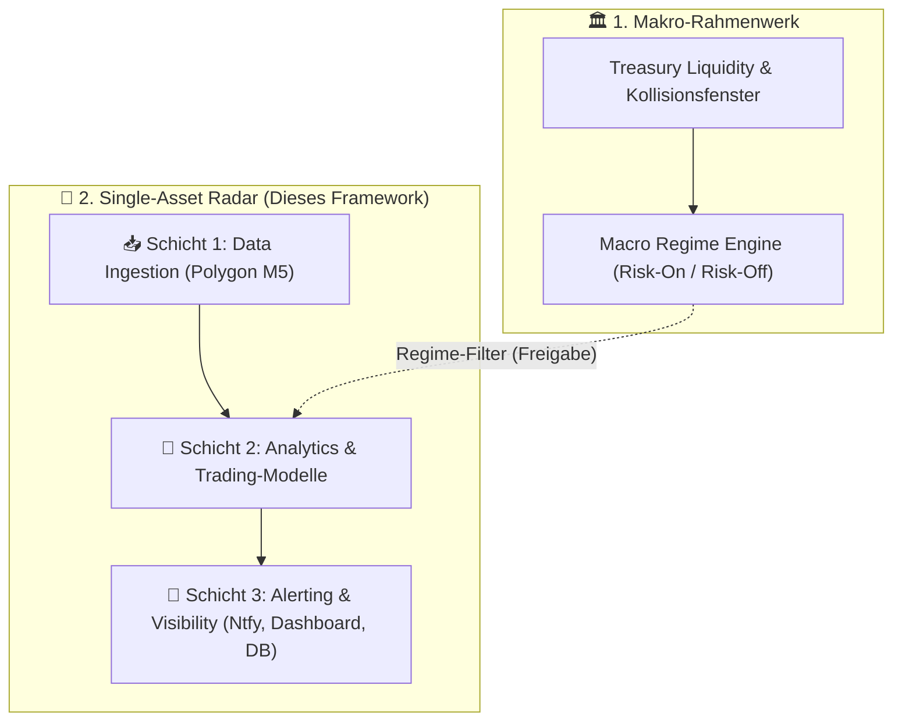
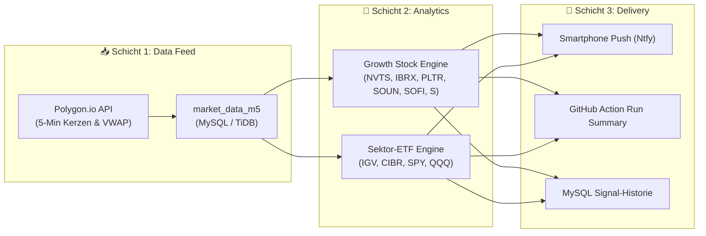

# Single-Asset Radar Master Architecture

Dieses Dokument beschreibt die übergeordnete End-to-End-Architektur des **Single-Asset Radars** in `CrashRadar`. Es verbindet die automatisierte **Datenbeschaffung (M5-Candles)** mit den **systematischen Handelsmodellen (Growth Stocks & Sektor-ETFs)** und der **Echtzeit-Alarmierung (Ntfy Push & Dashboards)**.

---

## 1. Systemübersicht & Leitidee

Während die [`MacroRegimeEngine`](file:///D:/GitHub/CrashRadar/src/analysis/MacroRegimeEngine.js) und die [`Treasury-Liquidity-Capacity-Architecture.md`](file:///D:/GitHub/CrashRadar/docs/macro/Treasury-Liquidity-Capacity-Architecture.md) das übergeordnete Makro-Klima und Liquiditätszyklen steuern, überwacht das **Single-Asset Radar** konkrete liquide Einzelwerte und ETFs auf Mikro-Ebene.



---

## 2. Die 3-Schichten-Architektur

Das Radar gliedert sich in drei klar voneinander getrennte Schichten:



### A. Schicht 1: Data Ingestion & Inkrementeller Sync
* **Verantwortung:** Bezug von 5-Minuten-Intraday-Kerzen direkt über die REST-API von Polygon.io und Ablage in MySQL `market_data_m5`.
* **Detail-Spezifikation:** Vollständig dokumentiert in [`docs/single-asset-radar/M5Candels.md`](file:///D:/GitHub/CrashRadar/docs/single-asset-radar/M5Candels.md).
* **Kern-Komponenten:**
  * Adapter: [`PolygonFetchAdapter.js`](file:///D:/GitHub/CrashRadar/src/core/adapters/fetch/PolygonFetchAdapter.js)
  * Konfiguration: [`Database-Fetcher-Config.json`](file:///D:/GitHub/CrashRadar/config/Database-Fetcher-Config.json) (`"frequency": "intraday_m5"`)
  * Profil-Steuerung: `node index.js --profile intraday_m5`

### B. Schicht 2: Heuristik & Trading-Modelle
* **Verantwortung:** Berechnung von Signalen, M5-VWAP-Bestätigungen, Squeeze-Ausbrüchen und Parabolic-Climax-Exits.
* **Detail-Spezifikation:** Vollständig dokumentiert in [`docs/single-asset-radar/SingleAssetTrading.md`](file:///D:/GitHub/CrashRadar/docs/single-asset-radar/SingleAssetTrading.md).
* **Kern-Modelle:**
  1. **Explosive Growth & Katapult-Aktien:** 4-Phasen-Modell (`BASE_BUILDING` $\to$ `BREAKOUT_ACTIVE` $\to$ `RIDE_TREND` $\to$ `TOP_CLIMAX_ALERT`).
  2. **Sektor- & Themen-ETFs:** Zweistufiges MACD-Regime (Wochen-Trend + Tages-Trigger) mit Relative Stärke vs. SPY (`RS_SPY`) und Trend-Runner Exit.
* **Werkzeuge:** [`GrowthStockTradingEngine.js`](file:///D:/GitHub/CrashRadar/scratch/tools/GrowthStockTradingEngine.js) & [`BlueChipAndEtfTrader.js`](file:///D:/GitHub/CrashRadar/scratch/tools/BlueChipAndEtfTrader.js).

### C. Schicht 3: Alerting, Sichtbarkeit & UI
* **Verantwortung:** Proaktive Zustellung von Handlungsanweisungen, damit keine manuelle Überwachung nötig ist.
* **Kanäle:**
  1. **Ntfy Push-Notifications:** Sofortige Benachrichtigung aufs Smartphone bei Statuswechsel oder Notfall-Ausstieg.
  2. **GitHub Action Run Summary:** Formatierte ASCII-/Markdown-Dashboard-Tabelle im Workflow-Log.
  3. **Persistierte Signal-Historie:** Speicherung in MySQL-Tabelle `single_asset_radar_signals`.

---

## 3. Automatisierungs- & Workflow-Orchestrierung

Um minimale API-Kosten und minimale GitHub Actions Laufzeiten zu gewährleisten, läuft das Radar zeitgesteuert über **zwei tägliche Schnitte**:

| Schnitt | Uhrzeit (MESZ) | Cron (UTC) | Fokus / Analyse-Zweck |
| :--- | :---: | :---: | :--- |
| **1. Eröffnungs-Schnitt** | **17:15 Uhr** | `15 15 * * 1-5` | • Analyse der ersten 1,5 Handelsstunden (15:30–17:00).<br>• Erkennt Intraday-Zündungen (`BREAKOUT_ACTIVE`) und neue Einstiegschancen. |
| **2. Schluss-Schnitt** | **22:15 Uhr** | `15 20 * * 1-5` | • Analyse des gesamten Handelstages & der US Power Hour (20:30–22:00).<br>• Erkennt Parabolic Climax Tops (`TOP_CLIMAX_ALERT`), aktualisiert Tages-VWAP & MACD. |

### Workflow-Blueprint (`.github/workflows/intraday-m5-fetch.yml`)

```yaml
name: Intraday M5 Fetch & Single-Asset Radar

on:
  schedule:
    # Mo–Fr: 15:15 UTC (17:15 MESZ) & 20:15 UTC (22:15 MESZ)
    - cron: '15 15,20 * * 1-5'
  workflow_dispatch:

jobs:
  m5-radar:
    runs-on: ubuntu-latest
    steps:
      - name: Checkout Repository
        uses: actions/checkout@v4

      - name: Setup Node.js
        uses: actions/setup-node@v4
        with:
          node-version: 20
          cache: 'npm'

      - name: Install Dependencies
        run: npm ci

      # 1. Datenbeschaffung (Dauer: < 10 Sekunden für 10 Ticker)
      - name: 📥 Fetch M5 Candles from Polygon
        run: node index.js --profile intraday_m5
        env:
          DATABASE_URL: ${{ secrets.DATABASE_URL }}
          POLYGONIO_API_KEY: ${{ secrets.POLYGONIO_API_KEY }}

      # 2. Single-Asset Radar Berechnung & Ntfy Alerts (Dauer: < 5 Sekunden)
      - name: 🧠 Run Single-Asset Radar Analysis & Send Alerts
        run: node index.js --single-asset-radar
        env:
          DATABASE_URL: ${{ secrets.DATABASE_URL }}
          NTFY_TOPIC: ${{ secrets.NTFY_TOPIC }}
```

---

## 4. Alerting-Regeln & Benachrichtigungs-Formate

Über den [`NtfyService.js`](file:///D:/GitHub/CrashRadar/src/services/NtfyService.js) werden Push-Nachrichten strukturiert nach Priorität versendet:

| Event / Signal | Priorität | Icon / Tags | Beispiel-Nachricht |
| :--- | :---: | :---: | :--- |
| **🚀 `BREAKOUT_ACTIVE`**<br>(Neuer Zündungs-Kauf) | `high` | `rocket, chart_with_upwards_trend` | **[CrashRadar] 🚀 BREAKOUT ACTIVE: PLTR**<br>Kurs bricht über 10d-Hoch ($108.50) bei 2.1x Volumen aus! M5-Tagesschluss stabil +1.8% über Tages-VWAP. |
| **🚨 `TOP_CLIMAX_ALERT`**<br>(Sofortiger Notfall-Verkauf) | `urgent` | `rotating_light, skull` | **[CrashRadar] 🚨 TOP CLIMAX ALERT: NVTS**<br>Parabolische Hysterie (+52% über 20 EMA)! M5 Power-Hour Dump unter VWAP (-4.8%). Gewinne sofort zu 100% sichern! |
| **🟢 `BULLISH_TREND_RIDE`**<br>(ETF-Einstieg) | `default` | `white_check_mark` | **[CrashRadar] 🟢 BULLISH TREND: IGV**<br>Tages-MACD Bull Cross + Outperformance vs. SPY (+6.6%). Freigabe für Trend-Position. |
| **🛑 `STOP_LOSS_EXIT`**<br>(Risikoschutz) | `high` | `octagonal_sign` | **[CrashRadar] 🛑 STOP LOSS: CIBR**<br>Position bei $63.15 ausgestoppt (-5.5% Schutz greift). |

---

## 5. Komponenten-Sitemap & Dateiverzeichnis

| Ebene | Datei / Pfad | Zweck / Inhalt |
| :--- | :--- | :--- |
| **Master-Architektur** | [`docs/single-asset-radar/Single-Asset-Radar-Architecture.md`](file:///D:/GitHub/CrashRadar/docs/single-asset-radar/Single-Asset-Radar-Architecture.md) | **Dieses Dokument:** Gesamtsystem, Datenfluss & Orchestrierung. |
| **Detail: Datenfeed** | [`docs/single-asset-radar/M5Candels.md`](file:///D:/GitHub/CrashRadar/docs/single-asset-radar/M5Candels.md) | Spezifikation der Polygon.io Endpunkte, Paginierung, Pacing & Tabellen. |
| **Detail: Trading-Modelle** | [`docs/single-asset-radar/SingleAssetTrading.md`](file:///D:/GitHub/CrashRadar/docs/single-asset-radar/SingleAssetTrading.md) | 4-Phasen-Modell, Sektor-MACD, M5-VWAP Heuristik & Backtest-Ergebnisse. |
| **Makro-Rahmenwerk** | [`docs/macro/Treasury-Liquidity-Capacity-Architecture.md`](file:///D:/GitHub/CrashRadar/docs/macro/Treasury-Liquidity-Capacity-Architecture.md) | Makro-Liquiditätszyklen & Kollisionsfenster. |
| **Fetcher-Adapter** | [`src/core/adapters/fetch/PolygonFetchAdapter.js`](file:///D:/GitHub/CrashRadar/src/core/adapters/fetch/PolygonFetchAdapter.js) | Native Abruf-Klasse für 5-Minuten-Kerzen von Polygon.io. |
| **Factory-Registrierung** | [`src/core/adapters/fetch/FetchAdapterFactory.js`](file:///D:/GitHub/CrashRadar/src/core/adapters/fetch/FetchAdapterFactory.js) | Registriert `'Polygon'` für den `TimeSeriesFetcher`. |
| **ETL-Konfiguration** | [`config/Database-Fetcher-Config.json`](file:///D:/GitHub/CrashRadar/config/Database-Fetcher-Config.json) | Provider-Definition & Task-Deklaration mit `"frequency": "intraday_m5"`. |
| **CLI-Einstiegspunkt** | [`index.js`](file:///D:/GitHub/CrashRadar/index.js) | CLI-Steuerung via `--profile` und `--single-asset-radar`. |
| **Push-Dienst** | [`src/services/NtfyService.js`](file:///D:/GitHub/CrashRadar/src/services/NtfyService.js) | Zustellung strukturierter Alerts aufs Smartphone. |
| **Live-Engines (Prototypen)** | [`GrowthStockTradingEngine.js`](file:///D:/GitHub/CrashRadar/scratch/tools/GrowthStockTradingEngine.js) & [`BlueChipAndEtfTrader.js`](file:///D:/GitHub/CrashRadar/scratch/tools/BlueChipAndEtfTrader.js) | Berechnung der Trade-Historie und des Live-Dashboards. |
